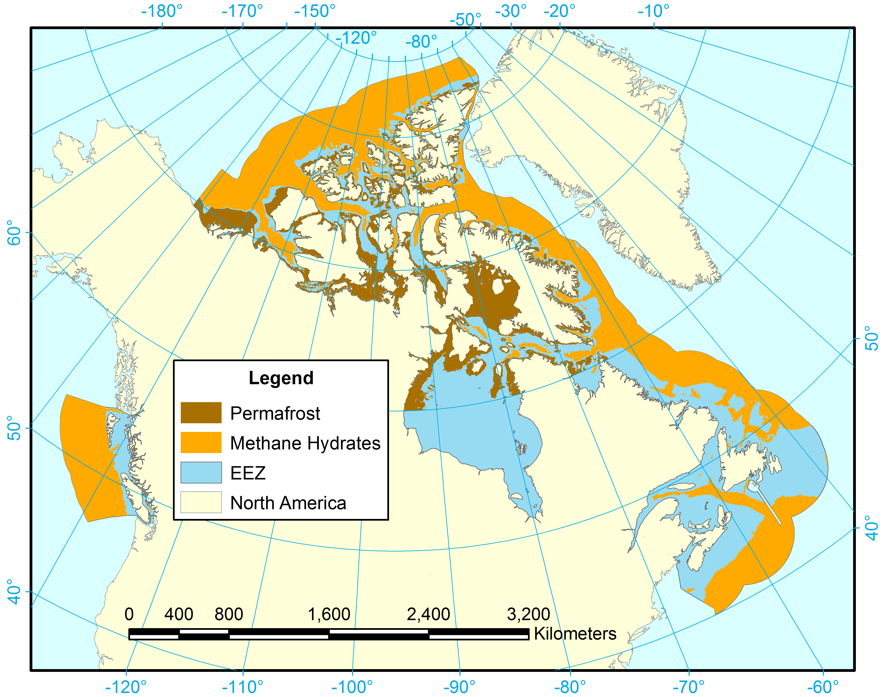

```{r,echo=FALSE,message=FALSE,warning=FALSE,results='hide',cache=F}
#### getting ready to plot flowers ####
# load packages
# devtools::load_all('~/GitHub/ohicore')
# source('install_ohicore.r')
# require(plyr)
require(ohicore)
require(dplyr)
require(grid)
require(methods)
require(tidyr)
require(ggplot2)
source('PlotFlower_small.R')


# set rgn to Canada
rgn_id <- 218

# calculate all the scores
calculate_new_scores <- F
if(calculate_new_scores){
  # populate CHONe folder and modify layers and functions
  # delete
  unlink('eezCHONE/conf/*');unlink('eezCHONE/layers/*');unlink('eezCHONE/spatial/*')
  unlink('eezCHONE/layers.csv');unlink('eezCHONE/scores.csv');
  
  # create new layers.csv, and layers folder for Canada-CHONe2014
  file.copy('eez2013/layers.csv', 'eezCHONE/layers.csv', overwrite = T)
  file.copy('eez2013/scores.csv', 'eezCHONE/scores.csv', overwrite = T)
  fl=list.files('eez2013/layers')
  file.copy(paste('eez2013/layers/',fl,sep = ""),paste('eezCHONE/layers/',fl,sep = ""), overwrite = T)
  fl=list.files('eez2013/conf')
  file.copy(paste('eez2013/conf/',fl,sep = ""),paste('eezCHONE/conf/',fl,sep = ""), overwrite = T)
  fl=list.files('eez2013/spatial')
  file.copy(paste('eez2013/spatial/',fl,sep = ""),paste('eezCHONE/spatial/',fl,sep = ""), overwrite = T)
  
  # calculate normal OHI scores
  source("eez2013/calculate_scores.R")
  # launch_app('~/GitHub/ohi-canada/eezCHONE')
  
  # modify
  source("layers_Canada-CHONe2014.R") # this line "Canadianizes" the index
  
  # calculate Canadian scores
  source("eezCHONE/calculate_scores.R")
  #launch_app('~/GitHub/ohi-canada/eezCHONE')
} else {
  #create function to alter weights
  reweigh <- function(w,i){
    goals$weight[goals$goal=='FP']      = w[,names(w)==i][w$X=="FoodProvision"]
    goals$weight[goals$goal=='FIS']     = w[,names(w)==i][w$X=="FoodProvision"]/2
    goals$weight[goals$goal=='MAR']     = w[,names(w)==i][w$X=="FoodProvision"]/2
    goals$weight[goals$goal=='AN']      = w[,names(w)==i][w$X=="AboriginalNeeds"]
    goals$weight[goals$goal=='NP']      = w[,names(w)==i][w$X=="NaturalProducts"]
    goals$weight[goals$goal=='CS']      = w[,names(w)==i][w$X=="CarbonStorage"]
    goals$weight[goals$goal=='CP']      = w[,names(w)==i][w$X=="CoastalProtection"]
    goals$weight[goals$goal=='TR']      = w[,names(w)==i][w$X=="TourismRecreation"]
    goals$weight[goals$goal=='LE']      = w[,names(w)==i][w$X=="CoastalLivelihoods"]
    goals$weight[goals$goal=='LIV']     = w[,names(w)==i][w$X=="CoastalLivelihoods"]/2
    goals$weight[goals$goal=='ECO']     = w[,names(w)==i][w$X=="CoastalLivelihoods"]/2
    goals$weight[goals$goal=='SP']      = w[,names(w)==i][w$X=="IconicPlacesSPecies"]
    goals$weight[goals$goal=='ICO']     = w[,names(w)==i][w$X=="IconicPlacesSPecies"]/2
    goals$weight[goals$goal=='LSP']     = w[,names(w)==i][w$X=="IconicPlacesSPecies"]/2
    goals$weight[goals$goal=='CW']      = w[,names(w)==i][w$X=="CleanWaters"]
    goals$weight[goals$goal=='BD']      = w[,names(w)==i][w$X=="Biodiversity"]
    goals$weight[goals$goal=='HAB']     = w[,names(w)==i][w$X=="Biodiversity"]/2
    goals$weight[goals$goal=='SPP']     = w[,names(w)==i][w$X=="Biodiversity"]/2
    return(goals$weight)
  }
  # fix FP weights function
  fix_FP_weights <- function(goals,scores,rgn_id){
    #back calculate subgoal weights from FP
    FPscore <- scores$score[scores$region_id==rgn_id&scores$goal=='FP'&scores$dimension=='score']
    FISscore <- scores$score[scores$region_id==rgn_id&scores$goal=='FIS'&scores$dimension=='score']
    MARscore <- scores$score[scores$region_id==rgn_id&scores$goal=='MAR'&scores$dimension=='score']
    FISweight <- (FPscore-MARscore)/(FISscore-MARscore)*goals$weight[goals$goal=='FP']
    goals$weight[goals$goal=='FIS']=FISweight
    goals$weight[goals$goal=='MAR']=goals$weight[goals$goal=='FP']-FISweight
    return(goals$weight)
  }
}

  

# basic flower parameters
w <- 2.35 #width
h <- 2.35 #height
r <- 600 #res
d <- 0.4 #disk
lc <- 1 #label.cex
lo <- 0.2 #label.offset
c <- 1.2 #cex
cm <- 1.2 #cex.main
crop <- 1.5

#### Figure 1 ####
fig1="Figures_for_paper/fig2.tiff"

tiff(fig1,width=7, height=5, units="in",res=r,compression="lzw")

AN_timeseries <- read.csv("~/GitHub/ohi-canada/eezCHONE/rawdata.Canada-CHONe2014/AN/AN_timeseries.csv", stringsAsFactors=FALSE)
AN_timeseries <- AN_timeseries[AN_timeseries$rgn_id==rgn_id,]
plot(AN_timeseries$year,AN_timeseries$value,xlab="Year",ylab="Aboriginal Needs Score",type='b',lwd=2,bty='l',ylim=c(0,1))
dev.off()

#### Figure 2 ####
fig2="Figures_for_paper/fig3.tiff"
tiff(fig2,width=w*3, height=h*1, units="in",res=r,compression = "lzw")
par(mfrow=c(1,3))


### Normal OHI
scores <- read.csv("eez2013/scores.csv", stringsAsFactors=FALSE) 
goals <- read.csv("eez2013/conf/goals.csv", stringsAsFactors=FALSE)
goals$weight <- fix_FP_weights(goals,scores,rgn_id)
goals_supra = na.omit(unique(goals$parent))
wts = with(subset(goals, !goal %in% goals_supra, c(goal, weight)), setNames(weight, goal))
#goal_labels = gsub('\\n', '\n', with(goals, setNames(name_flower, goal))[names(wts)], fixed=T)
goal_labels = gsub('\\n', '\n', with(goals, setNames(goal, goal))[names(wts)], fixed=T)
# get goals for flowers, all and specific to weights
goals.all = arrange(goals, order_color)[['goal']]

# get colors for aster, based on 10 colors, but extended to all goals. subselect for goals.wts
cols.goals.all = colorRampPalette(RColorBrewer::brewer.pal(10, 'Spectral'), space='Lab')(length(goals.all))
names(cols.goals.all) = goals.all
# region scores    
    x = with(subset(scores, dimension=='score' & region_id==rgn_id & goal %in% names(wts)),
             setNames(score, goal))[names(wts)]


### figure with normal OHI
rgn_name="Original OHI - Equal"
# nf <- layout(matrix(c(0,1,1,0,2,2,3,3,4,4,5,5,6,6,7,7), 4, 4, byrow=TRUE), respect=FALSE) 
# nf <- layout(matrix(c(1,2), 1, 2, byrow=TRUE), respect=FALSE) 

PlotFlower_small(main = rgn_name,
           lengths=x,
           widths=wts,
           fill.col=ifelse(is.na(x), 
                           'grey80', 
                           cols.goals.all[names(wts)]),
           labels  =ifelse(is.na(x), 
                           paste(goal_labels, '-', sep='\n'), 
                           paste(goal_labels, round(x), sep='\n')),
           center=round(weighted.mean(x, wts, na.rm=T)),
           max.length = 100, disk=0.4, label.cex=lc, label.offset=lo, cex=c, cex.main=cm)

### Canadian OHI ###
scores <- read.csv("eezCHONE/scores.csv", stringsAsFactors=FALSE) 
goals <- read.csv("eezCHONE/conf/goals.csv", stringsAsFactors=FALSE)
goals$weight <- fix_FP_weights(goals,scores,rgn_id)

goals_supra = na.omit(unique(goals$parent))
wts = with(subset(goals, !goal %in% goals_supra, c(goal, weight)), setNames(weight, goal))
#goal_labels = gsub('\\n', '\n', with(goals, setNames(name_flower, goal))[names(wts)], fixed=T)
goal_labels = gsub('\\n', '\n', with(goals, setNames(goal, goal))[names(wts)], fixed=T)
# get goals for flowers, all and specific to weights
goals.all = arrange(goals, order_color)[['goal']]

# get colors for aster, based on 10 colors, but extended to all goals. subselect for goals.wts
cols.goals.all = colorRampPalette(RColorBrewer::brewer.pal(10, 'Spectral'), space='Lab')(length(goals.all))
names(cols.goals.all) = goals.all
# region scores    
    x = with(subset(scores, dimension=='score' & region_id==rgn_id & goal %in% names(wts)),
             setNames(score, goal))[names(wts)]


### figure with COHI equal ###
### weights: equal ###
# set weights
weights=read.csv('eezCHONE/rawdata.Canada-CHONe2014/weights/weights_All.csv')
#calculate weights, chose either "equal", "importance", "BWrank", "lmc", "lmc1", or "lmc10"
goals$weight <- reweigh(weights,"equal")
goals$weight <- fix_FP_weights(goals,scores,rgn_id)
wts = with(subset(goals, !goal %in% goals_supra, c(goal, weight)), setNames(weight, goal))
rgn_name="COHI - Equal"
PlotFlower_small(main = rgn_name,
           lengths=x,
           widths=wts,
           fill.col=ifelse(is.na(x), 
                           'grey80', 
                           cols.goals.all[names(wts)]),
           labels  =ifelse(is.na(x), 
                           paste(goal_labels, '-', sep='\n'), 
                           paste(goal_labels, round(x), sep='\n')),
           center=round(weighted.mean(x, wts, na.rm=T)),
           max.length = 100, disk=d, label.cex=lc, label.offset=lo, cex=c, cex.main=cm)

### figure with COHI lmc 1 ###
### weights: lmc1 ###
# set weights
weights=read.csv('eezCHONE/rawdata.Canada-CHONe2014/weights/weights_All.csv')
#calculate weights, chose either "equal", "importance", "BWrank", "lmc", "lmc1", or "lmc10"
goals$weight <- reweigh(weights,"lmc1")
goals$weight <- fix_FP_weights(goals,scores,rgn_id)
wts = with(subset(goals, !goal %in% goals_supra, c(goal, weight)), setNames(weight, goal))
rgn_name="COHI - BW-DCE"
PlotFlower_small(main = rgn_name,
           lengths=x,
           widths=wts,
           fill.col=ifelse(is.na(x), 
                           'grey80', 
                           cols.goals.all[names(wts)]),
           labels  =ifelse(is.na(x), 
                           paste(goal_labels, '-', sep='\n'), 
                           paste(goal_labels, round(x), sep='\n')),
           center=round(weighted.mean(x, wts, na.rm=T)),
           max.length = 100, disk=d, label.cex=lc, label.offset=lo, cex=c, cex.main=cm)


dev.off()  

#### Figure 3 ####
fig3="Figures_for_paper/fig4.tiff"
### Canadian OHI ###
scores <- read.csv("eezCHONE/scores.csv", stringsAsFactors=FALSE) 
goals <- read.csv("eezCHONE/conf/goals.csv", stringsAsFactors=FALSE)

goals_supra = na.omit(unique(goals$parent))
wts = with(subset(goals, !goal %in% goals_supra, c(goal, weight)), setNames(weight, goal))
#goal_labels = gsub('\\n', '\n', with(goals, setNames(name_flower, goal))[names(wts)], fixed=T)
goal_labels = gsub('\\n', '\n', with(goals, setNames(goal, goal))[names(wts)], fixed=T)
# get goals for flowers, all and specific to weights
goals.all = arrange(goals, order_color)[['goal']]

# get colors for aster, based on 10 colors, but extended to all goals. subselect for goals.wts
cols.goals.all = colorRampPalette(RColorBrewer::brewer.pal(10, 'Spectral'), space='Lab')(length(goals.all))
names(cols.goals.all) = goals.all
# region scores    
x = with(subset(scores, dimension=='score' & region_id==rgn_id & goal %in% names(wts)),
         setNames(score, goal))[names(wts)]

### weights: equal
# set weights
weights=read.csv('eezCHONE/rawdata.Canada-CHONe2014/weights/weights_All.csv')
#calculate weights, chose either "equal", "importance", "BWrank", "lmc", "lmc1", or "lmc10"
goals$weight <- reweigh(weights,"equal")
goals$weight <- fix_FP_weights(goals,scores,rgn_id)

wts = data.frame(equal=with(subset(goals, !goal %in% goals_supra, c(goal, weight)), setNames(weight, goal)))

### weights: importance
# set weights
weights=read.csv('eezCHONE/rawdata.Canada-CHONe2014/weights/weights_All.csv')
#calculate weights, chose either "equal", "importance", "BWrank", "lmc", "lmc1", or "lmc10"
goals$weight <- reweigh(weights,"importance")
goals$weight <- fix_FP_weights(goals,scores,rgn_id)

wts$importance = with(subset(goals, !goal %in% goals_supra, c(goal, weight)), setNames(weight, goal))

### weights: BWrank
# set weights
weights=read.csv('eezCHONE/rawdata.Canada-CHONe2014/weights/weights_All.csv')
#calculate weights, chose either "equal", "importance", "BWrank", "lmc", "lmc1", or "lmc10"
goals$weight <- reweigh(weights,"BWrank")
goals$weight <- fix_FP_weights(goals,scores,rgn_id)

wts$BWrank = with(subset(goals, !goal %in% goals_supra, c(goal, weight)), setNames(weight, goal))

### weights: lmc1
# set weights
weights=read.csv('eezCHONE/rawdata.Canada-CHONe2014/weights/weights_All.csv')
#calculate weights, chose either "equal", "importance", "BWrank", "lmc", "lmc1", or "lmc10"
goals$weight <- reweigh(weights,"lmc1")
goals$weight <- fix_FP_weights(goals,scores,rgn_id)

wts$lmc1 = with(subset(goals, !goal %in% goals_supra, c(goal, weight)), setNames(weight, goal))

#### prepare data for plotting
wtsdf <- wts %>% 
  mutate(goal=row.names(.)) %>%
  gather(type,weight,-goal) %>%
  group_by(type) %>% 
  mutate(cum_sum=cumsum(weight)-weight/2) %>% 
  ungroup()

cols <- rev(cols.goals.all[names(cols.goals.all )%in%row.names(wts)])

wtsdf$goal <- factor(wtsdf$goal,levels=names(cols),ordered = TRUE)
wtsdf$type <- factor(wtsdf$type,levels=c('equal','importance','BWrank','lmc1'),ordered = TRUE)

#### plot
 p <- ggplot(wtsdf,aes(x=type,fill=goal))+
   geom_bar(aes(weight=weight))+
     scale_fill_manual(values=as.vector(cols))+
   geom_text(aes(x=type,y=cum_sum,label=goal))+
   guides(fill=FALSE)+
   scale_y_continuous(name="Weight",
                      limits=c(0,11),
                      expand=c(0,0))+
   scale_x_discrete(name="Weighting Scheme",
                    labels=c("Equal", "Likert", "BW-Rank","BW-DCE"),
                    expand=c(0,0))+
   annotate("text",x=c(1,2,3,4),y=10.5,
            label=apply(wts,2, function(w) round(weighted.mean(x, w, na.rm=T))),
            size=6)+
   theme_classic()+ 
   theme(axis.line.x = element_blank(),axis.line.y = element_blank())

ggsave(fig3,p,width = 4.5,height=6,compression="lzw",dpi=r)

#### Figure 4 ####
weight_choice="lmc1"
fig4="Figures_for_paper/fig5.tiff"

### Canadian OHI ###
scores <- read.csv("eezCHONE/scores.csv", stringsAsFactors=FALSE) 
goals <- read.csv("eezCHONE/conf/goals.csv", stringsAsFactors=FALSE)

goals_supra = na.omit(unique(goals$parent))
wts = with(subset(goals, !goal %in% goals_supra, c(goal, weight)), setNames(weight, goal))
#goal_labels = gsub('\\n', '\n', with(goals, setNames(name_flower, goal))[names(wts)], fixed=T)
goal_labels = gsub('\\n', '\n', with(goals, setNames(goal, goal))[names(wts)], fixed=T)
# get goals for flowers, all and specific to weights
goals.all = arrange(goals, order_color)[['goal']]

# get colors for aster, based on 10 colors, but extended to all goals. subselect for goals.wts
cols.goals.all = colorRampPalette(RColorBrewer::brewer.pal(10, 'Spectral'), space='Lab')(length(goals.all))
names(cols.goals.all) = goals.all
# region scores    
x = with(subset(scores, dimension=='score' & region_id==rgn_id & goal %in% names(wts)),
         setNames(score, goal))[names(wts)]

### weights: BC
# set weights
weights=read.csv('eezCHONE/rawdata.Canada-CHONe2014/weights/weights_BC.csv')
#calculate weights, chose either "equal", "importance", "BWrank", "lmc", "lmc1", or "lmc10"
goals$weight <- reweigh(weights,weight_choice)
goals$weight <- fix_FP_weights(goals,scores,rgn_id)

wts = data.frame(BC=with(subset(goals, !goal %in% goals_supra, c(goal, weight)), setNames(weight, goal)))

### weights: PR
# set weights
weights=read.csv('eezCHONE/rawdata.Canada-CHONe2014/weights/weights_PR.csv')
#calculate weights, chose either "equal", "importance", "BWrank", "lmc", "lmc1", or "lmc10"
goals$weight <- reweigh(weights,weight_choice)
goals$weight <- fix_FP_weights(goals,scores,rgn_id)

wts$PR = with(subset(goals, !goal %in% goals_supra, c(goal, weight)), setNames(weight, goal))

### weights: ON
# set weights
weights=read.csv('eezCHONE/rawdata.Canada-CHONe2014/weights/weights_ON.csv')
#calculate weights, chose either "equal", "importance", "BWrank", "lmc", "lmc1", or "lmc10"
goals$weight <- reweigh(weights,weight_choice)
goals$weight <- fix_FP_weights(goals,scores,rgn_id)

wts$ON = with(subset(goals, !goal %in% goals_supra, c(goal, weight)), setNames(weight, goal))

### weights: QC
# set weights
weights=read.csv('eezCHONE/rawdata.Canada-CHONe2014/weights/weights_QC.csv')
#calculate weights, chose either "equal", "importance", "BWrank", "lmc", "lmc1", or "lmc10"
goals$weight <- reweigh(weights,weight_choice)
goals$weight <- fix_FP_weights(goals,scores,rgn_id)

wts$QC = with(subset(goals, !goal %in% goals_supra, c(goal, weight)), setNames(weight, goal))

### weights: MR
# set weights
weights=read.csv('eezCHONE/rawdata.Canada-CHONe2014/weights/weights_MR.csv')
#calculate weights, chose either "equal", "importance", "BWrank", "lmc", "lmc1", or "lmc10"
goals$weight <- reweigh(weights,weight_choice)
goals$weight <- fix_FP_weights(goals,scores,rgn_id)

wts$MR = with(subset(goals, !goal %in% goals_supra, c(goal, weight)), setNames(weight, goal))

#### prepare data for plotting
wtsdf <- wts %>% 
  mutate(goal=row.names(.)) %>%
  gather(type,weight,-goal) %>%
  group_by(type) %>% 
  mutate(cum_sum=cumsum(weight)-weight/2) %>% 
  ungroup()

cols <- rev(cols.goals.all[names(cols.goals.all )%in%row.names(wts)])

wtsdf$goal <- factor(wtsdf$goal,levels=names(cols),ordered = TRUE)
wtsdf$type <- factor(wtsdf$type,levels=c('BC','PR','ON','QC','MR'),ordered = TRUE)

#### plot
raw <- read.csv("C:/Users/Remi-Work/Desktop/Latent Gold/userstats_bothlang_usable.csv")
n <- data.frame(table(raw$sample))
n
  

 p <- ggplot(wtsdf,aes(x=type,fill=goal))+
  geom_bar(aes(weight=weight))+
    scale_fill_manual(values=as.vector(cols))+
  geom_text(aes(x=type,y=cum_sum,label=goal))+
  guides(fill=FALSE)+
  scale_y_continuous(name="Weight",
                     limits=c(0,11.5),
                     expand=c(0,0))+
  scale_x_discrete(name="Region",
                   labels=c(paste0("BC\n(n=",n$Freq[1],")"),
                            paste0("Prairies\n(n=",n$Freq[4],")"),
                            paste0("ON\n(n=",n$Freq[3],")"),
                            paste0("QC\n(n=",n$Freq[5],")"),
                            paste0("Atlantic\n(n=",n$Freq[2],")")),
  expand=c(0,0))+
  annotate("text",x=c(1,2,3,4,5),y=10.5,
           label=apply(wts,2, function(w) round(weighted.mean(x, w, na.rm=T))),
           size=6)+
   annotate("text",x=c(1,2,3,4,5),y=11.1,
           label=c("A","B","A","AB","AB"),
           size=4)+
  theme_classic()+ 
   theme(axis.line.x = element_blank(),axis.line.y = element_blank())

ggsave(fig4,p,width=5.5,height=6,compression="lzw",dpi=r)  

#### Figure 5 ####
weight_choice="lmc1"
fig5="Figures_for_paper/fig6.tiff"

### Canadian OHI ###
scores <- read.csv("eezCHONE/scores.csv", stringsAsFactors=FALSE) 
goals <- read.csv("eezCHONE/conf/goals.csv", stringsAsFactors=FALSE)

goals_supra = na.omit(unique(goals$parent))
wts = with(subset(goals, !goal %in% goals_supra, c(goal, weight)), setNames(weight, goal))
#goal_labels = gsub('\\n', '\n', with(goals, setNames(name_flower, goal))[names(wts)], fixed=T)
goal_labels = gsub('\\n', '\n', with(goals, setNames(goal, goal))[names(wts)], fixed=T)
# get goals for flowers, all and specific to weights
goals.all = arrange(goals, order_color)[['goal']]

# get colors for aster, based on 10 colors, but extended to all goals. subselect for goals.wts
cols.goals.all = colorRampPalette(RColorBrewer::brewer.pal(10, 'Spectral'), space='Lab')(length(goals.all))
names(cols.goals.all) = goals.all
# region scores    
x = with(subset(scores, dimension=='score' & region_id==rgn_id & goal %in% names(wts)),
         setNames(score, goal))[names(wts)]

### weights: BC
# set weights
weights=read.csv('eezCHONE/rawdata.Canada-CHONe2014/weights/weights_20to24.csv')
#calculate weights, chose either "equal", "importance", "BWrank", "lmc", "lmc1", or "lmc10"
goals$weight <- reweigh(weights,weight_choice)
goals$weight <- fix_FP_weights(goals,scores,rgn_id)

wts = data.frame(age20to24=with(subset(goals, !goal %in% goals_supra, c(goal, weight)), setNames(weight, goal)))

### weights: 25to34
# set weights
weights=read.csv('eezCHONE/rawdata.Canada-CHONe2014/weights/weights_25to34.csv')
#calculate weights, chose either "equal", "importance", "BWrank", "lmc", "lmc1", or "lmc10"
goals$weight <- reweigh(weights,weight_choice)
goals$weight <- fix_FP_weights(goals,scores,rgn_id)

wts$age25to34 = with(subset(goals, !goal %in% goals_supra, c(goal, weight)), setNames(weight, goal))

### weights: 35to44
# set weights
weights=read.csv('eezCHONE/rawdata.Canada-CHONe2014/weights/weights_35to44.csv')
#calculate weights, chose either "equal", "importance", "BWrank", "lmc", "lmc1", or "lmc10"
goals$weight <- reweigh(weights,weight_choice)
goals$weight <- fix_FP_weights(goals,scores,rgn_id)

wts$age35to44 = with(subset(goals, !goal %in% goals_supra, c(goal, weight)), setNames(weight, goal))

### weights: 45to54
# set weights
weights=read.csv('eezCHONE/rawdata.Canada-CHONe2014/weights/weights_45to54.csv')
#calculate weights, chose either "equal", "importance", "BWrank", "lmc", "lmc1", or "lmc10"
goals$weight <- reweigh(weights,weight_choice)
goals$weight <- fix_FP_weights(goals,scores,rgn_id)

wts$age45to54 = with(subset(goals, !goal %in% goals_supra, c(goal, weight)), setNames(weight, goal))

### weights: 55to64
# set weights
weights=read.csv('eezCHONE/rawdata.Canada-CHONe2014/weights/weights_55to64.csv')
#calculate weights, chose either "equal", "importance", "BWrank", "lmc", "lmc1", or "lmc10"
goals$weight <- reweigh(weights,weight_choice)
goals$weight <- fix_FP_weights(goals,scores,rgn_id)

wts$age55to64 = with(subset(goals, !goal %in% goals_supra, c(goal, weight)), setNames(weight, goal))

### weights: 65plus
# set weights
weights=read.csv('eezCHONE/rawdata.Canada-CHONe2014/weights/weights_65plus.csv')
#calculate weights, chose either "equal", "importance", "BWrank", "lmc", "lmc1", or "lmc10"
goals$weight <- reweigh(weights,weight_choice)
goals$weight <- fix_FP_weights(goals,scores,rgn_id)

wts$age65plus = with(subset(goals, !goal %in% goals_supra, c(goal, weight)), setNames(weight, goal))

#### prepare data for plotting
wtsdf <- wts %>% 
  mutate(goal=row.names(.)) %>%
  gather(type,weight,-goal) %>%
  group_by(type) %>% 
  mutate(cum_sum=cumsum(weight)-weight/2) %>% 
  ungroup()

cols <- rev(cols.goals.all[names(cols.goals.all )%in%row.names(wts)])

wtsdf$goal <- factor(wtsdf$goal,levels=names(cols),ordered = TRUE)
wtsdf$type <- factor(wtsdf$type,levels=c('age20to24','age25to34','age35to44','age45to54','age55to64','age65plus'),ordered = TRUE)

#### plot
raw <- read.csv("C:/Users/Remi-Work/Desktop/Latent Gold/userstats_bothlang_usable.csv")
n <- data.frame(table(raw$demothree_age))
n

 p <- ggplot(wtsdf,aes(x=type,fill=goal))+
  geom_bar(aes(weight=weight))+
    scale_fill_manual(values=as.vector(cols))+
  geom_text(aes(x=type,y=cum_sum,label=goal))+
  guides(fill=FALSE)+
  scale_y_continuous(name="Weight",
                     limits=c(0,11.5),
                     expand=c(0,0))+
  scale_x_discrete(name="Respondent age (years)",
                   labels=c(paste0("20 to 24\n(n=",n$Freq[2],")"),
                            paste0("25 to 34\n(n=",n$Freq[3],")"),
                            paste0("35 to 44\n(n=",n$Freq[4],")"),
                            paste0("45 to 54\n(n=",n$Freq[5],")"),
                            paste0("55 to 64\n(n=",n$Freq[6],")"),
                            paste0("> 65\n(n=",n$Freq[7],")")),
  expand=c(0,0))+
  annotate("text",x=c(1,2,3,4,5,6),y=10.5,
           label=apply(wts,2, function(w) round(weighted.mean(x, w, na.rm=T))),
           size=6)+
   annotate("text",x=c(1,2,3,4,5,6),y=11.1,
            label=c("AB","A","A","A","A","B"),
            size=4)+
  theme_classic()+ 
   theme(axis.line.x = element_blank(),axis.line.y = element_blank())

ggsave(fig5,p,width=6.5,height=6,compression="lzw",dpi=r)  

#### Figure 6 ####
weight_choice="lmc1"
fig6="Figures_for_paper/fig7.tiff"

### Canadian OHI ###
scores <- read.csv("eezCHONE/scores.csv", stringsAsFactors=FALSE) 
goals <- read.csv("eezCHONE/conf/goals.csv", stringsAsFactors=FALSE)

goals_supra = na.omit(unique(goals$parent))
wts = with(subset(goals, !goal %in% goals_supra, c(goal, weight)), setNames(weight, goal))
#goal_labels = gsub('\\n', '\n', with(goals, setNames(name_flower, goal))[names(wts)], fixed=T)
goal_labels = gsub('\\n', '\n', with(goals, setNames(goal, goal))[names(wts)], fixed=T)
# get goals for flowers, all and specific to weights
goals.all = arrange(goals, order_color)[['goal']]

# get colors for aster, based on 10 colors, but extended to all goals. subselect for goals.wts
cols.goals.all = colorRampPalette(RColorBrewer::brewer.pal(10, 'Spectral'), space='Lab')(length(goals.all))
names(cols.goals.all) = goals.all
# region scores    
x = with(subset(scores, dimension=='score' & region_id==rgn_id & goal %in% names(wts)),
         setNames(score, goal))[names(wts)]

### weights: NDPGreen
# set weights
weights=read.csv('eezCHONE/rawdata.Canada-CHONe2014/weights/weights_NDPGreen.csv')
#calculate weights, chose either "equal", "importance", "BWrank", "lmc", "lmc1", or "lmc10"
goals$weight <- reweigh(weights,weight_choice)
goals$weight <- fix_FP_weights(goals,scores,rgn_id)

wts = data.frame(NDPGreen=with(subset(goals, !goal %in% goals_supra, c(goal, weight)), setNames(weight, goal)))

### weights: Liberal
# set weights
weights=read.csv('eezCHONE/rawdata.Canada-CHONe2014/weights/weights_Liberal.csv')
#calculate weights, chose either "equal", "importance", "BWrank", "lmc", "lmc1", or "lmc10"
goals$weight <- reweigh(weights,weight_choice)
goals$weight <- fix_FP_weights(goals,scores,rgn_id)

wts$Liberal = with(subset(goals, !goal %in% goals_supra, c(goal, weight)), setNames(weight, goal))

### weights: CPC
# set weights
weights=read.csv('eezCHONE/rawdata.Canada-CHONe2014/weights/weights_CPC.csv')
#calculate weights, chose either "equal", "importance", "BWrank", "lmc", "lmc1", or "lmc10"
goals$weight <- reweigh(weights,weight_choice)
goals$weight <- fix_FP_weights(goals,scores,rgn_id)

wts$CPC = with(subset(goals, !goal %in% goals_supra, c(goal, weight)), setNames(weight, goal))

### weights: Other
# set weights
weights=read.csv('eezCHONE/rawdata.Canada-CHONe2014/weights/weights_Other.csv')
#calculate weights, chose either "equal", "importance", "BWrank", "lmc", "lmc1", or "lmc10"
goals$weight <- reweigh(weights,weight_choice)
goals$weight <- fix_FP_weights(goals,scores,rgn_id)

wts$Other = with(subset(goals, !goal %in% goals_supra, c(goal, weight)), setNames(weight, goal))


#### prepare data for plotting
wtsdf <- wts %>% 
  mutate(goal=row.names(.)) %>%
  gather(type,weight,-goal) %>%
  group_by(type) %>% 
  mutate(cum_sum=cumsum(weight)-weight/2) %>% 
  ungroup()

cols <- rev(cols.goals.all[names(cols.goals.all )%in%row.names(wts)])

wtsdf$goal <- factor(wtsdf$goal,levels=names(cols),ordered = TRUE)
wtsdf$type <- factor(wtsdf$type,levels=c('NDPGreen','Liberal','CPC','Other'),ordered = TRUE)

#### plot
raw <- read.csv("C:/Users/Remi-Work/Desktop/Latent Gold/userstats_bothlang_usable.csv")
n <- data.frame(table(raw$political_party))
n

 p <- ggplot(wtsdf,aes(x=type,fill=goal))+
  geom_bar(aes(weight=weight))+
    scale_fill_manual(values=as.vector(cols))+
  geom_text(aes(x=type,y=cum_sum,label=goal))+
  guides(fill=FALSE)+
  scale_y_continuous(name="Weight",
                     limits=c(0,11.5),
                     expand=c(0,0))+
  scale_x_discrete(name="Political affiliation",
                   labels=c(paste0("NDP/Green\n(n=",n$Freq[5]+n$Freq[7],")"),
                            paste0("LPC\n(n=",n$Freq[6],")"),
                            paste0("CPC\n(n=",n$Freq[3],")"),
                            paste0("Other\n(n=",n$Freq[2]+n$Freq[4]+n$Freq[8],")")),
  expand=c(0,0))+
  annotate("text",x=c(1,2,3,4),y=10.5,
           label=apply(wts,2, function(w) round(weighted.mean(x, w, na.rm=T))),
           size=6)+
   annotate("text",x=c(1,2,3,4),y=11.1,
           label=c("A","B","C","B"),
           size=4)+
  theme_classic()+ 
   theme(axis.line.x = element_blank(),axis.line.y = element_blank())

ggsave(fig6,p,width=4.5,height=6,compression="lzw",dpi=r)

#### Figure 7 ####
weight_choice="lmc1"
fig7="Figures_for_paper/fig8.tiff"

### Canadian OHI ###
scores <- read.csv("eezCHONE/scores.csv", stringsAsFactors=FALSE) 
goals <- read.csv("eezCHONE/conf/goals.csv", stringsAsFactors=FALSE)

goals_supra = na.omit(unique(goals$parent))
wts = with(subset(goals, !goal %in% goals_supra, c(goal, weight)), setNames(weight, goal))
#goal_labels = gsub('\\n', '\n', with(goals, setNames(name_flower, goal))[names(wts)], fixed=T)
goal_labels = gsub('\\n', '\n', with(goals, setNames(goal, goal))[names(wts)], fixed=T)
# get goals for flowers, all and specific to weights
goals.all = arrange(goals, order_color)[['goal']]

# get colors for aster, based on 10 colors, but extended to all goals. subselect for goals.wts
cols.goals.all = colorRampPalette(RColorBrewer::brewer.pal(10, 'Spectral'), space='Lab')(length(goals.all))
names(cols.goals.all) = goals.all
# region scores    
x = with(subset(scores, dimension=='score' & region_id==rgn_id & goal %in% names(wts)),
         setNames(score, goal))[names(wts)]

### weights: yes
# set weights
weights=read.csv('eezCHONE/rawdata.Canada-CHONe2014/weights/weights_ENGO_yes.csv')
#calculate weights, chose either "equal", "importance", "BWrank", "lmc", "lmc1", or "lmc10"
goals$weight <- reweigh(weights,weight_choice)
goals$weight <- fix_FP_weights(goals,scores,rgn_id)

wts = data.frame(yes=with(subset(goals, !goal %in% goals_supra, c(goal, weight)), setNames(weight, goal)))

### weights: no
# set weights
weights=read.csv('eezCHONE/rawdata.Canada-CHONe2014/weights/weights_ENGO_no.csv')
#calculate weights, chose either "equal", "importance", "BWrank", "lmc", "lmc1", or "lmc10"
goals$weight <- reweigh(weights,weight_choice)
goals$weight <- fix_FP_weights(goals,scores,rgn_id)

wts$no = with(subset(goals, !goal %in% goals_supra, c(goal, weight)), setNames(weight, goal))

#### prepare data for plotting
wtsdf <- wts %>% 
  mutate(goal=row.names(.)) %>%
  gather(type,weight,-goal) %>%
  group_by(type) %>% 
  mutate(cum_sum=cumsum(weight)-weight/2) %>% 
  ungroup()

cols <- rev(cols.goals.all[names(cols.goals.all )%in%row.names(wts)])

wtsdf$goal <- factor(wtsdf$goal,levels=names(cols),ordered = TRUE)
wtsdf$type <- factor(wtsdf$type,levels=c('yes','no'),ordered = TRUE)

#### plot
raw <- read.csv("C:/Users/Remi-Work/Desktop/Latent Gold/userstats_bothlang_usable.csv")
n <- data.frame(table(raw$envr_org))
n

 p <- ggplot(wtsdf,aes(x=type,fill=goal))+
  geom_bar(aes(weight=weight))+
    scale_fill_manual(values=as.vector(cols))+
  geom_text(aes(x=type,y=cum_sum,label=goal))+
  guides(fill=FALSE)+
  scale_y_continuous(name="Weight",
                     limits=c(0,11.5),
                     expand=c(0,0))+
  scale_x_discrete(name="ENGO",
                   labels=c(paste0("member\n(n=",n$Freq[4],")"),
                            paste0("non-member\n(n=",n$Freq[3],")")),
  expand=c(0,0))+
  annotate("text",x=c(1,2),y=10.5,
           label=apply(wts,2, function(w) round(weighted.mean(x, w, na.rm=T))),
           size=6)+
   annotate("text",x=c(1,2),y=11.1,
           label=c("A","B"),
           size=4)+
  theme_classic()+ 
   theme(axis.line.x = element_blank(),axis.line.y = element_blank())

ggsave(fig7,p,width=2.5,height=6,compression="lzw",dpi=r)  
   
```


**Figure 1**: Aboriginal Needs score over time


**Figure 2**: Normal OHI and Canadian modified OHI. Numbers indicate goal scores. Mariculture (MAR) and Fisheries (FIS) subgoals are part of Food Provision; Aboriginal Needs (AN); Natural Products (NP); Carbon Storage (CS); Coastal Protection (CP); Tourism & Recreation (TR); Livelihoods (LIV) and Economies (ECO) subgoals are part of Coastal Livelihoods; Iconic species (ICO) and Lasting Special Places (LSP) subgoals are part of Iconic Places & Species; Clean Waters (CW); Habitat (HAB) and Species Protection (SPP) subgoals are part of Biodiversity.


**Figure 3**: Canadian modified OHI with different weighting techniques. In all cases subgoals weights are half their parent weights except for Food Provision where subgoals are weighted relative to yield. In equal weighting, for all goals are weights = 1. For the Likert Importance, weights are derived from the relative importance (1-5) question. For the BW Rank and BW-DCE, the weights are derived from the answers of best/worst pairings. Thos answers were either simply ranked, or the weights were derived from the DCE model coefficients.  Numbers indicate goal weights. Mariculture (MAR) and Fisheries (FIS) subgoals are part of Food Provision; Aboriginal Needs (AN); Natural Products (NP); Carbon Storage (CS); Coastal Protection (CP); Tourism & Recreation (TR); Livelihoods (LIV) and Economies (ECO) subgoals are part of Coastal Livelihoods; Iconic species (ICO) and Lasting Special Places (LSP) subgoals are part of Iconic Places & Species; Clean Waters (CW); Habitat (HAB) and Species Protection (SPP) subgoals are part of Biodiversity.


**Figure 4**: Canadian modified OHI with Best/Worst DCE coefficient weights from each province. Numbers indicate goal weights. Mariculture (MAR) and Fisheries (FIS) subgoals are part of Food Provision; Aboriginal Needs (AN); Natural Products (NP); Carbon Storage (CS); Coastal Protection (CP); Tourism & Recreation (TR); Livelihoods (LIV) and Economies (ECO) subgoals are part of Coastal Livelihoods; Iconic species (ICO) and Lasting Special Places (LSP) subgoals are part of Iconic Places & Species; Clean Waters (CW); Habitat (HAB) and Species Protection (SPP) subgoals are part of Biodiversity.


**Figure 5**: Canadian modified OHI with Best/Worst DCE coefficient weights from each age group. Numbers indicate goal weights. Mariculture (MAR) and Fisheries (FIS) subgoals are part of Food Provision; Aboriginal Needs (AN); Natural Products (NP); Carbon Storage (CS); Coastal Protection (CP); Tourism & Recreation (TR); Livelihoods (LIV) and Economies (ECO) subgoals are part of Coastal Livelihoods; Iconic species (ICO) and Lasting Special Places (LSP) subgoals are part of Iconic Places & Species; Clean Waters (CW); Habitat (HAB) and Species Protection (SPP) subgoals are part of Biodiversity.


**Figure 6**: Canadian modified OHI with Best/Worst DCE coefficient weights from each political affiliation. Numbers indicate goal weights. Mariculture (MAR) and Fisheries (FIS) subgoals are part of Food Provision; Aboriginal Needs (AN); Natural Products (NP); Carbon Storage (CS); Coastal Protection (CP); Tourism & Recreation (TR); Livelihoods (LIV) and Economies (ECO) subgoals are part of Coastal Livelihoods; Iconic species (ICO) and Lasting Special Places (LSP) subgoals are part of Iconic Places & Species; Clean Waters (CW); Habitat (HAB) and Species Protection (SPP) subgoals are part of Biodiversity.


**Figure 7**: Canadian modified OHI with Best/Worst DCE coefficient weights from different environmental engagement categories. Numbers indicate goal weights. Mariculture (MAR) and Fisheries (FIS) subgoals are part of Food Provision; Aboriginal Needs (AN); Natural Products (NP); Carbon Storage (CS); Coastal Protection (CP); Tourism & Recreation (TR); Livelihoods (LIV) and Economies (ECO) subgoals are part of Coastal Livelihoods; Iconic species (ICO) and Lasting Special Places (LSP) subgoals are part of Iconic Places & Species; Clean Waters (CW); Habitat (HAB) and Species Protection (SPP) subgoals are part of Biodiversity.

**Appendix**:



**Figure A1**: Map of carbon storage areas


**Table A1**: The score, current status, likely future state, trend, pressure and resilience for the Canadian Ocean Health Index.
```{r,echo=FALSE,message=FALSE,warning=FALSE,cache=F}
require(tidyr)
require(knitr)
scores=read.csv('eezCHONE/scores.csv', stringsAsFactors=F)
test <- scores[scores$region_id==218,] %>% 
  spread(dimension,score)
test$subgoal <- test$goal

test <- test[c(8,7,15,1,16,4,3,12,13,6,19,10,14,17,5,2,9,18,11),c(1,9,6,7,3,8,4,5)]
test$goal <- c("Food Provision",
               "Food Provision",
               "Food Provision",
               "Aboriginal Needs",
               "Natural Products",
               "Carbon Storage",
               "Coastal Protection",
               "Coastal Livelihoods",
               "Coastal Livelihoods",
               "Coastal Livelihoods",
               "Tourism & Recreation",
               "Iconic Places & Species",
               "Iconic Places & Species",
               "Iconic Places & Species",
               "Clean Waters",
               "Biodiversity",
               "Biodiversity",
               "Biodiversity",
               "OHI")
names(test) <- paste0(toupper(substr(names(test),1,1)),substr(names(test),2,100))
test$Subgoal[c(1,4:8,11,12,15,16,19)] <- ""
kable(test, format = "markdown",row.names = FALSE)
```

