# Ocean Health Index Report

## GLOBAL (0)

### Flower

### Scores

|                                | score| status| future|
|:-------------------------------|-----:|------:|------:|
|Index                           | 64.60|     NA|  64.80|
|Food Provision                  | 60.89|  57.31|  64.48|
|. Fisheries                     | 62.35|  58.40|  66.31|
|. Mariculture                   | 25.90|  25.12|  26.69|
|Aboriginal Needs                | 52.19|  49.28|  55.10|
|Natural Products                | 58.28|  55.72|  60.85|
|Carbon Storage                  | 73.70|  79.69|  67.70|
|Coastal Protection              | 68.78|  68.82|  68.74|
|Tourism & Recreation            | 44.07|  43.90|  44.23|
|Coastal Livelihoods & Economies | 81.84|  82.50|  81.18|
|. Livelihoods                   | 76.26|  77.32|  75.20|
|. Economies                     | 87.42|  87.68|  87.17|
|Sense of Place                  | 59.46|  58.80|  60.12|
|. Iconic Species                | 59.41|  60.85|  57.96|
|. Lasting Special Places        | 60.65|  57.97|  63.34|
|Clean Waters                    | 61.15|  63.04|  59.26|
|Biodiversity                    | 84.74|  85.81|  83.68|
|. Habitats                      | 88.01|  88.09|  87.94|
|. Species                       | 81.57|  83.59|  79.56|

## Albania (82)

### Flower

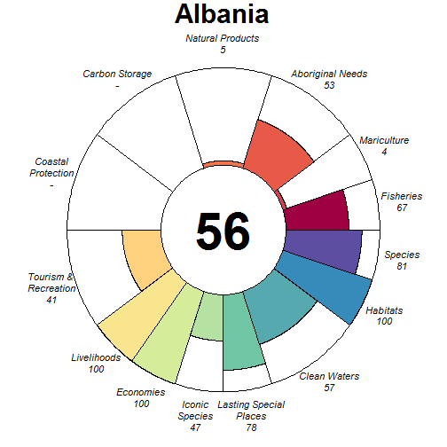

### Scores

|                                |  score| status| future| trend| pressures| resilience|
|:-------------------------------|------:|------:|------:|-----:|---------:|----------:|
|Index                           |  56.41|     NA|  57.91|    NA|        NA|         NA|
|Food Provision                  |  42.78|  40.82|  44.74|  0.01|        NA|         NA|
|. Fisheries                     |  67.06|  64.00|  70.12|  0.01|     32.11|      59.06|
|. Mariculture                   |   4.25|   4.03|   4.47|  0.00|     35.91|      68.75|
|Aboriginal Needs                |  52.55|  50.00|  55.09|  0.00|     28.04|      58.90|
|Natural Products                |   4.51|   4.45|   4.58| -0.05|     45.11|      64.68|
|Carbon Storage                  |     NA|     NA|     NA|    NA|        NA|         NA|
|Coastal Protection              |     NA|     NA|     NA|    NA|        NA|         NA|
|Tourism & Recreation            |  41.27|  40.13|  42.42|  0.00|     57.92|      75.00|
|Coastal Livelihoods & Economies | 100.00| 100.00| 100.00|  0.56|        NA|         NA|
|. Livelihoods                   | 100.00| 100.00| 100.00|  1.00|     37.25|      39.70|
|. Economies                     | 100.00| 100.00| 100.00|  0.11|     34.28|      49.25|
|Sense of Place                  |  62.59|  55.49|  69.70|  0.25|        NA|         NA|
|. Iconic Species                |  47.48|  54.29|  40.68| -0.50|     37.41|      62.99|
|. Lasting Special Places        |  77.70|  56.69|  98.72|  1.00|     46.51|      68.18|
|Clean Waters                    |  57.18|  56.82|  57.55|  0.02|     75.00|      75.00|
|Biodiversity                    |  90.42|  91.60|  89.23| -0.08|        NA|         NA|
|. Habitats                      |  99.93|  99.86| 100.00|  0.02|     31.12|      60.89|
|. Species                       |  80.90|  83.35|  78.45| -0.18|     38.48|      57.59|

## Algeria (84)

### Flower

### Scores

|                                |  score| status| future| trend| pressures| resilience|
|:-------------------------------|------:|------:|------:|-----:|---------:|----------:|
|Index                           |  53.94|     NA|  54.69|    NA|        NA|         NA|
|Food Provision                  |  65.74|  62.90|  68.58|  0.02|        NA|         NA|
|. Fisheries                     |  65.84|  63.00|  68.68|  0.02|     32.87|      56.13|
|. Mariculture                   |   0.03|   0.03|   0.03|  0.00|     34.06|      58.33|
|Aboriginal Needs                |  52.12|  50.00|  54.24|  0.00|     29.75|      55.47|
|Natural Products                |   0.00|   0.00|   0.00| -0.63|     27.46|      59.45|
|Carbon Storage                  |     NA|     NA|     NA|    NA|        NA|         NA|
|Coastal Protection              |     NA|     NA|     NA|    NA|        NA|         NA|
|Tourism & Recreation            |  20.97|  20.79|  21.15|  0.00|     57.36|      62.50|
|Coastal Livelihoods & Economies | 100.00| 100.00| 100.00|  0.52|        NA|         NA|
|. Livelihoods                   | 100.00| 100.00| 100.00|  1.00|     33.65|      31.78|
|. Economies                     | 100.00| 100.00| 100.00|  0.05|     31.86|      47.67|
|Sense of Place                  |  26.22|  29.83|  22.61| -0.25|        NA|         NA|
|. Iconic Species                |  49.83|  57.14|  42.52| -0.50|     35.86|      59.81|
|. Lasting Special Places        |   2.61|   2.52|   2.71|  0.00|     39.06|      61.93|
|Clean Waters                    |  81.32|  77.26|  85.37|  0.22|     75.00|      62.50|
|Biodiversity                    |  85.12|  84.71|  85.53| -0.10|        NA|         NA|
|. Habitats                      |  91.63|  88.23|  95.04| -0.02|     32.48|      58.93|
|. Species                       |  78.61|  81.19|  76.03| -0.18|     37.52|      55.31|

## American Samoa (151)

### Flower

### Scores

|                                | score| status| future| trend| pressures| resilience|
|:-------------------------------|-----:|------:|------:|-----:|---------:|----------:|
|Index                           | 60.14|     NA|  59.87|    NA|        NA|         NA|
|Food Provision                  | 54.95|  51.00|  58.90|  0.08|        NA|         NA|
|. Fisheries                     | 54.95|  51.00|  58.90|  0.08|     26.05|      56.75|
|. Mariculture                   |    NA|     NA|     NA|    NA|     26.79|      30.27|
|Aboriginal Needs                | 52.60|  50.00|  55.20|  0.00|     26.10|      57.62|
|Natural Products                |    NA|     NA|     NA|    NA|        NA|         NA|
|Carbon Storage                  | 91.85|  91.28|  92.41|    NA|     33.70|      37.43|
|Coastal Protection              | 28.40|  28.68|  28.12| -0.02|     38.28|      37.43|
|Tourism & Recreation            | 29.48|  30.97|  28.00|  0.00|     58.61|      29.22|
|Coastal Livelihoods & Economies | 84.25|  82.35|  86.16|  0.01|        NA|         NA|
|. Livelihoods                   | 99.20|  98.41| 100.00|  0.01|     26.13|      46.29|
|. Economies                     | 69.30|  66.28|  72.31|  0.01|     26.16|      52.38|
|Sense of Place                  | 54.86|  53.93|  55.78|  0.05|        NA|         NA|
|. Iconic Species                | 58.91|  62.50|  55.32| -0.30|     31.48|      57.59|
|. Lasting Special Places        | 50.80|  45.36|  56.24|  0.40|     38.39|      30.56|
|Clean Waters                    | 67.84|  72.54|  63.13|  0.02|     73.16|      29.22|
|Biodiversity                    | 77.01|  89.27|  71.12| -0.14|        NA|         NA|
|. Habitats                      |    NA|  95.64|     NA| -0.02|     34.43|         NA|
|. Species                       | 77.01|  82.91|  71.12| -0.26|     31.50|      41.94|

## Amsterdam Island and Saint Paul Island (92)

### Flower

### Scores

|                                |  score| status| future| trend| pressures| resilience|
|:-------------------------------|------:|------:|------:|-----:|---------:|----------:|
|Index                           |  66.06|     NA|  67.21|    NA|        NA|         NA|
|Food Provision                  |  12.82|  12.00|  13.64|  0.00|        NA|         NA|
|. Fisheries                     |  12.82|  12.00|  13.64|  0.00|     25.39|      66.68|
|. Mariculture                   |     NA|     NA|     NA|    NA|     26.64|      70.34|
|Aboriginal Needs                |  53.46|  50.00|  56.92|  0.00|     25.29|      67.23|
|Natural Products                |     NA|     NA|     NA|    NA|        NA|         NA|
|Carbon Storage                  |     NA|     NA|     NA|    NA|        NA|         NA|
|Coastal Protection              |     NA|     NA|     NA|    NA|        NA|         NA|
|Tourism & Recreation            |     NA|     NA|     NA|    NA|     30.63|      73.53|
|Coastal Livelihoods & Economies |     NA|     NA|     NA|    NA|        NA|         NA|
|. Livelihoods                   |     NA|     NA|     NA|    NA|        NA|      34.82|
|. Economies                     |     NA|     NA|     NA|    NA|        NA|      50.00|
|Sense of Place                  |  74.91|  73.33|  76.48|  0.00|        NA|         NA|
|. Iconic Species                |  49.81|  46.67|  52.96|  0.00|     26.68|      67.54|
|. Lasting Special Places        | 100.00| 100.00| 100.00|  0.00|     26.00|      71.92|
|Clean Waters                    |  99.99|  99.97| 100.00|  0.00|     25.77|      73.53|
|Biodiversity                    |  89.14|  89.27|  89.01| -0.10|        NA|         NA|
|. Habitats                      | 100.00| 100.00| 100.00|  0.00|     25.77|      65.94|
|. Species                       |  78.28|  78.54|  78.03| -0.21|     28.18|      68.04|

## Andaman and Nicobar (26)

### Flower

### Scores

|                                | score| status| future| trend| pressures| resilience|
|:-------------------------------|-----:|------:|------:|-----:|---------:|----------:|
|Index                           | 53.94|     NA|  53.48|    NA|        NA|         NA|
|Food Provision                  | 14.71|  14.00|  15.43|  0.00|        NA|         NA|
|. Fisheries                     | 14.71|  14.00|  15.43|  0.00|     28.45|      59.38|
|. Mariculture                   |    NA|     NA|     NA|    NA|     29.13|      60.73|
|Aboriginal Needs                | 52.68|  50.00|  55.35|  0.00|     27.78|      60.21|
|Natural Products                |    NA|     NA|     NA|    NA|        NA|         NA|
|Carbon Storage                  | 73.53|  86.45|  60.61| -0.58|     33.26|      60.31|
|Coastal Protection              | 52.85|  51.85|  53.85| -0.05|     38.86|      60.31|
|Tourism & Recreation            | 43.68|  42.63|  44.72|  0.00|     59.93|      75.00|
|Coastal Livelihoods & Economies | 78.22|  75.06|  81.39|  0.04|        NA|         NA|
|. Livelihoods                   | 63.97|  60.54|  67.40|  0.09|     33.08|      49.49|
|. Economies                     | 92.48|  89.58|  95.38| -0.01|     31.39|      53.83|
|Sense of Place                  | 23.72|  22.50|  24.94|  0.00|        NA|         NA|
|. Iconic Species                |    NA|     NA|     NA|    NA|     33.70|      63.33|
|. Lasting Special Places        | 23.72|  22.50|  24.94|  0.00|     42.19|      75.00|
|Clean Waters                    | 59.96|  59.66|  60.26|  0.01|     75.00|      75.00|
|Biodiversity                    | 86.07|  87.33|  84.81| -0.20|        NA|         NA|
|. Habitats                      | 90.46|  89.71|  91.21| -0.14|     30.46|      63.79|
|. Species                       | 81.68|  84.95|  78.41| -0.25|     34.01|      61.76|

## Angola (200)

### Flower

### Scores

|                                | score| status| future| trend| pressures| resilience|
|:-------------------------------|-----:|------:|------:|-----:|---------:|----------:|
|Index                           | 42.39|     NA|  36.74|    NA|        NA|         NA|
|Food Provision                  | 23.20|  22.00|  24.41|  0.03|        NA|         NA|
|. Fisheries                     | 23.20|  22.00|  24.41|  0.03|     28.46|      55.53|
|. Mariculture                   |    NA|     NA|     NA|    NA|     27.94|      62.50|
|Aboriginal Needs                | 52.21|  50.00|  54.41|  0.00|     27.68|      54.42|
|Natural Products                |  1.25|   1.60|   0.89| -0.80|     26.67|      54.27|
|Carbon Storage                  | 60.40|  86.94|  33.86| -1.00|     32.02|      50.04|
|Coastal Protection              | 18.62|  27.05|  10.19| -1.00|     35.91|      50.04|
|Tourism & Recreation            |  6.70|   6.66|   6.75|  0.00|     58.73|      62.50|
|Coastal Livelihoods & Economies | 78.59|  93.43|  63.74| -0.57|        NA|         NA|
|. Livelihoods                   | 63.02|  86.86|  39.18| -0.90|     34.31|      51.32|
|. Economies                     | 94.15| 100.00|  88.29| -0.24|     34.31|      47.96|
|Sense of Place                  | 46.41|  47.13|  45.69| -0.12|        NA|         NA|
|. Iconic Species                | 53.97|  56.67|  51.26| -0.25|     33.45|      55.32|
|. Lasting Special Places        | 38.85|  37.59|  40.12|  0.00|     40.37|      60.80|
|Clean Waters                    | 60.86|  62.64|  59.09| -0.02|     75.00|      62.50|
|Biodiversity                    | 75.71|  83.01|  68.40| -0.37|        NA|         NA|
|. Habitats                      | 73.69|  83.88|  63.51| -0.51|     29.46|      58.99|
|. Species                       | 77.72|  82.15|  73.29| -0.24|     33.96|      49.08|

## Anguilla (118)

### Flower

### Scores

|                                |  score| status| future| trend| pressures| resilience|
|:-------------------------------|------:|------:|------:|-----:|---------:|----------:|
|Index                           |  56.26|     NA|  51.79|    NA|        NA|         NA|
|Food Provision                  |   4.22|   4.00|   4.44|  0.01|        NA|         NA|
|. Fisheries                     |   4.22|   4.00|   4.44|  0.01|     25.80|      57.21|
|. Mariculture                   |     NA|     NA|     NA|    NA|     27.89|      63.13|
|Aboriginal Needs                |  52.63|  50.00|  55.26|  0.00|     26.00|      57.87|
|Natural Products                |     NA|     NA|     NA|    NA|        NA|         NA|
|Carbon Storage                  |  69.18| 100.00|  38.37| -1.00|     35.80|      52.06|
|Coastal Protection              |  37.47|  38.66|  36.27| -0.14|     42.71|      52.06|
|Tourism & Recreation            | 100.00| 100.00| 100.00|  0.00|     58.68|      66.40|
|Coastal Livelihoods & Economies |  59.35|  64.89|  53.80| -0.42|        NA|         NA|
|. Livelihoods                   |  35.98|  49.43|  22.53| -0.83|     31.41|      35.94|
|. Economies                     |  82.71|  80.34|  85.07|  0.00|     31.30|      49.46|
|Sense of Place                  |  36.33|  37.14|  35.51| -0.10|        NA|         NA|
|. Iconic Species                |  72.65|  74.29|  71.02| -0.20|     33.83|      61.13|
|. Lasting Special Places        |   0.00|   0.00|   0.00|  0.00|     40.59|      65.59|
|Clean Waters                    |  67.18|  67.71|  66.65|  0.02|     75.00|      66.40|
|Biodiversity                    |  80.00|  84.21|  75.78| -0.28|        NA|         NA|
|. Habitats                      |  78.10|  83.91|  72.28| -0.34|     32.94|      60.76|
|. Species                       |  81.90|  84.52|  79.28| -0.21|     32.33|      56.56|

## Antarctica (213)

### Flower

### Scores

|                                | score| status| future| trend| pressures| resilience|
|:-------------------------------|-----:|------:|------:|-----:|---------:|----------:|
|Index                           |    NA|     NA|     NA|    NA|        NA|         NA|
|Food Provision                  |    NA|     NA|     NA|    NA|        NA|         NA|
|. Fisheries                     |    NA|     NA|     NA|    NA|        NA|         NA|
|. Mariculture                   |    NA|     NA|     NA|    NA|        NA|         NA|
|Aboriginal Needs                |    NA|     NA|     NA|    NA|        NA|         NA|
|Natural Products                |    NA|     NA|     NA|    NA|        NA|         NA|
|Carbon Storage                  |    NA|     NA|     NA|    NA|        NA|         NA|
|Coastal Protection              |    NA|     NA|     NA|    NA|        NA|         NA|
|Tourism & Recreation            |    NA|     NA|     NA|    NA|        NA|         NA|
|Coastal Livelihoods & Economies |    NA|     NA|     NA|    NA|        NA|         NA|
|. Livelihoods                   |    NA|     NA|     NA|    NA|        NA|         NA|
|. Economies                     |    NA|     NA|     NA|    NA|        NA|         NA|
|Sense of Place                  |    NA|     NA|     NA|    NA|        NA|         NA|
|. Iconic Species                |    NA|     NA|     NA|    NA|        NA|         NA|
|. Lasting Special Places        |    NA|     NA|     NA|    NA|        NA|         NA|
|Clean Waters                    |    NA|     NA|     NA|    NA|        NA|         NA|
|Biodiversity                    |    NA|     NA|     NA|    NA|        NA|         NA|
|. Habitats                      |    NA|     NA|     NA|    NA|        NA|         NA|
|. Species                       |    NA|     NA|     NA|    NA|        NA|         NA|

## Antigua and Barbuda (120)

### Flower

### Scores

|                                |  score| status| future| trend| pressures| resilience|
|:-------------------------------|------:|------:|------:|-----:|---------:|----------:|
|Index                           |  62.51|     NA|  63.26|    NA|        NA|         NA|
|Food Provision                  |  21.34|  20.00|  22.68|  0.03|        NA|         NA|
|. Fisheries                     |  21.34|  20.00|  22.68|  0.03|     26.58|      61.17|
|. Mariculture                   |     NA|     NA|     NA|    NA|     27.71|      63.54|
|Aboriginal Needs                |  52.95|  50.00|  55.89|  0.00|     26.64|      62.34|
|Natural Products                |     NA|     NA|     NA|    NA|        NA|         NA|
|Carbon Storage                  | 100.00| 100.00| 100.00|    NA|     36.39|      62.43|
|Coastal Protection              |  27.46|  28.56|  26.35| -0.22|     41.52|      62.43|
|Tourism & Recreation            |  60.76|  59.22|  62.31|  0.00|     58.76|      75.00|
|Coastal Livelihoods & Economies |  92.91|  89.46|  96.36|  0.58|        NA|         NA|
|. Livelihoods                   | 100.00| 100.00| 100.00|  1.00|     31.58|      38.76|
|. Economies                     |  85.82|  78.91|  92.73|  0.17|     30.41|      49.46|
|Sense of Place                  |  57.05|  57.54|  56.57| -0.16|        NA|         NA|
|. Iconic Species                |  60.11|  63.64|  56.58| -0.31|     34.65|      64.50|
|. Lasting Special Places        |  54.00|  51.44|  56.56|  0.00|     41.39|      71.59|
|Clean Waters                    |  66.60|  66.86|  66.33| -0.01|     75.00|      75.00|
|Biodiversity                    |  83.56|  84.27|  82.85| -0.16|        NA|         NA|
|. Habitats                      |  85.09|  83.91|  86.27| -0.11|     31.35|      62.04|
|. Species                       |  82.03|  84.63|  79.42| -0.22|     32.93|      58.79|

## Argentina (172)

### Flower

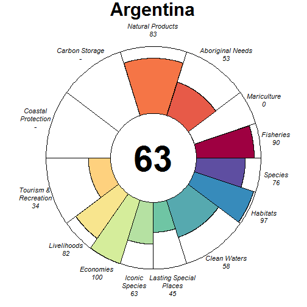

### Scores

|                                |  score| status| future| trend| pressures| resilience|
|:-------------------------------|------:|------:|------:|-----:|---------:|----------:|
|Index                           |  68.60|     NA|  70.31|    NA|        NA|         NA|
|Food Provision                  |  89.64|  82.98|  96.31|  0.09|        NA|         NA|
|. Fisheries                     |  89.67|  83.00|  96.33|  0.09|     30.40|      60.81|
|. Mariculture                   |   0.07|   0.07|   0.08|  0.00|     29.08|      50.73|
|Aboriginal Needs                |  52.73|  50.00|  55.46|  0.00|     27.88|      60.99|
|Natural Products                |  82.53|  77.49|  87.57|  0.01|     26.01|      62.51|
|Carbon Storage                  |     NA|     NA|     NA|    NA|        NA|         NA|
|Coastal Protection              |     NA|     NA|     NA|    NA|        NA|         NA|
|Tourism & Recreation            |  34.41|  34.94|  33.89|  0.00|     58.48|      50.00|
|Coastal Livelihoods & Economies |  91.18|  88.71|  93.64|  0.07|        NA|         NA|
|. Livelihoods                   |  82.35|  77.42|  87.28|  0.10|     31.62|      50.14|
|. Economies                     | 100.00| 100.00| 100.00|  0.04|     31.22|      48.92|
|Sense of Place                  |  53.66|  53.58|  53.73| -0.09|        NA|         NA|
|. Iconic Species                |  62.57|  63.64|  61.50| -0.19|     33.73|      61.64|
|. Lasting Special Places        |  44.74|  43.53|  45.96|  0.00|     42.17|      59.09|
|Clean Waters                    |  58.30|  61.67|  54.93| -0.04|     75.00|      50.00|
|Biodiversity                    |  86.37|  85.76|  86.98| -0.10|        NA|         NA|
|. Habitats                      |  96.65|  93.31| 100.00|  0.00|     29.71|      60.54|
|. Species                       |  76.08|  78.20|  73.95| -0.20|     35.08|      58.97|

## Aruba (250)

### Flower

### Scores

|                                |  score| status| future| trend| pressures| resilience|
|:-------------------------------|------:|------:|------:|-----:|---------:|----------:|
|Index                           |  69.29|     NA|  67.88|    NA|        NA|         NA|
|Food Provision                  |   4.22|   4.00|   4.43|  0.01|        NA|         NA|
|. Fisheries                     |   4.22|   4.00|   4.43|  0.01|     26.75|      57.56|
|. Mariculture                   |     NA|     NA|     NA|    NA|     28.31|      63.13|
|Aboriginal Needs                |  52.58|  50.00|  55.16|  0.00|     26.72|      58.02|
|Natural Products                |     NA|     NA|     NA|    NA|        NA|         NA|
|Carbon Storage                  |  81.61|  99.51|  63.71| -0.61|     36.41|      52.06|
|Coastal Protection              |  78.67|  76.62|  80.73|  0.03|     42.50|      52.06|
|Tourism & Recreation            | 100.00| 100.00| 100.00|  0.01|     42.58|      66.40|
|Coastal Livelihoods & Economies | 100.00| 100.00| 100.00|  0.51|        NA|         NA|
|. Livelihoods                   | 100.00| 100.00| 100.00|  0.99|     27.71|      32.97|
|. Economies                     | 100.00| 100.00| 100.00|  0.02|     27.61|      49.46|
|Sense of Place                  |  29.64|  31.11|  28.17| -0.14|        NA|         NA|
|. Iconic Species                |  59.29|  62.22|  56.35| -0.29|     32.08|      61.48|
|. Lasting Special Places        |   0.00|   0.00|   0.00|  0.00|     31.27|      65.59|
|Clean Waters                    |  92.57|  89.27|  95.87|  0.02|     49.02|      66.40|
|Biodiversity                    |  84.33|  90.88|  82.81| -0.24|        NA|         NA|
|. Habitats                      |     NA|  95.91|     NA| -0.29|     34.74|         NA|
|. Species                       |  84.33|  85.86|  82.81| -0.18|     30.88|      56.57|

## Ascension (85)

### Flower

### Scores

|                                | score| status| future| trend| pressures| resilience|
|:-------------------------------|-----:|------:|------:|-----:|---------:|----------:|
|Index                           | 53.65|     NA|  55.58|    NA|        NA|         NA|
|Food Provision                  | 45.95|  43.00|  48.91|  0.04|        NA|         NA|
|. Fisheries                     | 45.95|  43.00|  48.91|  0.04|     25.32|      58.83|
|. Mariculture                   |    NA|     NA|     NA|    NA|     26.21|      70.34|
|Aboriginal Needs                | 52.70|  50.00|  55.40|  0.00|     25.50|      58.20|
|Natural Products                |    NA|     NA|     NA|    NA|        NA|         NA|
|Carbon Storage                  |    NA|     NA|     NA|    NA|        NA|         NA|
|Coastal Protection              |    NA|     NA|     NA|    NA|        NA|         NA|
|Tourism & Recreation            | 44.93|  43.79|  46.06|  0.00|     57.81|      73.53|
|Coastal Livelihoods & Economies | 84.96|  76.39|  93.54|  0.34|        NA|         NA|
|. Livelihoods                   | 85.75|  71.50| 100.00|  0.68|     25.94|      30.85|
|. Economies                     | 84.18|  81.28|  87.08|  0.01|     25.92|      45.62|
|Sense of Place                  |  0.00|   0.00|   0.00|  0.00|        NA|         NA|
|. Iconic Species                |    NA|     NA|     NA|    NA|     31.17|      62.72|
|. Lasting Special Places        |  0.00|   0.00|   0.00|  0.00|     37.34|      71.92|
|Clean Waters                    | 57.72|  57.76|  57.68|  0.01|     75.00|      73.53|
|Biodiversity                    | 89.29|  91.09|  87.48| -0.14|        NA|         NA|
|. Habitats                      | 99.32|  98.64| 100.00|  0.03|     26.86|      62.16|
|. Species                       | 79.26|  83.55|  74.97| -0.30|     30.80|      59.94|

## Australia (16)

### Flower

### Scores

|                                |  score| status| future| trend| pressures| resilience|
|:-------------------------------|------:|------:|------:|-----:|---------:|----------:|
|Index                           |  70.15|     NA|  73.22|    NA|        NA|         NA|
|Food Provision                  |  43.48|  40.16|  46.80|  0.05|        NA|         NA|
|. Fisheries                     |  55.27|  51.00|  59.54|  0.05|     28.51|      69.09|
|. Mariculture                   |  13.16|  12.29|  14.04|  0.04|     30.30|      65.25|
|Aboriginal Needs                |  53.53|  50.00|  57.05|  0.00|     27.53|      70.26|
|Natural Products                |  66.29|  60.24|  72.35|  0.11|     33.61|      71.19|
|Carbon Storage                  |  91.13|  82.25| 100.00|  0.74|     34.46|      75.00|
|Coastal Protection              |  55.31|  49.92|  60.71|  0.16|     41.85|      75.00|
|Tourism & Recreation            |  59.31|  58.06|  60.55|  0.00|     61.79|      75.00|
|Coastal Livelihoods & Economies |  95.62|  91.23| 100.00|  0.51|        NA|         NA|
|. Livelihoods                   |  91.23|  82.47| 100.00|  0.97|     29.77|      48.38|
|. Economies                     | 100.00| 100.00| 100.00|  0.06|     30.94|      59.33|
|Sense of Place                  |  84.61|  86.58|  82.64|  0.33|        NA|         NA|
|. Iconic Species                |  69.22|  73.16|  65.28| -0.34|     32.58|      69.72|
|. Lasting Special Places        | 100.00| 100.00| 100.00|  1.00|     38.48|      75.00|
|Clean Waters                    |  63.95|  65.93|  61.97| -0.09|     75.00|      75.00|
|Biodiversity                    |  88.30|  86.46|  90.15|  0.02|        NA|         NA|
|. Habitats                      |  94.48|  88.96| 100.00|  0.29|     30.99|      68.35|
|. Species                       |  82.13|  83.95|  80.30| -0.25|     32.51|      70.30|

## Azores (55)

### Flower

### Scores

|                                |  score| status| future| trend| pressures| resilience|
|:-------------------------------|------:|------:|------:|-----:|---------:|----------:|
|Index                           |  62.70|     NA|  64.27|    NA|        NA|         NA|
|Food Provision                  |  40.67|  38.00|  43.35|  0.03|        NA|         NA|
|. Fisheries                     |  40.67|  38.00|  43.35|  0.03|     26.95|      63.49|
|. Mariculture                   |     NA|     NA|     NA|    NA|     29.88|      64.52|
|Aboriginal Needs                |  53.04|  50.00|  56.09|  0.00|     27.06|      63.96|
|Natural Products                |     NA|     NA|     NA|    NA|        NA|         NA|
|Carbon Storage                  |     NA|     NA|     NA|    NA|        NA|         NA|
|Coastal Protection              |     NA|     NA|     NA|    NA|        NA|         NA|
|Tourism & Recreation            |  74.01|  71.91|  76.11|  0.00|     57.24|      75.00|
|Coastal Livelihoods & Economies |  84.33|  88.74|  79.93| -0.17|        NA|         NA|
|. Livelihoods                   |  68.67|  77.48|  59.86| -0.35|     33.20|      34.58|
|. Economies                     | 100.00| 100.00| 100.00|  0.00|     31.57|      51.74|
|Sense of Place                  |  43.68|  37.37|  50.00|  1.00|        NA|         NA|
|. Iconic Species                |   0.00|   0.00|   0.00|    NA|     35.61|      65.52|
|. Lasting Special Places        |  87.37|  74.74| 100.00|  1.00|     45.03|      71.59|
|Clean Waters                    |  57.86|  57.91|  57.81|  0.00|     75.00|      75.00|
|Biodiversity                    |  85.32|  84.00|  86.63| -0.11|        NA|         NA|
|. Habitats                      |  94.86|  89.72| 100.00|  0.03|     28.74|      65.25|
|. Species                       |  75.77|  78.28|  73.26| -0.25|     34.74|      66.89|

## Bahamas (110)

### Flower

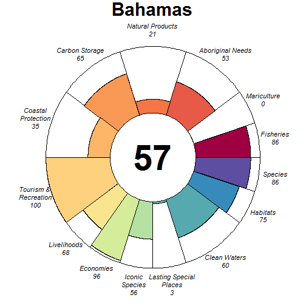

### Scores

|                                |  score| status| future| trend| pressures| resilience|
|:-------------------------------|------:|------:|------:|-----:|---------:|----------:|
|Index                           |  61.12|     NA|  58.65|    NA|        NA|         NA|
|Food Provision                  |  85.53|  79.00|  92.07|  0.09|        NA|         NA|
|. Fisheries                     |  85.53|  79.00|  92.07|  0.09|     26.12|      57.98|
|. Mariculture                   |   0.00|   0.00|   0.00|  0.00|     27.34|      63.54|
|Aboriginal Needs                |  52.65|  50.00|  55.30|  0.00|     25.81|      57.92|
|Natural Products                |  20.74|  23.93|  17.56| -0.57|     28.06|      62.07|
|Carbon Storage                  |  65.46|  93.63|  37.28| -1.00|     30.04|      50.69|
|Coastal Protection              |  34.59|  35.80|  33.38| -0.18|     34.82|      50.69|
|Tourism & Recreation            | 100.00| 100.00| 100.00| -0.01|     55.24|      62.50|
|Coastal Livelihoods & Economies |  82.03|  80.18|  83.88|  0.03|        NA|         NA|
|. Livelihoods                   |  67.69|  67.61|  67.76|  0.00|     32.32|      33.00|
|. Economies                     |  96.38|  92.76| 100.00|  0.06|     31.91|      49.46|
|Sense of Place                  |  29.67|  30.02|  29.31| -0.09|        NA|         NA|
|. Iconic Species                |  56.32|  57.14|  55.50| -0.19|     32.14|      61.51|
|. Lasting Special Places        |   3.01|   2.89|   3.13|  0.00|     38.63|      63.07|
|Clean Waters                    |  60.42|  60.27|  60.57|  0.07|     75.00|      62.50|
|Biodiversity                    |  80.10|  83.06|  77.14| -0.25|        NA|         NA|
|. Habitats                      |  74.56|  79.39|  69.74| -0.34|     28.89|      61.75|
|. Species                       |  85.63|  86.73|  84.53| -0.16|     32.21|      57.34|

## Bahrain (52)

### Flower

### Scores

|                                | score| status| future| trend| pressures| resilience|
|:-------------------------------|-----:|------:|------:|-----:|---------:|----------:|
|Index                           | 52.88|     NA|  51.61|    NA|        NA|         NA|
|Food Provision                  | 58.60|  59.00|  58.20| -0.13|        NA|         NA|
|. Fisheries                     | 58.60|  59.00|  58.21| -0.13|     33.39|      55.71|
|. Mariculture                   |  0.01|   0.01|   0.01|  0.00|     31.38|      50.00|
|Aboriginal Needs                | 52.17|  50.00|  54.33|  0.00|     29.11|      55.37|
|Natural Products                |  0.00|   0.00|   0.00|  0.00|     27.90|      54.42|
|Carbon Storage                  | 86.27|  85.51|  87.03|    NA|     36.30|      41.67|
|Coastal Protection              | 39.43|  44.05|  34.81| -0.32|     40.06|      41.67|
|Tourism & Recreation            | 48.48|  49.14|  47.81| -0.01|     57.10|      50.00|
|Coastal Livelihoods & Economies | 82.62|  75.34|  89.90|  0.24|        NA|         NA|
|. Livelihoods                   | 87.86|  75.73| 100.00|  0.50|     33.17|      45.58|
|. Economies                     | 77.37|  74.95|  79.79| -0.01|     32.84|      55.25|
|Sense of Place                  | 18.70|  21.67|  15.73| -0.25|        NA|         NA|
|. Iconic Species                | 37.40|  43.33|  31.46| -0.50|     36.57|      55.05|
|. Lasting Special Places        |  0.00|   0.00|   0.00|  0.00|     44.55|      50.00|
|Clean Waters                    | 57.50|  65.97|  49.03| -0.26|     75.00|      50.00|
|Biodiversity                    | 85.00|  90.70|  79.30| -0.26|        NA|         NA|
|. Habitats                      | 89.90|  91.46|  88.34| -0.17|     33.39|      57.84|
|. Species                       | 80.10|  89.93|  70.27| -0.35|     39.54|      43.42|

## Bangladesh (204)

### Flower

### Scores

|                                |  score| status| future| trend| pressures| resilience|
|:-------------------------------|------:|------:|------:|-----:|---------:|----------:|
|Index                           |  70.11|     NA|  71.12|    NA|        NA|         NA|
|Food Provision                  |   4.50|   4.34|   4.65| -0.01|        NA|         NA|
|. Fisheries                     |   1.04|   1.00|   1.08| -0.03|     32.70|      63.17|
|. Mariculture                   |  13.21|  12.78|  13.64|  0.04|     38.16|      50.52|
|Aboriginal Needs                |  52.81|  50.00|  55.63|  0.00|     29.85|      63.95|
|Natural Products                |  93.76|  87.52| 100.00|  0.78|     29.39|      67.05|
|Carbon Storage                  | 100.00| 100.00| 100.00|  0.56|     33.65|      58.92|
|Coastal Protection              | 100.00| 100.00| 100.00|  0.56|     34.93|      64.28|
|Tourism & Recreation            |  12.88|  12.56|  13.20|  0.00|     59.21|      75.00|
|Coastal Livelihoods & Economies | 100.00| 100.00| 100.00|  0.50|        NA|         NA|
|. Livelihoods                   | 100.00| 100.00| 100.00|  1.00|     32.06|      45.89|
|. Economies                     | 100.00| 100.00| 100.00|  0.00|     30.87|      47.08|
|Sense of Place                  |  60.62|  59.84|  61.40| -0.09|        NA|         NA|
|. Iconic Species                |  62.92|  64.00|  61.84| -0.19|     38.23|      66.08|
|. Lasting Special Places        |  58.33|  55.69|  60.97|  0.00|     41.71|      70.45|
|Clean Waters                    |  84.32|  83.19|  85.45|  0.04|     75.00|      75.00|
|Biodiversity                    |  92.26|  93.69|  90.82|  0.03|        NA|         NA|
|. Habitats                      |  99.86|  99.73| 100.00|  0.28|     33.54|      63.42|
|. Species                       |  84.65|  87.65|  81.65| -0.22|     35.82|      59.90|

## Barbados (124)

### Flower

### Scores

|                                |  score| status| future| trend| pressures| resilience|
|:-------------------------------|------:|------:|------:|-----:|---------:|----------:|
|Index                           |  49.58|     NA|  48.41|    NA|        NA|         NA|
|Food Provision                  |  38.52|  36.00|  41.03|  0.05|        NA|         NA|
|. Fisheries                     |  38.52|  36.00|  41.03|  0.05|     25.91|      58.13|
|. Mariculture                   |     NA|     NA|     NA|    NA|     29.22|      67.71|
|Aboriginal Needs                |  52.72|  50.00|  55.44|  0.00|     26.57|      59.53|
|Natural Products                |   3.36|   3.26|   3.47| -0.09|     26.29|      64.85|
|Carbon Storage                  |  26.13|  25.28|  26.98|    NA|     38.28|      58.71|
|Coastal Protection              |  27.37|  26.33|  28.41|  0.04|     43.21|      58.71|
|Tourism & Recreation            | 100.00| 100.00| 100.00| -0.01|     57.89|      75.00|
|Coastal Livelihoods & Economies |  69.97|  86.30|  53.65| -0.58|        NA|         NA|
|. Livelihoods                   |  68.68| 100.00|  37.35| -1.00|     32.46|      45.65|
|. Economies                     |  71.27|  72.59|  69.94| -0.17|     30.45|      53.50|
|Sense of Place                  |  29.82|  31.77|  27.86| -0.17|        NA|         NA|
|. Iconic Species                |  55.90|  60.00|  51.81| -0.33|     36.07|      62.37|
|. Lasting Special Places        |   3.73|   3.55|   3.91|  0.00|     43.95|      75.00|
|Clean Waters                    |  68.32|  69.35|  67.29| -0.04|     75.00|      75.00|
|Biodiversity                    |  79.57|  79.20|  79.94| -0.11|        NA|         NA|
|. Habitats                      |  78.99|  75.09|  82.89|  0.02|     34.36|      61.57|
|. Species                       |  80.15|  83.31|  76.99| -0.24|     32.76|      58.55|

## Bassas da India (34)

### Flower

### Scores

|                                | score| status| future| trend| pressures| resilience|
|:-------------------------------|-----:|------:|------:|-----:|---------:|----------:|
|Index                           | 60.36|     NA|  61.89|    NA|        NA|         NA|
|Food Provision                  |    NA|     NA|     NA|    NA|        NA|         NA|
|. Fisheries                     |    NA|     NA|     NA|    NA|     25.13|      56.63|
|. Mariculture                   |    NA|     NA|     NA|    NA|     26.79|      63.52|
|Aboriginal Needs                | 52.64|  50.00|  55.28|  0.00|     25.07|      57.09|
|Natural Products                |    NA|     NA|     NA|    NA|        NA|         NA|
|Carbon Storage                  |    NA|     NA|     NA|    NA|        NA|         NA|
|Coastal Protection              | 89.12|  85.57|  92.66|  0.09|     47.40|      53.76|
|Tourism & Recreation            |    NA|     NA|     NA|    NA|     48.78|      70.13|
|Coastal Livelihoods & Economies |    NA|     NA|     NA|    NA|        NA|         NA|
|. Livelihoods                   |    NA|     NA|     NA|    NA|     29.30|      35.55|
|. Economies                     |    NA|     NA|     NA|    NA|     29.35|      47.71|
|Sense of Place                  |  0.00|   0.00|   0.00|  0.00|        NA|         NA|
|. Iconic Species                |    NA|     NA|     NA|    NA|     29.97|      61.11|
|. Lasting Special Places        |  0.00|   0.00|   0.00|  0.00|     37.96|      68.14|
|Clean Waters                    | 71.00|  69.60|  72.40|  0.00|     57.94|      70.13|
|Biodiversity                    | 89.05|  88.97|  89.13| -0.10|        NA|         NA|
|. Habitats                      | 96.39|  92.79| 100.00|  0.05|     28.51|      60.09|
|. Species                       | 81.70|  85.15|  78.26| -0.24|     31.01|      55.09|

## Belgium (59)

### Flower

### Scores

|                                |  score| status| future| trend| pressures| resilience|
|:-------------------------------|------:|------:|------:|-----:|---------:|----------:|
|Index                           |  77.20|     NA|  78.90|    NA|        NA|         NA|
|Food Provision                  |  66.57|  61.00|  72.14|  0.09|        NA|         NA|
|. Fisheries                     |  66.57|  61.00|  72.14|  0.09|     30.18|      67.27|
|. Mariculture                   |     NA|     NA|     NA|    NA|     37.69|      67.71|
|Aboriginal Needs                |  53.22|  50.00|  56.44|  0.00|     29.06|      68.10|
|Natural Products                |  99.04|  98.08| 100.00| -0.02|     29.33|      69.72|
|Carbon Storage                  | 100.00| 100.00| 100.00|  0.50|     32.89|      74.24|
|Coastal Protection              | 100.00| 100.00| 100.00|  0.50|     34.42|      74.24|
|Tourism & Recreation            |  30.16|  29.37|  30.95|  0.00|     58.46|      75.00|
|Coastal Livelihoods & Economies |  80.90|  80.49|  81.31|  0.02|        NA|         NA|
|. Livelihoods                   |  61.81|  60.99|  62.62|  0.00|     35.15|      43.27|
|. Economies                     | 100.00| 100.00| 100.00|  0.04|     32.97|      60.08|
|Sense of Place                  |  74.16|  75.00|  73.31|  0.38|        NA|         NA|
|. Iconic Species                |  48.31|  50.00|  46.63| -0.25|     38.11|      68.43|
|. Lasting Special Places        | 100.00| 100.00| 100.00|  1.00|     43.35|      73.86|
|Clean Waters                    |  76.93|  70.98|  82.89|  0.25|     75.00|      75.00|
|Biodiversity                    |  91.04|  90.08|  91.99|  0.06|        NA|         NA|
|. Habitats                      |  98.55|  97.10| 100.00|  0.24|     31.32|      66.15|
|. Species                       |  83.52|  83.06|  83.98| -0.13|     36.98|      66.11|

## Belize (164)

### Flower

### Scores

|                                |  score| status| future| trend| pressures| resilience|
|:-------------------------------|------:|------:|------:|-----:|---------:|----------:|
|Index                           |  60.03|     NA|  60.23|    NA|        NA|         NA|
|Food Provision                  |  46.23|  46.30|  46.16| -0.10|        NA|         NA|
|. Fisheries                     |  39.63|  35.00|  44.26|  0.19|     28.30|      69.86|
|. Mariculture                   |  50.53|  53.67|  47.39| -0.29|     29.68|      53.12|
|Aboriginal Needs                |  53.62|  50.00|  57.24|  0.00|     26.52|      70.37|
|Natural Products                |  49.93|  56.66|  43.21| -0.56|     27.68|      68.76|
|Carbon Storage                  |  40.27|  29.87|  50.68|  0.87|     33.05|      66.67|
|Coastal Protection              |  10.18|   9.19|  11.18|  0.18|     36.64|      66.67|
|Tourism & Recreation            |  98.57| 100.00|  97.14| -0.01|     56.74|      50.00|
|Coastal Livelihoods & Economies | 100.00| 100.00| 100.00|  0.53|        NA|         NA|
|. Livelihoods                   | 100.00| 100.00| 100.00|  1.00|     33.26|      45.64|
|. Economies                     | 100.00| 100.00| 100.00|  0.06|     31.68|      50.73|
|Sense of Place                  |  74.61|  76.74|  72.49| -0.24|        NA|         NA|
|. Iconic Species                |  51.24|  57.50|  44.98| -0.50|     33.04|      68.55|
|. Lasting Special Places        |  97.99|  95.97| 100.00|  0.03|     39.08|      62.50|
|Clean Waters                    |  51.82|  58.01|  45.64| -0.20|     75.00|      50.00|
|Biodiversity                    |  75.09|  71.60|  78.58|  0.02|        NA|         NA|
|. Habitats                      |  60.97|  54.46|  67.48|  0.18|     30.29|      66.99|
|. Species                       |  89.21|  88.74|  89.69| -0.14|     33.73|      65.76|

## Benin (99)

### Flower

### Scores

|                                |  score| status| future| trend| pressures| resilience|
|:-------------------------------|------:|------:|------:|-----:|---------:|----------:|
|Index                           |  64.38|     NA|  63.53|    NA|        NA|         NA|
|Food Provision                  |  69.65|  67.00|  72.30| -0.01|        NA|         NA|
|. Fisheries                     |  69.65|  67.00|  72.30| -0.01|     29.54|      55.56|
|. Mariculture                   |     NA|     NA|     NA|    NA|     31.84|      64.58|
|Aboriginal Needs                |  52.09|  50.00|  54.18|  0.00|     29.12|      54.43|
|Natural Products                |     NA|     NA|     NA|    NA|        NA|         NA|
|Carbon Storage                  | 100.00| 100.00| 100.00|    NA|     39.18|      53.79|
|Coastal Protection              | 100.00| 100.00| 100.00|    NA|     42.67|      53.79|
|Tourism & Recreation            |   7.82|   7.62|   8.02|  0.00|     59.10|      75.00|
|Coastal Livelihoods & Economies |  67.26|  74.32|  60.19| -0.44|        NA|         NA|
|. Livelihoods                   |  34.51|  48.64|  20.38| -0.90|     31.83|      39.32|
|. Economies                     | 100.00| 100.00| 100.00|  0.02|     31.83|      46.75|
|Sense of Place                  |  30.73|  31.25|  30.21| -0.08|        NA|         NA|
|. Iconic Species                |  61.46|  62.50|  60.43| -0.17|     36.92|      60.70|
|. Lasting Special Places        |   0.00|   0.00|   0.00|  0.00|     41.52|      68.18|
|Clean Waters                    |  71.39|  72.80|  69.98| -0.06|     75.00|      75.00|
|Biodiversity                    |  80.45|  91.99|  76.93| -0.22|        NA|         NA|
|. Habitats                      |     NA| 100.00|     NA|    NA|     35.27|         NA|
|. Species                       |  80.45|  83.97|  76.93| -0.22|     34.08|      54.03|

## Bermuda (108)

### Flower

### Scores

|                                | score| status| future| trend| pressures| resilience|
|:-------------------------------|-----:|------:|------:|-----:|---------:|----------:|
|Index                           | 64.67|     NA|  65.97|    NA|        NA|         NA|
|Food Provision                  | 21.52|  20.00|  23.03|  0.04|        NA|         NA|
|. Fisheries                     | 21.52|  20.00|  23.03|  0.04|     26.03|      63.89|
|. Mariculture                   |    NA|     NA|     NA|    NA|     26.83|      63.13|
|Aboriginal Needs                | 53.30|  50.00|  56.60|  0.00|     26.41|      66.40|
|Natural Products                |    NA|     NA|     NA|    NA|        NA|         NA|
|Carbon Storage                  |    NA|     NA|     NA|    NA|        NA|         NA|
|Coastal Protection              | 53.15|  51.73|  54.56| -0.03|     44.14|      67.15|
|Tourism & Recreation            | 99.58|  99.15| 100.00| -0.01|     55.14|      66.40|
|Coastal Livelihoods & Economies | 58.16|  56.85|  59.46| -0.04|        NA|         NA|
|. Livelihoods                   | 62.86|  61.86|  63.86| -0.02|     30.24|      43.91|
|. Economies                     | 53.45|  51.84|  55.06| -0.06|     30.00|      61.42|
|Sense of Place                  | 81.03|  78.96|  83.10| -0.04|        NA|         NA|
|. Iconic Species                | 64.77|  63.33|  66.21| -0.08|     34.30|      64.98|
|. Lasting Special Places        | 97.30|  94.59| 100.00|  0.00|     41.15|      65.59|
|Clean Waters                    | 72.89|  73.66|  72.13|  0.00|     73.55|      66.40|
|Biodiversity                    | 77.70|  76.57|  78.83| -0.12|        NA|         NA|
|. Habitats                      | 79.69|  75.86|  83.52| -0.02|     29.41|      63.19|
|. Species                       | 75.71|  77.28|  74.15| -0.22|     32.61|      64.11|

## Bonaire (245)

### Flower

### Scores

|                                |  score| status| future| trend| pressures| resilience|
|:-------------------------------|------:|------:|------:|-----:|---------:|----------:|
|Index                           |  66.77|     NA|  62.84|    NA|        NA|         NA|
|Food Provision                  |     NA|     NA|     NA|    NA|        NA|         NA|
|. Fisheries                     |     NA|     NA|     NA|    NA|     28.74|      59.26|
|. Mariculture                   |   0.07|   0.07|   0.08|  0.00|     28.92|      63.13|
|Aboriginal Needs                |  52.72|  50.00|  55.44|  0.00|     26.64|      59.61|
|Natural Products                |  16.67|  23.10|  10.25| -1.00|     28.26|      62.71|
|Carbon Storage                  |  77.04|  92.63|  61.46| -0.61|     31.56|      54.24|
|Coastal Protection              |  91.96|  90.45|  93.47| -0.01|     42.03|      54.24|
|Tourism & Recreation            | 100.00| 100.00| 100.00|  0.00|     58.86|      66.40|
|Coastal Livelihoods & Economies |  69.88|  84.52|  55.23| -0.50|        NA|         NA|
|. Livelihoods                   |  62.39|  93.79|  31.00| -1.00|     32.83|      32.97|
|. Economies                     |  77.36|  75.24|  79.47|  0.00|     31.50|      49.46|
|Sense of Place                  |  44.61|  45.43|  43.80| -0.14|        NA|         NA|
|. Iconic Species                |  57.10|  60.00|  54.20| -0.29|     34.04|      62.77|
|. Lasting Special Places        |  32.12|  30.85|  33.39|  0.00|     40.64|      65.59|
|Clean Waters                    |  61.87|  62.46|  61.29|  0.01|     75.00|      66.40|
|Biodiversity                    |  86.19|  91.84|  84.60| -0.23|        NA|         NA|
|. Habitats                      |     NA|  95.91|     NA| -0.29|     34.29|         NA|
|. Species                       |  86.19|  87.78|  84.60| -0.17|     34.39|      57.66|

## Bosnia and Herzegovina (232)

### Flower

### Scores

|                                |  score| status| future| trend| pressures| resilience|
|:-------------------------------|------:|------:|------:|-----:|---------:|----------:|
|Index                           |  57.58|     NA|  54.93|    NA|        NA|         NA|
|Food Provision                  |  51.19|  48.08|  54.30|  0.05|        NA|         NA|
|. Fisheries                     |  67.11|  63.00|  71.21|  0.06|     36.14|      63.47|
|. Mariculture                   |   1.97|   1.95|   1.99|  0.00|     44.08|      51.04|
|Aboriginal Needs                |  52.53|  50.00|  55.06|  0.00|     32.93|      63.57|
|Natural Products                |     NA|     NA|     NA|    NA|     36.68|      66.71|
|Carbon Storage                  |     NA|     NA|     NA|    NA|        NA|         NA|
|Coastal Protection              |     NA|     NA|     NA|    NA|        NA|         NA|
|Tourism & Recreation            |  27.37|  27.78|  26.96|  0.00|     58.80|      50.00|
|Coastal Livelihoods & Economies |  75.78|  89.67|  61.90| -0.46|        NA|         NA|
|. Livelihoods                   |  51.56|  79.34|  23.79| -1.00|     42.06|      32.94|
|. Economies                     | 100.00| 100.00| 100.00|  0.07|     41.36|      49.42|
|Sense of Place                  |  75.62|  80.00|  71.25| -0.25|        NA|         NA|
|. Iconic Species                |  51.95|  60.00|  43.91| -0.50|     43.69|      63.94|
|. Lasting Special Places        |  99.29| 100.00|  98.59|  0.00|     54.28|      50.00|
|Clean Waters                    |  45.09|  48.68|  41.50| -0.10|     75.00|      50.00|
|Biodiversity                    |  75.46|  77.35|  73.56| -0.14|        NA|         NA|
|. Habitats                      |  72.65|  70.17|  75.14| -0.02|     35.88|      61.36|
|. Species                       |  78.26|  84.54|  71.99| -0.26|     49.62|      57.31|

## Bouvet Island (105)

### Flower

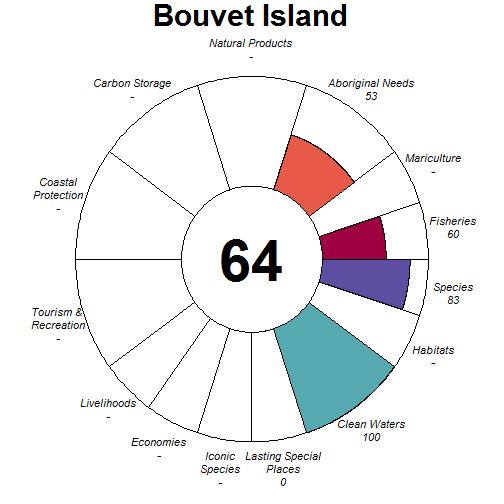

### Scores

|                                | score| status| future| trend| pressures| resilience|
|:-------------------------------|-----:|------:|------:|-----:|---------:|----------:|
|Index                           | 59.16|     NA|  61.12|    NA|        NA|         NA|
|Food Provision                  | 60.24|  55.00|  65.48|  0.12|        NA|         NA|
|. Fisheries                     | 60.24|  55.00|  65.48|  0.12|     25.03|      58.42|
|. Mariculture                   |    NA|     NA|     NA|    NA|     26.47|      63.42|
|Aboriginal Needs                | 52.74|  50.00|  55.48|  0.00|     25.03|      58.25|
|Natural Products                |    NA|     NA|     NA|    NA|        NA|         NA|
|Carbon Storage                  |    NA|     NA|     NA|    NA|        NA|         NA|
|Coastal Protection              |    NA|     NA|     NA|    NA|     36.64|      50.00|
|Tourism & Recreation            |    NA|     NA|     NA|    NA|     29.69|      75.00|
|Coastal Livelihoods & Economies |    NA|     NA|     NA|    NA|        NA|         NA|
|. Livelihoods                   |    NA|     NA|     NA|    NA|     25.30|      50.68|
|. Economies                     |    NA|     NA|     NA|    NA|     25.56|      50.00|
|Sense of Place                  |  0.00|   0.00|   0.00|  0.00|        NA|         NA|
|. Iconic Species                |    NA|     NA|     NA|    NA|     25.95|      62.36|
|. Lasting Special Places        |  0.00|   0.00|   0.00|  0.00|     25.77|      75.00|
|Clean Waters                    | 99.98|  99.97| 100.00|  0.00|     25.11|      75.00|
|Biodiversity                    | 82.84|  81.03|  84.65| -0.10|        NA|         NA|
|. Habitats                      |    NA|     NA|     NA|    NA|     30.86|         NA|
|. Species                       | 82.84|  81.03|  84.65| -0.10|     27.14|      60.92|

## Brazil (171)

### Flower

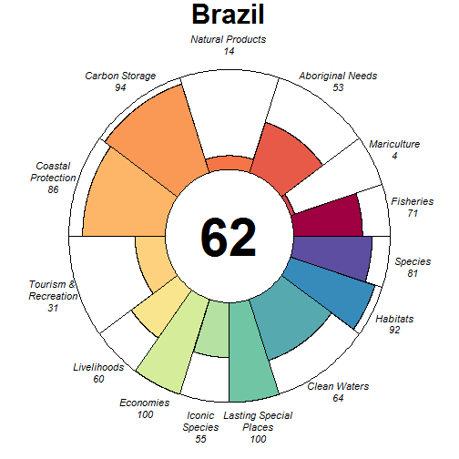

### Scores

|                                |  score| status| future| trend| pressures| resilience|
|:-------------------------------|------:|------:|------:|-----:|---------:|----------:|
|Index                           |  64.65|     NA|  64.78|    NA|        NA|         NA|
|Food Provision                  |  60.29|  56.55|  64.02|  0.01|        NA|         NA|
|. Fisheries                     |  71.44|  67.00|  75.88|  0.01|     28.75|      66.90|
|. Mariculture                   |   4.31|   4.13|   4.49|  0.00|     33.66|      60.31|
|Aboriginal Needs                |  53.30|  50.00|  56.59|  0.00|     28.12|      68.08|
|Natural Products                |  13.84|  13.21|  14.46| -0.07|     26.10|      69.48|
|Carbon Storage                  |  93.51|  95.42|  91.61| -0.27|     31.28|      73.48|
|Coastal Protection              |  85.76|  85.28|  86.24| -0.18|     34.55|      73.48|
|Tourism & Recreation            |  31.34|  30.50|  32.17|  0.00|     58.30|      75.00|
|Coastal Livelihoods & Economies |  79.75|  79.47|  80.03|  0.00|        NA|         NA|
|. Livelihoods                   |  59.50|  58.95|  60.05|  0.00|     30.30|      35.93|
|. Economies                     | 100.00| 100.00| 100.00|  0.01|     31.65|      53.33|
|Sense of Place                  |  77.53|  79.00|  76.06| -0.15|        NA|         NA|
|. Iconic Species                |  55.06|  58.00|  52.12| -0.31|     36.51|      68.24|
|. Lasting Special Places        | 100.00| 100.00| 100.00|  0.01|     44.97|      72.73|
|Clean Waters                    |  64.28|  65.64|  62.93| -0.06|     75.00|      75.00|
|Biodiversity                    |  86.90|  90.08|  83.72| -0.27|        NA|         NA|
|. Habitats                      |  92.35|  96.44|  88.26| -0.29|     32.95|      66.44|
|. Species                       |  81.45|  83.72|  79.18| -0.24|     34.33|      67.02|

## British Indian Ocean Territory (38)

### Flower

### Scores

|                                |  score| status| future| trend| pressures| resilience|
|:-------------------------------|------:|------:|------:|-----:|---------:|----------:|
|Index                           |  80.34|     NA|  81.41|    NA|        NA|         NA|
|Food Provision                  |  96.00|  92.00| 100.00|  0.11|        NA|         NA|
|. Fisheries                     |  96.00|  92.00| 100.00|  0.11|     25.24|      66.80|
|. Mariculture                   |     NA|     NA|     NA|    NA|     27.08|      69.23|
|Aboriginal Needs                |  53.58|  50.00|  57.16|  0.00|     25.21|      68.61|
|Natural Products                |     NA|     NA|     NA|    NA|        NA|         NA|
|Carbon Storage                  |     NA|     NA|     NA|    NA|        NA|         NA|
|Coastal Protection              | 100.00| 100.00| 100.00|    NA|     47.03|      71.78|
|Tourism & Recreation            |  82.16|  79.68|  84.64| -0.01|     50.00|      71.45|
|Coastal Livelihoods & Economies |  75.78|  74.82|  76.74| -0.08|        NA|         NA|
|. Livelihoods                   |  54.58|  55.69|  53.47| -0.16|     29.35|      50.54|
|. Economies                     |  96.98|  93.96| 100.00|  0.00|     28.65|      49.83|
|Sense of Place                  |  72.37|  75.00|  69.74|  0.25|        NA|         NA|
|. Iconic Species                |  44.74|  50.00|  39.48| -0.50|     30.25|      68.02|
|. Lasting Special Places        | 100.00| 100.00| 100.00|  1.00|     38.24|      70.17|
|Clean Waters                    |  71.48|  70.01|  72.94|  0.00|     58.75|      71.45|
|Biodiversity                    |  91.39|  92.70|  90.08| -0.13|        NA|         NA|
|. Habitats                      | 100.00| 100.00| 100.00|  0.00|     28.41|      66.54|
|. Species                       |  82.78|  85.40|  80.15| -0.27|     30.84|      66.46|

## British Virgin Islands (117)

### Flower

### Scores

|                                |  score| status| future| trend| pressures| resilience|
|:-------------------------------|------:|------:|------:|-----:|---------:|----------:|
|Index                           |  59.48|     NA|  54.07|    NA|        NA|         NA|
|Food Provision                  |  10.62|  10.00|  11.25|  0.03|        NA|         NA|
|. Fisheries                     |  10.62|  10.00|  11.25|  0.03|     26.06|      57.75|
|. Mariculture                   |     NA|     NA|     NA|    NA|     28.18|      63.13|
|Aboriginal Needs                |  52.65|  50.00|  55.31|  0.00|     26.27|      58.45|
|Natural Products                |     NA|     NA|     NA|    NA|        NA|         NA|
|Carbon Storage                  |  69.24| 100.00|  38.47| -1.00|     36.39|      52.97|
|Coastal Protection              |  45.86|  46.24|  45.49| -0.08|     42.31|      52.97|
|Tourism & Recreation            | 100.00| 100.00| 100.00| -0.01|     58.66|      66.40|
|Coastal Livelihoods & Economies |  71.50|  86.12|  56.88| -0.50|        NA|         NA|
|. Livelihoods                   |  64.34|  95.67|  33.01| -1.00|     31.40|      35.94|
|. Economies                     |  78.66|  76.56|  80.76| -0.01|     31.30|      49.46|
|Sense of Place                  |  37.33|  38.78|  35.89| -0.16|        NA|         NA|
|. Iconic Species                |  56.40|  60.00|  52.79| -0.31|     34.47|      61.51|
|. Lasting Special Places        |  18.27|  17.55|  18.98|  0.00|     40.96|      65.59|
|Clean Waters                    |  68.01|  68.56|  67.46|  0.02|     75.00|      66.40|
|Biodiversity                    |  80.11|  84.29|  75.93| -0.28|        NA|         NA|
|. Habitats                      |  78.13|  83.91|  72.36| -0.34|     32.95|      61.05|
|. Species                       |  82.08|  84.67|  79.50| -0.21|     32.53|      57.01|

## Brunei (247)

### Flower

### Scores

|                                | score| status| future| trend| pressures| resilience|
|:-------------------------------|-----:|------:|------:|-----:|---------:|----------:|
|Index                           | 52.02|     NA|  48.91|    NA|        NA|         NA|
|Food Provision                  | 21.22|  18.59|  23.84|  0.12|        NA|         NA|
|. Fisheries                     | 51.98|  45.00|  58.96|  0.33|     32.34|      59.37|
|. Mariculture                   |  3.83|   3.66|   3.99|  0.00|     31.76|      59.46|
|Aboriginal Needs                | 52.33|  50.00|  54.66|  0.00|     31.26|      59.50|
|Natural Products                |  0.00|   0.00|   0.00| -0.72|     28.72|      63.54|
|Carbon Storage                  | 63.81|  83.83|  43.79| -0.81|     31.97|      51.39|
|Coastal Protection              | 96.63|  97.36|  95.89| -0.11|     41.79|      59.26|
|Tourism & Recreation            | 25.00|  24.46|  25.54|  0.00|     61.61|      75.00|
|Coastal Livelihoods & Economies | 77.70|  85.58|  69.82| -0.34|        NA|         NA|
|. Livelihoods                   | 79.93|  98.13|  61.72| -0.66|     33.28|      55.09|
|. Economies                     | 75.47|  73.03|  77.91| -0.02|     32.13|      57.25|
|Sense of Place                  | 34.63|  37.96|  31.29| -0.25|        NA|         NA|
|. Iconic Species                | 52.54|  60.00|  45.09| -0.50|     37.09|      63.28|
|. Lasting Special Places        | 16.71|  15.93|  17.50|  0.00|     43.99|      73.86|
|Clean Waters                    | 65.11|  65.79|  64.43| -0.03|     75.00|      75.00|
|Biodiversity                    | 83.78|  87.77|  79.80| -0.28|        NA|         NA|
|. Habitats                      | 88.24|  91.13|  85.36| -0.26|     30.91|      64.28|
|. Species                       | 79.32|  84.41|  74.24| -0.31|     36.67|      62.88|

## Bulgaria (71)

### Flower

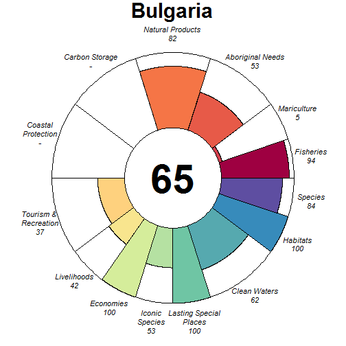

### Scores

|                                |  score| status| future| trend| pressures| resilience|
|:-------------------------------|------:|------:|------:|-----:|---------:|----------:|
|Index                           |  66.94|     NA|  67.81|    NA|        NA|         NA|
|Food Provision                  |  62.27|  58.01|  66.54|  0.05|        NA|         NA|
|. Fisheries                     |  93.50|  87.00| 100.00|  0.07|     28.62|      64.24|
|. Mariculture                   |   4.55|   4.42|   4.68|  0.02|     36.34|      50.00|
|Aboriginal Needs                |  53.16|  50.00|  56.32|  0.00|     27.20|      65.53|
|Natural Products                |  81.78|  65.72|  97.84|  0.54|     28.70|      67.81|
|Carbon Storage                  |     NA|     NA|     NA|    NA|        NA|         NA|
|Coastal Protection              |     NA|     NA|     NA|    NA|        NA|         NA|
|Tourism & Recreation            |  37.11|  37.67|  36.54| -0.01|     57.99|      50.00|
|Coastal Livelihoods & Economies |  71.23|  82.05|  60.42| -0.45|        NA|         NA|
|. Livelihoods                   |  42.46|  64.09|  20.84| -1.00|     36.32|      34.83|
|. Economies                     | 100.00| 100.00| 100.00|  0.11|     35.91|      52.25|
|Sense of Place                  |  76.33|  80.00|  72.67| -0.25|        NA|         NA|
|. Iconic Species                |  52.67|  60.00|  45.33| -0.50|     37.26|      64.70|
|. Lasting Special Places        | 100.00| 100.00| 100.00|  0.00|     46.61|      50.00|
|Clean Waters                    |  61.58|  61.45|  61.72|  0.13|     75.00|      50.00|
|Biodiversity                    |  92.06|  93.72|  90.40| -0.11|        NA|         NA|
|. Habitats                      | 100.00| 100.00| 100.00|  0.00|     29.30|      61.97|
|. Species                       |  84.12|  87.44|  80.81| -0.22|     34.92|      57.12|

## Cambodia (24)

### Flower

### Scores

|                                |  score| status| future| trend| pressures| resilience|
|:-------------------------------|------:|------:|------:|-----:|---------:|----------:|
|Index                           |  53.15|     NA|  48.81|    NA|        NA|         NA|
|Food Provision                  |   5.90|   5.62|   6.18|  0.03|        NA|         NA|
|. Fisheries                     |   5.25|   5.00|   5.49|  0.03|     37.85|      61.73|
|. Mariculture                   |   9.94|   9.45|  10.44|  0.05|     29.52|      51.04|
|Aboriginal Needs                |  52.40|  50.00|  54.79|  0.00|     32.52|      61.57|
|Natural Products                |  16.00|  15.06|  16.93| -0.01|     26.68|      66.21|
|Carbon Storage                  |  53.55|  75.88|  31.22| -1.00|     29.92|      54.61|
|Coastal Protection              |  61.76|  80.82|  42.70| -0.84|     34.07|      61.41|
|Tourism & Recreation            |  71.54|  69.87|  73.20|  0.00|     60.14|      75.00|
|Coastal Livelihoods & Economies |  75.22|  74.94|  75.50|  0.10|        NA|         NA|
|. Livelihoods                   |  50.44|  49.88|  50.99|  0.02|     36.02|      38.97|
|. Economies                     | 100.00| 100.00| 100.00|  0.19|     35.84|      50.08|
|Sense of Place                  |  54.82|  56.30|  53.34| -0.25|        NA|         NA|
|. Iconic Species                |  43.96|  50.00|  37.93| -0.50|     36.77|      65.12|
|. Lasting Special Places        |  65.68|  62.61|  68.75|  0.00|     42.99|      72.73|
|Clean Waters                    |  58.12|  56.99|  59.26|  0.06|     75.00|      75.00|
|Biodiversity                    |  82.19|  89.44|  74.94| -0.37|        NA|         NA|
|. Habitats                      |  83.71|  91.33|  76.10| -0.41|     30.65|      62.90|
|. Species                       |  80.66|  87.55|  73.78| -0.33|     40.35|      59.03|

## Cameroon (197)

### Flower

### Scores

|                                |  score| status| future| trend| pressures| resilience|
|:-------------------------------|------:|------:|------:|-----:|---------:|----------:|
|Index                           |  62.49|     NA|  58.80|    NA|        NA|         NA|
|Food Provision                  |  59.35|  58.00|  60.71| -0.04|        NA|         NA|
|. Fisheries                     |  59.35|  58.00|  60.71| -0.04|     35.35|      57.63|
|. Mariculture                   |     NA|     NA|     NA|    NA|     31.68|      62.50|
|Aboriginal Needs                |  52.20|  50.00|  54.40|  0.00|     31.24|      57.91|
|Natural Products                |     NA|     NA|     NA|    NA|        NA|         NA|
|Carbon Storage                  |  82.57|  91.91|  73.23| -0.40|     31.04|      51.57|
|Coastal Protection              |  82.39|  91.91|  72.86| -0.40|     32.27|      51.57|
|Tourism & Recreation            |  10.22|   9.95|  10.49|  0.00|     58.57|      75.00|
|Coastal Livelihoods & Economies |  78.30|  88.62|  67.97| -0.45|        NA|         NA|
|. Livelihoods                   |  56.59|  77.25|  35.94| -0.91|     36.79|      59.17|
|. Economies                     | 100.00| 100.00| 100.00|  0.02|     33.89|      47.42|
|Sense of Place                  |  59.73|  59.02|  60.44| -0.08|        NA|         NA|
|. Iconic Species                |  66.53|  67.50|  65.56| -0.17|     36.73|      61.85|
|. Lasting Special Places        |  52.93|  50.54|  55.32|  0.00|     42.94|      71.59|
|Clean Waters                    |  55.83|  61.06|  50.61| -0.26|     75.00|      75.00|
|Biodiversity                    |  81.86|  85.24|  78.48| -0.24|        NA|         NA|
|. Habitats                      |  86.72|  89.31|  84.13| -0.23|     31.46|      60.97|
|. Species                       |  77.00|  81.18|  72.82| -0.24|     39.83|      58.26|

## Canada (218)

### Flower

### Scores

|                                |  score| status| future| trend| pressures| resilience|
|:-------------------------------|------:|------:|------:|-----:|---------:|----------:|
|Index                           |  62.32|     NA|  65.20|    NA|        NA|         NA|
|Food Provision                  |  74.58|  67.19|  81.96|  0.07|        NA|         NA|
|. Fisheries                     |  71.43|  64.00|  78.85|  0.07|     16.69|      72.81|
|. Mariculture                   |  92.88|  85.77| 100.00|  0.04|     14.01|      68.68|
|Aboriginal Needs                |  35.46|  32.39|  38.52| -0.01|     13.58|      73.66|
|Natural Products                |  58.11|  58.70|  57.53| -0.34|     13.81|      76.44|
|Carbon Storage                  |  54.48|  50.39|  58.56|  0.00|     14.93|      64.06|
|Coastal Protection              |  95.89|  91.79| 100.00| -0.01|     23.81|      64.06|
|Tourism & Recreation            |  24.62|  23.93|  25.32|  0.00|     44.95|      62.97|
|Coastal Livelihoods & Economies |  89.73|  86.74|  92.73|  0.03|        NA|         NA|
|. Livelihoods                   |  79.47|  73.48|  85.45|  0.03|     17.13|      60.08|
|. Economies                     | 100.00| 100.00| 100.00|  0.02|     17.15|      73.55|
|Sense of Place                  |  52.58|  46.20|  58.95|  0.34|        NA|         NA|
|. Iconic Species                |  71.26|  67.14|  75.38| -0.10|     16.99|      74.46|
|. Lasting Special Places        |  33.89|  25.27|  42.52|  0.78|     22.84|      72.06|
|Clean Waters                    |  46.68|  52.20|  41.15| -0.32|     62.03|      62.97|
|Biodiversity                    |  91.05|  84.83|  97.28| -0.04|        NA|         NA|
|. Habitats                      |  92.72|  85.43| 100.00|  0.00|     14.73|      75.38|
|. Species                       |  89.39|  84.22|  94.55| -0.08|     19.67|      72.83|

## Canary Islands (58)

### Flower

### Scores

|                                | score| status| future| trend| pressures| resilience|
|:-------------------------------|-----:|------:|------:|-----:|---------:|----------:|
|Index                           | 61.29|     NA|  62.84|    NA|        NA|         NA|
|Food Provision                  | 75.03|  71.00|  79.05| -0.01|        NA|         NA|
|. Fisheries                     | 75.03|  71.00|  79.05| -0.01|     28.57|      64.97|
|. Mariculture                   |    NA|     NA|     NA|    NA|     29.14|      62.59|
|Aboriginal Needs                | 53.07|  50.00|  56.14|  0.00|     28.10|      65.30|
|Natural Products                |    NA|     NA|     NA|    NA|        NA|         NA|
|Carbon Storage                  | 52.84|  50.00|  55.68|    NA|     36.02|      70.45|
|Coastal Protection              | 52.60|  50.00|  55.19|    NA|     38.99|      70.45|
|Tourism & Recreation            | 73.90|  71.91|  75.90|  0.00|     58.13|      75.00|
|Coastal Livelihoods & Economies | 58.28|  61.92|  54.63| -0.17|        NA|         NA|
|. Livelihoods                   | 68.97|  77.48|  60.45| -0.35|     32.79|      36.49|
|. Economies                     | 47.59|  46.37|  48.81|  0.00|     32.56|      48.50|
|Sense of Place                  | 48.40|  46.79|  50.00|  0.00|        NA|         NA|
|. Iconic Species                |  0.00|   0.00|   0.00|    NA|     35.37|      66.81|
|. Lasting Special Places        | 96.79|  93.58| 100.00|  0.00|     44.72|      68.18|
|Clean Waters                    | 60.48|  60.38|  60.58|  0.01|     75.00|      75.00|
|Biodiversity                    | 77.04|  75.69|  78.38| -0.10|        NA|         NA|
|. Habitats                      | 73.62|  69.38|  77.87|  0.01|     31.06|      66.11|
|. Species                       | 80.45|  82.01|  78.89| -0.21|     36.15|      66.69|

## Cape Verde (56)

### Flower

### Scores

|                                |  score| status| future| trend| pressures| resilience|
|:-------------------------------|------:|------:|------:|-----:|---------:|----------:|
|Index                           |  74.62|     NA|  74.66|    NA|        NA|         NA|
|Food Provision                  |  79.33|  76.00|  82.67| -0.02|        NA|         NA|
|. Fisheries                     |  79.33|  76.00|  82.67| -0.02|     25.83|      56.47|
|. Mariculture                   |     NA|     NA|     NA|    NA|     27.69|      51.04|
|Aboriginal Needs                |  52.49|  50.00|  54.98|  0.00|     26.00|      56.19|
|Natural Products                |     NA|     NA|     NA|    NA|        NA|         NA|
|Carbon Storage                  |     NA|     NA|     NA|    NA|        NA|         NA|
|Coastal Protection              |     NA|     NA|     NA|    NA|        NA|         NA|
|Tourism & Recreation            |  98.51| 100.00|  97.02|  0.00|     58.64|      50.00|
|Coastal Livelihoods & Economies | 100.00| 100.00| 100.00|  0.31|        NA|         NA|
|. Livelihoods                   | 100.00| 100.00| 100.00|  0.65|     32.16|      51.82|
|. Economies                     | 100.00| 100.00| 100.00| -0.03|     32.16|      46.25|
|Sense of Place                  |  33.22|  33.33|  33.11| -0.07|        NA|         NA|
|. Iconic Species                |  66.45|  66.67|  66.23| -0.14|     32.12|      59.12|
|. Lasting Special Places        |   0.00|   0.00|   0.00|  0.00|     36.80|      59.09|
|Clean Waters                    |  69.42|  72.02|  66.83|  0.02|     75.00|      50.00|
|Biodiversity                    |  89.38|  90.77|  87.99| -0.12|        NA|         NA|
|. Habitats                      |  99.45|  98.91| 100.00| -0.01|     26.08|      58.27|
|. Species                       |  79.31|  82.63|  75.98| -0.23|     31.35|      52.90|

## Cayman Islands (113)

### Flower

### Scores

|                                |  score| status| future| trend| pressures| resilience|
|:-------------------------------|------:|------:|------:|-----:|---------:|----------:|
|Index                           |  64.28|     NA|  63.65|    NA|        NA|         NA|
|Food Provision                  |   8.62|   8.00|   9.24|  0.05|        NA|         NA|
|. Fisheries                     |   8.62|   8.00|   9.24|  0.05|     25.75|      62.53|
|. Mariculture                   |     NA|     NA|     NA|    NA|     27.00|      63.13|
|Aboriginal Needs                |  53.06|  50.00|  56.13|  0.00|     25.90|      63.05|
|Natural Products                |     NA|     NA|     NA|    NA|        NA|         NA|
|Carbon Storage                  |  88.98|  97.95|  80.00| -0.42|     29.67|      60.22|
|Coastal Protection              |  54.54|  54.19|  54.89| -0.10|     35.04|      60.22|
|Tourism & Recreation            |  49.53|  48.61|  50.44|  0.00|     55.34|      66.40|
|Coastal Livelihoods & Economies | 100.00| 100.00| 100.00|  0.50|        NA|         NA|
|. Livelihoods                   | 100.00| 100.00| 100.00|  1.00|     30.71|      35.94|
|. Economies                     | 100.00| 100.00| 100.00| -0.01|     30.40|      49.46|
|Sense of Place                  |  67.55|  66.79|  68.31| -0.12|        NA|         NA|
|. Iconic Species                |  58.18|  60.00|  56.36| -0.25|     32.54|      64.92|
|. Lasting Special Places        |  76.92|  73.58|  80.27|  0.00|     38.06|      65.59|
|Clean Waters                    |  70.86|  71.30|  70.42|  0.02|     75.00|      66.40|
|Biodiversity                    |  85.39|  87.31|  83.46| -0.22|        NA|         NA|
|. Habitats                      |  83.49|  87.18|  79.80| -0.30|     29.42|      63.79|
|. Species                       |  87.28|  87.45|  87.11| -0.15|     31.86|      60.64|

## Chile (224)

### Flower

### Scores

|                                |  score| status| future| trend| pressures| resilience|
|:-------------------------------|------:|------:|------:|-----:|---------:|----------:|
|Index                           |  65.34|     NA|  66.92|    NA|        NA|         NA|
|Food Provision                  |  87.19|  81.01|  93.37|  0.09|        NA|         NA|
|. Fisheries                     |  83.81|  76.00|  91.62|  0.12|     29.74|      67.66|
|. Mariculture                   | 100.00| 100.00| 100.00|  0.00|     27.11|      62.48|
|Aboriginal Needs                |  53.43|  50.00|  56.85|  0.00|     27.63|      69.16|
|Natural Products                |  33.72|  31.74|  35.70| -0.03|     26.43|      70.08|
|Carbon Storage                  |     NA|     NA|     NA|    NA|        NA|         NA|
|Coastal Protection              |     NA|     NA|     NA|    NA|        NA|         NA|
|Tourism & Recreation            |  30.11|  29.22|  31.00|  0.00|     56.57|      75.00|
|Coastal Livelihoods & Economies | 100.00| 100.00| 100.00|  0.44|        NA|         NA|
|. Livelihoods                   | 100.00| 100.00| 100.00|  1.00|     33.10|      55.32|
|. Economies                     | 100.00| 100.00| 100.00| -0.11|     31.30|      55.42|
|Sense of Place                  |  80.97|  81.30|  80.64| -0.04|        NA|         NA|
|. Iconic Species                |  62.18|  63.08|  61.28| -0.22|     31.89|      68.36|
|. Lasting Special Places        |  99.76|  99.52| 100.00|  0.15|     40.50|      75.00|
|Clean Waters                    |  54.20|  55.29|  53.11| -0.06|     75.00|      75.00|
|Biodiversity                    |  83.09|  81.53|  84.66| -0.13|        NA|         NA|
|. Habitats                      |  86.96|  84.01|  89.90| -0.09|     29.67|      68.65|
|. Species                       |  79.23|  79.05|  79.42| -0.18|     35.20|      72.29|

## China (209)

### Flower

### Scores

|                                |  score| status| future| trend| pressures| resilience|
|:-------------------------------|------:|------:|------:|-----:|---------:|----------:|
|Index                           |  61.61|     NA|  61.55|    NA|        NA|         NA|
|Food Provision                  |  76.39|  75.71|  77.07|  0.02|        NA|         NA|
|. Fisheries                     |  41.67|  40.00|  43.35|  0.05|     45.77|      60.97|
|. Mariculture                   | 100.00| 100.00| 100.00|  0.00|     38.62|      62.60|
|Aboriginal Needs                |  51.89|  50.00|  53.78|  0.00|     38.07|      61.00|
|Natural Products                |  77.18|  71.15|  83.21|  0.05|     28.66|      69.57|
|Carbon Storage                  |  53.17|  62.73|  43.60| -0.56|     38.84|      60.22|
|Coastal Protection              |  45.05|  44.74|  45.36| -0.09|     36.80|      60.22|
|Tourism & Recreation            |  41.45|  40.41|  42.49|  0.00|     59.21|      75.00|
|Coastal Livelihoods & Economies |  96.52|  93.05| 100.00|  0.17|        NA|         NA|
|. Livelihoods                   |  93.42|  86.84| 100.00|  0.34|     37.12|      67.12|
|. Economies                     |  99.63|  99.25| 100.00|  0.00|     34.65|      61.75|
|Sense of Place                  |  34.31|  35.82|  32.80| -0.11|        NA|         NA|
|. Iconic Species                |  51.69|  56.00|  47.39| -0.33|     43.30|      64.36|
|. Lasting Special Places        |  16.93|  15.63|  18.22|  0.12|     48.17|      73.86|
|Clean Waters                    |  62.65|  62.34|  62.96|  0.01|     75.00|      75.00|
|Biodiversity                    |  77.53|  80.80|  74.26| -0.22|        NA|         NA|
|. Habitats                      |  75.64|  77.03|  74.25| -0.19|     35.52|      64.19|
|. Species                       |  79.42|  84.58|  74.27| -0.25|     47.96|      62.64|

## Christmas Island (2)

### Flower

### Scores

|                                |  score| status| future| trend| pressures| resilience|
|:-------------------------------|------:|------:|------:|-----:|---------:|----------:|
|Index                           |  62.17|     NA|  63.61|    NA|        NA|         NA|
|Food Provision                  |  32.99|  31.00|  34.98|  0.02|        NA|         NA|
|. Fisheries                     |  32.99|  31.00|  34.98|  0.02|     27.28|      62.16|
|. Mariculture                   |     NA|     NA|     NA|    NA|     27.85|      74.61|
|Aboriginal Needs                |  53.02|  50.00|  56.05|  0.00|     26.84|      63.48|
|Natural Products                |     NA|     NA|     NA|    NA|        NA|         NA|
|Carbon Storage                  |  89.47|  85.51|  93.44|    NA|     34.68|      62.77|
|Coastal Protection              |  23.77|  22.41|  25.12|  0.07|     39.93|      62.77|
|Tourism & Recreation            |  62.72|  61.39|  64.06|  0.00|     61.94|      75.00|
|Coastal Livelihoods & Economies |  96.35|  92.70| 100.00|  0.51|        NA|         NA|
|. Livelihoods                   |  92.70|  85.40| 100.00|  0.97|     32.21|      45.89|
|. Economies                     | 100.00| 100.00| 100.00|  0.05|     30.88|      53.83|
|Sense of Place                  |  55.20|  56.35|  54.04| -0.25|        NA|         NA|
|. Iconic Species                |  47.37|  53.33|  41.40| -0.50|     31.35|      65.09|
|. Lasting Special Places        |  63.02|  59.37|  66.68|  0.00|     37.67|      75.00|
|Clean Waters                    |  57.18|  57.78|  56.58| -0.03|     75.00|      75.00|
|Biodiversity                    |  88.86|  89.48|  88.24| -0.12|        NA|         NA|
|. Habitats                      |  97.59|  95.17| 100.00|  0.04|     32.74|      64.83|
|. Species                       |  80.13|  83.78|  76.47| -0.28|     33.29|      64.12|

## Clipperton Island (107)

### Flower

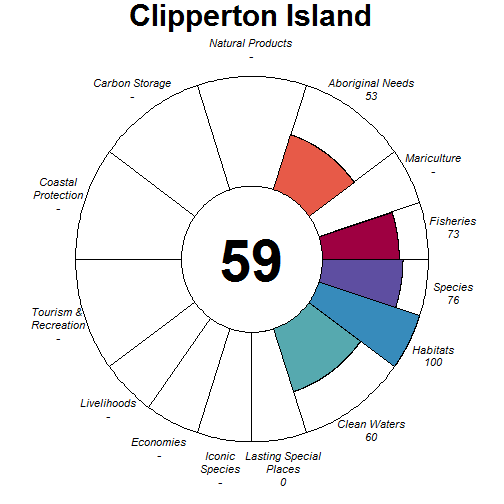

### Scores

|                                |  score| status| future| trend| pressures| resilience|
|:-------------------------------|------:|------:|------:|-----:|---------:|----------:|
|Index                           |  54.74|     NA|  55.27|    NA|        NA|         NA|
|Food Provision                  |  72.56|  70.00|  75.13| -0.04|        NA|         NA|
|. Fisheries                     |  72.56|  70.00|  75.13| -0.04|     25.16|      55.48|
|. Mariculture                   |     NA|     NA|     NA|    NA|     25.28|      55.27|
|Aboriginal Needs                |  52.63|  50.00|  55.26|  0.00|     25.10|      57.00|
|Natural Products                |     NA|     NA|     NA|    NA|        NA|         NA|
|Carbon Storage                  |     NA|     NA|     NA|    NA|        NA|         NA|
|Coastal Protection              |     NA|     NA|     NA|    NA|        NA|         NA|
|Tourism & Recreation            |     NA|     NA|     NA|    NA|     48.09|      54.22|
|Coastal Livelihoods & Economies |     NA|     NA|     NA|    NA|        NA|         NA|
|. Livelihoods                   |     NA|     NA|     NA|    NA|        NA|      45.02|
|. Economies                     |     NA|     NA|     NA|    NA|        NA|      50.73|
|Sense of Place                  |   0.00|   0.00|   0.00|  0.00|        NA|         NA|
|. Iconic Species                |     NA|     NA|     NA|    NA|     30.41|      58.53|
|. Lasting Special Places        |   0.00|   0.00|   0.00|  0.00|     39.41|      55.56|
|Clean Waters                    |  60.44|  61.37|  59.50|  0.00|     63.49|      54.22|
|Biodiversity                    |  88.06|  89.64|  86.47| -0.12|        NA|         NA|
|. Habitats                      | 100.00| 100.00| 100.00| -0.01|     25.13|      56.84|
|. Species                       |  76.11|  79.28|  72.94| -0.23|     31.27|      52.73|

## Cocos Islands (1)

### Flower

### Scores

|                                |  score| status| future| trend| pressures| resilience|
|:-------------------------------|------:|------:|------:|-----:|---------:|----------:|
|Index                           |  63.32|     NA|  65.10|    NA|        NA|         NA|
|Food Provision                  |  32.72|  31.00|  34.45|  0.00|        NA|         NA|
|. Fisheries                     |  32.72|  31.00|  34.45|  0.00|     26.37|      60.09|
|. Mariculture                   |     NA|     NA|     NA|    NA|     27.17|      74.61|
|Aboriginal Needs                |  52.85|  50.00|  55.69|  0.00|     26.23|      60.72|
|Natural Products                |     NA|     NA|     NA|    NA|        NA|         NA|
|Carbon Storage                  |  89.05|  85.51|  92.58|    NA|     33.28|      58.33|
|Coastal Protection              |  50.56|  47.96|  53.16|  0.07|     39.34|      58.33|
|Tourism & Recreation            |  62.85|  61.39|  64.31|  0.00|     60.72|      75.00|
|Coastal Livelihoods & Economies |  96.35|  92.70| 100.00|  0.51|        NA|         NA|
|. Livelihoods                   |  92.70|  85.40| 100.00|  0.97|     31.35|      45.89|
|. Economies                     | 100.00| 100.00| 100.00|  0.05|     30.13|      53.83|
|Sense of Place                  |  31.63|  30.00|  33.26|  0.00|        NA|         NA|
|. Iconic Species                |  63.26|  60.00|  66.52|  0.00|     30.92|      63.85|
|. Lasting Special Places        |   0.00|   0.00|   0.00|  0.00|     37.26|      75.00|
|Clean Waters                    |  64.27|  64.94|  63.60| -0.03|     75.00|      75.00|
|Biodiversity                    |  89.59|  90.32|  88.85| -0.12|        NA|         NA|
|. Habitats                      |  97.59|  95.17| 100.00|  0.04|     31.26|      64.00|
|. Species                       |  81.59|  85.48|  77.70| -0.28|     31.81|      61.90|

## Colombia (132)

### Flower

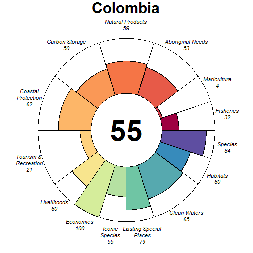

### Scores

|                                |  score| status| future| trend| pressures| resilience|
|:-------------------------------|------:|------:|------:|-----:|---------:|----------:|
|Index                           |  55.29|     NA|  53.69|    NA|        NA|         NA|
|Food Provision                  |  24.78|  23.28|  26.29|  0.00|        NA|         NA|
|. Fisheries                     |  31.99|  30.00|  33.97|  0.02|     28.42|      64.51|
|. Mariculture                   |   4.18|   4.05|   4.30| -0.04|     31.81|      58.85|
|Aboriginal Needs                |  53.26|  50.00|  56.52|  0.00|     26.56|      66.08|
|Natural Products                |  58.62|  53.49|  63.75|  0.08|     25.81|      68.41|
|Carbon Storage                  |  50.18|  67.58|  32.79| -0.96|     30.14|      68.76|
|Coastal Protection              |  61.85|  63.69|  60.00| -0.24|     36.98|      68.76|
|Tourism & Recreation            |  20.58|  19.99|  21.17|  0.00|     57.08|      75.00|
|Coastal Livelihoods & Economies |  79.91|  94.84|  64.98| -0.48|        NA|         NA|
|. Livelihoods                   |  59.82|  89.67|  29.97| -1.00|     33.15|      34.41|
|. Economies                     | 100.00| 100.00| 100.00|  0.04|     31.45|      51.50|
|Sense of Place                  |  66.60|  57.06|  76.13|  0.36|        NA|         NA|
|. Iconic Species                |  54.59|  56.92|  52.26| -0.28|     35.19|      66.77|
|. Lasting Special Places        |  78.60|  57.20| 100.00|  1.00|     43.40|      70.45|
|Clean Waters                    |  65.02|  63.33|  66.71|  0.08|     75.00|      75.00|
|Biodiversity                    |  72.10|  75.66|  68.53| -0.31|        NA|         NA|
|. Habitats                      |  60.21|  66.16|  54.26| -0.43|     31.68|      64.91|
|. Species                       |  83.98|  85.17|  82.80| -0.19|     33.62|      63.65|

## Comoro Islands (28)

### Flower

### Scores

|                                | score| status| future| trend| pressures| resilience|
|:-------------------------------|-----:|------:|------:|-----:|---------:|----------:|
|Index                           | 61.11|     NA|  62.40|    NA|        NA|         NA|
|Food Provision                  | 83.30|  80.00|  86.60| -0.03|        NA|         NA|
|. Fisheries                     | 83.30|  80.00|  86.60| -0.03|     26.54|      57.64|
|. Mariculture                   |    NA|     NA|     NA|    NA|     28.50|      57.29|
|Aboriginal Needs                | 52.59|  50.00|  55.18|  0.00|     26.71|      58.09|
|Natural Products                |    NA|     NA|     NA|    NA|        NA|         NA|
|Carbon Storage                  | 87.97|  85.51|  90.42|    NA|     35.24|      52.65|
|Coastal Protection              | 28.19|  27.57|  28.82|    NA|     38.89|      52.65|
|Tourism & Recreation            | 18.88|  18.79|  18.98|  0.00|     59.06|      62.50|
|Coastal Livelihoods & Economies | 95.35|  91.68|  99.03|  0.01|        NA|         NA|
|. Livelihoods                   | 94.97|  89.94| 100.00|  0.02|     32.95|      65.01|
|. Economies                     | 95.74|  93.41|  98.06|  0.00|     32.95|      47.71|
|Sense of Place                  | 30.92|  30.51|  31.32| -0.05|        NA|         NA|
|. Iconic Species                | 57.80|  57.14|  58.46| -0.10|     33.96|      61.24|
|. Lasting Special Places        |  4.03|   3.88|   4.19|  0.00|     42.48|      66.48|
|Clean Waters                    | 66.80|  67.70|  65.91|  0.02|     75.00|      62.50|
|Biodiversity                    | 86.01|  86.65|  85.37| -0.15|        NA|         NA|
|. Habitats                      | 91.12|  87.01|  95.24|  0.00|     31.50|      60.13|
|. Species                       | 80.89|  86.28|  75.51| -0.29|     32.70|      54.67|

## Cook Islands (153)

### Flower

### Scores

|                                | score| status| future| trend| pressures| resilience|
|:-------------------------------|-----:|------:|------:|-----:|---------:|----------:|
|Index                           | 53.79|     NA|  52.94|    NA|        NA|         NA|
|Food Provision                  | 51.80|  48.00|  55.60|  0.07|        NA|         NA|
|. Fisheries                     | 51.80|  48.00|  55.60|  0.07|     25.42|      59.20|
|. Mariculture                   |  0.00|   0.00|   0.00|  0.00|     26.71|      59.89|
|Aboriginal Needs                | 52.91|  50.00|  55.82|  0.00|     25.52|      60.80|
|Natural Products                | 37.81|  40.60|  35.02| -0.38|     26.80|      61.82|
|Carbon Storage                  | 52.44|  50.00|  54.89|  0.00|     28.86|      58.47|
|Coastal Protection              | 87.55|  98.03|  77.08| -0.41|     39.33|      58.47|
|Tourism & Recreation            | 31.78|  30.97|  32.60|  0.00|     59.36|      74.99|
|Coastal Livelihoods & Economies | 45.98|  46.74|  45.22| -0.17|        NA|         NA|
|. Livelihoods                   | 34.95|  38.35|  31.55| -0.34|     31.04|      45.32|
|. Economies                     | 57.01|  55.12|  58.89| -0.01|     29.85|      52.38|
|Sense of Place                  | 33.19|  33.32|  33.06| -0.08|        NA|         NA|
|. Iconic Species                | 64.05|  64.44|  63.66| -0.17|     30.77|      60.91|
|. Lasting Special Places        |  2.33|   2.19|   2.46|  0.00|     37.59|      74.99|
|Clean Waters                    | 64.22|  67.16|  61.29| -0.13|     75.00|      74.99|
|Biodiversity                    | 80.16|  81.46|  78.86| -0.20|        NA|         NA|
|. Habitats                      | 81.65|  80.61|  82.69| -0.13|     27.97|      62.11|
|. Species                       | 78.67|  82.31|  75.04| -0.26|     30.79|      57.17|

## Costa Rica (130)

### Flower

### Scores

|                                |  score| status| future| trend| pressures| resilience|
|:-------------------------------|------:|------:|------:|-----:|---------:|----------:|
|Index                           |  55.71|     NA|  52.42|    NA|        NA|         NA|
|Food Provision                  |  49.76|  45.61|  53.90|  0.09|        NA|         NA|
|. Fisheries                     |  57.88|  53.00|  62.76|  0.11|     29.35|      62.80|
|. Mariculture                   |   5.86|   5.68|   6.04| -0.05|     31.12|      60.42|
|Aboriginal Needs                |  53.14|  50.00|  56.27|  0.00|     27.40|      65.42|
|Natural Products                |  18.44|  22.77|  14.10| -0.78|     25.77|      69.04|
|Carbon Storage                  |  46.51|  64.67|  28.36| -1.00|     30.00|      62.89|
|Coastal Protection              |  62.19|  75.24|  49.15| -0.69|     31.45|      66.93|
|Tourism & Recreation            |  48.66|  47.22|  50.10| -0.01|     55.19|      75.00|
|Coastal Livelihoods & Economies |  75.29|  76.82|  73.76| -0.11|        NA|         NA|
|. Livelihoods                   |  50.57|  53.64|  47.51| -0.20|     29.50|      35.49|
|. Economies                     | 100.00| 100.00| 100.00| -0.01|     31.59|      52.83|
|Sense of Place                  |  61.83|  61.66|  62.00| -0.14|        NA|         NA|
|. Iconic Species                |  55.88|  58.57|  53.19| -0.28|     36.95|      65.53|
|. Lasting Special Places        |  67.77|  64.75|  70.80|  0.00|     45.55|      73.86|
|Clean Waters                    |  58.76|  60.11|  57.40| -0.07|     75.00|      75.00|
|Biodiversity                    |  82.52|  85.84|  79.20| -0.27|        NA|         NA|
|. Habitats                      |  83.14|  87.73|  78.55| -0.33|     30.61|      65.07|
|. Species                       |  81.90|  83.96|  79.85| -0.22|     34.42|      64.48|

## Croatia (187)

### Flower

### Scores

|                                |  score| status| future| trend| pressures| resilience|
|:-------------------------------|------:|------:|------:|-----:|---------:|----------:|
|Index                           |  69.27|     NA|  68.28|    NA|        NA|         NA|
|Food Provision                  |  63.68|  60.25|  67.11|  0.04|        NA|         NA|
|. Fisheries                     |  67.68|  64.00|  71.36|  0.05|     34.58|      59.29|
|. Mariculture                   |  15.71|  15.25|  16.16| -0.08|     33.30|      67.71|
|Aboriginal Needs                |  52.54|  50.00|  55.09|  0.00|     29.03|      59.86|
|Natural Products                |  69.13|  65.69|  72.57| -0.02|     29.06|      64.11|
|Carbon Storage                  |     NA|     NA|     NA|    NA|        NA|         NA|
|Coastal Protection              |     NA|     NA|     NA|    NA|        NA|         NA|
|Tourism & Recreation            |  97.81|  95.63| 100.00|  0.00|     59.27|      75.00|
|Coastal Livelihoods & Economies |  79.19|  92.95|  65.44| -0.45|        NA|         NA|
|. Livelihoods                   |  58.39|  85.90|  30.88| -1.00|     35.90|      44.83|
|. Economies                     | 100.00| 100.00| 100.00|  0.10|     35.57|      50.33|
|Sense of Place                  |  56.40|  58.80|  54.01| -0.22|        NA|         NA|
|. Iconic Species                |  56.06|  64.00|  48.11| -0.50|     36.75|      63.04|
|. Lasting Special Places        |  56.75|  53.59|  59.90|  0.06|     47.24|      70.45|
|Clean Waters                    |  46.59|  49.13|  44.04| -0.15|     75.00|      75.00|
|Biodiversity                    |  88.84|  89.66|  88.01| -0.10|        NA|         NA|
|. Habitats                      |  98.62|  97.25| 100.00|  0.01|     32.02|      61.44|
|. Species                       |  79.05|  82.07|  76.02| -0.20|     40.15|      58.54|

## Crozet Islands (91)

### Flower

### Scores

|                                |  score| status| future| trend| pressures| resilience|
|:-------------------------------|------:|------:|------:|-----:|---------:|----------:|
|Index                           |  79.83|     NA|  82.12|    NA|        NA|         NA|
|Food Provision                  |  91.16|  85.00|  97.31|  0.01|        NA|         NA|
|. Fisheries                     |  91.16|  85.00|  97.31|  0.01|     25.04|      66.90|
|. Mariculture                   |     NA|     NA|     NA|    NA|     26.01|      70.34|
|Aboriginal Needs                |  53.50|  50.00|  57.01|  0.00|     25.04|      67.50|
|Natural Products                |     NA|     NA|     NA|    NA|        NA|         NA|
|Carbon Storage                  |     NA|     NA|     NA|    NA|        NA|         NA|
|Coastal Protection              |     NA|     NA|     NA|    NA|        NA|         NA|
|Tourism & Recreation            |     NA|     NA|     NA|    NA|     28.41|      73.53|
|Coastal Livelihoods & Economies |     NA|     NA|     NA|    NA|        NA|         NA|
|. Livelihoods                   |     NA|     NA|     NA|    NA|        NA|      34.82|
|. Economies                     |     NA|     NA|     NA|    NA|        NA|      50.00|
|Sense of Place                  |  74.93|  73.33|  76.53|  0.00|        NA|         NA|
|. Iconic Species                |  49.87|  46.67|  53.07|  0.00|     26.20|      67.76|
|. Lasting Special Places        | 100.00| 100.00| 100.00|  0.00|     25.60|      71.92|
|Clean Waters                    |  99.98|  99.96| 100.00|  0.00|     25.44|      73.53|
|Biodiversity                    |  79.58|  79.41|  79.75| -0.19|        NA|         NA|
|. Habitats                      |     NA|     NA|     NA|    NA|        NA|         NA|
|. Species                       |  79.58|  79.41|  79.75| -0.19|     27.30|      68.04|

## Cuba (112)

### Flower

### Scores

|                                |  score| status| future| trend| pressures| resilience|
|:-------------------------------|------:|------:|------:|-----:|---------:|----------:|
|Index                           |  55.18|     NA|  56.38|    NA|        NA|         NA|
|Food Provision                  |  18.49|  17.18|  19.81|  0.03|        NA|         NA|
|. Fisheries                     |  21.54|  20.00|  23.07|  0.04|     28.89|      67.35|
|. Mariculture                   |   1.71|   1.61|   1.81|  0.00|     30.07|      67.71|
|Aboriginal Needs                |  53.39|  50.00|  56.78|  0.00|     26.52|      67.64|
|Natural Products                |  10.93|  13.93|   7.94| -0.85|     27.82|      69.81|
|Carbon Storage                  | 100.00| 100.00| 100.00|  0.09|     31.97|      69.85|
|Coastal Protection              |  31.94|  29.35|  34.53|  0.09|     34.12|      69.85|
|Tourism & Recreation            |  22.42|  21.72|  23.12|  0.00|     55.22|      75.00|
|Coastal Livelihoods & Economies |  93.11|  90.27|  95.95|  0.50|        NA|         NA|
|. Livelihoods                   |  96.60|  93.19| 100.00|  1.00|     34.11|      36.45|
|. Economies                     |  89.62|  87.34|  91.89| -0.01|     31.80|      49.46|
|Sense of Place                  |  71.59|  71.05|  72.13| -0.18|        NA|         NA|
|. Iconic Species                |  55.09|  58.57|  51.60| -0.35|     33.95|      68.94|
|. Lasting Special Places        |  88.09|  83.52|  92.66|  0.00|     40.68|      73.86|
|Clean Waters                    |  64.95|  64.57|  65.33|  0.02|     75.00|      75.00|
|Biodiversity                    |  84.97|  81.70|  88.23| -0.04|        NA|         NA|
|. Habitats                      |  81.02|  75.00|  87.04|  0.06|     30.23|      66.91|
|. Species                       |  88.91|  88.40|  89.42| -0.14|     34.37|      65.77|

## Curacao (244)

### Flower

### Scores

|                                |  score| status| future| trend| pressures| resilience|
|:-------------------------------|------:|------:|------:|-----:|---------:|----------:|
|Index                           |  66.99|     NA|  63.25|    NA|        NA|         NA|
|Food Provision                  |     NA|     NA|     NA|    NA|        NA|         NA|
|. Fisheries                     |     NA|     NA|     NA|    NA|     26.40|      59.11|
|. Mariculture                   |     NA|     NA|     NA|    NA|     28.45|      63.13|
|Aboriginal Needs                |  52.76|  50.00|  55.51|  0.00|     26.45|      59.86|
|Natural Products                |     NA|     NA|     NA|    NA|        NA|         NA|
|Carbon Storage                  |  72.50|  87.72|  57.29| -0.61|     29.44|      48.98|
|Coastal Protection              | 100.00| 100.00| 100.00|  0.03|     51.13|      54.78|
|Tourism & Recreation            |  46.68|  46.06|  47.30|  0.00|     58.28|      66.40|
|Coastal Livelihoods & Economies |  70.09|  84.52|  55.66| -0.50|        NA|         NA|
|. Livelihoods                   |  62.65|  93.79|  31.52| -1.00|     31.15|      32.97|
|. Economies                     |  77.52|  75.24|  79.80|  0.00|     30.18|      49.46|
|Sense of Place                  |  39.67|  40.72|  38.62| -0.14|        NA|         NA|
|. Iconic Species                |  57.03|  60.00|  54.05| -0.29|     34.55|      62.52|
|. Lasting Special Places        |  22.31|  21.43|  23.19|  0.00|     40.67|      65.59|
|Clean Waters                    |  70.00|  70.92|  69.08|  0.00|     75.00|      66.40|
|Biodiversity                    |  84.24|  89.91|  82.53| -0.24|        NA|         NA|
|. Habitats                      |     NA|  93.86|     NA| -0.29|     33.79|         NA|
|. Species                       |  84.24|  85.95|  82.53| -0.18|     32.76|      57.94|

## Cyprus (81)

### Flower

### Scores

|                                | score| status| future| trend| pressures| resilience|
|:-------------------------------|-----:|------:|------:|-----:|---------:|----------:|
|Index                           | 52.75|     NA|  53.24|    NA|        NA|         NA|
|Food Provision                  |    NA|     NA|     NA|    NA|        NA|         NA|
|. Fisheries                     |    NA|     NA|     NA|    NA|     29.42|      61.43|
|. Mariculture                   | 13.42|  12.41|  14.42|  0.05|     30.84|      69.79|
|Aboriginal Needs                | 52.86|  50.00|  55.73|  0.00|     27.21|      61.91|
|Natural Products                |  0.00|   0.00|   0.00|  0.00|     29.52|      65.50|
|Carbon Storage                  |    NA|     NA|     NA|    NA|        NA|         NA|
|Coastal Protection              |    NA|     NA|     NA|    NA|        NA|         NA|
|Tourism & Recreation            | 58.57|  57.19|  59.95| -0.01|     59.25|      75.00|
|Coastal Livelihoods & Economies | 64.59|  63.52|  65.66| -0.01|        NA|         NA|
|. Livelihoods                   | 62.32|  61.48|  63.16|  0.01|     31.76|      38.68|
|. Economies                     | 66.85|  65.55|  68.15| -0.04|     33.23|      52.67|
|Sense of Place                  | 43.03|  44.41|  41.65| -0.19|        NA|         NA|
|. Iconic Species                | 45.31|  51.43|  39.20| -0.50|     35.46|      64.91|
|. Lasting Special Places        | 40.75|  37.39|  44.11|  0.12|     44.45|      73.86|
|Clean Waters                    | 58.34|  60.30|  56.38| -0.10|     75.00|      75.00|
|Biodiversity                    | 91.85|  90.35|  93.35| -0.06|        NA|         NA|
|. Habitats                      | 96.64|  93.28| 100.00|  0.03|     28.49|      64.94|
|. Species                       | 87.06|  87.42|  86.70| -0.15|     35.87|      62.88|

## Democratic Republic of the Congo (199)

### Flower

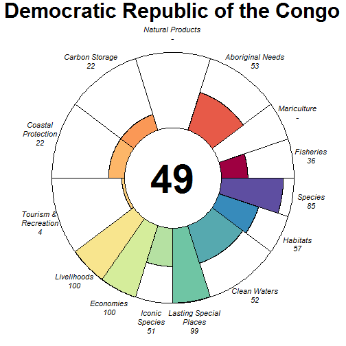

### Scores

|                                |  score| status| future| trend| pressures| resilience|
|:-------------------------------|------:|------:|------:|-----:|---------:|----------:|
|Index                           |  48.47|     NA|  46.71|    NA|        NA|         NA|
|Food Provision                  |  36.47|  35.00|  37.93| -0.02|        NA|         NA|
|. Fisheries                     |  36.47|  35.00|  37.93| -0.02|     37.00|      66.46|
|. Mariculture                   |     NA|     NA|     NA|    NA|     47.85|      56.25|
|Aboriginal Needs                |  52.94|  50.00|  55.88|  0.00|     31.43|      67.05|
|Natural Products                |     NA|     NA|     NA|    NA|     34.33|      67.71|
|Carbon Storage                  |  22.08|  30.61|  13.55| -1.00|     34.01|      68.18|
|Coastal Protection              |  22.03|  30.61|  13.45| -1.00|     35.01|      68.18|
|Tourism & Recreation            |   3.77|   3.75|   3.79|  0.00|     59.01|      62.50|
|Coastal Livelihoods & Economies | 100.00| 100.00| 100.00|  0.50|        NA|         NA|
|. Livelihoods                   | 100.00| 100.00| 100.00|  1.00|     43.75|      32.28|
|. Economies                     | 100.00| 100.00| 100.00|  0.00|     39.60|      47.96|
|Sense of Place                  |  75.19|  75.32|  75.07| -0.08|        NA|         NA|
|. Iconic Species                |  51.07|  52.00|  50.14| -0.17|     44.38|      67.36|
|. Lasting Special Places        |  99.32|  98.64| 100.00|  0.00|     47.54|      61.93|
|Clean Waters                    |  52.34|  49.53|  55.15|  0.23|     75.00|      62.50|
|Biodiversity                    |  71.40|  77.21|  65.60| -0.35|        NA|         NA|
|. Habitats                      |  57.47|  65.31|  49.63| -0.50|     35.50|      64.29|
|. Species                       |  85.34|  89.11|  81.57| -0.21|     44.02|      60.11|

## Denmark (175)

### Flower

### Scores

|                                |  score| status| future| trend| pressures| resilience|
|:-------------------------------|------:|------:|------:|-----:|---------:|----------:|
|Index                           |  75.60|     NA|  77.11|    NA|        NA|         NA|
|Food Provision                  |  64.27|  60.13|  68.40|  0.06|        NA|         NA|
|. Fisheries                     |  65.20|  61.00|  69.40|  0.06|     36.81|      66.34|
|. Mariculture                   |   9.19|   8.75|   9.63|  0.02|     37.01|      63.53|
|Aboriginal Needs                |  52.92|  50.00|  55.85|  0.00|     31.77|      67.21|
|Natural Products                |  99.09|  98.17| 100.00|  0.00|     30.45|      68.77|
|Carbon Storage                  | 100.00| 100.00| 100.00|    NA|     38.34|      70.45|
|Coastal Protection              |  93.37|  89.00|  97.75|  0.02|     44.64|      70.45|
|Tourism & Recreation            |  35.97|  35.03|  36.90|  0.00|     58.74|      75.00|
|Coastal Livelihoods & Economies |  68.05|  66.34|  69.77|  0.00|        NA|         NA|
|. Livelihoods                   |  67.42|  66.77|  68.08|  0.00|     35.15|      40.93|
|. Economies                     |  68.68|  65.90|  71.46| -0.01|     33.33|      60.75|
|Sense of Place                  |  87.00|  86.67|  87.33|  0.44|        NA|         NA|
|. Iconic Species                |  74.00|  73.33|  74.67| -0.12|     37.00|      67.90|
|. Lasting Special Places        | 100.00| 100.00| 100.00|  1.00|     43.68|      68.18|
|Clean Waters                    |  64.60|  66.51|  62.70| -0.09|     75.00|      75.00|
|Biodiversity                    |  90.72|  89.00|  92.45| -0.04|        NA|         NA|
|. Habitats                      |  96.98|  93.96| 100.00|  0.03|     33.40|      67.06|
|. Species                       |  84.47|  84.03|  84.91| -0.11|     41.42|      67.77|

## Djibouti (46)

### Flower

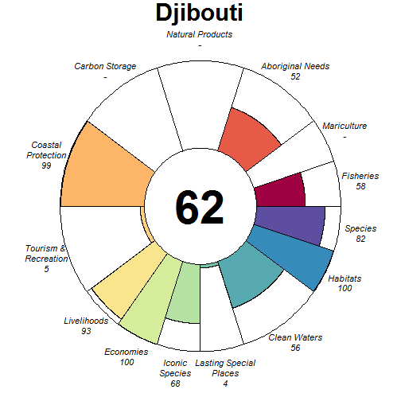

### Scores

|                                |  score| status| future| trend| pressures| resilience|
|:-------------------------------|------:|------:|------:|-----:|---------:|----------:|
|Index                           |  61.78|     NA|  61.66|    NA|        NA|         NA|
|Food Provision                  |  58.07|  59.00|  57.14| -0.17|        NA|         NA|
|. Fisheries                     |  58.07|  59.00|  57.14| -0.17|     32.34|      57.28|
|. Mariculture                   |     NA|     NA|     NA|    NA|     28.43|      50.00|
|Aboriginal Needs                |  52.29|  50.00|  54.58|  0.00|     29.06|      56.82|
|Natural Products                |     NA|     NA|     NA|    NA|        NA|         NA|
|Carbon Storage                  |     NA|     NA|     NA|    NA|     29.41|      45.50|
|Coastal Protection              |  99.23|  98.45| 100.00|    NA|     39.04|      47.00|
|Tourism & Recreation            |   5.04|   5.11|   4.97|  0.00|     58.18|      50.00|
|Coastal Livelihoods & Economies |  96.70|  93.40| 100.00|  0.29|        NA|         NA|
|. Livelihoods                   |  93.40|  86.79| 100.00|  0.57|     33.70|      43.76|
|. Economies                     | 100.00| 100.00| 100.00|  0.00|     32.01|      47.71|
|Sense of Place                  |  35.99|  36.41|  35.58| -0.08|        NA|         NA|
|. Iconic Species                |  67.96|  68.89|  67.03| -0.17|     34.53|      60.18|
|. Lasting Special Places        |   4.03|   3.92|   4.13|  0.00|     41.06|      56.82|
|Clean Waters                    |  56.28|  58.70|  53.86|  0.00|     75.00|      50.00|
|Biodiversity                    |  90.60|  94.06|  87.14| -0.16|        NA|         NA|
|. Habitats                      |  99.61|  99.23| 100.00|  0.00|     29.36|      59.28|
|. Species                       |  81.59|  88.90|  74.29| -0.32|     36.67|      51.99|

## Dominica (123)

### Flower

### Scores

|                                | score| status| future| trend| pressures| resilience|
|:-------------------------------|-----:|------:|------:|-----:|---------:|----------:|
|Index                           | 40.11|     NA|  39.09|    NA|        NA|         NA|
|Food Provision                  | 10.60|  10.00|  11.20|  0.03|        NA|         NA|
|. Fisheries                     | 10.60|  10.00|  11.20|  0.03|     27.49|      57.68|
|. Mariculture                   |    NA|     NA|     NA|    NA|     29.30|      66.67|
|Aboriginal Needs                | 52.52|  50.00|  55.03|  0.00|     27.36|      57.86|
|Natural Products                |  0.00|   0.00|   0.00| -0.15|     30.75|      62.05|
|Carbon Storage                  | 26.00|  25.28|  26.72|    NA|     37.29|      54.55|
|Coastal Protection              |  6.76|   7.24|   6.28| -0.27|     40.51|      54.55|
|Tourism & Recreation            | 54.08|  52.56|  55.61|  0.00|     57.70|      75.00|
|Coastal Livelihoods & Economies | 82.01|  92.73|  71.30| -0.38|        NA|         NA|
|. Livelihoods                   | 75.13| 100.00|  50.27| -0.80|     32.40|      44.97|
|. Economies                     | 88.89|  85.46|  92.33|  0.04|     32.40|      49.46|
|Sense of Place                  | 35.53|  36.79|  34.28| -0.12|        NA|         NA|
|. Iconic Species                | 66.17|  68.89|  63.44| -0.25|     35.51|      62.31|
|. Lasting Special Places        |  4.90|   4.69|   5.11|  0.00|     42.35|      69.32|
|Clean Waters                    | 62.39|  64.17|  60.62| -0.08|     75.00|      75.00|
|Biodiversity                    | 71.20|  72.48|  69.92| -0.16|        NA|         NA|
|. Habitats                      | 58.76|  58.71|  58.82| -0.13|     33.78|      60.89|
|. Species                       | 83.64|  86.26|  81.02| -0.20|     34.33|      56.03|

## Dominican Republic (115)

### Flower

### Scores

|                                |  score| status| future| trend| pressures| resilience|
|:-------------------------------|------:|------:|------:|-----:|---------:|----------:|
|Index                           |  61.37|     NA|  57.36|    NA|        NA|         NA|
|Food Provision                  |  19.15|  17.75|  20.54|  0.04|        NA|         NA|
|. Fisheries                     |  21.57|  20.00|  23.14|  0.05|     28.18|      65.63|
|. Mariculture                   |   0.31|   0.29|   0.32|  0.00|     31.75|      64.58|
|Aboriginal Needs                |  53.28|  50.00|  56.55|  0.00|     27.09|      66.81|
|Natural Products                |  76.49|  75.88|  77.09| -0.15|     31.79|      68.01|
|Carbon Storage                  |  58.53|  81.90|  35.16| -1.00|     35.43|      65.53|
|Coastal Protection              |  55.82|  57.04|  54.60| -0.19|     40.10|      65.53|
|Tourism & Recreation            |  39.08|  38.77|  39.39|  0.00|     57.06|      62.50|
|Coastal Livelihoods & Economies |  82.94|  98.77|  67.11| -0.49|        NA|         NA|
|. Livelihoods                   |  67.11| 100.00|  34.21| -1.00|     32.68|      36.35|
|. Economies                     |  98.77|  97.54| 100.00|  0.02|     31.27|      48.08|
|Sense of Place                  |  78.33|  80.00|  76.66| -0.16|        NA|         NA|
|. Iconic Species                |  56.66|  60.00|  53.32| -0.31|     36.87|      66.58|
|. Lasting Special Places        | 100.00| 100.00| 100.00|  0.00|     44.05|      60.80|
|Clean Waters                    |  65.98|  67.14|  64.82|  0.01|     75.00|      62.50|
|Biodiversity                    |  84.16|  86.69|  81.63| -0.25|        NA|         NA|
|. Habitats                      |  82.45|  86.98|  77.93| -0.32|     32.80|      66.40|
|. Species                       |  85.87|  86.41|  85.32| -0.17|     34.35|      65.76|

## East Timor (231)

### Flower

### Scores

|                                | score| status| future| trend| pressures| resilience|
|:-------------------------------|-----:|------:|------:|-----:|---------:|----------:|
|Index                           | 48.53|     NA|  44.06|    NA|        NA|         NA|
|Food Provision                  | 41.32|  36.76|  45.88|  0.23|        NA|         NA|
|. Fisheries                     | 41.59|  37.00|  46.18|  0.23|     30.92|      59.40|
|. Mariculture                   |  0.02|   0.02|   0.02|  0.00|     29.47|      50.00|
|Aboriginal Needs                | 52.63|  50.00|  55.27|  0.00|     27.53|      59.44|
|Natural Products                |    NA|     NA|     NA|    NA|        NA|         NA|
|Carbon Storage                  | 58.20|  84.48|  31.93| -1.00|     36.63|      51.15|
|Coastal Protection              | 17.70|  26.04|   9.36| -1.00|     42.26|      51.15|
|Tourism & Recreation            | 41.69|  42.63|  40.74|  0.00|     63.22|      50.00|
|Coastal Livelihoods & Economies | 28.28|  41.31|  15.25|  0.00|        NA|         NA|
|. Livelihoods                   | 56.51|  82.58|  30.43| -1.00|     27.80|      39.48|
|. Economies                     |  0.05|   0.04|   0.07|  1.00|     27.80|      43.92|
|Sense of Place                  | 65.38|  56.16|  74.60|  0.45|        NA|         NA|
|. Iconic Species                | 60.29|  60.00|  60.58| -0.10|     33.99|      57.22|
|. Lasting Special Places        | 70.47|  52.31|  88.62|  1.00|     42.69|      50.00|
|Clean Waters                    | 55.20|  55.40|  55.00|  0.11|     75.00|      50.00|
|Biodiversity                    | 76.37|  84.20|  68.53| -0.38|        NA|         NA|
|. Habitats                      | 74.87|  81.97|  67.76| -0.40|     30.92|      59.26|
|. Species                       | 77.87|  86.44|  69.29| -0.35|     35.81|      47.48|

## Ecuador (137)

### Flower

### Scores

|                                |  score| status| future| trend| pressures| resilience|
|:-------------------------------|------:|------:|------:|-----:|---------:|----------:|
|Index                           |  68.59|     NA|  64.84|    NA|        NA|         NA|
|Food Provision                  |  79.20|  76.61|  81.79|  0.26|        NA|         NA|
|. Fisheries                     |  58.21|  53.00|  63.42|  0.11|     29.46|      66.71|
|. Mariculture                   | 100.00| 100.00| 100.00|  0.40|     28.78|      55.94|
|Aboriginal Needs                |  53.51|  50.00|  57.01|  0.00|     27.12|      69.63|
|Natural Products                |  99.30|  98.59| 100.00|  0.00|     26.47|      70.79|
|Carbon Storage                  |  54.76|  74.14|  35.39| -1.00|     28.07|      72.73|
|Coastal Protection              |  59.02|  79.96|  38.08| -1.00|     29.19|      73.48|
|Tourism & Recreation            |  14.83|  14.35|  15.30|  0.00|     55.00|      75.00|
|Coastal Livelihoods & Economies | 100.00| 100.00| 100.00|  0.11|        NA|         NA|
|. Livelihoods                   | 100.00| 100.00| 100.00|  0.22|     32.48|      58.62|
|. Economies                     | 100.00| 100.00| 100.00| -0.01|     30.78|      49.50|
|Sense of Place                  |  78.95|  80.00|  77.91| -0.14|        NA|         NA|
|. Iconic Species                |  57.91|  60.00|  55.82| -0.27|     33.77|      68.01|
|. Lasting Special Places        | 100.00| 100.00| 100.00|  0.00|     42.25|      72.73|
|Clean Waters                    |  66.18|  63.57|  68.79|  0.12|     75.00|      75.00|
|Biodiversity                    |  80.11|  86.13|  74.09| -0.37|        NA|         NA|
|. Habitats                      |  79.73|  89.82|  69.65| -0.52|     29.10|      65.97|
|. Species                       |  80.49|  82.45|  78.53| -0.23|     34.12|      66.75|

## Egypt (214)

### Flower

### Scores

|                                |  score| status| future| trend| pressures| resilience|
|:-------------------------------|------:|------:|------:|-----:|---------:|----------:|
|Index                           |  66.12|     NA|  67.98|    NA|        NA|         NA|
|Food Provision                  |  24.90|  24.66|  25.14| -0.13|        NA|         NA|
|. Fisheries                     |  53.24|  50.00|  56.48|  0.00|     30.02|      69.27|
|. Mariculture                   |  21.11|  21.27|  20.95| -0.15|     31.29|      57.14|
|Aboriginal Needs                |  53.56|  50.00|  57.11|  0.00|     27.24|      70.35|
|Natural Products                |  52.41|  46.80|  58.02|  0.14|     28.15|      71.86|
|Carbon Storage                  |  87.62|  82.46|  92.79|  0.00|     36.92|      74.89|
|Coastal Protection              |  55.66|  52.91|  58.40|  0.00|     43.22|      74.89|
|Tourism & Recreation            |  52.86|  51.55|  54.17|  0.00|     58.64|      75.00|
|Coastal Livelihoods & Economies |  97.83|  95.66| 100.00|  0.35|        NA|         NA|
|. Livelihoods                   |  95.66|  91.33| 100.00|  0.67|     31.30|      53.01|
|. Economies                     | 100.00| 100.00| 100.00|  0.03|     30.43|      47.75|
|Sense of Place                  |  71.61|  71.47|  71.74|  0.25|        NA|         NA|
|. Iconic Species                |  49.44|  55.38|  43.49| -0.50|     33.69|      70.12|
|. Lasting Special Places        |  93.78|  87.56| 100.00|  1.00|     36.51|      75.00|
|Clean Waters                    |  73.36|  75.90|  70.81| -0.10|     75.00|      75.00|
|Biodiversity                    |  91.42|  91.25|  91.59| -0.12|        NA|         NA|
|. Habitats                      |  97.61|  95.23| 100.00|  0.00|     31.99|      67.25|
|. Species                       |  85.23|  87.28|  83.18| -0.23|     34.22|      66.87|

## El Salvador (134)

### Flower

### Scores

|                                |  score| status| future| trend| pressures| resilience|
|:-------------------------------|------:|------:|------:|-----:|---------:|----------:|
|Index                           |  53.03|     NA|  50.33|    NA|        NA|         NA|
|Food Provision                  |  50.05|  46.68|  53.41|  0.03|        NA|         NA|
|. Fisheries                     |  53.60|  50.00|  57.21|  0.03|     29.68|      67.27|
|. Mariculture                   |   0.32|   0.30|   0.33|  0.00|     34.62|      68.75|
|Aboriginal Needs                |  53.39|  50.00|  56.79|  0.00|     28.75|      69.90|
|Natural Products                |  24.30|  23.81|  24.80| -0.13|     31.92|      71.65|
|Carbon Storage                  |  43.69|  59.96|  27.43| -1.00|     31.83|      70.45|
|Coastal Protection              |  43.80|  59.96|  27.65| -1.00|     30.69|      70.45|
|Tourism & Recreation            |  22.92|  22.20|  23.65|  0.00|     55.00|      75.00|
|Coastal Livelihoods & Economies |  71.27|  72.89|  69.65| -0.14|        NA|         NA|
|. Livelihoods                   |  42.54|  45.78|  39.30| -0.28|     35.49|      50.36|
|. Economies                     | 100.00| 100.00| 100.00|  0.01|     32.49|      48.33|
|Sense of Place                  |  76.76|  77.78|  75.74|  0.38|        NA|         NA|
|. Iconic Species                |  53.52|  55.56|  51.49| -0.25|     40.09|      68.67|
|. Lasting Special Places        | 100.00| 100.00| 100.00|  1.00|     46.75|      70.45|
|Clean Waters                    |  66.54|  61.08|  71.99|  0.27|     75.00|      75.00|
|Biodiversity                    |  77.53|  82.87|  72.20| -0.37|        NA|         NA|
|. Habitats                      |  71.31|  79.84|  62.78| -0.50|     30.99|      67.63|
|. Species                       |  83.76|  85.90|  81.62| -0.23|     35.63|      67.71|

## Equatorial Guinea (104)

### Flower

### Scores

|                                | score| status| future| trend| pressures| resilience|
|:-------------------------------|-----:|------:|------:|-----:|---------:|----------:|
|Index                           | 61.99|     NA|  61.42|    NA|        NA|         NA|
|Food Provision                  | 54.20|  51.00|  57.40|  0.01|        NA|         NA|
|. Fisheries                     | 54.20|  51.00|  57.40|  0.01|     26.10|      62.11|
|. Mariculture                   |    NA|     NA|     NA|    NA|     28.34|      50.00|
|Aboriginal Needs                | 52.94|  50.00|  55.87|  0.00|     26.32|      61.90|
|Natural Products                | 94.10|  88.76|  99.44|  0.00|     25.61|      62.06|
|Carbon Storage                  | 88.52|  93.63|  83.41| -0.32|     29.35|      60.91|
|Coastal Protection              | 88.28|  93.63|  82.93| -0.32|     30.90|      60.91|
|Tourism & Recreation            | 13.29|  13.49|  13.10|  0.00|     58.64|      50.00|
|Coastal Livelihoods & Economies | 13.36|  15.99|  10.72| -0.68|        NA|         NA|
|. Livelihoods                   |  7.34|  10.86|   3.81| -1.00|     25.76|      31.97|
|. Economies                     | 19.38|  21.12|  17.64| -0.36|     25.84|      47.96|
|Sense of Place                  | 70.69|  70.75|  70.63| -0.11|        NA|         NA|
|. Iconic Species                | 58.64|  60.00|  57.27| -0.21|     33.15|      62.88|
|. Lasting Special Places        | 82.74|  81.50|  83.98|  0.00|     40.79|      50.00|
|Clean Waters                    | 56.58|  58.58|  54.59|  0.02|     75.00|      50.00|
|Biodiversity                    | 87.94|  89.76|  86.12| -0.21|        NA|         NA|
|. Habitats                      | 96.98|  96.82|  97.14| -0.16|     27.20|      60.53|
|. Species                       | 78.90|  82.70|  75.10| -0.26|     31.75|      56.27|

## Eritrea (45)

### Flower

### Scores

|                                | score| status| future| trend| pressures| resilience|
|:-------------------------------|-----:|------:|------:|-----:|---------:|----------:|
|Index                           | 52.94|     NA|  51.50|    NA|        NA|         NA|
|Food Provision                  | 54.75|  55.00|  54.51| -0.16|        NA|         NA|
|. Fisheries                     | 54.75|  55.00|  54.51| -0.16|     27.61|      57.39|
|. Mariculture                   |    NA|     NA|     NA|    NA|     27.30|      58.33|
|Aboriginal Needs                | 52.54|  50.00|  55.09|  0.00|     26.11|      56.95|
|Natural Products                | 65.95|  65.93|  65.97| -0.16|     27.28|      60.92|
|Carbon Storage                  | 88.95|  92.71|  85.20| -0.22|     28.71|      49.62|
|Coastal Protection              | 91.75|  97.05|  86.44| -0.22|     37.31|      49.62|
|Tourism & Recreation            |  5.16|   5.11|   5.21|  0.00|     56.60|      62.50|
|Coastal Livelihoods & Economies |  3.62|   3.67|   3.57| -0.54|        NA|         NA|
|. Livelihoods                   |  0.17|   0.25|   0.09| -1.00|     33.00|      43.76|
|. Economies                     |  7.07|   7.09|   7.05| -0.09|     31.41|      47.71|
|Sense of Place                  | 24.70|  26.92|  22.48| -0.19|        NA|         NA|
|. Iconic Species                | 49.40|  53.85|  44.95| -0.39|     32.34|      61.25|
|. Lasting Special Places        |  0.00|   0.00|   0.00|  0.00|     39.63|      61.93|
|Clean Waters                    | 53.73|  55.88|  51.58| -0.05|     75.00|      62.50|
|Biodiversity                    | 88.27|  91.59|  84.95| -0.24|        NA|         NA|
|. Habitats                      | 96.20|  94.87|  97.53| -0.11|     29.09|      60.31|
|. Species                       | 80.34|  88.30|  72.38| -0.37|     33.19|      54.08|

## Estonia (70)

### Flower

### Scores

|                                |  score| status| future| trend| pressures| resilience|
|:-------------------------------|------:|------:|------:|-----:|---------:|----------:|
|Index                           |  74.23|     NA|  73.86|    NA|        NA|         NA|
|Food Provision                  |  82.12|  76.00|  88.25|  0.06|        NA|         NA|
|. Fisheries                     |  82.12|  76.00|  88.25|  0.06|     31.09|      67.74|
|. Mariculture                   |   0.00|   0.00|   0.00|  0.00|     32.20|      69.79|
|Aboriginal Needs                |  53.30|  50.00|  56.60|  0.00|     28.73|      68.70|
|Natural Products                |  28.60|  33.96|  23.24| -0.69|     28.15|      72.73|
|Carbon Storage                  | 100.00| 100.00| 100.00|  0.50|     31.26|      71.21|
|Coastal Protection              |  99.98|  99.97| 100.00|  0.08|     48.65|      71.21|
|Tourism & Recreation            |  43.91|  42.87|  44.94|  0.00|     60.40|      75.00|
|Coastal Livelihoods & Economies |  74.50|  85.81|  63.19| -0.48|        NA|         NA|
|. Livelihoods                   |  49.00|  71.61|  26.38| -1.00|     35.34|      46.98|
|. Economies                     | 100.00| 100.00| 100.00|  0.04|     35.22|      55.33|
|Sense of Place                  | 100.00| 100.00| 100.00|  1.00|        NA|         NA|
|. Iconic Species                |     NA|     NA|     NA|    NA|     32.28|      69.32|
|. Lasting Special Places        | 100.00| 100.00| 100.00|  1.00|     40.28|      69.32|
|Clean Waters                    |  63.51|  62.46|  64.55|  0.05|     75.00|      75.00|
|Biodiversity                    |  96.36|  94.93|  97.79|  0.06|        NA|         NA|
|. Habitats                      | 100.00| 100.00| 100.00|  0.18|     29.18|      66.98|
|. Species                       |  92.72|  89.86|  95.57| -0.05|     34.83|      64.86|

## Faeroe Islands (141)

### Flower

### Scores

|                                |  score| status| future| trend| pressures| resilience|
|:-------------------------------|------:|------:|------:|-----:|---------:|----------:|
|Index                           |  57.89|     NA|  60.94|    NA|        NA|         NA|
|Food Provision                  |  81.59|  77.57|  85.61|  0.08|        NA|         NA|
|. Fisheries                     |  77.02|  72.00|  82.04|  0.10|     34.61|      56.56|
|. Mariculture                   | 100.00| 100.00| 100.00|  0.00|     27.02|      63.53|
|Aboriginal Needs                |  52.11|  50.00|  54.21|  0.00|     30.36|      55.89|
|Natural Products                |  15.01|  14.91|  15.10| -0.13|     29.31|      60.49|
|Carbon Storage                  |     NA|     NA|     NA|    NA|        NA|         NA|
|Coastal Protection              |     NA|     NA|     NA|    NA|     46.57|      50.00|
|Tourism & Recreation            |  45.01|  43.79|  46.22|  0.00|     58.16|      75.00|
|Coastal Livelihoods & Economies |  86.61|  76.39|  96.84|  0.39|        NA|         NA|
|. Livelihoods                   |  85.75|  71.50| 100.00|  0.68|     32.46|      39.40|
|. Economies                     |  87.48|  81.28|  93.68|  0.09|     31.15|      58.45|
|Sense of Place                  |  30.78|  26.67|  34.89|  0.17|        NA|         NA|
|. Iconic Species                |  61.55|  53.33|  69.77|  0.33|     35.22|      60.94|
|. Lasting Special Places        |   0.00|   0.00|   0.00|  0.00|     39.69|      68.18|
|Clean Waters                    |  65.09|  64.95|  65.24|  0.01|     75.00|      75.00|
|Biodiversity                    |  86.97|  84.56|  89.38| -0.03|        NA|         NA|
|. Habitats                      |  95.18|  90.37| 100.00|  0.05|     30.36|      61.04|
|. Species                       |  78.75|  78.76|  78.75| -0.10|     39.37|      60.24|

## Falkland Islands (95)

### Flower

### Scores

|                                | score| status| future| trend| pressures| resilience|
|:-------------------------------|-----:|------:|------:|-----:|---------:|----------:|
|Index                           | 55.19|     NA|  55.68|    NA|        NA|         NA|
|Food Provision                  | 93.50|  87.00| 100.00|  0.08|        NA|         NA|
|. Fisheries                     | 93.50|  87.00| 100.00|  0.08|     26.27|      58.02|
|. Mariculture                   |  0.00|   0.00|   0.00| -0.03|     26.27|      70.34|
|Aboriginal Needs                | 52.63|  50.00|  55.27|  0.00|     25.84|      57.76|
|Natural Products                |    NA|     NA|     NA|    NA|        NA|         NA|
|Carbon Storage                  |    NA|     NA|     NA|    NA|        NA|         NA|
|Coastal Protection              |    NA|     NA|     NA|    NA|        NA|         NA|
|Tourism & Recreation            | 44.89|  43.79|  45.99|  0.00|     58.34|      73.53|
|Coastal Livelihoods & Economies | 37.54|  50.88|  24.21| -0.50|        NA|         NA|
|. Livelihoods                   | 58.26|  85.58|  30.95| -0.99|     26.20|      33.95|
|. Economies                     | 16.82|  16.17|  17.47|  0.00|     26.01|      50.27|
|Sense of Place                  | 36.61|  30.00|  43.21|  0.25|        NA|         NA|
|. Iconic Species                | 73.21|  60.00|  86.42|  0.50|     29.99|      61.92|
|. Lasting Special Places        |  0.00|   0.00|   0.00|  0.00|     36.31|      71.92|
|Clean Waters                    | 31.77|  31.75|  31.78|  0.01|     75.00|      73.53|
|Biodiversity                    | 89.41|  89.48|  89.33| -0.07|        NA|         NA|
|. Habitats                      | 99.32|  98.64| 100.00|  0.03|     26.31|      61.35|
|. Species                       | 79.49|  80.32|  78.66| -0.17|     30.96|      59.94|

## Fiji (18)

### Flower

### Scores

|                                | score| status| future| trend| pressures| resilience|
|:-------------------------------|-----:|------:|------:|-----:|---------:|----------:|
|Index                           | 68.52|     NA|  64.51|    NA|        NA|         NA|
|Food Provision                  | 79.95|  70.94|  88.95|  0.21|        NA|         NA|
|. Fisheries                     | 80.01|  71.00|  89.02|  0.21|     27.67|      61.96|
|. Mariculture                   |  0.03|   0.03|   0.03|  0.00|     28.14|      50.00|
|Aboriginal Needs                | 53.15|  50.00|  56.29|  0.00|     25.89|      64.04|
|Natural Products                | 36.37|  36.15|  36.58| -0.09|     44.60|      65.80|
|Carbon Storage                  | 58.06|  82.26|  33.86| -1.00|     33.31|      58.04|
|Coastal Protection              | 78.65|  79.68|  77.63| -0.12|     41.99|      58.04|
|Tourism & Recreation            | 98.04| 100.00|  96.08|  0.00|     62.81|      50.00|
|Coastal Livelihoods & Economies | 66.82|  77.84|  55.80| -0.50|        NA|         NA|
|. Livelihoods                   | 53.11|  76.88|  29.34| -0.96|     31.77|      38.66|
|. Economies                     | 80.52|  78.79|  82.25| -0.04|     30.62|      52.38|
|Sense of Place                  | 75.17|  76.26|  74.09| -0.18|        NA|         NA|
|. Iconic Species                | 52.49|  56.36|  48.62| -0.36|     31.90|      62.79|
|. Lasting Special Places        | 97.86|  96.15|  99.56|  0.00|     39.23|      50.00|
|Clean Waters                    | 59.26|  65.35|  53.17| -0.16|     75.00|      50.00|
|Biodiversity                    | 79.73|  86.81|  72.65| -0.37|        NA|         NA|
|. Habitats                      | 80.61|  90.85|  70.36| -0.48|     30.43|      60.08|
|. Species                       | 78.86|  82.78|  74.94| -0.26|     32.76|      56.13|

## Finland (174)

### Flower

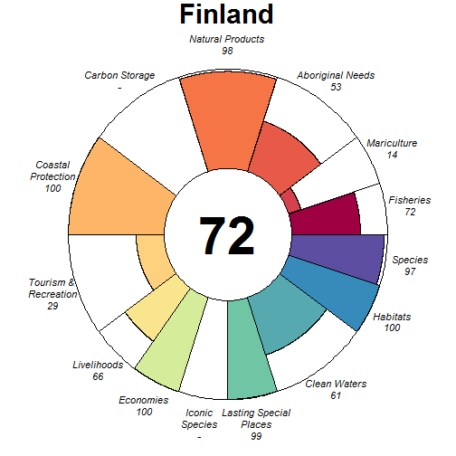

### Scores

|                                |  score| status| future| trend| pressures| resilience|
|:-------------------------------|------:|------:|------:|-----:|---------:|----------:|
|Index                           |  76.32|     NA|  77.73|    NA|        NA|         NA|
|Food Provision                  |  64.54|  60.27|  68.81|  0.03|        NA|         NA|
|. Fisheries                     |  71.81|  67.00|  76.61|  0.04|     34.18|      69.53|
|. Mariculture                   |  13.73|  13.19|  14.27| -0.02|     34.14|      62.92|
|Aboriginal Needs                |  53.46|  50.00|  56.92|  0.00|     28.45|      70.38|
|Natural Products                |  97.73|  95.46| 100.00|  0.11|     28.78|      71.57|
|Carbon Storage                  |     NA|     NA|     NA|    NA|        NA|         NA|
|Coastal Protection              | 100.00| 100.00| 100.00|  0.08|     50.80|      50.00|
|Tourism & Recreation            |  29.31|  28.66|  29.96|  0.00|     61.04|      75.00|
|Coastal Livelihoods & Economies |  83.15|  82.24|  84.06|  0.02|        NA|         NA|
|. Livelihoods                   |  66.30|  64.48|  68.12|  0.00|     36.39|      53.50|
|. Economies                     | 100.00| 100.00| 100.00|  0.04|     36.27|      62.92|
|Sense of Place                  |  99.43|  98.86| 100.00|  1.00|        NA|         NA|
|. Iconic Species                |     NA|     NA|     NA|    NA|     33.47|      70.77|
|. Lasting Special Places        |  99.43|  98.86| 100.00|  1.00|     42.37|      72.73|
|Clean Waters                    |  61.04|  62.25|  59.84| -0.06|     75.00|      75.00|
|Biodiversity                    |  98.26|  96.52| 100.00|  0.01|        NA|         NA|
|. Habitats                      | 100.00| 100.00| 100.00|  0.01|     30.02|      70.18|
|. Species                       |  96.52|  93.03| 100.00|  0.02|     37.36|      68.83|

## France (179)

### Flower

### Scores

|                                |  score| status| future| trend| pressures| resilience|
|:-------------------------------|------:|------:|------:|-----:|---------:|----------:|
|Index                           |  68.99|     NA|  70.20|    NA|        NA|         NA|
|Food Provision                  |  67.87|  64.37|  71.36|  0.01|        NA|         NA|
|. Fisheries                     |  66.62|  62.00|  71.24|  0.05|     32.30|      67.29|
|. Mariculture                   |  69.92|  68.27|  71.58| -0.06|     38.37|      65.23|
|Aboriginal Needs                |  53.13|  50.00|  56.26|  0.00|     30.15|      68.10|
|Natural Products                |  75.29|  75.64|  74.93| -0.21|     29.68|      69.66|
|Carbon Storage                  |  78.76|  66.92|  90.59|  0.34|     35.76|      74.24|
|Coastal Protection              |  37.91|  34.69|  41.13|  0.08|     34.75|      74.24|
|Tourism & Recreation            |  63.14|  61.35|  64.94|  0.00|     56.93|      75.00|
|Coastal Livelihoods & Economies |  80.46|  94.23|  66.69| -0.46|        NA|         NA|
|. Livelihoods                   |  60.92|  88.46|  33.38| -1.00|     32.00|      46.30|
|. Economies                     | 100.00| 100.00| 100.00|  0.07|     31.71|      59.25|
|Sense of Place                  |  78.20|  78.18|  78.21|  0.43|        NA|         NA|
|. Iconic Species                |  56.39|  56.36|  56.42| -0.14|     38.96|      68.26|
|. Lasting Special Places        | 100.00| 100.00| 100.00|  1.00|     42.22|      73.86|
|Clean Waters                    |  72.17|  74.74|  69.60| -0.10|     75.00|      75.00|
|Biodiversity                    |  82.95|  77.61|  88.30|  0.05|        NA|         NA|
|. Habitats                      |  85.37|  74.37|  96.37|  0.27|     33.24|      67.60|
|. Species                       |  80.54|  80.86|  80.22| -0.17|     37.15|      69.78|

## French Guiana (169)

### Flower

### Scores

|                                |  score| status| future| trend| pressures| resilience|
|:-------------------------------|------:|------:|------:|-----:|---------:|----------:|
|Index                           |  62.11|     NA|  61.13|    NA|        NA|         NA|
|Food Provision                  |  17.16|  16.00|  18.32|  0.02|        NA|         NA|
|. Fisheries                     |  17.16|  16.00|  18.32|  0.02|     25.98|      65.84|
|. Mariculture                   |     NA|     NA|     NA|    NA|     28.53|      61.93|
|Aboriginal Needs                |  53.40|  50.00|  56.80|  0.00|     25.99|      67.22|
|Natural Products                |     NA|     NA|     NA|    NA|        NA|         NA|
|Carbon Storage                  | 100.00| 100.00| 100.00|  0.00|     28.95|      71.36|
|Coastal Protection              | 100.00| 100.00| 100.00|  0.00|     31.31|      71.36|
|Tourism & Recreation            |  24.88|  24.61|  25.16|  0.00|     59.82|      66.77|
|Coastal Livelihoods & Economies |  45.16|  55.41|  34.91| -0.42|        NA|         NA|
|. Livelihoods                   |  59.36|  81.05|  37.67| -0.84|     25.58|      33.51|
|. Economies                     |  30.97|  29.78|  32.16|  0.00|     25.90|      50.27|
|Sense of Place                  |  77.95|  79.60|  76.30| -0.21|        NA|         NA|
|. Iconic Species                |  58.30|  64.00|  52.61| -0.43|     33.65|      66.72|
|. Lasting Special Places        |  97.60|  95.20| 100.00|  0.00|     42.52|      67.24|
|Clean Waters                    |  50.83|  51.16|  50.50|  0.02|     75.00|      66.77|
|Biodiversity                    |  89.61|  91.07|  88.15| -0.13|        NA|         NA|
|. Habitats                      | 100.00| 100.00| 100.00|  0.00|     26.89|      65.40|
|. Species                       |  79.21|  82.13|  76.30| -0.27|     32.68|      65.09|

## French Polynesia (147)

### Flower

### Scores

|                                |  score| status| future| trend| pressures| resilience|
|:-------------------------------|------:|------:|------:|-----:|---------:|----------:|
|Index                           |  66.91|     NA|  67.57|    NA|        NA|         NA|
|Food Provision                  |  57.50|  54.29|  60.72|  0.02|        NA|         NA|
|. Fisheries                     |  59.44|  56.00|  62.87|  0.03|     27.15|      58.25|
|. Mariculture                   |  48.38|  46.21|  50.55| -0.04|     26.26|      62.85|
|Aboriginal Needs                |  52.83|  50.00|  55.66|  0.00|     25.50|      59.82|
|Natural Products                |  98.64|  97.27| 100.00| -0.02|     28.36|      63.72|
|Carbon Storage                  |  88.45|  85.51|  91.40|    NA|     31.82|      52.68|
|Coastal Protection              |  86.57|  84.28|  88.86|  0.01|     37.72|      52.68|
|Tourism & Recreation            |  31.14|  30.97|  31.32|  0.00|     57.98|      61.01|
|Coastal Livelihoods & Economies |  72.03|  70.86|  73.21|  0.52|        NA|         NA|
|. Livelihoods                   | 100.00| 100.00| 100.00|  1.00|     26.26|      35.42|
|. Economies                     |  44.07|  41.71|  46.42|  0.04|     26.20|      52.38|
|Sense of Place                  |  30.72|  32.73|  28.71| -0.17|        NA|         NA|
|. Iconic Species                |  61.43|  65.45|  57.41| -0.33|     30.85|      61.29|
|. Lasting Special Places        |   0.00|   0.00|   0.00|  0.00|     37.51|      66.52|
|Clean Waters                    |  62.40|  67.17|  57.62| -0.14|     75.00|      61.01|
|Biodiversity                    |  88.78|  89.36|  88.20| -0.12|        NA|         NA|
|. Habitats                      |  97.59|  95.17| 100.00|  0.00|     29.89|      60.99|
|. Species                       |  79.97|  83.55|  76.39| -0.25|     31.95|      57.41|

## Gabon (198)

### Flower

### Scores

|                                | score| status| future| trend| pressures| resilience|
|:-------------------------------|-----:|------:|------:|-----:|---------:|----------:|
|Index                           | 53.65|     NA|  47.92|    NA|        NA|         NA|
|Food Provision                  | 68.39|  66.00|  70.79| -0.04|        NA|         NA|
|. Fisheries                     | 68.39|  66.00|  70.79| -0.04|     30.13|      60.24|
|. Mariculture                   |    NA|     NA|     NA|    NA|     27.88|      50.00|
|Aboriginal Needs                | 52.55|  50.00|  55.10|  0.00|     28.61|      59.52|
|Natural Products                |    NA|     NA|     NA|    NA|        NA|         NA|
|Carbon Storage                  | 48.76|  68.65|  28.87| -1.00|     28.18|      55.60|
|Coastal Protection              | 48.54|  68.65|  28.43| -1.00|     30.11|      55.60|
|Tourism & Recreation            |  6.50|   6.59|   6.40|  0.00|     58.92|      50.00|
|Coastal Livelihoods & Economies | 60.04|  69.40|  50.68| -0.55|        NA|         NA|
|. Livelihoods                   | 39.21|  57.04|  21.38| -1.00|     33.49|      47.09|
|. Economies                     | 80.87|  81.76|  79.99| -0.11|     33.49|      48.50|
|Sense of Place                  | 77.89|  77.42|  78.37| -0.08|        NA|         NA|
|. Iconic Species                | 66.97|  67.50|  66.43| -0.17|     32.45|      61.49|
|. Lasting Special Places        | 88.82|  87.34|  90.31|  0.00|     39.70|      50.00|
|Clean Waters                    | 53.21|  54.60|  51.82|  0.05|     75.00|      50.00|
|Biodiversity                    | 67.00|  73.18|  60.82| -0.38|        NA|         NA|
|. Habitats                      | 57.19|  65.41|  48.98| -0.52|     29.38|      59.05|
|. Species                       | 76.81|  80.95|  72.67| -0.24|     36.82|      55.00|

## Gambia (65)

### Flower

### Scores

|                                |  score| status| future| trend| pressures| resilience|
|:-------------------------------|------:|------:|------:|-----:|---------:|----------:|
|Index                           |  68.56|     NA|  64.35|    NA|        NA|         NA|
|Food Provision                  |  69.47|  66.97|  71.97| -0.04|        NA|         NA|
|. Fisheries                     |  69.50|  67.00|  72.00| -0.04|     32.07|      62.81|
|. Mariculture                   |   0.09|   0.08|   0.09|  0.00|     32.73|      73.96|
|Aboriginal Needs                |  52.70|  50.00|  55.39|  0.00|     29.36|      62.05|
|Natural Products                |     NA|     NA|     NA|    NA|        NA|         NA|
|Carbon Storage                  |  62.01|  82.39|  41.63| -0.88|     32.48|      61.38|
|Coastal Protection              |  61.91|  82.39|  41.43| -0.88|     33.23|      61.38|
|Tourism & Recreation            |  57.15|  55.68|  58.62|  0.00|     58.20|      75.00|
|Coastal Livelihoods & Economies | 100.00| 100.00| 100.00|  0.33|        NA|         NA|
|. Livelihoods                   | 100.00| 100.00| 100.00|  0.56|     31.72|      48.32|
|. Economies                     | 100.00| 100.00| 100.00|  0.11|     31.72|      48.58|
|Sense of Place                  |  59.26|  57.71|  60.81|  0.02|        NA|         NA|
|. Iconic Species                |  75.34|  77.14|  73.53| -0.20|     39.02|      65.45|
|. Lasting Special Places        |  43.19|  38.29|  48.09|  0.23|     43.53|      73.86|
|Clean Waters                    |  76.04|  75.76|  76.31|  0.01|     75.00|      75.00|
|Biodiversity                    |  78.54|  84.14|  72.94| -0.34|        NA|         NA|
|. Habitats                      |  77.25|  85.42|  69.07| -0.45|     31.67|      64.46|
|. Species                       |  79.83|  82.85|  76.82| -0.24|     36.92|      63.58|

## Georgia (74)

### Flower

### Scores

|                                |  score| status| future| trend| pressures| resilience|
|:-------------------------------|------:|------:|------:|-----:|---------:|----------:|
|Index                           |  71.46|     NA|  71.46|    NA|        NA|         NA|
|Food Provision                  |  94.00|  88.00| 100.00|  0.07|        NA|         NA|
|. Fisheries                     |  94.00|  88.00| 100.00|  0.07|     27.26|      58.52|
|. Mariculture                   |     NA|     NA|     NA|    NA|     31.97|      50.00|
|Aboriginal Needs                |  52.62|  50.00|  55.25|  0.00|     27.10|      58.91|
|Natural Products                | 100.00| 100.00| 100.00|  0.51|     27.06|      61.62|
|Carbon Storage                  |     NA|     NA|     NA|    NA|        NA|         NA|
|Coastal Protection              |     NA|     NA|     NA|    NA|        NA|         NA|
|Tourism & Recreation            |  30.43|  30.88|  29.98|  0.00|     58.86|      50.00|
|Coastal Livelihoods & Economies |  99.53|  99.05| 100.00|  0.43|        NA|         NA|
|. Livelihoods                   |  99.05|  98.11| 100.00|  0.84|     26.84|      44.50|
|. Economies                     | 100.00| 100.00| 100.00|  0.02|     26.84|      50.58|
|Sense of Place                  |  46.60|  50.27|  42.93| -0.25|        NA|         NA|
|. Iconic Species                |  52.37|  60.00|  44.74| -0.50|     36.60|      61.06|
|. Lasting Special Places        |  40.83|  40.53|  41.12|  0.00|     45.57|      50.00|
|Clean Waters                    |  55.78|  58.68|  52.88| -0.02|     75.00|      50.00|
|Biodiversity                    |  92.71|  94.81|  90.60| -0.11|        NA|         NA|
|. Habitats                      | 100.00| 100.00| 100.00|  0.00|     28.20|      58.97|
|. Species                       |  85.42|  89.62|  81.21| -0.22|     34.73|      51.54|

## Germany (176)

### Flower

### Scores

|                                |  score| status| future| trend| pressures| resilience|
|:-------------------------------|------:|------:|------:|-----:|---------:|----------:|
|Index                           |  76.87|     NA|  77.91|    NA|        NA|         NA|
|Food Provision                  |     NA|     NA|     NA|    NA|        NA|         NA|
|. Fisheries                     |     NA|     NA|     NA|    NA|     35.80|      67.81|
|. Mariculture                   |  12.66|  12.05|  13.26|  0.03|     40.86|      65.21|
|Aboriginal Needs                |  53.19|  50.00|  56.37|  0.00|     30.67|      69.29|
|Natural Products                | 100.00| 100.00| 100.00|  0.00|     29.45|      70.66|
|Carbon Storage                  | 100.00| 100.00| 100.00|  0.50|     34.00|      74.24|
|Coastal Protection              |  96.31|  92.63| 100.00|  0.04|     42.05|      74.24|
|Tourism & Recreation            |  27.47|  26.77|  28.18|  0.00|     58.94|      75.00|
|Coastal Livelihoods & Economies |  90.11|  89.31|  90.91|  0.02|        NA|         NA|
|. Livelihoods                   |  80.22|  78.62|  81.82|  0.00|     31.00|      43.34|
|. Economies                     | 100.00| 100.00| 100.00|  0.04|     33.93|      62.33|
|Sense of Place                  |  67.62|  70.00|  65.23|  0.25|        NA|         NA|
|. Iconic Species                |  35.23|  40.00|  30.46| -0.50|     39.62|      68.88|
|. Lasting Special Places        | 100.00| 100.00| 100.00|  1.00|     46.16|      73.86|
|Clean Waters                    |  67.56|  67.12|  67.99|  0.02|     75.00|      75.00|
|Biodiversity                    |  89.56|  86.64|  92.47|  0.04|        NA|         NA|
|. Habitats                      |  94.60|  89.20| 100.00|  0.20|     31.64|      67.37|
|. Species                       |  84.52|  84.08|  84.95| -0.12|     40.27|      67.75|

## Ghana (106)

### Flower

### Scores

|                                |  score| status| future| trend| pressures| resilience|
|:-------------------------------|------:|------:|------:|-----:|---------:|----------:|
|Index                           |  61.58|     NA|  59.03|    NA|        NA|         NA|
|Food Provision                  |  89.21|  85.00|  93.43|  0.02|        NA|         NA|
|. Fisheries                     |  89.21|  85.00|  93.43|  0.02|     30.47|      56.45|
|. Mariculture                   |     NA|     NA|     NA|    NA|     31.31|      62.50|
|Aboriginal Needs                |  52.09|  50.00|  54.19|  0.00|     29.88|      55.25|
|Natural Products                |  95.13|  90.27| 100.00|  0.91|     27.62|      60.09|
|Carbon Storage                  |  68.20|  98.52|  37.87| -1.00|     39.59|      56.08|
|Coastal Protection              |  17.66|  25.69|   9.62| -1.00|     42.57|      56.08|
|Tourism & Recreation            |  10.69|  10.42|  10.96|  0.00|     59.08|      75.00|
|Coastal Livelihoods & Economies |  94.68|  89.36| 100.00|  0.44|        NA|         NA|
|. Livelihoods                   |  89.36|  78.71| 100.00|  0.94|     33.58|      38.99|
|. Economies                     | 100.00| 100.00| 100.00| -0.05|     31.47|      48.25|
|Sense of Place                  |  35.46|  36.59|  34.34| -0.12|        NA|         NA|
|. Iconic Species                |  59.21|  62.00|  56.43| -0.25|     37.74|      61.27|
|. Lasting Special Places        |  11.71|  11.17|  12.26|  0.00|     42.16|      71.59|
|Clean Waters                    |  74.71|  70.04|  79.37|  0.20|     75.00|      75.00|
|Biodiversity                    |  77.98|  85.47|  70.49| -0.37|        NA|         NA|
|. Habitats                      |  76.10|  87.33|  64.88| -0.52|     32.99|      59.86|
|. Species                       |  79.86|  83.61|  76.10| -0.23|     35.11|      55.36|

## Gibraltar (60)

### Flower

### Scores

|                                |  score| status| future| trend| pressures| resilience|
|:-------------------------------|------:|------:|------:|-----:|---------:|----------:|
|Index                           |  72.25|     NA|  74.72|    NA|        NA|         NA|
|Food Provision                  |  83.68|  69.00|  98.37|  0.48|        NA|         NA|
|. Fisheries                     |  83.68|  69.00|  98.37|  0.48|     32.87|      64.39|
|. Mariculture                   |     NA|     NA|     NA|    NA|     42.36|      70.50|
|Aboriginal Needs                |  52.83|  50.00|  55.66|  0.00|     30.87|      65.15|
|Natural Products                |     NA|     NA|     NA|    NA|        NA|         NA|
|Carbon Storage                  |     NA|     NA|     NA|    NA|        NA|         NA|
|Coastal Protection              |     NA|     NA|     NA|    NA|        NA|         NA|
|Tourism & Recreation            |  73.81|  71.91|  75.71|  0.00|     57.84|      73.91|
|Coastal Livelihoods & Economies |  74.50|  73.61|  75.39|  0.06|        NA|         NA|
|. Livelihoods                   | 100.00| 100.00| 100.00|  0.11|     28.79|      34.49|
|. Economies                     |  49.00|  47.21|  50.79|  0.00|     28.79|      51.74|
|Sense of Place                  |  74.67|  76.25|  73.08| -0.15|        NA|         NA|
|. Iconic Species                |  49.33|  52.50|  46.16| -0.30|     41.59|      65.92|
|. Lasting Special Places        | 100.00| 100.00| 100.00|  0.00|     47.22|      68.32|
|Clean Waters                    |  59.02|  59.13|  58.91|  0.00|     75.00|      73.91|
|Biodiversity                    |  87.22|  88.53|  85.90| -0.11|        NA|         NA|
|. Habitats                      | 100.00| 100.00| 100.00|  0.00|     34.33|      64.58|
|. Species                       |  74.43|  77.06|  71.81| -0.22|     41.12|      66.00|

## Glorioso Islands (30)

### Flower

### Scores

|                                | score| status| future| trend| pressures| resilience|
|:-------------------------------|-----:|------:|------:|-----:|---------:|----------:|
|Index                           | 65.63|     NA|  68.87|    NA|        NA|         NA|
|Food Provision                  |    NA|     NA|     NA|    NA|        NA|         NA|
|. Fisheries                     |    NA|     NA|     NA|    NA|     25.31|      57.15|
|. Mariculture                   |    NA|     NA|     NA|    NA|     26.66|      63.52|
|Aboriginal Needs                | 52.65|  50.00|  55.31|  0.00|     25.26|      57.42|
|Natural Products                |    NA|     NA|     NA|    NA|        NA|         NA|
|Carbon Storage                  |    NA|     NA|     NA|    NA|        NA|         NA|
|Coastal Protection              | 89.37|  85.57|  93.16|  0.09|     45.63|      53.76|
|Tourism & Recreation            | 52.83|  51.09|  54.56|  0.00|     49.36|      70.13|
|Coastal Livelihoods & Economies | 95.05|  90.10| 100.00|  0.32|        NA|         NA|
|. Livelihoods                   | 93.40|  86.79| 100.00|  0.57|     29.24|      35.55|
|. Economies                     | 96.71|  93.41| 100.00|  0.06|     29.33|      47.71|
|Sense of Place                  |  0.00|   0.00|   0.00|  0.00|        NA|         NA|
|. Iconic Species                |    NA|     NA|     NA|    NA|     29.87|      61.63|
|. Lasting Special Places        |  0.00|   0.00|   0.00|  0.00|     38.07|      68.14|
|Clean Waters                    | 80.69|  69.87|  91.51|  0.40|     58.06|      70.13|
|Biodiversity                    | 88.79|  90.02|  87.56| -0.14|        NA|         NA|
|. Habitats                      | 96.39|  92.79| 100.00|  0.05|     28.10|      60.61|
|. Species                       | 81.18|  87.24|  75.12| -0.33|     30.76|      55.09|

## Greece (80)

### Flower

### Scores

|                                | score| status| future| trend| pressures| resilience|
|:-------------------------------|-----:|------:|------:|-----:|---------:|----------:|
|Index                           | 68.81|     NA|  69.78|    NA|        NA|         NA|
|Food Provision                  | 57.96|  54.44|  61.48|  0.04|        NA|         NA|
|. Fisheries                     | 71.47|  67.00|  75.93|  0.05|     33.57|      63.82|
|. Mariculture                   | 31.81|  30.12|  33.50|  0.01|     31.00|      62.98|
|Aboriginal Needs                | 52.88|  50.00|  55.76|  0.00|     29.48|      64.38|
|Natural Products                | 53.30|  47.14|  59.47|  0.21|     30.04|      67.31|
|Carbon Storage                  |    NA|     NA|     NA|    NA|        NA|         NA|
|Coastal Protection              |    NA|     NA|     NA|    NA|        NA|         NA|
|Tourism & Recreation            | 95.52|  92.95|  98.10|  0.00|     57.96|      75.00|
|Coastal Livelihoods & Economies | 62.69|  75.55|  49.83| -0.47|        NA|         NA|
|. Livelihoods                   | 60.61|  88.51|  32.72| -0.97|     33.38|      38.33|
|. Economies                     | 64.77|  62.60|  66.94|  0.02|     31.97|      48.83|
|Sense of Place                  | 73.77|  68.49|  79.06|  0.40|        NA|         NA|
|. Iconic Species                | 59.06|  60.00|  58.12| -0.20|     35.23|      66.34|
|. Lasting Special Places        | 88.49|  76.97| 100.00|  1.00|     41.74|      72.73|
|Clean Waters                    | 64.30|  65.53|  63.07| -0.06|     75.00|      75.00|
|Biodiversity                    | 90.06|  88.61|  91.50| -0.10|        NA|         NA|
|. Habitats                      | 95.88|  91.76| 100.00| -0.02|     31.70|      65.95|
|. Species                       | 84.23|  85.45|  83.01| -0.17|     38.26|      65.06|

## Greenland (145)

### Flower

### Scores

|                                |  score| status| future| trend| pressures| resilience|
|:-------------------------------|------:|------:|------:|-----:|---------:|----------:|
|Index                           |  63.11|     NA|  65.23|    NA|        NA|         NA|
|Food Provision                  |  71.77|  66.00|  77.54|  0.07|        NA|         NA|
|. Fisheries                     |  71.77|  66.00|  77.54|  0.07|     27.12|      65.88|
|. Mariculture                   |     NA|     NA|     NA|    NA|     26.37|      63.53|
|Aboriginal Needs                |  53.38|  50.00|  56.76|  0.00|     26.29|      67.27|
|Natural Products                |   0.00|   0.00|   0.00|  0.00|     26.17|      68.74|
|Carbon Storage                  |     NA|     NA|     NA|    NA|        NA|         NA|
|Coastal Protection              |  93.95|  93.02|  94.88| -0.01|     42.66|      50.00|
|Tourism & Recreation            |  44.99|  43.79|  46.20|  0.00|     58.33|      75.00|
|Coastal Livelihoods & Economies | 100.00| 100.00| 100.00|  0.00|        NA|         NA|
|. Livelihoods                   | 100.00| 100.00| 100.00|  0.01|     33.07|      41.38|
|. Economies                     | 100.00| 100.00| 100.00| -0.01|     31.25|      61.42|
|Sense of Place                  |  84.91|  82.22|  87.60|  0.05|        NA|         NA|
|. Iconic Species                |  69.82|  64.44|  75.20|  0.08|     33.78|      67.44|
|. Lasting Special Places        | 100.00| 100.00| 100.00|  0.02|     36.24|      68.18|
|Clean Waters                    |  28.29|  28.28|  28.31|  0.00|     75.00|      75.00|
|Biodiversity                    |  90.67|  85.56|  95.78|  0.01|        NA|         NA|
|. Habitats                      |  94.47|  88.94| 100.00|  0.02|     27.51|      66.60|
|. Species                       |  86.87|  82.19|  91.55| -0.01|     31.69|      67.77|

## Grenada (125)

### Flower

### Scores

|                                |  score| status| future| trend| pressures| resilience|
|:-------------------------------|------:|------:|------:|-----:|---------:|----------:|
|Index                           |  49.07|     NA|  45.59|    NA|        NA|         NA|
|Food Provision                  |  36.14|  34.00|  38.28|  0.03|        NA|         NA|
|. Fisheries                     |  36.14|  34.00|  38.28|  0.03|     26.22|      58.28|
|. Mariculture                   |     NA|     NA|     NA|    NA|     29.17|      63.54|
|Aboriginal Needs                |  52.63|  50.00|  55.26|  0.00|     26.17|      58.05|
|Natural Products                |     NA|     NA|     NA|    NA|        NA|         NA|
|Carbon Storage                  |  37.02|  52.48|  21.56| -1.00|     32.33|      56.82|
|Coastal Protection              |  37.26|  54.08|  20.45| -1.00|     42.26|      56.82|
|Tourism & Recreation            |  26.20|  25.51|  26.88|  0.00|     58.69|      75.00|
|Coastal Livelihoods & Economies |  84.84|  84.10|  85.59|  0.49|        NA|         NA|
|. Livelihoods                   | 100.00| 100.00| 100.00|  1.00|     31.59|      50.79|
|. Economies                     |  69.69|  68.20|  71.17| -0.02|     31.59|      49.46|
|Sense of Place                  |  27.51|  28.18|  26.84| -0.11|        NA|         NA|
|. Iconic Species                |  55.02|  56.36|  53.67| -0.21|     33.86|      62.90|
|. Lasting Special Places        |   0.00|   0.00|   0.00|  0.00|     41.00|      72.73|
|Clean Waters                    |  68.45|  68.41|  68.50|  0.00|     75.00|      75.00|
|Biodiversity                    |  71.55|  76.10|  67.00| -0.33|        NA|         NA|
|. Habitats                      |  56.21|  63.72|  48.70| -0.50|     31.07|      61.16|
|. Species                       |  86.89|  88.47|  85.30| -0.16|     33.18|      55.53|

## Guadeloupe and Martinique (140)

### Flower

### Scores

|                                | score| status| future| trend| pressures| resilience|
|:-------------------------------|-----:|------:|------:|-----:|---------:|----------:|
|Index                           | 49.60|     NA|  49.92|    NA|        NA|         NA|
|Food Provision                  |  4.24|   3.97|   4.52|  0.02|        NA|         NA|
|. Fisheries                     |  4.27|   4.00|   4.55|  0.02|     27.95|      65.53|
|. Mariculture                   |  0.26|   0.25|   0.28|  0.00|     28.21|      63.13|
|Aboriginal Needs                | 53.26|  50.00|  56.52|  0.00|     27.33|      66.84|
|Natural Products                |  0.00|   0.00|   0.00|  0.00|     26.73|      67.94|
|Carbon Storage                  | 99.51|  99.88|  99.13| -0.15|     37.08|      65.87|
|Coastal Protection              | 32.43|  31.00|  33.87|  0.02|     41.35|      65.87|
|Tourism & Recreation            | 10.92|  10.77|  11.06|  0.00|     58.38|      66.40|
|Coastal Livelihoods & Economies | 64.46|  65.99|  62.92| -0.23|        NA|         NA|
|. Livelihoods                   | 97.41|  96.48|  98.33| -0.04|     32.51|      46.09|
|. Economies                     | 31.51|  35.51|  27.51| -0.43|     30.84|      49.46|
|Sense of Place                  | 73.45|  73.37|  73.52| -0.16|        NA|         NA|
|. Iconic Species                | 56.81|  60.00|  53.62| -0.31|     35.53|      66.75|
|. Lasting Special Places        | 90.09|  86.75|  93.43|  0.00|     42.26|      65.59|
|Clean Waters                    | 67.87|  68.74|  67.00|  0.00|     75.00|      66.40|
|Biodiversity                    | 89.87|  89.07|  90.67| -0.13|        NA|         NA|
|. Habitats                      | 96.39|  92.78| 100.00| -0.04|     31.91|      65.02|
|. Species                       | 83.34|  85.35|  81.34| -0.21|     34.67|      63.77|

## Guatemala (136)

### Flower

### Scores

|                                |  score| status| future| trend| pressures| resilience|
|:-------------------------------|------:|------:|------:|-----:|---------:|----------:|
|Index                           |  65.19|     NA|  64.56|    NA|        NA|         NA|
|Food Provision                  |  44.08|  40.93|  47.22|  0.09|        NA|         NA|
|. Fisheries                     |  51.33|  47.00|  55.65|  0.09|     28.71|      66.21|
|. Mariculture                   |  33.90|  32.42|  35.39|  0.08|     35.79|      47.29|
|Aboriginal Needs                |  53.34|  50.00|  56.68|  0.00|     28.23|      68.69|
|Natural Products                |  21.93|  28.58|  15.27| -0.91|     26.40|      70.34|
|Carbon Storage                  |  90.97|  94.09|  87.86| -0.30|     31.41|      71.38|
|Coastal Protection              |  91.14|  94.09|  88.19| -0.30|     30.34|      71.38|
|Tourism & Recreation            |  24.30|  23.53|  25.08|  0.00|     55.00|      75.00|
|Coastal Livelihoods & Economies | 100.00| 100.00| 100.00|  0.52|        NA|         NA|
|. Livelihoods                   | 100.00| 100.00| 100.00|  0.97|     34.93|      41.47|
|. Economies                     | 100.00| 100.00| 100.00|  0.06|     32.66|      50.08|
|Sense of Place                  |  79.04|  78.88|  79.20| -0.11|        NA|         NA|
|. Iconic Species                |  60.11|  61.82|  58.40| -0.21|     41.16|      67.89|
|. Lasting Special Places        |  97.97|  95.94| 100.00|  0.00|     46.24|      71.59|
|Clean Waters                    |  57.28|  57.16|  57.40|  0.01|     75.00|      75.00|
|Biodiversity                    |  89.88|  91.01|  88.74| -0.20|        NA|         NA|
|. Habitats                      |  97.79|  97.04|  98.53| -0.15|     31.36|      65.90|
|. Species                       |  81.97|  84.98|  78.95| -0.25|     34.90|      64.81|

## Guernsey (228)

### Flower

### Scores

|                                | score| status| future| trend| pressures| resilience|
|:-------------------------------|-----:|------:|------:|-----:|---------:|----------:|
|Index                           | 54.45|     NA|  56.76|    NA|        NA|         NA|
|Food Provision                  |    NA|     NA|     NA|    NA|        NA|         NA|
|. Fisheries                     |    NA|     NA|     NA|    NA|     32.28|      58.40|
|. Mariculture                   |    NA|     NA|     NA|    NA|     31.77|      63.47|
|Aboriginal Needs                | 52.31|  50.00|  54.62|  0.00|     29.98|      58.01|
|Natural Products                |    NA|     NA|     NA|    NA|        NA|         NA|
|Carbon Storage                  | 52.44|  50.00|  54.87|  0.00|     28.80|      58.33|
|Coastal Protection              | 51.83|  50.00|  53.66|  0.00|     36.17|      58.33|
|Tourism & Recreation            | 45.14|  43.79|  46.48|  0.00|     56.37|      75.00|
|Coastal Livelihoods & Economies | 85.44|  76.39|  94.49|  0.34|        NA|         NA|
|. Livelihoods                   | 85.75|  71.50| 100.00|  0.68|     29.71|      40.90|
|. Economies                     | 85.13|  81.28|  88.98|  0.01|     31.64|      58.45|
|Sense of Place                  |  0.00|   0.00|   0.00|  0.00|        NA|         NA|
|. Iconic Species                |    NA|     NA|     NA|    NA|     35.94|      62.36|
|. Lasting Special Places        |  0.00|   0.00|   0.00|  0.00|     40.27|      75.00|
|Clean Waters                    | 70.60|  70.61|  70.59|  0.00|     75.00|      75.00|
|Biodiversity                    | 77.85|  76.38|  79.32| -0.07|        NA|         NA|
|. Habitats                      | 75.95|  71.73|  80.17|  0.01|     28.52|      61.65|
|. Species                       | 79.76|  81.04|  78.48| -0.16|     37.32|      59.99|

## Guinea (194)

### Flower

### Scores

|                                |  score| status| future| trend| pressures| resilience|
|:-------------------------------|------:|------:|------:|-----:|---------:|----------:|
|Index                           |  52.09|     NA|  49.98|    NA|        NA|         NA|
|Food Provision                  |  71.98|  69.00|  74.95| -0.04|        NA|         NA|
|. Fisheries                     |  71.98|  69.00|  74.95| -0.04|     28.77|      63.03|
|. Mariculture                   |     NA|     NA|     NA|    NA|     28.52|      63.54|
|Aboriginal Needs                |  52.91|  50.00|  55.82|  0.00|     28.02|      63.32|
|Natural Products                |     NA|     NA|     NA|    NA|     26.51|      65.43|
|Carbon Storage                  |  33.95|  36.72|  31.19| -0.39|     35.55|      68.65|
|Coastal Protection              |   7.84|   8.54|   7.14| -0.39|     39.31|      68.65|
|Tourism & Recreation            |   5.57|   5.42|   5.71|  0.00|     58.64|      75.00|
|Coastal Livelihoods & Economies |  82.69| 100.00|  65.39| -0.51|        NA|         NA|
|. Livelihoods                   |  65.39| 100.00|  30.78| -1.00|     33.95|      27.22|
|. Economies                     | 100.00| 100.00| 100.00| -0.01|     31.53|      40.83|
|Sense of Place                  |  74.84|  76.31|  73.37| -0.25|        NA|         NA|
|. Iconic Species                |  55.20|  62.50|  47.89| -0.50|     34.75|      65.45|
|. Lasting Special Places        |  94.48|  90.11|  98.84|  0.00|     38.83|      68.18|
|Clean Waters                    |  64.37|  65.18|  63.56| -0.04|     75.00|      75.00|
|Biodiversity                    |  74.63|  76.56|  72.69| -0.22|        NA|         NA|
|. Habitats                      |  71.29|  72.03|  70.56| -0.19|     30.39|      63.04|
|. Species                       |  77.96|  81.09|  74.83| -0.25|     33.69|      61.39|

## Guinea Bissau (193)

### Flower

### Scores

|                                |  score| status| future| trend| pressures| resilience|
|:-------------------------------|------:|------:|------:|-----:|---------:|----------:|
|Index                           |  50.43|     NA|  49.23|    NA|        NA|         NA|
|Food Provision                  |  70.32|  65.00|  75.64|  0.05|        NA|         NA|
|. Fisheries                     |  70.32|  65.00|  75.64|  0.05|     27.46|      66.91|
|. Mariculture                   |     NA|     NA|     NA|    NA|     27.66|      56.25|
|Aboriginal Needs                |  53.34|  50.00|  56.67|  0.00|     26.78|      67.22|
|Natural Products                |     NA|     NA|     NA|    NA|     26.73|      66.91|
|Carbon Storage                  |  25.76|  35.55|  15.97| -1.00|     33.95|      70.08|
|Coastal Protection              |   6.13|   8.54|   3.73| -1.00|     37.67|      70.08|
|Tourism & Recreation            |  27.09|  26.91|  27.26|  0.00|     58.40|      62.50|
|Coastal Livelihoods & Economies |  61.58|  59.58|  63.59|  0.28|        NA|         NA|
|. Livelihoods                   |  96.41|  92.82| 100.00|  0.60|     26.26|      41.77|
|. Economies                     |  26.76|  26.33|  27.19| -0.05|     26.40|      45.62|
|Sense of Place                  |  77.78|  81.25|  74.31| -0.25|        NA|         NA|
|. Iconic Species                |  55.56|  62.50|  48.61| -0.50|     32.87|      67.04|
|. Lasting Special Places        | 100.00| 100.00| 100.00|  0.00|     37.35|      67.61|
|Clean Waters                    |  62.29|  63.20|  61.38|  0.02|     75.00|      62.50|
|Biodiversity                    |  69.54|  74.55|  64.54| -0.37|        NA|         NA|
|. Habitats                      |  59.93|  67.31|  52.55| -0.50|     29.19|      64.26|
|. Species                       |  79.15|  81.78|  76.52| -0.25|     32.61|      63.06|

## Guyana (167)

### Flower

### Scores

|                                | score| status| future| trend| pressures| resilience|
|:-------------------------------|-----:|------:|------:|-----:|---------:|----------:|
|Index                           | 51.37|     NA|  46.56|    NA|        NA|         NA|
|Food Provision                  |  3.13|   2.99|   3.27|  0.00|        NA|         NA|
|. Fisheries                     |  3.14|   3.00|   3.27|  0.00|     29.09|      56.71|
|. Mariculture                   |  0.64|   0.61|   0.67|  0.00|     31.17|      62.50|
|Aboriginal Needs                | 52.42|  50.00|  54.83|  0.00|     27.26|      56.56|
|Natural Products                |    NA|     NA|     NA|    NA|     26.39|      61.42|
|Carbon Storage                  | 72.29|  87.91|  56.66| -0.60|     31.24|      46.24|
|Coastal Protection              | 72.01|  87.91|  56.10| -0.60|     33.17|      46.24|
|Tourism & Recreation            | 31.61|  30.84|  32.39|  0.00|     59.75|      75.00|
|Coastal Livelihoods & Economies | 69.48|  73.41|  65.55| -0.31|        NA|         NA|
|. Livelihoods                   | 40.31|  46.82|  33.79| -0.50|     31.84|      48.64|
|. Economies                     | 98.65| 100.00|  97.30| -0.11|     32.90|      47.75|
|Sense of Place                  | 26.82|  30.55|  23.10| -0.25|        NA|         NA|
|. Iconic Species                | 52.50|  60.00|  45.01| -0.50|     35.62|      61.41|
|. Lasting Special Places        |  1.15|   1.10|   1.19|  0.00|     44.93|      69.32|
|Clean Waters                    | 51.09|  54.03|  48.15| -0.16|     75.00|      75.00|
|Biodiversity                    | 83.46|  87.93|  78.98| -0.28|        NA|         NA|
|. Habitats                      | 88.15|  92.56|  83.74| -0.29|     28.41|      59.17|
|. Species                       | 78.76|  83.31|  74.21| -0.26|     35.34|      54.42|

## Haiti (114)

### Flower

### Scores

|                                |  score| status| future| trend| pressures| resilience|
|:-------------------------------|------:|------:|------:|-----:|---------:|----------:|
|Index                           |  48.47|     NA|  44.08|    NA|        NA|         NA|
|Food Provision                  |   1.05|   1.00|   1.09|  0.00|        NA|         NA|
|. Fisheries                     |   1.05|   1.00|   1.09|  0.00|     27.58|      55.35|
|. Mariculture                   |     NA|     NA|     NA|    NA|     28.28|      50.00|
|Aboriginal Needs                |  52.31|  50.00|  54.62|  0.00|     27.18|      55.15|
|Natural Products                |  71.24|  65.44|  77.03|  0.17|     34.32|      54.42|
|Carbon Storage                  |  65.08|  95.96|  34.19| -1.00|     34.84|      42.81|
|Coastal Protection              |  22.31|  33.16|  11.47| -1.00|     38.00|      42.81|
|Tourism & Recreation            |   5.32|   5.38|   5.27|  0.00|     55.93|      50.00|
|Coastal Livelihoods & Economies |  98.84|  98.17|  99.51|  0.50|        NA|         NA|
|. Livelihoods                   | 100.00| 100.00| 100.00|  1.00|     33.73|      27.22|
|. Economies                     |  97.67|  96.34|  99.01|  0.00|     31.58|      40.83|
|Sense of Place                  |  28.60|  30.58|  26.62| -0.15|        NA|         NA|
|. Iconic Species                |  53.78|  57.78|  49.78| -0.30|     35.70|      54.67|
|. Lasting Special Places        |   3.42|   3.38|   3.46|  0.00|     42.23|      50.00|
|Clean Waters                    |  62.70|  65.13|  60.28|  0.01|     75.00|      50.00|
|Biodiversity                    |  77.26|  83.83|  70.69| -0.33|        NA|         NA|
|. Habitats                      |  69.26|  79.37|  59.16| -0.51|     31.19|      57.46|
|. Species                       |  85.25|  88.30|  82.21| -0.15|     34.18|      43.46|

## Heard and McDonald Islands (94)

### Flower

### Scores

|                                |  score| status| future| trend| pressures| resilience|
|:-------------------------------|------:|------:|------:|-----:|---------:|----------:|
|Index                           |  87.81|     NA|  89.87|    NA|        NA|         NA|
|Food Provision                  |  94.00|  88.00| 100.00|  0.08|        NA|         NA|
|. Fisheries                     |  94.00|  88.00| 100.00|  0.08|     25.29|      68.44|
|. Mariculture                   |     NA|     NA|     NA|    NA|     26.78|      74.61|
|Aboriginal Needs                |  53.64|  50.00|  57.28|  0.00|     25.18|      69.28|
|Natural Products                |     NA|     NA|     NA|    NA|        NA|         NA|
|Carbon Storage                  |     NA|     NA|     NA|    NA|        NA|         NA|
|Coastal Protection              |     NA|     NA|     NA|    NA|        NA|         NA|
|Tourism & Recreation            |     NA|     NA|     NA|    NA|     30.70|      75.00|
|Coastal Livelihoods & Economies |     NA|     NA|     NA|    NA|        NA|         NA|
|. Livelihoods                   |     NA|     NA|     NA|    NA|        NA|      40.01|
|. Economies                     |     NA|     NA|     NA|    NA|        NA|      50.00|
|Sense of Place                  | 100.00| 100.00| 100.00|  0.00|        NA|         NA|
|. Iconic Species                |     NA|     NA|     NA|    NA|     26.05|      69.08|
|. Lasting Special Places        | 100.00| 100.00| 100.00|  0.00|     25.90|      75.00|
|Clean Waters                    |  99.99|  99.99| 100.00|  0.00|     25.03|      75.00|
|Biodiversity                    |  91.41|  90.73|  92.09| -0.08|        NA|         NA|
|. Habitats                      | 100.00| 100.00| 100.00|  0.00|     25.23|      67.96|
|. Species                       |  82.82|  81.46|  84.18| -0.16|     27.39|      70.21|

## Honduras (133)

### Flower

### Scores

|                                |  score| status| future| trend| pressures| resilience|
|:-------------------------------|------:|------:|------:|-----:|---------:|----------:|
|Index                           |  51.83|     NA|  49.68|    NA|        NA|         NA|
|Food Provision                  |  13.11|  12.65|  13.56| -0.07|        NA|         NA|
|. Fisheries                     |  38.85|  36.00|  41.70|  0.06|     27.72|      63.55|
|. Mariculture                   |   8.42|   8.40|   8.43| -0.09|     31.82|      51.35|
|Aboriginal Needs                |  53.10|  50.00|  56.20|  0.00|     26.81|      64.37|
|Natural Products                |   9.52|   9.22|   9.82| -0.03|     43.12|      68.70|
|Carbon Storage                  |  62.79|  87.74|  37.85| -1.00|     35.60|      66.33|
|Coastal Protection              |  40.96|  40.59|  41.32| -0.10|     40.33|      66.33|
|Tourism & Recreation            |  44.03|  42.76|  45.29|  0.00|     56.99|      75.00|
|Coastal Livelihoods & Economies |  94.01|  88.01| 100.00|  0.42|        NA|         NA|
|. Livelihoods                   |  88.01|  76.02| 100.00|  0.77|     33.82|      50.86|
|. Economies                     | 100.00| 100.00| 100.00|  0.08|     32.01|      49.00|
|Sense of Place                  |  64.82|  65.04|  64.61| -0.17|        NA|         NA|
|. Iconic Species                |  56.24|  60.00|  52.47| -0.33|     36.65|      66.32|
|. Lasting Special Places        |  73.41|  70.08|  76.74|  0.00|     46.18|      75.00|
|Clean Waters                    |  51.98|  57.31|  46.65| -0.28|     75.00|      75.00|
|Biodiversity                    |  83.97|  86.42|  81.51| -0.24|        NA|         NA|
|. Habitats                      |  81.06|  85.40|  76.71| -0.31|     32.24|      65.28|
|. Species                       |  86.88|  87.45|  86.31| -0.16|     34.37|      63.29|

## Howland Island and Baker Island (158)

### Flower

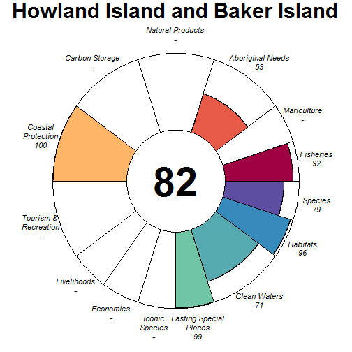

### Scores

|                                | score| status| future| trend| pressures| resilience|
|:-------------------------------|-----:|------:|------:|-----:|---------:|----------:|
|Index                           | 83.85|     NA|  84.36|    NA|        NA|         NA|
|Food Provision                  | 91.84|  87.00|  96.68| -0.01|        NA|         NA|
|. Fisheries                     | 91.84|  87.00|  96.68| -0.01|     25.55|      61.31|
|. Mariculture                   |    NA|     NA|     NA|    NA|     25.76|      30.27|
|Aboriginal Needs                | 53.10|  50.00|  56.19|  0.00|     25.45|      62.99|
|Natural Products                |    NA|     NA|     NA|    NA|        NA|         NA|
|Carbon Storage                  |    NA|     NA|     NA|    NA|        NA|         NA|
|Coastal Protection              | 99.74| 100.00|  99.47| -0.02|     41.97|      45.37|
|Tourism & Recreation            |    NA|     NA|     NA|    NA|     44.34|      29.22|
|Coastal Livelihoods & Economies |    NA|     NA|     NA|    NA|        NA|         NA|
|. Livelihoods                   |    NA|     NA|     NA|    NA|     26.05|      42.06|
|. Economies                     |    NA|     NA|     NA|    NA|     26.01|      50.00|
|Sense of Place                  | 99.06| 100.00|  98.12|  0.00|        NA|         NA|
|. Iconic Species                |    NA|     NA|     NA|    NA|     29.39|      60.67|
|. Lasting Special Places        | 99.06| 100.00|  98.12|  0.00|     36.25|      30.56|
|Clean Waters                    | 71.43|  74.51|  68.35|  0.00|     54.29|      29.22|
|Biodiversity                    | 87.96|  88.57|  87.35| -0.13|        NA|         NA|
|. Habitats                      | 96.46|  93.85|  99.06| -0.05|     28.10|      54.46|
|. Species                       | 79.46|  83.28|  75.64| -0.21|     30.54|      45.91|

## Iceland (143)

### Flower

### Scores

|                                | score| status| future| trend| pressures| resilience|
|:-------------------------------|-----:|------:|------:|-----:|---------:|----------:|
|Index                           | 64.36|     NA|  66.44|    NA|        NA|         NA|
|Food Provision                  | 66.55|  62.00|  71.10|  0.10|        NA|         NA|
|. Fisheries                     | 66.57|  62.00|  71.14|  0.10|     34.30|      58.65|
|. Mariculture                   | 60.26|  60.61|  59.92| -0.17|     27.89|      58.94|
|Aboriginal Needs                | 52.36|  50.00|  54.73|  0.00|     30.24|      58.88|
|Natural Products                | 98.08|  96.17| 100.00|  0.30|     29.08|      60.70|
|Carbon Storage                  |    NA|     NA|     NA|    NA|        NA|         NA|
|Coastal Protection              | 50.01|  50.09|  49.93| -0.01|     47.93|      50.00|
|Tourism & Recreation            | 58.15|  58.90|  57.40|  0.00|     58.07|      50.00|
|Coastal Livelihoods & Economies | 62.72|  61.14|  64.30|  0.02|        NA|         NA|
|. Livelihoods                   | 85.04|  70.07| 100.00|  0.84|     32.13|      52.19|
|. Economies                     | 40.41|  52.21|  28.61| -0.79|     33.28|      56.17|
|Sense of Place                  | 57.51|  53.96|  61.05|  0.10|        NA|         NA|
|. Iconic Species                | 59.88|  55.56|  64.21|  0.10|     33.43|      60.31|
|. Lasting Special Places        | 55.13|  52.36|  57.90|  0.10|     38.32|      50.00|
|Clean Waters                    | 58.30|  54.48|  62.12|  0.33|     75.00|      50.00|
|Biodiversity                    | 75.60|  73.86|  77.33| -0.04|        NA|         NA|
|. Habitats                      | 70.14|  68.16|  72.12| -0.05|     30.32|      58.01|
|. Species                       | 81.05|  79.55|  82.54| -0.02|     37.99|      53.90|

## Ile Europa (35)

### Flower

### Scores

|                                |  score| status| future| trend| pressures| resilience|
|:-------------------------------|------:|------:|------:|-----:|---------:|----------:|
|Index                           |  66.14|     NA|  66.89|    NA|        NA|         NA|
|Food Provision                  |     NA|     NA|     NA|    NA|        NA|         NA|
|. Fisheries                     |     NA|     NA|     NA|    NA|     25.15|      56.62|
|. Mariculture                   |     NA|     NA|     NA|    NA|     26.83|      63.52|
|Aboriginal Needs                |  52.67|  50.00|  55.33|  0.00|     25.12|      57.44|
|Natural Products                |     NA|     NA|     NA|    NA|        NA|         NA|
|Carbon Storage                  | 100.00| 100.00| 100.00|  0.00|     26.24|      45.57|
|Coastal Protection              |  91.87|  87.38|  96.36|  0.08|     39.02|      53.76|
|Tourism & Recreation            |     NA|     NA|     NA|    NA|     49.83|      70.13|
|Coastal Livelihoods & Economies |     NA|     NA|     NA|    NA|        NA|         NA|
|. Livelihoods                   |     NA|     NA|     NA|    NA|     29.27|      35.55|
|. Economies                     |     NA|     NA|     NA|    NA|     29.37|      47.71|
|Sense of Place                  |   0.00|   0.00|   0.00|  0.00|        NA|         NA|
|. Iconic Species                |     NA|     NA|     NA|    NA|     30.11|      61.10|
|. Lasting Special Places        |   0.00|   0.00|   0.00|  0.00|     38.19|      68.14|
|Clean Waters                    |  71.15|  69.80|  72.50|  0.00|     58.37|      70.13|
|Biodiversity                    |  81.14|  88.94|  77.17| -0.11|        NA|         NA|
|. Habitats                      |     NA|  92.79|     NA|  0.05|     31.20|         NA|
|. Species                       |  81.14|  85.10|  77.17| -0.26|     31.02|      55.09|

## Ile Tromelin (36)

### Flower

### Scores

|                                | score| status| future| trend| pressures| resilience|
|:-------------------------------|-----:|------:|------:|-----:|---------:|----------:|
|Index                           | 65.97|     NA|  67.90|    NA|        NA|         NA|
|Food Provision                  | 96.50|  93.00| 100.00|  0.09|        NA|         NA|
|. Fisheries                     | 96.50|  93.00| 100.00|  0.09|     25.21|      56.85|
|. Mariculture                   |    NA|     NA|     NA|    NA|     27.15|      63.52|
|Aboriginal Needs                | 52.64|  50.00|  55.28|  0.00|     25.18|      57.18|
|Natural Products                |    NA|     NA|     NA|    NA|        NA|         NA|
|Carbon Storage                  |    NA|     NA|     NA|    NA|        NA|         NA|
|Coastal Protection              | 88.98|  85.57|  92.39|  0.09|     48.38|      53.76|
|Tourism & Recreation            |    NA|     NA|     NA|    NA|     50.96|      70.13|
|Coastal Livelihoods & Economies |    NA|     NA|     NA|    NA|        NA|         NA|
|. Livelihoods                   |    NA|     NA|     NA|    NA|     29.33|      35.55|
|. Economies                     |    NA|     NA|     NA|    NA|     29.52|      47.71|
|Sense of Place                  |  0.00|   0.00|   0.00|  0.00|        NA|         NA|
|. Iconic Species                |    NA|     NA|     NA|    NA|     29.97|      61.33|
|. Lasting Special Places        |  0.00|   0.00|   0.00|  0.00|     38.33|      68.14|
|Clean Waters                    | 71.25|  69.87|  72.63|  0.00|     58.14|      70.13|
|Biodiversity                    | 86.46|  85.80|  87.12| -0.08|        NA|         NA|
|. Habitats                      | 90.97|  85.57|  96.37|  0.09|     40.78|      60.27|
|. Species                       | 81.95|  86.02|  77.87| -0.26|     30.74|      55.09|

## India (203)

### Flower

### Scores

|                                |  score| status| future| trend| pressures| resilience|
|:-------------------------------|------:|------:|------:|-----:|---------:|----------:|
|Index                           |  63.49|     NA|  62.09|    NA|        NA|         NA|
|Food Provision                  |  41.53|  40.52|  42.55| -0.06|        NA|         NA|
|. Fisheries                     |  43.05|  42.00|  44.10| -0.06|     33.72|      61.07|
|. Mariculture                   |   2.31|   2.23|   2.39|  0.00|     39.31|      60.73|
|Aboriginal Needs                |  52.51|  50.00|  55.03|  0.00|     31.30|      61.78|
|Natural Products                |  99.40|  98.79| 100.00|  0.59|     28.28|      66.71|
|Carbon Storage                  |  73.99|  87.14|  60.84| -0.58|     36.39|      62.52|
|Coastal Protection              |  53.26|  53.22|  53.29| -0.10|     41.92|      62.52|
|Tourism & Recreation            |  49.28|  47.99|  50.56|  0.00|     58.54|      75.00|
|Coastal Livelihoods & Economies |  69.69|  73.02|  66.36| -0.24|        NA|         NA|
|. Livelihoods                   |  39.38|  46.04|  32.72| -0.50|     34.82|      48.71|
|. Economies                     | 100.00| 100.00| 100.00|  0.02|     32.84|      52.67|
|Sense of Place                  |  39.46|  40.97|  37.94| -0.18|        NA|         NA|
|. Iconic Species                |  50.74|  55.00|  46.47| -0.36|     39.07|      64.60|
|. Lasting Special Places        |  28.18|  26.94|  29.42|  0.00|     47.12|      75.00|
|Clean Waters                    |  69.16|  69.15|  69.16|  0.00|     75.00|      75.00|
|Biodiversity                    |  86.67|  88.22|  85.12| -0.18|        NA|         NA|
|. Habitats                      |  89.83|  89.71|  89.95| -0.14|     35.78|      64.85|
|. Species                       |  83.51|  86.73|  80.28| -0.23|     38.79|      62.86|

## Indonesia (216)

### Flower

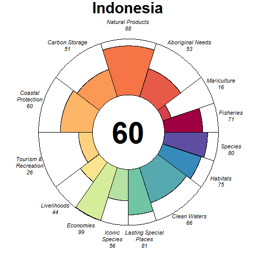

### Scores

|                                | score| status| future| trend| pressures| resilience|
|:-------------------------------|-----:|------:|------:|-----:|---------:|----------:|
|Index                           | 62.08|     NA|  61.67|    NA|        NA|         NA|
|Food Provision                  | 59.56|  52.30|  66.82|  0.23|        NA|         NA|
|. Fisheries                     | 70.93|  62.00|  79.86|  0.28|     35.10|      65.52|
|. Mariculture                   | 16.50|  15.57|  17.44|  0.06|     31.33|      55.52|
|Aboriginal Needs                | 52.92|  50.00|  55.83|  0.00|     31.26|      66.61|
|Natural Products                | 87.74|  83.60|  91.88| -0.07|     27.47|      71.19|
|Carbon Storage                  | 51.13|  70.15|  32.10| -1.00|     32.93|      71.57|
|Coastal Protection              | 59.60|  61.49|  57.71| -0.24|     41.37|      71.57|
|Tourism & Recreation            | 25.92|  25.42|  26.41|  0.00|     62.78|      75.00|
|Coastal Livelihoods & Economies | 71.45|  68.59|  74.31|  0.15|        NA|         NA|
|. Livelihoods                   | 43.51|  38.40|  48.62|  0.31|     33.28|      51.49|
|. Economies                     | 99.40|  98.79| 100.00| -0.01|     31.87|      53.33|
|Sense of Place                  | 68.67|  60.55|  76.79|  0.35|        NA|         NA|
|. Iconic Species                | 56.16|  58.75|  53.57| -0.29|     34.99|      67.49|
|. Lasting Special Places        | 81.18|  62.35| 100.00|  1.00|     41.81|      75.00|
|Clean Waters                    | 66.24|  67.73|  64.75| -0.07|     75.00|      75.00|
|Biodiversity                    | 77.59|  85.04|  70.14| -0.41|        NA|         NA|
|. Habitats                      | 75.12|  84.38|  65.85| -0.50|     32.02|      66.13|
|. Species                       | 80.07|  85.70|  74.43| -0.33|     38.08|      65.58|

## Iran (191)

### Flower

### Scores

|                                |  score| status| future| trend| pressures| resilience|
|:-------------------------------|------:|------:|------:|-----:|---------:|----------:|
|Index                           |  57.11|     NA|  52.89|    NA|        NA|         NA|
|Food Provision                  |  50.64|  49.66|  51.63| -0.08|        NA|         NA|
|. Fisheries                     |  52.00|  51.00|  53.01| -0.08|     32.75|      60.91|
|. Mariculture                   |   6.88|   6.53|   7.22|  0.02|     29.50|      57.50|
|Aboriginal Needs                |  52.62|  50.00|  55.24|  0.00|     28.88|      60.65|
|Natural Products                |  99.88|  99.75| 100.00|  0.88|     27.27|      63.59|
|Carbon Storage                  |  59.36|  84.86|  33.85| -1.00|     34.38|      55.26|
|Coastal Protection              |  17.56|  25.26|   9.85| -1.00|     37.09|      55.26|
|Tourism & Recreation            |  14.19|  14.07|  14.30|  0.00|     57.45|      62.50|
|Coastal Livelihoods & Economies |  80.78|  81.08|  80.47|  0.44|        NA|         NA|
|. Livelihoods                   | 100.00| 100.00| 100.00|  0.99|     35.10|      49.29|
|. Economies                     |  61.55|  62.16|  60.94| -0.11|     34.71|      51.83|
|Sense of Place                  |  61.12|  60.75|  61.49| -0.11|        NA|         NA|
|. Iconic Species                |  56.09|  57.50|  54.68| -0.21|     34.95|      63.61|
|. Lasting Special Places        |  66.15|  64.00|  68.30|  0.00|     41.57|      61.93|
|Clean Waters                    |  54.86|  59.51|  50.21| -0.17|     75.00|      62.50|
|Biodiversity                    |  80.06|  88.25|  71.87| -0.41|        NA|         NA|
|. Habitats                      |  77.83|  87.96|  67.69| -0.50|     30.78|      62.79|
|. Species                       |  82.30|  88.54|  76.05| -0.31|     37.23|      58.39|

## Iraq (192)

### Flower

### Scores

|                                |  score| status| future| trend| pressures| resilience|
|:-------------------------------|------:|------:|------:|-----:|---------:|----------:|
|Index                           |  60.89|     NA|  61.03|    NA|        NA|         NA|
|Food Provision                  |  55.32|  55.00|  55.63| -0.08|        NA|         NA|
|. Fisheries                     |  55.32|  55.00|  55.63| -0.08|     35.91|      55.64|
|. Mariculture                   |     NA|     NA|     NA|    NA|     55.22|      50.00|
|Aboriginal Needs                |  52.09|  50.00|  54.17|  0.00|     29.81|      55.10|
|Natural Products                |     NA|     NA|     NA|    NA|        NA|         NA|
|Carbon Storage                  |  85.54|  85.51|  85.57|    NA|     42.07|      42.26|
|Coastal Protection              |  85.40|  85.51|  85.29|    NA|     43.04|      42.26|
|Tourism & Recreation            |  20.64|  20.85|  20.42|  0.00|     56.32|      50.00|
|Coastal Livelihoods & Economies |  87.79|  86.98|  88.60|  0.48|        NA|         NA|
|. Livelihoods                   | 100.00| 100.00| 100.00|  1.00|     32.51|      36.08|
|. Economies                     |  75.57|  73.95|  77.20| -0.04|     32.51|      54.12|
|Sense of Place                  |  32.68|  32.05|  33.31|  0.00|        NA|         NA|
|. Iconic Species                |  61.22|  60.00|  62.45|  0.00|     42.64|      55.00|
|. Lasting Special Places        |   4.13|   4.10|   4.17|  0.00|     44.86|      50.00|
|Clean Waters                    |  41.11|  39.51|  42.71|  0.24|     75.00|      50.00|
|Biodiversity                    |  87.46|  91.33|  83.59| -0.17|        NA|         NA|
|. Habitats                      |  95.55|  92.75|  98.35|  0.00|     39.20|      57.58|
|. Species                       |  79.37|  89.91|  68.82| -0.33|     47.14|      43.36|

## Ireland (181)

### Flower

### Scores

|                                |  score| status| future| trend| pressures| resilience|
|:-------------------------------|------:|------:|------:|-----:|---------:|----------:|
|Index                           |  65.04|     NA|  66.41|    NA|        NA|         NA|
|Food Provision                  |  82.67|  76.66|  88.67|  0.06|        NA|         NA|
|. Fisheries                     |  85.26|  78.00|  92.51|  0.11|     32.74|      66.78|
|. Mariculture                   |  64.76|  67.43|  62.09| -0.27|     34.92|      65.73|
|Aboriginal Needs                |  53.10|  50.00|  56.21|  0.00|     29.71|      67.33|
|Natural Products                |  75.92|  68.71|  83.13|  0.11|     27.46|      69.59|
|Carbon Storage                  |  53.45|  50.00|  56.89|  0.00|     32.46|      74.24|
|Coastal Protection              |  53.32|  50.00|  56.64|  0.00|     33.99|      74.24|
|Tourism & Recreation            |  28.58|  27.81|  29.35|  0.00|     58.40|      75.00|
|Coastal Livelihoods & Economies |  77.70|  91.05|  64.34| -0.48|        NA|         NA|
|. Livelihoods                   |  55.39|  82.11|  28.68| -1.00|     33.68|      39.46|
|. Economies                     | 100.00| 100.00| 100.00|  0.04|     32.01|      57.58|
|Sense of Place                  |  78.44|  77.78|  79.10|  0.02|        NA|         NA|
|. Iconic Species                |  56.88|  55.56|  58.20| -0.08|     36.56|      67.89|
|. Lasting Special Places        | 100.00| 100.00| 100.00|  0.12|     42.67|      73.86|
|Clean Waters                    |  69.08|  68.54|  69.61|  0.02|     75.00|      75.00|
|Biodiversity                    |  78.16|  76.12|  80.20| -0.08|        NA|         NA|
|. Habitats                      |  76.21|  71.78|  80.63|  0.01|     31.17|      66.38|
|. Species                       |  80.11|  80.45|  79.77| -0.16|     37.04|      67.64|

## Israel (79)

### Flower

### Scores

|                                |  score| status| future| trend| pressures| resilience|
|:-------------------------------|------:|------:|------:|-----:|---------:|----------:|
|Index                           |  69.53|     NA|  73.10|    NA|        NA|         NA|
|Food Provision                  |  38.32|  36.21|  40.43|  0.02|        NA|         NA|
|. Fisheries                     |  56.09|  53.00|  59.18|  0.03|     30.19|      59.44|
|. Mariculture                   |   0.68|   0.65|   0.72|  0.00|     42.10|      72.92|
|Aboriginal Needs                |  52.48|  50.00|  54.95|  0.00|     29.27|      59.28|
|Natural Products                |  87.46|  81.72|  93.20|  0.02|     27.83|      66.24|
|Carbon Storage                  |  91.23|  82.45| 100.00|  1.00|     46.79|      56.84|
|Coastal Protection              |  91.23|  82.45| 100.00|  1.00|     49.05|      56.84|
|Tourism & Recreation            |  29.15|  28.37|  29.94|  0.00|     58.22|      75.00|
|Coastal Livelihoods & Economies | 100.00| 100.00| 100.00|  0.52|        NA|         NA|
|. Livelihoods                   | 100.00| 100.00| 100.00|  1.00|     36.73|      39.00|
|. Economies                     | 100.00| 100.00| 100.00|  0.03|     33.77|      58.50|
|Sense of Place                  |  40.58|  39.75|  41.41|  0.03|        NA|         NA|
|. Iconic Species                |  40.97|  46.00|  35.95| -0.43|     42.83|      63.62|
|. Lasting Special Places        |  40.18|  33.49|  46.87|  0.49|     47.85|      69.32|
|Clean Waters                    |  73.80|  69.82|  77.79|  0.17|     75.00|      75.00|
|Biodiversity                    |  91.01|  88.74|  93.28|  0.18|        NA|         NA|
|. Habitats                      |  94.80|  89.60| 100.00|  0.49|     40.97|      64.36|
|. Species                       |  87.22|  87.89|  86.56| -0.14|     37.10|      61.47|

## Italy (184)

### Flower

### Scores

|                                |  score| status| future| trend| pressures| resilience|
|:-------------------------------|------:|------:|------:|-----:|---------:|----------:|
|Index                           |  67.23|     NA|  70.62|    NA|        NA|         NA|
|Food Provision                  |  44.30|  41.67|  46.92|  0.01|        NA|         NA|
|. Fisheries                     |  68.60|  64.00|  73.19|  0.05|     31.30|      64.68|
|. Mariculture                   |  19.79|  19.15|  20.43| -0.03|     35.24|      61.60|
|Aboriginal Needs                |  53.04|  50.00|  56.07|  0.00|     28.75|      65.56|
|Natural Products                |  93.28|  86.56| 100.00|  0.17|     29.12|      69.40|
|Carbon Storage                  |  79.49|  65.18|  93.79|  0.50|     39.00|      70.45|
|Coastal Protection              |  35.15|  28.84|  41.46|  0.50|     39.38|      70.45|
|Tourism & Recreation            |  61.24|  59.52|  62.97|  0.00|     57.22|      75.00|
|Coastal Livelihoods & Economies |  85.93|  85.62|  86.25|  0.03|        NA|         NA|
|. Livelihoods                   |  71.87|  71.23|  72.51|  0.00|     30.48|      35.91|
|. Economies                     | 100.00| 100.00| 100.00|  0.05|     33.09|      53.83|
|Sense of Place                  |  76.31|  78.89|  73.72|  0.02|        NA|         NA|
|. Iconic Species                |  52.61|  57.78|  47.44| -0.40|     39.55|      66.56|
|. Lasting Special Places        | 100.00| 100.00| 100.00|  0.44|     47.17|      68.18|
|Clean Waters                    |  57.25|  58.34|  56.16| -0.06|     75.00|      75.00|
|Biodiversity                    |  86.35|  83.85|  88.84|  0.03|        NA|         NA|
|. Habitats                      |  93.21|  86.42| 100.00|  0.25|     33.52|      64.42|
|. Species                       |  79.48|  81.29|  77.68| -0.20|     37.75|      64.05|

## Ivory Coast (195)

### Flower

### Scores

|                                |  score| status| future| trend| pressures| resilience|
|:-------------------------------|------:|------:|------:|-----:|---------:|----------:|
|Index                           |  50.04|     NA|  47.11|    NA|        NA|         NA|
|Food Provision                  |  89.62|  85.00|  94.24|  0.01|        NA|         NA|
|. Fisheries                     |  89.62|  85.00|  94.24|  0.01|     27.22|      58.12|
|. Mariculture                   |     NA|     NA|     NA|    NA|     32.04|      73.96|
|Aboriginal Needs                |  52.45|  50.00|  54.89|  0.00|     27.54|      57.19|
|Natural Products                |  20.69|  28.62|  12.76| -1.00|     26.29|      61.44|
|Carbon Storage                  |  22.84|  32.78|  12.89| -1.00|     31.33|      50.49|
|Coastal Protection              |  22.75|  32.78|  12.72| -1.00|     32.89|      50.49|
|Tourism & Recreation            |  12.52|  12.20|  12.83|  0.00|     59.19|      75.00|
|Coastal Livelihoods & Economies |  86.56|  87.35|  85.76| -0.10|        NA|         NA|
|. Livelihoods                   |  73.11|  74.70|  71.53| -0.22|     29.93|      62.65|
|. Economies                     | 100.00| 100.00| 100.00|  0.03|     31.19|      44.67|
|Sense of Place                  |  55.16|  54.75|  55.57| -0.11|        NA|         NA|
|. Iconic Species                |  60.49|  62.22|  58.75| -0.21|     35.84|      62.43|
|. Lasting Special Places        |  49.83|  47.27|  52.39|  0.00|     41.03|      73.86|
|Clean Waters                    |  67.53|  70.89|  64.16| -0.14|     75.00|      75.00|
|Biodiversity                    |  70.28|  75.27|  65.29| -0.35|        NA|         NA|
|. Habitats                      |  58.89|  66.39|  51.39| -0.50|     29.24|      61.42|
|. Species                       |  81.67|  84.15|  79.20| -0.21|     32.36|      57.73|

## Jamaica (166)

### Flower

### Scores

|                                |  score| status| future| trend| pressures| resilience|
|:-------------------------------|------:|------:|------:|-----:|---------:|----------:|
|Index                           |  52.73|     NA|  47.47|    NA|        NA|         NA|
|Food Provision                  |   3.16|   2.97|   3.34|  0.01|        NA|         NA|
|. Fisheries                     |   3.18|   3.00|   3.37|  0.01|     28.05|      63.37|
|. Mariculture                   |   0.08|   0.08|   0.09|  0.00|     28.92|      50.00|
|Aboriginal Needs                |  53.10|  50.00|  56.20|  0.00|     27.08|      64.65|
|Natural Products                |   6.72|   6.31|   7.13|  0.01|     27.16|      65.52|
|Carbon Storage                  |  68.42|  97.46|  39.37| -1.00|     35.90|      58.33|
|Coastal Protection              |  26.71|  27.58|  25.84| -0.19|     38.16|      58.33|
|Tourism & Recreation            |  76.41|  77.10|  75.73|  0.00|     55.10|      50.00|
|Coastal Livelihoods & Economies |  78.14|  92.26|  64.03| -0.49|        NA|         NA|
|. Livelihoods                   |  69.23|  98.64|  39.82| -0.93|     32.23|      41.08|
|. Economies                     |  87.06|  85.89|  88.23| -0.05|     30.86|      48.67|
|Sense of Place                  |  77.74|  80.00|  75.49|  0.32|        NA|         NA|
|. Iconic Species                |  55.49|  60.00|  50.98| -0.36|     37.07|      64.01|
|. Lasting Special Places        | 100.00| 100.00| 100.00|  1.00|     44.51|      50.00|
|Clean Waters                    |  59.57|  65.29|  53.85| -0.14|     75.00|      50.00|
|Biodiversity                    |  77.33|  80.90|  73.76| -0.26|        NA|         NA|
|. Habitats                      |  70.58|  75.66|  65.50| -0.35|     31.81|      61.20|
|. Species                       |  84.08|  86.14|  82.01| -0.18|     34.53|      56.63|

## Jan Mayen (144)

### Flower

### Scores

|                                | score| status| future| trend| pressures| resilience|
|:-------------------------------|-----:|------:|------:|-----:|---------:|----------:|
|Index                           | 63.87|     NA|  68.29|    NA|        NA|         NA|
|Food Provision                  | 68.87|  63.00|  74.73|  0.10|        NA|         NA|
|. Fisheries                     | 68.87|  63.00|  74.73|  0.10|     30.93|      67.07|
|. Mariculture                   |    NA|     NA|     NA|    NA|     25.97|      63.42|
|Aboriginal Needs                | 53.28|  50.00|  56.56|  0.00|     28.92|      68.69|
|Natural Products                |    NA|     NA|     NA|    NA|        NA|         NA|
|Carbon Storage                  |    NA|     NA|     NA|    NA|        NA|         NA|
|Coastal Protection              |    NA|     NA|     NA|    NA|     42.01|      50.00|
|Tourism & Recreation            | 46.01|  43.79|  48.23|  0.00|     44.27|      75.00|
|Coastal Livelihoods & Economies | 85.65|  76.39|  94.91|  0.34|        NA|         NA|
|. Livelihoods                   | 85.75|  71.50| 100.00|  0.68|     28.89|      56.08|
|. Economies                     | 85.54|  81.28|  89.81|  0.01|     28.55|      58.45|
|Sense of Place                  | 46.08|  43.33|  48.82|  0.00|        NA|         NA|
|. Iconic Species                | 92.15|  86.67|  97.64|  0.00|     29.53|      67.89|
|. Lasting Special Places        |  0.00|   0.00|   0.00|  0.00|     35.65|      75.00|
|Clean Waters                    | 80.10|  77.20|  83.00|  0.00|     52.25|      75.00|
|Biodiversity                    | 67.13|  62.49|  71.77|  0.05|        NA|         NA|
|. Habitats                      | 49.57|  46.85|  52.29| -0.01|     30.41|      66.69|
|. Species                       | 84.70|  78.14|  91.25|  0.10|     38.26|      69.26|

## Japan (210)

### Flower

### Scores

|                                |  score| status| future| trend| pressures| resilience|
|:-------------------------------|------:|------:|------:|-----:|---------:|----------:|
|Index                           |  64.28|     NA|  64.56|    NA|        NA|         NA|
|Food Provision                  |  31.64|  29.79|  33.50|  0.04|        NA|         NA|
|. Fisheries                     |  33.07|  31.00|  35.15|  0.05|     33.46|      63.85|
|. Mariculture                   |  24.48|  23.72|  25.24| -0.04|     31.72|      59.23|
|Aboriginal Needs                |  52.88|  50.00|  55.76|  0.00|     30.45|      65.37|
|Natural Products                |  40.90|  39.21|  42.59| -0.04|     30.97|      65.62|
|Carbon Storage                  |  94.68|  91.28|  98.07|    NA|     38.32|      60.84|
|Coastal Protection              |  96.89|  94.15|  99.63| -0.02|     39.90|      60.84|
|Tourism & Recreation            |  24.06|  24.40|  23.72|  0.00|     58.29|      50.00|
|Coastal Livelihoods & Economies |  76.71|  81.31|  72.11| -0.25|        NA|         NA|
|. Livelihoods                   |  53.42|  62.62|  44.21| -0.50|     31.40|      43.82|
|. Economies                     | 100.00| 100.00| 100.00|  0.00|     31.79|      56.92|
|Sense of Place                  |  74.86|  75.77|  73.94| -0.14|        NA|         NA|
|. Iconic Species                |  56.54|  60.00|  53.08| -0.29|     41.06|      64.12|
|. Lasting Special Places        |  93.17|  91.55|  94.80|  0.00|     46.05|      56.82|
|Clean Waters                    |  61.48|  65.94|  57.01| -0.08|     75.00|      50.00|
|Biodiversity                    |  88.73|  88.23|  89.23| -0.10|        NA|         NA|
|. Habitats                      |  96.40|  92.81| 100.00|  0.00|     34.38|      62.95|
|. Species                       |  81.06|  83.65|  78.46| -0.20|     39.25|      60.85|

## Jarvis Island (149)

### Flower

### Scores

|                                | score| status| future| trend| pressures| resilience|
|:-------------------------------|-----:|------:|------:|-----:|---------:|----------:|
|Index                           | 73.17|     NA|  73.92|    NA|        NA|         NA|
|Food Provision                  | 58.20|  54.00|  62.39|  0.06|        NA|         NA|
|. Fisheries                     | 58.20|  54.00|  62.39|  0.06|     26.43|      61.35|
|. Mariculture                   |    NA|     NA|     NA|    NA|     25.32|      30.27|
|Aboriginal Needs                | 53.06|  50.00|  56.13|  0.00|     25.95|      63.09|
|Natural Products                |    NA|     NA|     NA|    NA|        NA|         NA|
|Carbon Storage                  |    NA|     NA|     NA|    NA|        NA|         NA|
|Coastal Protection              |    NA|     NA|     NA|    NA|        NA|         NA|
|Tourism & Recreation            |    NA|     NA|     NA|    NA|     42.49|      29.22|
|Coastal Livelihoods & Economies |    NA|     NA|     NA|    NA|        NA|         NA|
|. Livelihoods                   |    NA|     NA|     NA|    NA|        NA|      41.80|
|. Economies                     |    NA|     NA|     NA|    NA|        NA|      50.00|
|Sense of Place                  | 99.09| 100.00|  98.19|  0.00|        NA|         NA|
|. Iconic Species                |    NA|     NA|     NA|    NA|     29.28|      60.58|
|. Lasting Special Places        | 99.09| 100.00|  98.19|  0.00|     36.05|      30.56|
|Clean Waters                    | 71.33|  74.39|  68.27|  0.00|     54.15|      29.22|
|Biodiversity                    | 84.17|  83.75|  84.59| -0.09|        NA|         NA|
|. Habitats                      | 91.22|  85.57|  96.86|  0.07|     27.32|      53.99|
|. Species                       | 77.13|  81.93|  72.33| -0.24|     32.07|      46.25|

## Jersey (227)

### Flower

### Scores

|                                | score| status| future| trend| pressures| resilience|
|:-------------------------------|-----:|------:|------:|-----:|---------:|----------:|
|Index                           | 59.30|     NA|  61.93|    NA|        NA|         NA|
|Food Provision                  |    NA|     NA|     NA|    NA|        NA|         NA|
|. Fisheries                     |    NA|     NA|     NA|    NA|     30.22|      59.91|
|. Mariculture                   |    NA|     NA|     NA|    NA|     31.99|      63.47|
|Aboriginal Needs                | 52.55|  50.00|  55.11|  0.00|     28.48|      59.43|
|Natural Products                |    NA|     NA|     NA|    NA|        NA|         NA|
|Carbon Storage                  | 52.53|  50.00|  55.06|  0.00|     30.21|      60.87|
|Coastal Protection              | 51.90|  50.00|  53.80|  0.00|     37.84|      60.87|
|Tourism & Recreation            | 45.07|  43.79|  46.35|  0.00|     57.27|      75.00|
|Coastal Livelihoods & Economies | 85.45|  76.39|  94.51|  0.34|        NA|         NA|
|. Livelihoods                   | 85.75|  71.50| 100.00|  0.68|     29.60|      40.90|
|. Economies                     | 85.15|  81.28|  89.03|  0.01|     31.47|      58.45|
|Sense of Place                  | 37.75|  35.78|  39.72|  0.00|        NA|         NA|
|. Iconic Species                |    NA|     NA|     NA|    NA|     36.49|      63.38|
|. Lasting Special Places        | 37.75|  35.78|  39.72|  0.00|     41.63|      75.00|
|Clean Waters                    | 70.95|  70.90|  71.01|  0.00|     75.00|      75.00|
|Biodiversity                    | 78.20|  76.54|  79.85| -0.07|        NA|         NA|
|. Habitats                      | 76.03|  71.73|  80.33|  0.01|     28.69|      62.52|
|. Species                       | 80.36|  81.35|  79.36| -0.16|     36.32|      61.25|

## Johnston Atoll (159)

### Flower

### Scores

|                                | score| status| future| trend| pressures| resilience|
|:-------------------------------|-----:|------:|------:|-----:|---------:|----------:|
|Index                           | 69.45|     NA|  69.57|    NA|        NA|         NA|
|Food Provision                  | 57.20|  53.00|  61.40|  0.06|        NA|         NA|
|. Fisheries                     | 57.20|  53.00|  61.40|  0.06|     25.44|      61.31|
|. Mariculture                   |    NA|     NA|     NA|    NA|     26.31|      30.27|
|Aboriginal Needs                | 53.07|  50.00|  56.15|  0.00|     25.64|      62.89|
|Natural Products                |    NA|     NA|     NA|    NA|        NA|         NA|
|Carbon Storage                  |    NA|     NA|     NA|    NA|        NA|         NA|
|Coastal Protection              | 74.45|  74.30|  74.59|    NA|     44.18|      45.37|
|Tourism & Recreation            |    NA|     NA|     NA|    NA|     48.16|      29.22|
|Coastal Livelihoods & Economies |    NA|     NA|     NA|    NA|        NA|         NA|
|. Livelihoods                   |    NA|     NA|     NA|    NA|        NA|      41.80|
|. Economies                     |    NA|     NA|     NA|    NA|        NA|      50.00|
|Sense of Place                  | 75.75|  80.00|  71.50| -0.25|        NA|         NA|
|. Iconic Species                | 52.81|  60.00|  45.61| -0.50|     31.69|      60.53|
|. Lasting Special Places        | 98.69| 100.00|  97.38|  0.00|     38.50|      30.56|
|Clean Waters                    | 70.65|  74.29|  67.02|  0.00|     58.87|      29.22|
|Biodiversity                    | 85.59|  84.43|  86.75| -0.06|        NA|         NA|
|. Habitats                      | 91.06|  87.15|  94.97|  0.01|     28.70|      54.26|
|. Species                       | 80.12|  81.71|  78.54| -0.13|     30.84|      46.26|

## Jordan (215)

### Flower

### Scores

|                                |  score| status| future| trend| pressures| resilience|
|:-------------------------------|------:|------:|------:|-----:|---------:|----------:|
|Index                           |  55.13|     NA|  53.91|    NA|        NA|         NA|
|Food Provision                  |   4.08|   4.00|   4.15| -0.01|        NA|         NA|
|. Fisheries                     |   4.08|   4.00|   4.15| -0.01|     44.88|      58.62|
|. Mariculture                   |     NA|     NA|     NA|    NA|     37.43|      65.62|
|Aboriginal Needs                |  51.92|  50.00|  53.83|  0.00|     35.25|      58.47|
|Natural Products                |     NA|     NA|     NA|    NA|        NA|         NA|
|Carbon Storage                  |  87.95|  85.51|  90.40|    NA|     39.51|      56.82|
|Coastal Protection              |  56.40|  59.92|  52.88| -0.24|     43.61|      56.82|
|Tourism & Recreation            |  53.53|  52.19|  54.87|  0.00|     58.82|      75.00|
|Coastal Livelihoods & Economies |  87.88|  78.69|  97.07|  0.57|        NA|         NA|
|. Livelihoods                   |  75.76|  57.38|  94.13|  0.94|     39.29|      43.29|
|. Economies                     | 100.00| 100.00| 100.00|  0.20|     38.77|      51.92|
|Sense of Place                  |  26.09|  30.00|  22.19| -0.25|        NA|         NA|
|. Iconic Species                |  52.19|  60.00|  44.38| -0.50|     40.53|      63.15|
|. Lasting Special Places        |   0.00|   0.00|   0.00|  0.00|     46.57|      72.73|
|Clean Waters                    |  49.56|  58.00|  41.13| -0.43|     75.00|      75.00|
|Biodiversity                    |  78.78|  90.44|  68.65| -0.31|        NA|         NA|
|. Habitats                      |     NA|  91.98|     NA| -0.24|     41.43|         NA|
|. Species                       |  78.78|  88.91|  68.65| -0.38|     48.60|      56.65|

## Juan de Nova Island (33)

### Flower

### Scores

|                                | score| status| future| trend| pressures| resilience|
|:-------------------------------|-----:|------:|------:|-----:|---------:|----------:|
|Index                           | 65.67|     NA|  69.01|    NA|        NA|         NA|
|Food Provision                  |    NA|     NA|     NA|    NA|        NA|         NA|
|. Fisheries                     |    NA|     NA|     NA|    NA|     25.18|      57.09|
|. Mariculture                   |    NA|     NA|     NA|    NA|     26.76|      63.52|
|Aboriginal Needs                | 52.67|  50.00|  55.35|  0.00|     25.12|      57.53|
|Natural Products                |    NA|     NA|     NA|    NA|        NA|         NA|
|Carbon Storage                  |    NA|     NA|     NA|    NA|        NA|         NA|
|Coastal Protection              | 89.30|  85.57|  93.02|  0.09|     46.15|      53.76|
|Tourism & Recreation            | 52.86|  51.09|  54.64|  0.00|     48.89|      70.13|
|Coastal Livelihoods & Economies | 95.05|  90.10| 100.00|  0.32|        NA|         NA|
|. Livelihoods                   | 93.40|  86.79| 100.00|  0.57|     29.30|      35.55|
|. Economies                     | 96.71|  93.41| 100.00|  0.06|     29.34|      47.71|
|Sense of Place                  |  0.00|   0.00|   0.00|  0.00|        NA|         NA|
|. Iconic Species                |    NA|     NA|     NA|    NA|     29.98|      61.57|
|. Lasting Special Places        |  0.00|   0.00|   0.00|  0.00|     38.02|      68.14|
|Clean Waters                    | 80.38|  69.62|  91.15|  0.40|     58.19|      70.13|
|Biodiversity                    | 89.41|  89.88|  88.93| -0.11|        NA|         NA|
|. Habitats                      | 96.39|  92.79| 100.00|  0.05|     28.31|      60.54|
|. Species                       | 82.42|  86.98|  77.87| -0.28|     30.89|      55.09|

## Kenya (43)

### Flower

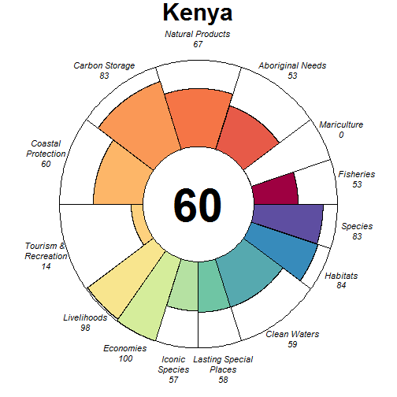

### Scores

|                                |  score| status| future| trend| pressures| resilience|
|:-------------------------------|------:|------:|------:|-----:|---------:|----------:|
|Index                           |  62.87|     NA|  63.11|    NA|        NA|         NA|
|Food Provision                  |  52.96|  51.00|  54.92| -0.08|        NA|         NA|
|. Fisheries                     |  52.96|  51.00|  54.92| -0.08|     26.76|      66.30|
|. Mariculture                   |   0.00|   0.00|   0.00|  0.00|     33.16|      69.79|
|Aboriginal Needs                |  53.31|  50.00|  56.62|  0.00|     27.26|      67.40|
|Natural Products                |  67.18|  62.84|  71.52|  0.00|     26.87|      69.28|
|Carbon Storage                  |  82.63|  90.02|  75.25| -0.43|     33.12|      70.64|
|Coastal Protection              |  59.63|  58.97|  60.29| -0.13|     38.25|      70.64|
|Tourism & Recreation            |  14.14|  13.76|  14.51|  0.00|     58.41|      75.00|
|Coastal Livelihoods & Economies |  98.96|  97.93| 100.00|  0.34|        NA|         NA|
|. Livelihoods                   |  97.93|  95.85| 100.00|  0.54|     33.89|      44.32|
|. Economies                     | 100.00| 100.00| 100.00|  0.14|     31.98|      47.92|
|Sense of Place                  |  57.72|  57.89|  57.56| -0.15|        NA|         NA|
|. Iconic Species                |  57.04|  60.00|  54.09| -0.30|     37.02|      68.07|
|. Lasting Special Places        |  58.40|  55.77|  61.03|  0.00|     46.41|      75.00|
|Clean Waters                    |  58.61|  58.86|  58.35| -0.01|     75.00|      75.00|
|Biodiversity                    |  83.54|  85.06|  82.03| -0.22|        NA|         NA|
|. Habitats                      |  84.19|  83.75|  84.63| -0.15|     32.73|      66.60|
|. Species                       |  82.90|  86.37|  79.43| -0.28|     33.11|      66.13|

## Kerguelen Islands (93)

### Flower

### Scores

|                                |  score| status| future| trend| pressures| resilience|
|:-------------------------------|------:|------:|------:|-----:|---------:|----------:|
|Index                           |  82.48|     NA|  84.94|    NA|        NA|         NA|
|Food Provision                  |  93.00|  86.00| 100.00|  0.08|        NA|         NA|
|. Fisheries                     |  93.00|  86.00| 100.00|  0.08|     25.35|      67.43|
|. Mariculture                   |     NA|     NA|     NA|    NA|     26.93|      70.34|
|Aboriginal Needs                |  53.45|  50.00|  56.91|  0.00|     25.22|      67.08|
|Natural Products                |     NA|     NA|     NA|    NA|        NA|         NA|
|Carbon Storage                  |     NA|     NA|     NA|    NA|        NA|         NA|
|Coastal Protection              |     NA|     NA|     NA|    NA|        NA|         NA|
|Tourism & Recreation            |     NA|     NA|     NA|    NA|     31.26|      73.53|
|Coastal Livelihoods & Economies |     NA|     NA|     NA|    NA|        NA|         NA|
|. Livelihoods                   |     NA|     NA|     NA|    NA|        NA|      34.82|
|. Economies                     |     NA|     NA|     NA|    NA|        NA|      50.00|
|Sense of Place                  |  74.95|  73.33|  76.58|  0.00|        NA|         NA|
|. Iconic Species                |  49.91|  46.67|  53.15|  0.00|     26.18|      68.29|
|. Lasting Special Places        | 100.00| 100.00| 100.00|  0.00|     26.02|      71.92|
|Clean Waters                    |  99.98|  99.97| 100.00|  0.00|     25.28|      73.53|
|Biodiversity                    |  90.98|  90.77|  91.20| -0.09|        NA|         NA|
|. Habitats                      | 100.00| 100.00| 100.00|  0.00|     25.32|      66.68|
|. Species                       |  81.97|  81.53|  82.40| -0.18|     27.46|      68.04|

## Kiribati (212)

### Flower

### Scores

|                                |  score| status| future| trend| pressures| resilience|
|:-------------------------------|------:|------:|------:|-----:|---------:|----------:|
|Index                           |  70.79|     NA|  72.43|    NA|        NA|         NA|
|Food Provision                  |  66.92|  62.98|  70.85|  0.07|        NA|         NA|
|. Fisheries                     |  66.94|  63.00|  70.87|  0.07|     30.49|      54.15|
|. Mariculture                   |   0.14|   0.14|   0.15|  0.00|     26.51|      47.21|
|Aboriginal Needs                |  52.27|  50.00|  54.53|  0.00|     27.43|      54.90|
|Natural Products                |  78.66|  66.52|  90.81|  0.39|     25.47|      56.09|
|Carbon Storage                  |  86.73|  85.51|  87.95|    NA|     32.64|      41.28|
|Coastal Protection              |  82.15|  81.75|  82.55|    NA|     38.31|      41.28|
|Tourism & Recreation            |  69.10|  69.98|  68.23|  0.01|     58.91|      49.42|
|Coastal Livelihoods & Economies |  89.65|  86.23|  93.06|  0.10|        NA|         NA|
|. Livelihoods                   |  79.30|  72.47|  86.13|  0.07|     32.27|      74.36|
|. Economies                     | 100.00| 100.00| 100.00|  0.13|     30.51|      61.67|
|Sense of Place                  |  30.91|  33.33|  28.48| -0.17|        NA|         NA|
|. Iconic Species                |  61.81|  66.67|  56.96| -0.33|     31.33|      54.87|
|. Lasting Special Places        |   0.00|   0.00|   0.00|  0.00|     38.68|      49.42|
|Clean Waters                    |  65.66|  68.34|  62.97|  0.01|     75.00|      49.42|
|Biodiversity                    |  85.89|  86.96|  84.82| -0.13|        NA|         NA|
|. Habitats                      |  93.30|  89.78|  96.83| -0.01|     30.52|      56.20|
|. Species                       |  78.47|  84.13|  72.82| -0.25|     35.84|      44.92|

## Kuwait (51)

### Flower

### Scores

|                                |  score| status| future| trend| pressures| resilience|
|:-------------------------------|------:|------:|------:|-----:|---------:|----------:|
|Index                           |  57.97|     NA|  58.47|    NA|        NA|         NA|
|Food Provision                  |  32.50|  31.87|  33.12| -0.07|        NA|         NA|
|. Fisheries                     |  32.63|  32.00|  33.25| -0.07|     31.97|      58.04|
|. Mariculture                   |   0.05|   0.05|   0.05|  0.00|     32.89|      50.00|
|Aboriginal Needs                |  52.42|  50.00|  54.85|  0.00|     28.02|      57.40|
|Natural Products                |     NA|     NA|     NA|    NA|        NA|         NA|
|Carbon Storage                  |  86.90|  85.51|  88.29|    NA|     35.55|      45.40|
|Coastal Protection              |  23.85|  23.54|  24.16|    NA|     37.41|      45.40|
|Tourism & Recreation            |  20.25|  20.46|  20.05|  0.00|     55.84|      50.00|
|Coastal Livelihoods & Economies | 100.00| 100.00| 100.00|  0.51|        NA|         NA|
|. Livelihoods                   | 100.00| 100.00| 100.00|  1.00|     35.85|      36.44|
|. Economies                     | 100.00| 100.00| 100.00|  0.02|     33.31|      54.67|
|Sense of Place                  |  60.32|  53.26|  67.38|  0.25|        NA|         NA|
|. Iconic Species                |  40.71|  46.67|  34.75| -0.50|     36.61|      60.76|
|. Lasting Special Places        |  79.92|  59.85| 100.00|  1.00|     44.27|      50.00|
|Clean Waters                    |  56.26|  60.76|  51.76| -0.10|     75.00|      50.00|
|Biodiversity                    |  89.23|  91.83|  86.63| -0.17|        NA|         NA|
|. Habitats                      |  96.92|  93.84| 100.00| -0.01|     33.78|      59.00|
|. Species                       |  81.54|  89.82|  73.26| -0.34|     38.13|      51.07|

## Latvia (69)

### Flower

### Scores

|                                |  score| status| future| trend| pressures| resilience|
|:-------------------------------|------:|------:|------:|-----:|---------:|----------:|
|Index                           |  76.55|     NA|  80.35|    NA|        NA|         NA|
|Food Provision                  |  85.57|  79.00|  92.13|  0.07|        NA|         NA|
|. Fisheries                     |  85.57|  79.00|  92.13|  0.07|     32.17|      68.33|
|. Mariculture                   |     NA|     NA|     NA|    NA|     35.33|      71.88|
|Aboriginal Needs                |  53.18|  50.00|  56.36|  0.00|     30.94|      69.46|
|Natural Products                |  90.69|  81.37| 100.00|  0.28|     29.96|      71.43|
|Carbon Storage                  |  53.34|  50.00|  56.67|  0.00|     32.30|      72.73|
|Coastal Protection              |  99.99|  99.97| 100.00|  0.06|     48.97|      72.73|
|Tourism & Recreation            |  35.39|  34.51|  36.26|  0.00|     60.04|      75.00|
|Coastal Livelihoods & Economies |  89.91|  82.17|  97.65|  0.34|        NA|         NA|
|. Livelihoods                   |  79.82|  64.34|  95.30|  0.68|     30.56|      39.33|
|. Economies                     | 100.00| 100.00| 100.00|  0.01|     33.01|      52.92|
|Sense of Place                  | 100.00| 100.00| 100.00|  0.00|        NA|         NA|
|. Iconic Species                |     NA|     NA|     NA|    NA|     34.56|      69.71|
|. Lasting Special Places        | 100.00| 100.00| 100.00|  0.00|     42.58|      71.59|
|Clean Waters                    |  68.54|  65.18|  71.89|  0.15|     75.00|      75.00|
|Biodiversity                    |  88.88|  85.23|  92.53| -0.04|        NA|         NA|
|. Habitats                      |  85.57|  80.63|  90.51|  0.00|     30.23|      67.82|
|. Species                       |  92.19|  89.83|  94.55| -0.07|     35.81|      66.09|

## Lebanon (78)

### Flower

### Scores

|                                |  score| status| future| trend| pressures| resilience|
|:-------------------------------|------:|------:|------:|-----:|---------:|----------:|
|Index                           |  63.86|     NA|  64.16|    NA|        NA|         NA|
|Food Provision                  |  53.83|  51.00|  56.65|  0.02|        NA|         NA|
|. Fisheries                     |  53.83|  51.00|  56.65|  0.02|     30.67|      60.19|
|. Mariculture                   |     NA|     NA|     NA|    NA|     37.30|      66.67|
|Aboriginal Needs                |  52.48|  50.00|  54.97|  0.00|     30.02|      60.12|
|Natural Products                |  70.97|  59.52|  82.42|  0.43|     29.59|      58.35|
|Carbon Storage                  |     NA|     NA|     NA|    NA|        NA|         NA|
|Coastal Protection              |     NA|     NA|     NA|    NA|        NA|         NA|
|Tourism & Recreation            |  70.20|  68.51|  71.88| -0.01|     58.70|      75.00|
|Coastal Livelihoods & Economies |  84.06|  99.79|  68.33| -0.47|        NA|         NA|
|. Livelihoods                   |  68.11|  99.57|  36.65| -0.95|     36.25|      36.69|
|. Economies                     | 100.00| 100.00| 100.00|  0.01|     33.49|      49.00|
|Sense of Place                  |  23.23|  26.80|  19.67| -0.25|        NA|         NA|
|. Iconic Species                |  46.20|  53.33|  39.06| -0.50|     39.69|      60.10|
|. Lasting Special Places        |   0.27|   0.26|   0.28|  0.00|     47.86|      75.00|
|Clean Waters                    |  65.75|  63.71|  67.80|  0.10|     75.00|      75.00|
|Biodiversity                    |  90.38|  89.22|  91.53| -0.07|        NA|         NA|
|. Habitats                      |  92.33|  88.73|  95.93| -0.03|     33.24|      63.11|
|. Species                       |  88.43|  89.72|  87.14| -0.12|     38.26|      53.01|

## Liberia (97)

### Flower

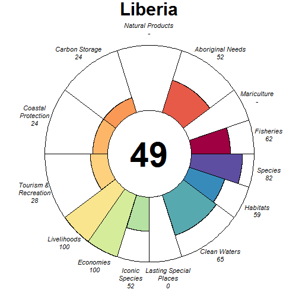

### Scores

|                                |  score| status| future| trend| pressures| resilience|
|:-------------------------------|------:|------:|------:|-----:|---------:|----------:|
|Index                           |  50.21|     NA|  47.40|    NA|        NA|         NA|
|Food Provision                  |  62.38|  60.00|  64.77| -0.02|        NA|         NA|
|. Fisheries                     |  62.38|  60.00|  64.77| -0.02|     26.88|      55.03|
|. Mariculture                   |     NA|     NA|     NA|    NA|     30.08|      63.54|
|Aboriginal Needs                |  52.20|  50.00|  54.40|  0.00|     27.05|      53.73|
|Natural Products                |     NA|     NA|     NA|    NA|     26.12|      59.17|
|Carbon Storage                  |  23.89|  34.97|  12.81| -1.00|     31.05|      42.05|
|Coastal Protection              |  23.79|  34.97|  12.61| -1.00|     32.82|      42.05|
|Tourism & Recreation            |  27.59|  26.91|  28.28|  0.00|     59.44|      75.00|
|Coastal Livelihoods & Economies | 100.00| 100.00| 100.00|  0.53|        NA|         NA|
|. Livelihoods                   | 100.00| 100.00| 100.00|  1.00|     26.33|      37.53|
|. Economies                     | 100.00| 100.00| 100.00|  0.07|     26.34|      47.58|
|Sense of Place                  |  26.25|  30.00|  22.50| -0.25|        NA|         NA|
|. Iconic Species                |  52.50|  60.00|  45.00| -0.50|     34.64|      60.39|
|. Lasting Special Places        |   0.00|   0.00|   0.00|  0.00|     39.67|      67.05|
|Clean Waters                    |  65.26|  64.52|  65.99|  0.03|     75.00|      75.00|
|Biodiversity                    |  70.53|  75.81|  65.25| -0.36|        NA|         NA|
|. Habitats                      |  59.34|  67.19|  51.49| -0.51|     28.38|      60.17|
|. Species                       |  81.73|  84.44|  79.02| -0.21|     32.12|      55.69|

## Libya (67)

### Flower

### Scores

|                                |  score| status| future| trend| pressures| resilience|
|:-------------------------------|------:|------:|------:|-----:|---------:|----------:|
|Index                           |  47.97|     NA|  46.01|    NA|        NA|         NA|
|Food Provision                  |  68.26|  65.28|  71.24|  0.02|        NA|         NA|
|. Fisheries                     |  70.06|  67.00|  73.11|  0.02|     28.86|      52.44|
|. Mariculture                   |   0.19|   0.18|   0.19|  0.00|     30.61|      50.00|
|Aboriginal Needs                |  52.15|  50.00|  54.31|  0.00|     26.63|      52.74|
|Natural Products                |   5.07|   4.80|   5.34|  0.02|     28.14|      58.82|
|Carbon Storage                  |     NA|     NA|     NA|    NA|        NA|         NA|
|Coastal Protection              |     NA|     NA|     NA|    NA|        NA|         NA|
|Tourism & Recreation            |   8.98|   9.09|   8.86|  0.00|     57.33|      50.00|
|Coastal Livelihoods & Economies |  68.83|  78.41|  59.24| -0.51|        NA|         NA|
|. Livelihoods                   |  37.65|  56.82|  18.49| -1.00|     32.97|      31.56|
|. Economies                     | 100.00| 100.00| 100.00| -0.02|     31.00|      47.33|
|Sense of Place                  |  24.69|  28.33|  21.05| -0.25|        NA|         NA|
|. Iconic Species                |  49.38|  56.67|  42.09| -0.50|     32.84|      56.42|
|. Lasting Special Places        |   0.00|   0.00|   0.00|  0.00|     36.14|      50.00|
|Clean Waters                    |  66.59|  72.35|  60.82| -0.11|     75.00|      50.00|
|Biodiversity                    |  89.23|  91.24|  87.21| -0.11|        NA|         NA|
|. Habitats                      | 100.00| 100.00| 100.00|  0.00|     27.62|      55.04|
|. Species                       |  78.46|  82.49|  74.43| -0.22|     33.11|      47.73|

## Line Group (148)

### Flower

### Scores

|                                |  score| status| future| trend| pressures| resilience|
|:-------------------------------|------:|------:|------:|-----:|---------:|----------:|
|Index                           |  61.95|     NA|  61.07|    NA|        NA|         NA|
|Food Provision                  |     NA|     NA|     NA|    NA|        NA|         NA|
|. Fisheries                     |     NA|     NA|     NA|    NA|     25.46|      53.53|
|. Mariculture                   |     NA|     NA|     NA|    NA|     25.53|      47.21|
|Aboriginal Needs                |  52.46|  50.00|  54.93|  0.00|     25.67|      55.54|
|Natural Products                |     NA|     NA|     NA|    NA|        NA|         NA|
|Carbon Storage                  |     NA|     NA|     NA|    NA|        NA|         NA|
|Coastal Protection              | 100.00| 100.00| 100.00|    NA|     38.47|      41.28|
|Tourism & Recreation            |  69.51|  69.98|  69.05|  0.01|     55.36|      49.42|
|Coastal Livelihoods & Economies |  71.37|  76.78|  65.97| -0.30|        NA|         NA|
|. Livelihoods                   |  77.44|  84.02|  70.87| -0.37|     33.09|      60.03|
|. Economies                     |  65.30|  69.53|  61.07| -0.23|     30.60|      40.17|
|Sense of Place                  |   0.00|   0.00|   0.00|  0.00|        NA|         NA|
|. Iconic Species                |     NA|     NA|     NA|    NA|     31.33|      54.25|
|. Lasting Special Places        |   0.00|   0.00|   0.00|  0.00|     38.26|      49.42|
|Clean Waters                    |  54.20|  56.27|  52.13|  0.02|     75.00|      49.42|
|Biodiversity                    |  86.11|  86.78|  85.44| -0.14|        NA|         NA|
|. Habitats                      |  95.81|  91.91|  99.71| -0.01|     27.99|      55.58|
|. Species                       |  76.41|  81.66|  71.17| -0.26|     30.78|      44.92|

## Lithuania (189)

### Flower

### Scores

|                                |  score| status| future| trend| pressures| resilience|
|:-------------------------------|------:|------:|------:|-----:|---------:|----------:|
|Index                           |  70.35|     NA|  72.19|    NA|        NA|         NA|
|Food Provision                  |  90.60|  83.00|  98.20|  0.09|        NA|         NA|
|. Fisheries                     |  90.60|  83.00|  98.20|  0.09|     31.48|      68.72|
|. Mariculture                   |     NA|     NA|     NA|    NA|     41.34|      67.71|
|Aboriginal Needs                |  53.28|  50.00|  56.55|  0.00|     30.48|      70.20|
|Natural Products                |  66.53|  62.29|  70.77| -0.02|     27.69|      72.30|
|Carbon Storage                  |     NA|     NA|     NA|    NA|        NA|         NA|
|Coastal Protection              |  71.82|  72.45|  71.19| -0.04|     48.07|      50.00|
|Tourism & Recreation            |  20.74|  20.23|  21.24|  0.00|     59.62|      75.00|
|Coastal Livelihoods & Economies |  77.07|  76.21|  77.92|  0.01|        NA|         NA|
|. Livelihoods                   |  54.13|  52.42|  55.85|  0.00|     33.05|      52.90|
|. Economies                     | 100.00| 100.00| 100.00|  0.01|     37.52|      53.42|
|Sense of Place                  | 100.00| 100.00| 100.00|  1.00|        NA|         NA|
|. Iconic Species                |     NA|     NA|     NA|    NA|     39.07|      69.91|
|. Lasting Special Places        | 100.00| 100.00| 100.00|  1.00|     46.94|      72.73|
|Clean Waters                    |  62.91|  65.19|  60.64| -0.10|     75.00|      75.00|
|Biodiversity                    |  90.25|  87.30|  93.19| -0.07|        NA|         NA|
|. Habitats                      |  89.70|  85.42|  93.98| -0.04|     30.79|      68.47|
|. Species                       |  90.79|  89.19|  92.40| -0.10|     35.95|      67.73|

## Macquarie Island (4)

### Flower

### Scores

|                                |  score| status| future| trend| pressures| resilience|
|:-------------------------------|------:|------:|------:|-----:|---------:|----------:|
|Index                           |  76.86|     NA|  79.55|    NA|        NA|         NA|
|Food Provision                  |  57.02|  51.00|  63.04|  0.14|        NA|         NA|
|. Fisheries                     |  57.02|  51.00|  63.04|  0.14|     25.22|      68.33|
|. Mariculture                   |     NA|     NA|     NA|    NA|     27.09|      74.61|
|Aboriginal Needs                |  53.59|  50.00|  57.17|  0.00|     25.31|      68.78|
|Natural Products                |     NA|     NA|     NA|    NA|        NA|         NA|
|Carbon Storage                  |     NA|     NA|     NA|    NA|        NA|         NA|
|Coastal Protection              |     NA|     NA|     NA|    NA|        NA|         NA|
|Tourism & Recreation            |     NA|     NA|     NA|    NA|     45.84|      75.00|
|Coastal Livelihoods & Economies |     NA|     NA|     NA|    NA|        NA|         NA|
|. Livelihoods                   |     NA|     NA|     NA|    NA|        NA|      49.48|
|. Economies                     |     NA|     NA|     NA|    NA|        NA|      59.21|
|Sense of Place                  | 100.00| 100.00| 100.00|  0.00|        NA|         NA|
|. Iconic Species                |     NA|     NA|     NA|    NA|     29.28|      68.98|
|. Lasting Special Places        | 100.00| 100.00| 100.00|  0.00|     36.22|      75.00|
|Clean Waters                    |  82.54|  79.35|  85.74|  0.00|     50.59|      75.00|
|Biodiversity                    |  91.16|  90.52|  91.81| -0.07|        NA|         NA|
|. Habitats                      | 100.00| 100.00| 100.00|  0.00|     25.09|      67.86|
|. Species                       |  82.33|  81.04|  83.62| -0.15|     29.93|      70.21|

## Madagascar (42)

### Flower

### Scores

|                                |  score| status| future| trend| pressures| resilience|
|:-------------------------------|------:|------:|------:|-----:|---------:|----------:|
|Index                           |  57.26|     NA|  56.41|    NA|        NA|         NA|
|Food Provision                  |  45.31|  44.23|  46.38| -0.08|        NA|         NA|
|. Fisheries                     |  47.12|  46.00|  48.24| -0.08|     29.19|      60.18|
|. Mariculture                   |   1.17|   1.12|   1.21| -0.01|     28.28|      55.42|
|Aboriginal Needs                |  52.87|  50.00|  55.74|  0.00|     26.57|      61.38|
|Natural Products                |  92.52|  85.04| 100.00|  0.18|     29.98|      70.94|
|Carbon Storage                  |  67.40|  87.30|  47.51| -0.82|     33.97|      62.23|
|Coastal Protection              |  40.84|  41.00|  40.67| -0.12|     40.80|      62.23|
|Tourism & Recreation            |  12.49|  12.21|  12.76|  0.00|     61.38|      75.00|
|Coastal Livelihoods & Economies |  81.92|  80.93|  82.90|  0.03|        NA|         NA|
|. Livelihoods                   |  63.83|  61.86|  65.81|  0.00|     30.98|      50.35|
|. Economies                     | 100.00| 100.00| 100.00|  0.05|     31.87|      44.83|
|Sense of Place                  |  46.29|  42.63|  49.95|  0.34|        NA|         NA|
|. Iconic Species                |  54.50|  57.78|  51.23| -0.32|     33.60|      63.85|
|. Lasting Special Places        |  38.07|  27.48|  48.67|  1.00|     42.02|      72.73|
|Clean Waters                    |  50.54|  51.48|  49.60| -0.05|     75.00|      75.00|
|Biodiversity                    |  82.46|  86.36|  78.57| -0.28|        NA|         NA|
|. Habitats                      |  84.62|  87.99|  81.26| -0.27|     30.65|      62.99|
|. Species                       |  80.30|  84.73|  75.88| -0.28|     34.37|      60.44|

## Madeira (57)

### Flower

### Scores

|                                | score| status| future| trend| pressures| resilience|
|:-------------------------------|-----:|------:|------:|-----:|---------:|----------:|
|Index                           | 66.54|     NA|  68.06|    NA|        NA|         NA|
|Food Provision                  | 62.72|  59.00|  66.43|  0.00|        NA|         NA|
|. Fisheries                     | 62.72|  59.00|  66.43|  0.00|     27.21|      65.39|
|. Mariculture                   |    NA|     NA|     NA|    NA|     29.12|      64.52|
|Aboriginal Needs                | 53.20|  50.00|  56.40|  0.00|     27.15|      65.92|
|Natural Products                |    NA|     NA|     NA|    NA|        NA|         NA|
|Carbon Storage                  |    NA|     NA|     NA|    NA|        NA|         NA|
|Coastal Protection              |    NA|     NA|     NA|    NA|        NA|         NA|
|Tourism & Recreation            | 73.91|  71.91|  75.91|  0.00|     58.08|      75.00|
|Coastal Livelihoods & Economies | 81.23|  83.63|  78.83| -0.15|        NA|         NA|
|. Livelihoods                   | 68.48|  77.48|  59.48| -0.35|     32.53|      32.42|
|. Economies                     | 93.98|  89.77|  98.19|  0.05|     31.10|      48.50|
|Sense of Place                  | 47.57|  45.14|  50.00|  1.00|        NA|         NA|
|. Iconic Species                |  0.00|   0.00|   0.00|    NA|     34.91|      66.90|
|. Lasting Special Places        | 95.14|  90.28| 100.00|  1.00|     44.42|      71.59|
|Clean Waters                    | 60.70|  60.88|  60.52| -0.01|     75.00|      75.00|
|Biodiversity                    | 86.48|  84.67|  88.30| -0.10|        NA|         NA|
|. Habitats                      | 94.86|  89.72| 100.00|  0.03|     28.82|      66.45|
|. Species                       | 78.10|  79.61|  76.59| -0.22|     34.97|      68.29|

## Malaysia (206)

### Flower

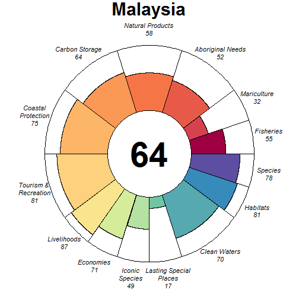

### Scores

|                                | score| status| future| trend| pressures| resilience|
|:-------------------------------|-----:|------:|------:|-----:|---------:|----------:|
|Index                           | 64.43|     NA|  63.34|    NA|        NA|         NA|
|Food Provision                  | 52.05|  47.23|  56.87|  0.21|        NA|         NA|
|. Fisheries                     | 55.22|  50.00|  60.44|  0.22|     40.91|      59.53|
|. Mariculture                   | 32.01|  29.73|  34.30|  0.12|     37.29|      59.46|
|Aboriginal Needs                | 51.87|  50.00|  53.73|  0.00|     36.85|      59.47|
|Natural Products                | 57.72|  54.31|  61.13|  0.01|     29.19|      64.83|
|Carbon Storage                  | 64.48|  83.97|  44.99| -0.83|     32.27|      59.09|
|Coastal Protection              | 75.47|  80.20|  70.75| -0.26|     41.43|      59.09|
|Tourism & Recreation            | 80.90|  79.10|  82.71|  0.00|     61.26|      75.00|
|Coastal Livelihoods & Economies | 79.19|  71.77|  86.61|  0.48|        NA|         NA|
|. Livelihoods                   | 87.24|  74.49| 100.00|  1.00|     35.74|      56.15|
|. Economies                     | 71.13|  69.05|  73.21| -0.03|     34.00|      58.83|
|Sense of Place                  | 33.34|  34.63|  32.06| -0.15|        NA|         NA|
|. Iconic Species                | 49.42|  52.73|  46.11| -0.30|     40.61|      63.47|
|. Lasting Special Places        | 17.27|  16.53|  18.01|  0.00|     46.81|      73.86|
|Clean Waters                    | 70.01|  66.31|  73.71|  0.17|     75.00|      75.00|
|Biodiversity                    | 79.22|  87.57|  70.87| -0.40|        NA|         NA|
|. Habitats                      | 80.70|  89.72|  71.68| -0.44|     35.25|      64.49|
|. Species                       | 77.74|  85.41|  70.06| -0.36|     43.31|      62.79|

## Maldives (39)

### Flower

### Scores

|                                |  score| status| future| trend| pressures| resilience|
|:-------------------------------|------:|------:|------:|-----:|---------:|----------:|
|Index                           |  69.96|     NA|  68.06|    NA|        NA|         NA|
|Food Provision                  |  91.24|  87.00|  95.49|  0.01|        NA|         NA|
|. Fisheries                     |  91.24|  87.00|  95.49|  0.01|     26.52|      54.05|
|. Mariculture                   |     NA|     NA|     NA|    NA|     26.70|      50.00|
|Aboriginal Needs                |  52.31|  50.00|  54.61|  0.00|     26.34|      54.30|
|Natural Products                |  68.93|  65.95|  71.91|  0.00|     26.56|      53.90|
|Carbon Storage                  |  70.22|  85.51|  54.93| -0.58|     32.45|      41.67|
|Coastal Protection              |  63.47|  62.62|  64.32|  0.03|     38.68|      41.67|
|Tourism & Recreation            |  97.02| 100.00|  94.04| -0.07|     53.14|      50.00|
|Coastal Livelihoods & Economies |  70.64|  73.52|  67.76|  0.04|        NA|         NA|
|. Livelihoods                   | 100.00| 100.00| 100.00|  0.54|     30.20|      49.00|
|. Economies                     |  41.29|  47.05|  35.53| -0.47|     29.19|      49.83|
|Sense of Place                  |  28.31|  30.00|  26.62| -0.14|        NA|         NA|
|. Iconic Species                |  56.62|  60.00|  53.25| -0.28|     31.40|      53.69|
|. Lasting Special Places        |   0.00|   0.00|   0.00|  0.00|     39.43|      50.00|
|Clean Waters                    |  70.90|  73.80|  67.99| -0.04|     65.82|      50.00|
|Biodiversity                    |  86.56|  90.21|  82.92| -0.22|        NA|         NA|
|. Habitats                      |  92.00|  93.51|  90.49| -0.18|     28.96|      56.64|
|. Species                       |  81.13|  86.91|  75.34| -0.25|     32.15|      42.62|

## Malta (68)

### Flower

### Scores

|                                |  score| status| future| trend| pressures| resilience|
|:-------------------------------|------:|------:|------:|-----:|---------:|----------:|
|Index                           |  75.84|     NA|  75.59|    NA|        NA|         NA|
|Food Provision                  |  64.73|  60.78|  68.68|  0.03|        NA|         NA|
|. Fisheries                     |  77.74|  73.00|  82.47|  0.03|     31.12|      64.35|
|. Mariculture                   |  16.04|  15.04|  17.05|  0.01|     29.26|      67.71|
|Aboriginal Needs                |  53.07|  50.00|  56.13|  0.00|     28.53|      65.70|
|Natural Products                |     NA|     NA|     NA|    NA|        NA|         NA|
|Carbon Storage                  |  87.12|  82.45|  91.79|    NA|     36.13|      70.45|
|Coastal Protection              |  86.92|  82.45|  91.39|    NA|     37.60|      70.45|
|Tourism & Recreation            | 100.00| 100.00| 100.00|  0.00|     55.75|      75.00|
|Coastal Livelihoods & Economies |  87.25|  98.97|  75.53| -0.36|        NA|         NA|
|. Livelihoods                   |  74.50|  97.94|  51.07| -0.75|     33.44|      40.74|
|. Economies                     | 100.00| 100.00| 100.00|  0.03|     32.99|      53.42|
|Sense of Place                  |  62.81|  62.74|  62.87| -0.17|        NA|         NA|
|. Iconic Species                |  46.92|  53.33|  40.51| -0.50|     37.54|      66.19|
|. Lasting Special Places        |  78.69|  72.15|  85.23|  0.16|     46.04|      68.18|
|Clean Waters                    |  56.71|  63.45|  49.98| -0.32|     75.00|      75.00|
|Biodiversity                    |  83.96|  84.00|  83.92| -0.15|        NA|         NA|
|. Habitats                      |  90.58|  88.52|  92.64| -0.09|     31.44|      64.05|
|. Species                       |  77.33|  79.47|  75.20| -0.21|     37.54|      64.16|

## Marshall Islands (11)

### Flower

### Scores

|                                | score| status| future| trend| pressures| resilience|
|:-------------------------------|-----:|------:|------:|-----:|---------:|----------:|
|Index                           | 72.81|     NA|  72.48|    NA|        NA|         NA|
|Food Provision                  | 97.00|  94.00| 100.00|  0.01|        NA|         NA|
|. Fisheries                     | 97.00|  94.00| 100.00|  0.01|     25.58|      55.61|
|. Mariculture                   |    NA|     NA|     NA|    NA|     27.96|      50.00|
|Aboriginal Needs                | 52.55|  50.00|  55.09|  0.00|     25.62|      56.49|
|Natural Products                | 94.51|  89.02| 100.00|  0.25|     28.00|      55.50|
|Carbon Storage                  | 86.98|  85.51|  88.45|    NA|     34.63|      45.05|
|Coastal Protection              | 80.52|  80.10|  80.94|    NA|     41.89|      45.05|
|Tourism & Recreation            | 68.67|  69.98|  67.35|  0.01|     63.29|      50.00|
|Coastal Livelihoods & Economies | 58.70|  70.58|  46.82| -0.67|        NA|         NA|
|. Livelihoods                   | 76.55|  84.02|  69.09| -0.37|     25.60|      46.12|
|. Economies                     | 40.86|  57.15|  24.56| -0.98|     25.81|      52.38|
|Sense of Place                  | 31.92|  33.00|  30.84| -0.11|        NA|         NA|
|. Iconic Species                | 63.84|  66.00|  61.69| -0.21|     30.84|      54.54|
|. Lasting Special Places        |  0.00|   0.00|   0.00|  0.00|     38.68|      50.00|
|Clean Waters                    | 68.65|  69.91|  67.39|  0.07|     75.00|      50.00|
|Biodiversity                    | 88.61|  89.27|  87.96| -0.11|        NA|         NA|
|. Habitats                      | 96.99|  93.97| 100.00|  0.00|     30.91|      57.13|
|. Species                       | 80.24|  84.56|  75.91| -0.22|     30.95|      44.53|

## Mauritania (64)

### Flower

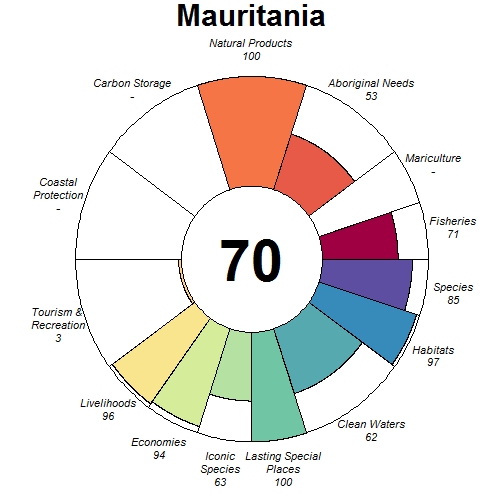

### Scores

|                                |  score| status| future| trend| pressures| resilience|
|:-------------------------------|------:|------:|------:|-----:|---------:|----------:|
|Index                           |  69.68|     NA|  70.94|    NA|        NA|         NA|
|Food Provision                  |  71.48|  68.00|  74.97| -0.04|        NA|         NA|
|. Fisheries                     |  71.48|  68.00|  74.97| -0.04|     29.14|      68.31|
|. Mariculture                   |     NA|     NA|     NA|    NA|     27.84|      57.29|
|Aboriginal Needs                |  53.41|  50.00|  56.83|  0.00|     28.02|      69.40|
|Natural Products                | 100.00| 100.00| 100.00|  1.00|     27.45|      69.04|
|Carbon Storage                  |     NA|     NA|     NA|    NA|        NA|         NA|
|Coastal Protection              |     NA|     NA|     NA|    NA|        NA|         NA|
|Tourism & Recreation            |   2.71|   2.69|   2.73|  0.00|     57.81|      62.50|
|Coastal Livelihoods & Economies |  95.14|  92.43|  97.85|  0.29|        NA|         NA|
|. Livelihoods                   |  96.41|  92.82| 100.00|  0.60|     27.23|      40.91|
|. Economies                     |  93.88|  92.05|  95.71| -0.02|     27.23|      44.33|
|Sense of Place                  |  81.36|  82.14|  80.57| -0.12|        NA|         NA|
|. Iconic Species                |  62.72|  64.29|  61.14| -0.25|     32.37|      68.32|
|. Lasting Special Places        | 100.00| 100.00| 100.00|  0.00|     36.39|      68.75|
|Clean Waters                    |  62.32|  62.19|  62.45|  0.07|     75.00|      62.50|
|Biodiversity                    |  91.01|  89.93|  92.08| -0.08|        NA|         NA|
|. Habitats                      |  97.02|  94.04| 100.00|  0.02|     28.95|      65.79|
|. Species                       |  84.99|  85.82|  84.16| -0.18|     33.76|      63.95|

## Mauritius (37)

### Flower

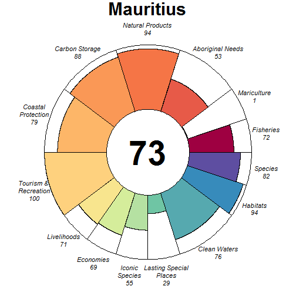

### Scores

|                                |  score| status| future| trend| pressures| resilience|
|:-------------------------------|------:|------:|------:|-----:|---------:|----------:|
|Index                           |  76.05|     NA|  78.95|    NA|        NA|         NA|
|Food Provision                  |  70.19|  66.59|  73.78|  0.00|        NA|         NA|
|. Fisheries                     |  71.67|  68.00|  75.34|  0.00|     26.26|      58.97|
|. Mariculture                   |   0.95|   0.89|   1.01|  0.00|     31.02|      70.83|
|Aboriginal Needs                |  52.73|  50.00|  55.47|  0.00|     26.70|      59.85|
|Natural Products                |  93.88|  87.75| 100.00|  1.00|     26.31|      64.02|
|Carbon Storage                  |  88.50|  85.51|  91.50|    NA|     38.44|      59.65|
|Coastal Protection              |  79.02|  77.22|  80.81| -0.01|     42.61|      59.65|
|Tourism & Recreation            | 100.00| 100.00| 100.00| -0.01|     60.75|      75.00|
|Coastal Livelihoods & Economies |  70.25|  64.52|  75.97|  0.20|        NA|         NA|
|. Livelihoods                   |  71.43|  59.61|  83.25|  0.52|     30.41|      45.46|
|. Economies                     |  69.06|  69.44|  68.69| -0.13|     30.34|      52.92|
|Sense of Place                  |  41.62|  41.71|  41.53| -0.11|        NA|         NA|
|. Iconic Species                |  54.54|  56.00|  53.08| -0.21|     35.41|      63.12|
|. Lasting Special Places        |  28.70|  27.41|  29.98|  0.00|     44.35|      72.73|
|Clean Waters                    |  76.02|  70.19|  81.86|  0.25|     75.00|      75.00|
|Biodiversity                    |  88.31|  88.04|  88.58| -0.13|        NA|         NA|
|. Habitats                      |  94.44|  90.36|  98.51| -0.01|     33.87|      62.68|
|. Species                       |  82.19|  85.72|  78.65| -0.26|     32.32|      59.45|

## Mayotte (29)

### Flower

### Scores

|                                |  score| status| future| trend| pressures| resilience|
|:-------------------------------|------:|------:|------:|-----:|---------:|----------:|
|Index                           |  64.06|     NA|  65.30|    NA|        NA|         NA|
|Food Provision                  |  78.91|  75.36|  82.46| -0.05|        NA|         NA|
|. Fisheries                     |  80.63|  77.00|  84.26| -0.05|     27.61|      66.32|
|. Mariculture                   |   1.02|   0.97|   1.08| -0.01|     27.25|      63.52|
|Aboriginal Needs                |  53.35|  50.00|  56.71|  0.00|     26.96|      67.61|
|Natural Products                |   0.00|   0.00|   0.00| -1.00|     25.50|      68.55|
|Carbon Storage                  |  90.60|  85.59|  95.62|  0.00|     34.93|      70.43|
|Coastal Protection              |  34.57|  31.94|  37.20|  0.09|     38.94|      70.43|
|Tourism & Recreation            |  51.94|  51.09|  52.78|  0.00|     59.87|      70.13|
|Coastal Livelihoods & Economies | 100.00| 100.00| 100.00|  0.19|        NA|         NA|
|. Livelihoods                   | 100.00| 100.00| 100.00|  0.38|     31.15|      35.55|
|. Economies                     | 100.00| 100.00| 100.00|  0.00|     31.15|      47.71|
|Sense of Place                  |  73.11|  76.00|  70.21|  0.25|        NA|         NA|
|. Iconic Species                |  46.21|  52.00|  40.43| -0.50|     33.59|      67.67|
|. Lasting Special Places        | 100.00| 100.00| 100.00|  1.00|     42.26|      68.14|
|Clean Waters                    |  69.03|  68.68|  69.38|  0.04|     75.00|      70.13|
|Biodiversity                    |  89.09|  89.58|  88.60| -0.14|        NA|         NA|
|. Habitats                      |  96.39|  92.77| 100.00|  0.03|     29.91|      65.09|
|. Species                       |  81.80|  86.39|  77.20| -0.31|     33.42|      63.42|

## Mexico (135)

### Flower

### Scores

|                                |  score| status| future| trend| pressures| resilience|
|:-------------------------------|------:|------:|------:|-----:|---------:|----------:|
|Index                           |  66.03|     NA|  64.02|    NA|        NA|         NA|
|Food Provision                  |  49.26|  46.51|  52.01|  0.00|        NA|         NA|
|. Fisheries                     |  53.00|  50.00|  56.01|  0.00|     30.28|      66.69|
|. Mariculture                   |  18.89|  18.20|  19.59| -0.01|     30.14|      55.31|
|Aboriginal Needs                |  53.45|  50.00|  56.90|  0.00|     27.73|      69.53|
|Natural Products                |  94.45|  88.89| 100.00|  0.17|     27.08|      69.74|
|Carbon Storage                  |  64.16|  87.98|  40.35| -1.00|     31.12|      70.08|
|Coastal Protection              |  34.91|  36.50|  33.32| -0.31|     33.09|      70.08|
|Tourism & Recreation            |  70.71|  69.96|  71.45| -0.01|     55.00|      62.50|
|Coastal Livelihoods & Economies |  72.80|  73.48|  72.13| -0.07|        NA|         NA|
|. Livelihoods                   |  45.61|  46.96|  44.25| -0.17|     30.14|      47.10|
|. Economies                     | 100.00| 100.00| 100.00|  0.04|     31.51|      53.00|
|Sense of Place                  |  77.03|  77.89|  76.17|  0.38|        NA|         NA|
|. Iconic Species                |  54.06|  55.79|  52.34| -0.25|     35.00|      67.00|
|. Lasting Special Places        | 100.00| 100.00| 100.00|  1.00|     42.65|      67.61|
|Clean Waters                    |  61.11|  61.57|  60.66|  0.04|     75.00|      62.50|
|Biodiversity                    |  82.45|  87.72|  77.18| -0.34|        NA|         NA|
|. Habitats                      |  82.71|  92.51|  72.90| -0.49|     30.87|      66.41|
|. Species                       |  82.19|  82.92|  81.45| -0.19|     34.89|      67.32|

## Micronesia (9)

### Flower

### Scores

|                                | score| status| future| trend| pressures| resilience|
|:-------------------------------|-----:|------:|------:|-----:|---------:|----------:|
|Index                           | 64.10|     NA|  63.95|    NA|        NA|         NA|
|Food Provision                  | 70.89|  68.00|  73.78| -0.01|        NA|         NA|
|. Fisheries                     | 70.89|  68.00|  73.78| -0.01|     25.94|      53.73|
|. Mariculture                   |  0.00|   0.00|   0.00|  0.00|     28.97|      50.00|
|Aboriginal Needs                | 52.34|  50.00|  54.67|  0.00|     25.93|      54.26|
|Natural Products                | 41.73|  40.41|  43.06|  0.02|     37.21|      53.59|
|Carbon Storage                  | 93.18|  86.36| 100.00|  0.94|     35.86|      41.67|
|Coastal Protection              | 73.39|  71.85|  74.93|  0.07|     41.93|      41.67|
|Tourism & Recreation            | 68.32|  69.98|  66.66|  0.01|     66.25|      50.00|
|Coastal Livelihoods & Economies | 61.26|  68.40|  54.11| -0.39|        NA|         NA|
|. Livelihoods                   | 74.86|  84.02|  65.70| -0.37|     26.60|      34.92|
|. Economies                     | 47.65|  52.79|  42.52| -0.42|     26.41|      52.38|
|Sense of Place                  | 24.16|  27.78|  20.53| -0.25|        NA|         NA|
|. Iconic Species                | 48.31|  55.56|  41.07| -0.50|     30.90|      53.38|
|. Lasting Special Places        |  0.00|   0.00|   0.00|  0.00|     39.19|      50.00|
|Clean Waters                    | 66.66|  69.10|  64.21|  0.02|     75.00|      50.00|
|Biodiversity                    | 89.05|  90.58|  87.52|  0.00|        NA|         NA|
|. Habitats                      | 97.74|  95.48| 100.00|  0.24|     30.16|      56.32|
|. Species                       | 80.35|  85.67|  75.03| -0.24|     31.26|      42.61|

## Monaco (185)

### Flower

### Scores

|                                | score| status| future| trend| pressures| resilience|
|:-------------------------------|-----:|------:|------:|-----:|---------:|----------:|
|Index                           | 67.30|     NA|  68.11|    NA|        NA|         NA|
|Food Provision                  | 77.31|  72.00|  82.62|  0.09|        NA|         NA|
|. Fisheries                     | 77.31|  72.00|  82.62|  0.09|     31.92|      58.35|
|. Mariculture                   |    NA|     NA|     NA|    NA|     35.41|      50.00|
|Aboriginal Needs                | 52.17|  50.00|  54.34|  0.00|     30.97|      57.27|
|Natural Products                |    NA|     NA|     NA|    NA|        NA|         NA|
|Carbon Storage                  |    NA|     NA|     NA|    NA|        NA|         NA|
|Coastal Protection              |    NA|     NA|     NA|    NA|        NA|         NA|
|Tourism & Recreation            | 42.74|  43.30|  42.18|  0.00|     57.43|      50.00|
|Coastal Livelihoods & Economies | 84.01|  88.87|  79.15| -0.21|        NA|         NA|
|. Livelihoods                   | 69.40|  80.51|  58.29| -0.47|     33.42|      44.49|
|. Economies                     | 98.62|  97.23| 100.00|  0.04|     31.96|      61.04|
|Sense of Place                  | 62.42|  53.33|  71.51|  1.00|        NA|         NA|
|. Iconic Species                | 41.51|  40.00|  43.03|    NA|     37.70|      60.64|
|. Lasting Special Places        | 83.33|  66.67| 100.00|  1.00|     42.68|      50.00|
|Clean Waters                    | 69.10|  72.01|  66.20|  0.00|     75.00|      50.00|
|Biodiversity                    | 83.34|  85.91|  80.77| -0.16|        NA|         NA|
|. Habitats                      |    NA|     NA|     NA|    NA|        NA|         NA|
|. Species                       | 83.34|  85.91|  80.77| -0.16|     37.39|      52.22|

## Montenegro (186)

### Flower

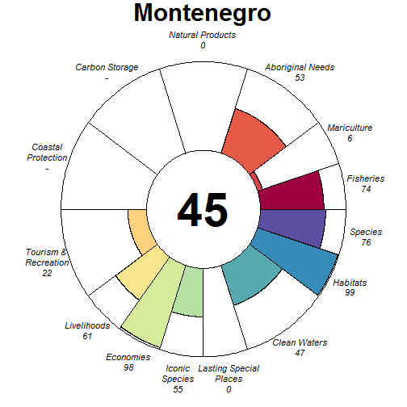

### Scores

|                                | score| status| future| trend| pressures| resilience|
|:-------------------------------|-----:|------:|------:|-----:|---------:|----------:|
|Index                           | 48.54|     NA|  46.11|    NA|        NA|         NA|
|Food Provision                  | 71.80|  66.65|  76.95|  0.06|        NA|         NA|
|. Fisheries                     | 74.34|  69.00|  79.68|  0.06|     31.29|      66.02|
|. Mariculture                   |  5.97|   5.80|   6.15|  0.02|     31.50|      45.50|
|Aboriginal Needs                | 53.14|  50.00|  56.29|  0.00|     28.22|      66.32|
|Natural Products                |  0.00|   0.00|   0.00| -0.14|     36.29|      48.61|
|Carbon Storage                  |    NA|     NA|     NA|    NA|        NA|         NA|
|Coastal Protection              |    NA|     NA|     NA|    NA|        NA|         NA|
|Tourism & Recreation            | 22.00|  22.36|  21.63|  0.00|     58.72|      48.91|
|Coastal Livelihoods & Economies | 79.09|  92.84|  65.34| -0.50|        NA|         NA|
|. Livelihoods                   | 60.61|  90.54|  30.68| -1.00|     34.69|      37.39|
|. Economies                     | 97.58|  95.15| 100.00|  0.00|     32.88|      51.17|
|Sense of Place                  | 27.40|  32.00|  22.81| -0.25|        NA|         NA|
|. Iconic Species                | 54.81|  64.00|  45.62| -0.50|     37.02|      51.49|
|. Lasting Special Places        |  0.00|   0.00|   0.00|  0.00|     46.71|      43.32|
|Clean Waters                    | 47.37|  54.29|  40.46| -0.25|     75.00|      48.91|
|Biodiversity                    | 87.53|  89.66|  85.39| -0.10|        NA|         NA|
|. Habitats                      | 98.64|  97.29| 100.00| -0.02|     29.26|      51.48|
|. Species                       | 76.41|  82.04|  70.78| -0.19|     37.90|      34.56|

## Montserrat (121)

### Flower

### Scores

|                                |  score| status| future| trend| pressures| resilience|
|:-------------------------------|------:|------:|------:|-----:|---------:|----------:|
|Index                           |  61.98|     NA|  54.44|    NA|        NA|         NA|
|Food Provision                  |   1.05|   1.00|   1.10|  0.00|        NA|         NA|
|. Fisheries                     |   1.05|   1.00|   1.10|  0.00|     29.62|      58.60|
|. Mariculture                   |     NA|     NA|     NA|    NA|     30.24|      63.13|
|Aboriginal Needs                |  52.43|  50.00|  54.86|  0.00|     28.47|      57.93|
|Natural Products                |     NA|     NA|     NA|    NA|        NA|         NA|
|Carbon Storage                  |  69.15| 100.00|  38.30| -1.00|     36.00|      52.06|
|Coastal Protection              |  68.59| 100.00|  37.18| -1.00|     39.40|      52.06|
|Tourism & Recreation            | 100.00| 100.00| 100.00|  0.00|     58.09|      66.40|
|Coastal Livelihoods & Economies |  89.13|  86.54|  91.72|  0.15|        NA|         NA|
|. Livelihoods                   |  96.37|  92.73| 100.00|  0.32|     33.57|      35.94|
|. Economies                     |  81.89|  80.34|  83.43| -0.02|     33.29|      49.46|
|Sense of Place                  |  28.09|  32.00|  24.17| -0.25|        NA|         NA|
|. Iconic Species                |  56.17|  64.00|  48.35| -0.50|     35.12|      62.53|
|. Lasting Special Places        |   0.00|   0.00|   0.00|  0.00|     40.97|      65.59|
|Clean Waters                    |  60.71|  61.06|  60.35|  0.02|     75.00|      66.40|
|Biodiversity                    |  88.69|  95.05|  82.32| -0.32|        NA|         NA|
|. Habitats                      |  88.38| 100.00|  76.76| -0.50|     30.83|      61.93|
|. Species                       |  88.99|  90.10|  87.88| -0.14|     35.42|      56.56|

## Morocco (62)

### Flower

### Scores

|                                |  score| status| future| trend| pressures| resilience|
|:-------------------------------|------:|------:|------:|-----:|---------:|----------:|
|Index                           |  73.89|     NA|  75.61|    NA|        NA|         NA|
|Food Provision                  |  80.10|  77.97|  82.22| -0.04|        NA|         NA|
|. Fisheries                     |  80.12|  78.00|  82.25| -0.04|     34.96|      59.59|
|. Mariculture                   |   0.10|   0.10|   0.11|  0.00|     34.38|      64.09|
|Aboriginal Needs                |  52.18|  50.00|  54.35|  0.00|     32.39|      58.77|
|Natural Products                |  71.14|  68.20|  74.08| -0.05|     29.52|      65.29|
|Carbon Storage                  |     NA|     NA|     NA|    NA|        NA|         NA|
|Coastal Protection              |     NA|     NA|     NA|    NA|        NA|         NA|
|Tourism & Recreation            |  82.43|  80.25|  84.61|  0.00|     57.89|      75.00|
|Coastal Livelihoods & Economies | 100.00| 100.00| 100.00|  0.17|        NA|         NA|
|. Livelihoods                   | 100.00| 100.00| 100.00|  0.28|     32.53|      53.99|
|. Economies                     | 100.00| 100.00| 100.00|  0.05|     31.22|      51.25|
|Sense of Place                  |  40.51|  40.98|  40.04| -0.12|        NA|         NA|
|. Iconic Species                |  56.52|  58.82|  54.22| -0.25|     36.01|      63.07|
|. Lasting Special Places        |  24.50|  23.13|  25.86|  0.00|     39.22|      75.00|
|Clean Waters                    |  80.06|  76.77|  83.35|  0.13|     75.00|      75.00|
|Biodiversity                    |  84.69|  83.21|  86.18| -0.09|        NA|         NA|
|. Habitats                      |  90.99|  86.22|  95.76|  0.02|     35.59|      64.23|
|. Species                       |  78.40|  80.19|  76.61| -0.20|     38.42|      64.62|

## Mozambique (41)

### Flower

### Scores

|                                |  score| status| future| trend| pressures| resilience|
|:-------------------------------|------:|------:|------:|-----:|---------:|----------:|
|Index                           |  66.78|     NA|  67.14|    NA|        NA|         NA|
|Food Provision                  |  75.93|  73.16|  78.70| -0.04|        NA|         NA|
|. Fisheries                     |  77.84|  75.00|  80.68| -0.04|     28.96|      60.02|
|. Mariculture                   |   0.17|   0.16|   0.18|  0.00|     29.81|      66.67|
|Aboriginal Needs                |  52.82|  50.00|  55.65|  0.00|     26.72|      60.96|
|Natural Products                |  56.80|  52.79|  60.81|  0.05|     29.22|      65.29|
|Carbon Storage                  |  97.30|  97.46|  97.14| -0.15|     31.24|      61.26|
|Coastal Protection              |  69.93|  71.49|  68.36| -0.18|     38.06|      61.26|
|Tourism & Recreation            |  25.61|  24.97|  26.25|  0.00|     59.50|      75.00|
|Coastal Livelihoods & Economies | 100.00| 100.00| 100.00|  0.53|        NA|         NA|
|. Livelihoods                   | 100.00| 100.00| 100.00|  1.00|     33.45|      28.81|
|. Economies                     | 100.00| 100.00| 100.00|  0.05|     31.76|      43.08|
|Sense of Place                  |  47.14|  47.69|  46.59| -0.15|        NA|         NA|
|. Iconic Species                |  55.99|  58.89|  53.08| -0.29|     34.53|      63.87|
|. Lasting Special Places        |  38.29|  36.50|  40.09|  0.00|     42.92|      72.73|
|Clean Waters                    |  54.42|  57.11|  51.73| -0.14|     75.00|      75.00|
|Biodiversity                    |  87.90|  89.61|  86.19| -0.19|        NA|         NA|
|. Habitats                      |  94.03|  93.02|  95.03| -0.12|     31.23|      61.88|
|. Species                       |  81.77|  86.20|  77.34| -0.27|     34.36|      57.81|

## Myanmar (205)

### Flower

### Scores

|                                |  score| status| future| trend| pressures| resilience|
|:-------------------------------|------:|------:|------:|-----:|---------:|----------:|
|Index                           |  55.79|     NA|  55.36|    NA|        NA|         NA|
|Food Provision                  |   2.27|   2.19|   2.35|  0.00|        NA|         NA|
|. Fisheries                     |   2.07|   2.00|   2.14|  0.00|     35.46|      56.84|
|. Mariculture                   |   7.92|   7.60|   8.25|  0.04|     28.52|      46.25|
|Aboriginal Needs                |  52.22|  50.00|  54.43|  0.00|     30.27|      57.13|
|Natural Products                |  87.48|  74.96| 100.00|  0.53|     27.70|      61.28|
|Carbon Storage                  |  79.15|  89.77|  68.53| -0.44|     30.72|      47.64|
|Coastal Protection              |  48.66|  51.83|  45.50| -0.24|     36.57|      47.64|
|Tourism & Recreation            |  10.25|  10.42|  10.08|  0.00|     59.53|      50.00|
|Coastal Livelihoods & Economies |  98.66|  97.31| 100.00|  0.46|        NA|         NA|
|. Livelihoods                   | 100.00| 100.00| 100.00|  0.94|     29.77|      42.54|
|. Economies                     |  97.31|  94.62| 100.00| -0.02|     31.65|      53.83|
|Sense of Place                  |  31.04|  32.55|  29.53| -0.15|        NA|         NA|
|. Iconic Species                |  51.71|  55.00|  48.42| -0.30|     34.97|      59.65|
|. Lasting Special Places        |  10.36|  10.10|  10.63|  0.00|     42.12|      57.95|
|Clean Waters                    |  61.56|  63.52|  59.59|  0.03|     75.00|      50.00|
|Biodiversity                    |  86.62|  89.64|  83.59| -0.20|        NA|         NA|
|. Habitats                      |  93.26|  93.21|  93.30| -0.13|     30.95|      57.93|
|. Species                       |  79.98|  86.08|  73.88| -0.27|     38.58|      50.84|

## Namibia (101)

### Flower

### Scores

|                                |  score| status| future| trend| pressures| resilience|
|:-------------------------------|------:|------:|------:|-----:|---------:|----------:|
|Index                           |  54.75|     NA|  54.78|    NA|        NA|         NA|
|Food Provision                  |  60.15|  54.95|  65.36|  0.09|        NA|         NA|
|. Fisheries                     |  60.21|  55.00|  65.41|  0.09|     27.25|      66.35|
|. Mariculture                   |  15.86|  14.88|  16.85|  0.06|     27.46|      55.31|
|Aboriginal Needs                |  53.23|  50.00|  56.45|  0.00|     26.54|      65.64|
|Natural Products                |  21.47|  22.03|  20.91| -0.28|     26.53|      67.78|
|Carbon Storage                  |     NA|     NA|     NA|    NA|        NA|         NA|
|Coastal Protection              |     NA|     NA|     NA|    NA|        NA|         NA|
|Tourism & Recreation            |  23.67|  23.06|  24.28|  0.00|     58.91|      75.00|
|Coastal Livelihoods & Economies |  75.51|  80.96|  70.06|  0.19|        NA|         NA|
|. Livelihoods                   | 100.00| 100.00| 100.00|  1.00|     33.63|      35.37|
|. Economies                     |  51.02|  61.92|  40.12| -0.61|     31.72|      49.00|
|Sense of Place                  |  78.83|  79.17|  78.49|  0.39|        NA|         NA|
|. Iconic Species                |  57.66|  58.33|  56.99| -0.21|     31.08|      67.59|
|. Lasting Special Places        | 100.00| 100.00| 100.00|  1.00|     38.74|      69.32|
|Clean Waters                    |  36.96|  40.03|  33.89| -0.23|     75.00|      75.00|
|Biodiversity                    |  88.18|  87.52|  88.84| -0.10|        NA|         NA|
|. Habitats                      |  97.38|  94.77| 100.00|  0.02|     27.30|      65.24|
|. Species                       |  78.98|  80.28|  77.67| -0.21|     32.60|      66.29|

## Nauru (10)

### Flower

### Scores

|                                | score| status| future| trend| pressures| resilience|
|:-------------------------------|-----:|------:|------:|-----:|---------:|----------:|
|Index                           | 72.45|     NA|  71.46|    NA|        NA|         NA|
|Food Provision                  | 97.50|  95.00| 100.00| -0.01|        NA|         NA|
|. Fisheries                     | 97.50|  95.00| 100.00| -0.01|     26.26|      53.30|
|. Mariculture                   |  0.00|   0.00|   0.00|  0.00|     27.34|      50.00|
|Aboriginal Needs                | 52.31|  50.00|  54.62|  0.00|     26.36|      54.38|
|Natural Products                |    NA|     NA|     NA|    NA|        NA|         NA|
|Carbon Storage                  |    NA|     NA|     NA|    NA|        NA|         NA|
|Coastal Protection              | 95.40|  96.41|  94.38|    NA|     48.04|      41.67|
|Tourism & Recreation            | 69.08|  69.98|  68.17|  0.01|     59.74|      50.00|
|Coastal Livelihoods & Economies | 72.77|  76.78|  68.76| -0.18|        NA|         NA|
|. Livelihoods                   | 74.77|  84.02|  65.52| -0.37|     30.34|      37.98|
|. Economies                     | 70.77|  69.53|  72.01|  0.00|     29.39|      40.17|
|Sense of Place                  | 32.70|  35.00|  30.40| -0.15|        NA|         NA|
|. Iconic Species                | 65.40|  70.00|  60.80| -0.30|     31.85|      52.92|
|. Lasting Special Places        |  0.00|   0.00|   0.00|  0.00|     39.55|      50.00|
|Clean Waters                    | 71.24|  73.50|  68.98|  0.02|     72.13|      50.00|
|Biodiversity                    | 88.63|  90.92|  86.34| -0.13|        NA|         NA|
|. Habitats                      | 99.10|  98.21| 100.00|  0.00|     28.56|      55.86|
|. Species                       | 78.16|  83.64|  72.67| -0.25|     31.57|      42.68|

## Netherlands (177)

### Flower

### Scores

|                                |  score| status| future| trend| pressures| resilience|
|:-------------------------------|------:|------:|------:|-----:|---------:|----------:|
|Index                           |  74.81|     NA|  74.97|    NA|        NA|         NA|
|Food Provision                  |  54.02|  50.65|  57.38|  0.05|        NA|         NA|
|. Fisheries                     |  63.08|  59.00|  67.17|  0.06|     36.09|      65.85|
|. Mariculture                   |  28.80|  27.42|  30.18|  0.02|     39.44|      65.83|
|Aboriginal Needs                |  52.90|  50.00|  55.80|  0.00|     31.84|      66.98|
|Natural Products                |  87.62|  86.98|  88.27| -0.17|     29.23|      68.65|
|Carbon Storage                  | 100.00| 100.00| 100.00|  0.50|     34.02|      71.97|
|Coastal Protection              | 100.00| 100.00| 100.00|  0.50|     35.24|      71.97|
|Tourism & Recreation            |  57.17|  55.70|  58.65|  0.00|     58.21|      75.00|
|Coastal Livelihoods & Economies |  64.38|  74.77|  54.00| -0.50|        NA|         NA|
|. Livelihoods                   |  51.01|  75.09|  26.93| -1.00|     36.36|      45.04|
|. Economies                     |  77.75|  74.44|  81.07|  0.00|     35.97|      62.50|
|Sense of Place                  |  76.84|  78.00|  75.68|  0.38|        NA|         NA|
|. Iconic Species                |  53.68|  56.00|  51.37| -0.25|     41.71|      67.40|
|. Lasting Special Places        | 100.00| 100.00| 100.00|  1.00|     46.24|      70.45|
|Clean Waters                    |  74.21|  73.53|  74.89|  0.03|     75.00|      75.00|
|Biodiversity                    |  80.97|  76.89|  85.06|  0.02|        NA|         NA|
|. Habitats                      |  79.98|  71.78|  88.19|  0.17|     31.98|      66.99|
|. Species                       |  81.97|  82.01|  81.93| -0.14|     40.47|      68.17|

## New Caledonia (5)

### Flower

### Scores

|                                |  score| status| future| trend| pressures| resilience|
|:-------------------------------|------:|------:|------:|-----:|---------:|----------:|
|Index                           |  66.13|     NA|  62.84|    NA|        NA|         NA|
|Food Provision                  |  75.36|  73.54|  77.18| -0.03|        NA|         NA|
|. Fisheries                     |  97.50|  95.00| 100.00|  0.00|     27.33|      54.77|
|. Mariculture                   |  15.87|  15.88|  15.86| -0.12|     27.33|      51.22|
|Aboriginal Needs                |  52.45|  50.00|  54.89|  0.00|     25.53|      55.19|
|Natural Products                |  99.98|  99.95| 100.00|  0.00|     28.55|      60.06|
|Carbon Storage                  |  50.04|  73.41|  26.67| -1.00|     32.83|      42.94|
|Coastal Protection              |  58.94|  60.80|  57.09| -0.10|     40.75|      42.94|
|Tourism & Recreation            |  66.76|  67.73|  65.78|  0.00|     60.39|      51.06|
|Coastal Livelihoods & Economies |  94.11|  92.61|  95.61|  0.48|        NA|         NA|
|. Livelihoods                   | 100.00| 100.00| 100.00|  0.99|     26.39|      39.04|
|. Economies                     |  88.22|  85.22|  91.22| -0.02|     26.36|      52.38|
|Sense of Place                  |  33.52|  34.42|  32.62| -0.11|        NA|         NA|
|. Iconic Species                |  62.09|  64.00|  60.18| -0.22|     31.21|      58.25|
|. Lasting Special Places        |   4.95|   4.85|   5.05|  0.00|     38.50|      51.09|
|Clean Waters                    |  52.84|  58.67|  47.02| -0.18|     75.00|      51.06|
|Biodiversity                    |  77.28|  83.01|  71.55| -0.32|        NA|         NA|
|. Habitats                      |  75.18|  81.27|  69.08| -0.36|     29.44|      56.99|
|. Species                       |  79.38|  84.75|  74.01| -0.27|     32.47|      49.77|

## New Zealand (162)

### Flower

### Scores

|                                |  score| status| future| trend| pressures| resilience|
|:-------------------------------|------:|------:|------:|-----:|---------:|----------:|
|Index                           |  73.20|     NA|  73.97|    NA|        NA|         NA|
|Food Provision                  |  78.51|  74.58|  82.45|  0.05|        NA|         NA|
|. Fisheries                     |  71.26|  66.00|  76.52|  0.07|     28.45|      62.53|
|. Mariculture                   | 100.00| 100.00| 100.00|  0.00|     30.71|      59.89|
|Aboriginal Needs                |  52.97|  50.00|  55.94|  0.00|     27.11|      63.08|
|Natural Products                |  94.39|  88.78| 100.00|  0.15|     30.10|      63.75|
|Carbon Storage                  |  76.86|  77.71|  76.01| -0.21|     30.23|      65.27|
|Coastal Protection              |  62.06|  61.69|  62.43| -0.14|     33.38|      65.27|
|Tourism & Recreation            |  66.32|  64.72|  67.92|  0.00|     60.46|      74.99|
|Coastal Livelihoods & Economies | 100.00| 100.00| 100.00|  0.50|        NA|         NA|
|. Livelihoods                   | 100.00| 100.00| 100.00|  0.98|     32.74|      49.78|
|. Economies                     | 100.00| 100.00| 100.00|  0.02|     31.19|      59.08|
|Sense of Place                  |  66.07|  64.84|  67.29| -0.11|        NA|         NA|
|. Iconic Species                |  58.49|  60.00|  56.97| -0.22|     33.12|      62.96|
|. Lasting Special Places        |  73.65|  69.69|  77.61|  0.00|     40.53|      74.99|
|Clean Waters                    |  55.03|  62.50|  47.56| -0.36|     75.00|      74.99|
|Biodiversity                    |  79.76|  79.38|  80.13| -0.14|        NA|         NA|
|. Habitats                      |  80.43|  78.46|  82.39| -0.09|     29.03|      63.49|
|. Species                       |  79.09|  80.31|  77.87| -0.18|     33.49|      60.57|

## Nicaragua (131)

### Flower

### Scores

|                                |  score| status| future| trend| pressures| resilience|
|:-------------------------------|------:|------:|------:|-----:|---------:|----------:|
|Index                           |  46.42|     NA|  47.18|    NA|        NA|         NA|
|Food Provision                  |  39.20|  36.29|  42.12|  0.06|        NA|         NA|
|. Fisheries                     |  57.69|  53.00|  62.37|  0.09|     30.25|      65.56|
|. Mariculture                   |  15.45|  14.82|  16.09|  0.03|     30.75|      50.62|
|Aboriginal Needs                |  53.23|  50.00|  56.45|  0.00|     27.48|      66.60|
|Natural Products                |  18.24|  19.80|  16.68| -0.39|     37.81|      68.58|
|Carbon Storage                  |   5.68|   7.94|   3.43| -1.00|     34.81|      65.53|
|Coastal Protection              |   8.95|   9.21|   8.68| -0.22|     37.28|      65.53|
|Tourism & Recreation            |  38.94|  38.50|  39.39|  0.00|     55.97|      62.50|
|Coastal Livelihoods & Economies |  79.77|  75.62|  83.92|  0.21|        NA|         NA|
|. Livelihoods                   |  59.55|  51.24|  67.85|  0.37|     30.66|      53.84|
|. Economies                     | 100.00| 100.00| 100.00|  0.04|     31.18|      47.75|
|Sense of Place                  |  75.89|  75.66|  76.12| -0.14|        NA|         NA|
|. Iconic Species                |  54.58|  56.92|  52.24| -0.28|     35.22|      66.70|
|. Lasting Special Places        |  97.20|  94.41| 100.00|  0.00|     40.47|      60.80|
|Clean Waters                    |  69.89|  66.45|  73.32|  0.22|     75.00|      62.50|
|Biodiversity                    |  74.37|  77.00|  71.73| -0.25|        NA|         NA|
|. Habitats                      |  61.70|  65.57|  57.82| -0.33|     31.58|      63.36|
|. Species                       |  87.04|  88.43|  85.64| -0.17|     34.64|      59.46|

## Nigeria (196)

### Flower

### Scores

|                                |  score| status| future| trend| pressures| resilience|
|:-------------------------------|------:|------:|------:|-----:|---------:|----------:|
|Index                           |  60.27|     NA|  59.94|    NA|        NA|         NA|
|Food Provision                  |  50.75|  51.00|  50.49| -0.06|        NA|         NA|
|. Fisheries                     |  50.75|  51.00|  50.49| -0.06|     44.78|      53.94|
|. Mariculture                   |   0.00|   0.00|   0.00|  0.00|     31.05|      48.33|
|Aboriginal Needs                |  51.16|  50.00|  52.32|  0.00|     38.46|      52.53|
|Natural Products                |  95.26|  90.52| 100.00|  1.00|     26.41|      56.39|
|Carbon Storage                  |  99.96|  99.91| 100.00| -0.01|     35.12|      42.86|
|Coastal Protection              |  27.85|  27.83|  27.87| -0.01|     40.39|      42.86|
|Tourism & Recreation            |  11.97|  12.15|  11.78|  0.00|     59.05|      50.00|
|Coastal Livelihoods & Economies |  77.10|  79.89|  74.30|  0.28|        NA|         NA|
|. Livelihoods                   | 100.00| 100.00| 100.00|  0.90|     35.67|      39.55|
|. Economies                     |  54.20|  59.79|  48.60| -0.35|     33.61|      47.25|
|Sense of Place                  |  44.49|  45.11|  43.87| -0.08|        NA|         NA|
|. Iconic Species                |  65.91|  67.50|  64.32| -0.17|     37.90|      57.46|
|. Lasting Special Places        |  23.07|  22.73|  23.41|  0.00|     40.86|      50.00|
|Clean Waters                    |  71.64|  74.77|  68.51|  0.00|     75.00|      50.00|
|Biodiversity                    |  72.58|  74.94|  70.22| -0.12|        NA|         NA|
|. Habitats                      |  68.68|  66.84|  70.52| -0.01|     37.34|      55.86|
|. Species                       |  76.47|  83.03|  69.91| -0.23|     49.86|      48.94|

## Niue (154)

### Flower

### Scores

|                                | score| status| future| trend| pressures| resilience|
|:-------------------------------|-----:|------:|------:|-----:|---------:|----------:|
|Index                           | 56.35|     NA|  56.41|    NA|        NA|         NA|
|Food Provision                  | 64.98|  61.00|  68.96|  0.03|        NA|         NA|
|. Fisheries                     | 64.98|  61.00|  68.96|  0.03|     25.48|      58.94|
|. Mariculture                   |    NA|     NA|     NA|    NA|     27.67|      59.89|
|Aboriginal Needs                | 52.90|  50.00|  55.81|  0.00|     25.69|      60.88|
|Natural Products                |    NA|     NA|     NA|    NA|        NA|         NA|
|Carbon Storage                  | 52.23|  50.00|  54.47|  0.00|     31.25|      58.33|
|Coastal Protection              | 81.72|  90.02|  73.43| -0.36|     41.37|      58.33|
|Tourism & Recreation            | 31.64|  30.97|  32.31|  0.00|     62.18|      74.99|
|Coastal Livelihoods & Economies | 56.78|  55.14|  58.41|  0.01|        NA|         NA|
|. Livelihoods                   | 80.70|  78.56|  82.85|  0.02|     32.30|      45.32|
|. Economies                     | 32.85|  31.73|  33.98|  0.00|     30.89|      52.38|
|Sense of Place                  | 31.33|  32.50|  30.15| -0.12|        NA|         NA|
|. Iconic Species                | 62.65|  65.00|  60.30| -0.25|     31.83|      60.68|
|. Lasting Special Places        |  0.00|   0.00|   0.00|  0.00|     38.93|      74.99|
|Clean Waters                    | 55.80|  55.98|  55.63| -0.01|     75.00|      74.99|
|Biodiversity                    | 79.80|  81.10|  78.50| -0.19|        NA|         NA|
|. Habitats                      | 81.51|  80.61|  82.41| -0.13|     28.80|      61.89|
|. Species                       | 78.09|  81.58|  74.60| -0.26|     31.23|      57.10|

## Norfolk Island (3)

### Flower

### Scores

|                                |  score| status| future| trend| pressures| resilience|
|:-------------------------------|------:|------:|------:|-----:|---------:|----------:|
|Index                           |  69.58|     NA|  71.96|    NA|        NA|         NA|
|Food Provision                  |  48.64|  45.00|  52.29|  0.03|        NA|         NA|
|. Fisheries                     |  48.64|  45.00|  52.29|  0.03|     25.49|      68.46|
|. Mariculture                   |     NA|     NA|     NA|    NA|     26.43|      74.61|
|Aboriginal Needs                |  53.71|  50.00|  57.42|  0.00|     25.62|      70.59|
|Natural Products                |     NA|     NA|     NA|    NA|        NA|         NA|
|Carbon Storage                  |     NA|     NA|     NA|    NA|        NA|         NA|
|Coastal Protection              |     NA|     NA|     NA|    NA|        NA|         NA|
|Tourism & Recreation            |  63.17|  61.39|  64.94|  0.00|     57.59|      75.00|
|Coastal Livelihoods & Economies |  96.35|  92.70| 100.00|  0.51|        NA|         NA|
|. Livelihoods                   |  92.70|  85.40| 100.00|  0.97|     30.83|      49.48|
|. Economies                     | 100.00| 100.00| 100.00|  0.05|     29.69|      59.21|
|Sense of Place                  |  66.53|  62.61|  70.46|  0.00|        NA|         NA|
|. Iconic Species                |  85.01|  80.00|  90.01|    NA|     31.17|      69.09|
|. Lasting Special Places        |  48.06|  45.21|  50.91|  0.00|     36.82|      75.00|
|Clean Waters                    |  68.11|  68.02|  68.21|  0.00|     75.00|      75.00|
|Biodiversity                    |  90.56|  90.72|  90.40| -0.10|        NA|         NA|
|. Habitats                      | 100.00| 100.00| 100.00|  0.00|     26.14|      67.98|
|. Species                       |  81.12|  81.45|  80.80| -0.20|     31.03|      70.23|

## North Korea (21)

### Flower

### Scores

|                                |  score| status| future| trend| pressures| resilience|
|:-------------------------------|------:|------:|------:|-----:|---------:|----------:|
|Index                           |  54.00|     NA|  53.95|    NA|        NA|         NA|
|Food Provision                  |  55.81|  53.02|  58.59|  0.05|        NA|         NA|
|. Fisheries                     |  60.00|  57.00|  62.99|  0.05|     34.41|      56.12|
|. Mariculture                   |  14.88|  14.15|  15.61|  0.00|     29.15|      60.31|
|Aboriginal Needs                |  52.09|  50.00|  54.18|  0.00|     30.65|      56.00|
|Natural Products                |  22.36|  29.00|  15.72| -0.87|     28.75|      67.34|
|Carbon Storage                  |     NA|     NA|     NA|    NA|        NA|         NA|
|Coastal Protection              | 100.00| 100.00| 100.00|  0.03|     42.07|      50.00|
|Tourism & Recreation            |   0.00|   0.00|   0.00|  0.00|     58.76|      62.50|
|Coastal Livelihoods & Economies |  71.34|  66.93|  75.76|  0.16|        NA|         NA|
|. Livelihoods                   |  92.17|  84.35| 100.00|  0.32|     28.04|      43.87|
|. Economies                     |  50.51|  49.52|  51.51|  0.00|     27.90|      40.17|
|Sense of Place                  |  36.11|  35.92|  36.29| -0.05|        NA|         NA|
|. Iconic Species                |  71.78|  71.43|  72.14| -0.10|     36.76|      60.08|
|. Lasting Special Places        |   0.43|   0.42|   0.44|  0.00|     46.21|      63.07|
|Clean Waters                    |  58.53|  59.69|  57.37|  0.00|     75.00|      62.50|
|Biodiversity                    |  89.76|  91.89|  87.63| -0.10|        NA|         NA|
|. Habitats                      |  99.62|  99.23| 100.00|  0.03|     30.15|      59.37|
|. Species                       |  79.90|  84.55|  75.25| -0.23|     40.87|      54.09|

## Northern Mariana Islands and Guam (13)

### Flower

### Scores

|                                | score| status| future| trend| pressures| resilience|
|:-------------------------------|-----:|------:|------:|-----:|---------:|----------:|
|Index                           | 60.18|     NA|  58.94|    NA|        NA|         NA|
|Food Provision                  | 16.41|  17.00|  15.82| -0.23|        NA|         NA|
|. Fisheries                     | 16.41|  17.00|  15.82| -0.23|     30.72|      56.42|
|. Mariculture                   |  0.43|   0.43|   0.43|  0.00|     27.94|      30.27|
|Aboriginal Needs                | 52.39|  50.00|  54.78|  0.00|     28.04|      57.04|
|Natural Products                |    NA|     NA|     NA|    NA|        NA|         NA|
|Carbon Storage                  | 91.49|  91.28|  91.70|    NA|     34.94|      36.32|
|Coastal Protection              | 44.44|  45.24|  43.65| -0.02|     41.95|      36.32|
|Tourism & Recreation            | 66.46|  69.98|  62.93|  0.01|     61.64|      29.22|
|Coastal Livelihoods & Economies | 61.11|  69.90|  52.33| -0.38|        NA|         NA|
|. Livelihoods                   | 75.55|  93.66|  57.44| -0.67|     27.14|      46.29|
|. Economies                     | 46.67|  46.14|  47.21| -0.09|     27.13|      52.38|
|Sense of Place                  | 56.06|  49.59|  62.53|  0.42|        NA|         NA|
|. Iconic Species                | 55.58|  56.36|  54.80| -0.17|     32.05|      57.47|
|. Lasting Special Places        | 56.53|  42.81|  70.26|  1.00|     39.28|      30.56|
|Clean Waters                    | 66.39|  71.26|  61.53|  0.02|     75.00|      29.22|
|Biodiversity                    | 86.88|  88.54|  85.21| -0.13|        NA|         NA|
|. Habitats                      | 94.61|  93.00|  96.22| -0.05|     32.06|      52.11|
|. Species                       | 79.14|  84.08|  74.20| -0.20|     35.39|      41.39|

## Northern Saint-Martin (221)

### Flower

### Scores

|                                |  score| status| future| trend| pressures| resilience|
|:-------------------------------|------:|------:|------:|-----:|---------:|----------:|
|Index                           |  77.01|     NA|  78.39|    NA|        NA|         NA|
|Food Provision                  |     NA|     NA|     NA|    NA|        NA|         NA|
|. Fisheries                     |     NA|     NA|     NA|    NA|     29.94|      64.04|
|. Mariculture                   |     NA|     NA|     NA|    NA|     30.61|      63.13|
|Aboriginal Needs                |  52.97|  50.00|  55.93|  0.00|     28.17|      64.13|
|Natural Products                |     NA|     NA|     NA|    NA|        NA|         NA|
|Carbon Storage                  | 100.00| 100.00| 100.00|    NA|     37.04|      61.71|
|Coastal Protection              |  33.78|  32.33|  35.24|  0.04|     41.89|      61.71|
|Tourism & Recreation            | 100.00| 100.00| 100.00|  0.00|     58.45|      66.40|
|Coastal Livelihoods & Economies |  89.52|  86.54|  92.51|  0.11|        NA|         NA|
|. Livelihoods                   |  96.37|  92.73| 100.00|  0.21|     33.59|      46.09|
|. Economies                     |  82.68|  80.34|  85.02|  0.00|     31.83|      49.46|
|Sense of Place                  |  80.43|  77.42|  83.44|  0.00|        NA|         NA|
|. Iconic Species                |     NA|     NA|     NA|    NA|     36.04|      66.04|
|. Lasting Special Places        |  80.43|  77.42|  83.44|  0.00|     42.03|      65.59|
|Clean Waters                    |  67.90|  68.73|  67.06|  0.01|     75.00|      66.40|
|Biodiversity                    |  91.49|  90.09|  92.90| -0.08|        NA|         NA|
|. Habitats                      |  95.70|  91.40| 100.00|  0.02|     33.91|      64.71|
|. Species                       |  87.29|  88.78|  85.80| -0.18|     35.93|      61.69|

## Norway (223)

### Flower

### Scores

|                                |  score| status| future| trend| pressures| resilience|
|:-------------------------------|------:|------:|------:|-----:|---------:|----------:|
|Index                           |  73.54|     NA|  76.97|    NA|        NA|         NA|
|Food Provision                  |  79.69|  76.91|  82.47|  0.03|        NA|         NA|
|. Fisheries                     |  67.46|  63.00|  71.92|  0.05|     35.22|      67.95|
|. Mariculture                   | 100.00| 100.00| 100.00|  0.00|     27.41|      63.42|
|Aboriginal Needs                |  53.16|  50.00|  56.33|  0.00|     30.60|      68.94|
|Natural Products                |  89.52|  79.04| 100.00|  0.26|     28.69|      69.54|
|Carbon Storage                  |     NA|     NA|     NA|    NA|        NA|         NA|
|Coastal Protection              |  72.88|  71.69|  74.08|  0.01|     41.31|      50.00|
|Tourism & Recreation            |  61.55|  59.89|  63.22|  0.00|     57.47|      75.00|
|Coastal Livelihoods & Economies |  77.69|  74.24|  81.14|  0.01|        NA|         NA|
|. Livelihoods                   |  81.24|  76.02|  86.47|  0.09|     33.10|      57.51|
|. Economies                     |  74.14|  72.47|  75.81| -0.07|     31.45|      60.58|
|Sense of Place                  |  77.24|  74.90|  79.59|  0.41|        NA|         NA|
|. Iconic Species                |  58.68|  58.18|  59.18| -0.14|     34.57|      68.77|
|. Lasting Special Places        |  95.81|  91.61| 100.00|  0.97|     39.16|      75.00|
|Clean Waters                    |  62.41|  60.99|  63.82|  0.07|     75.00|      75.00|
|Biodiversity                    |  87.71|  83.36|  92.06| -0.02|        NA|         NA|
|. Habitats                      |  90.05|  85.06|  95.04| -0.01|     29.42|      67.57|
|. Species                       |  85.38|  81.67|  89.09| -0.02|     37.97|      69.26|

## Oecussi Ambeno (237)

### Flower

### Scores

|                                | score| status| future| trend| pressures| resilience|
|:-------------------------------|-----:|------:|------:|-----:|---------:|----------:|
|Index                           | 52.87|     NA|  47.13|    NA|        NA|         NA|
|Food Provision                  |    NA|     NA|     NA|    NA|        NA|         NA|
|. Fisheries                     |    NA|     NA|     NA|    NA|     34.07|      55.41|
|. Mariculture                   |    NA|     NA|     NA|    NA|     32.20|      50.00|
|Aboriginal Needs                | 51.96|  50.00|  53.92|  0.00|     31.29|      55.03|
|Natural Products                |    NA|     NA|     NA|    NA|        NA|         NA|
|Carbon Storage                  | 28.84|  42.35|  15.33| -1.00|     31.37|      41.03|
|Coastal Protection              | 54.30|  80.78|  27.81| -1.00|     39.70|      44.02|
|Tourism & Recreation            | 41.77|  42.63|  40.91|  0.00|     62.00|      50.00|
|Coastal Livelihoods & Economies | 78.39|  75.06|  81.71|  0.04|        NA|         NA|
|. Livelihoods                   | 64.00|  60.54|  67.45|  0.09|     29.39|      46.09|
|. Economies                     | 92.77|  89.58|  95.97| -0.01|     29.39|      53.83|
|Sense of Place                  | 36.95|  36.56|  37.34|  0.00|        NA|         NA|
|. Iconic Species                |    NA|     NA|     NA|    NA|     36.11|      54.57|
|. Lasting Special Places        | 36.95|  36.56|  37.34|  0.00|     43.55|      50.00|
|Clean Waters                    | 55.48|  57.85|  53.11|  0.00|     75.00|      50.00|
|Biodiversity                    | 75.30|  83.65|  66.94| -0.38|        NA|         NA|
|. Habitats                      | 73.56|  80.78|  66.33| -0.40|     30.66|      57.27|
|. Species                       | 77.04|  86.51|  67.56| -0.35|     38.65|      43.92|

## Oman (48)

### Flower

### Scores

|                                |  score| status| future| trend| pressures| resilience|
|:-------------------------------|------:|------:|------:|-----:|---------:|----------:|
|Index                           |  68.98|     NA|  68.78|    NA|        NA|         NA|
|Food Provision                  |  74.43|  72.93|  75.93| -0.08|        NA|         NA|
|. Fisheries                     |  74.50|  73.00|  76.01| -0.08|     27.42|      56.15|
|. Mariculture                   |   0.16|   0.15|   0.16|  0.00|     28.17|      50.00|
|Aboriginal Needs                |  52.45|  50.00|  54.89|  0.00|     26.80|      56.46|
|Natural Products                |  75.76|  73.10|  78.42| -0.05|     27.69|      59.68|
|Carbon Storage                  |     NA|     NA|     NA|    NA|     28.55|      44.13|
|Coastal Protection              |  99.23|  98.45| 100.00|    NA|     38.90|      46.09|
|Tourism & Recreation            |  28.89|  29.29|  28.50|  0.00|     57.55|      50.00|
|Coastal Livelihoods & Economies | 100.00| 100.00| 100.00|  0.15|        NA|         NA|
|. Livelihoods                   | 100.00| 100.00| 100.00|  0.27|     33.02|      55.90|
|. Economies                     | 100.00| 100.00| 100.00|  0.03|     31.46|      55.42|
|Sense of Place                  |  49.08|  49.60|  48.55| -0.11|        NA|         NA|
|. Iconic Species                |  53.93|  55.56|  52.30| -0.21|     33.44|      59.21|
|. Lasting Special Places        |  44.23|  43.65|  44.80|  0.00|     41.99|      50.00|
|Clean Waters                    |  51.11|  57.78|  44.44| -0.22|     75.00|      50.00|
|Biodiversity                    |  89.92|  91.54|  88.30| -0.12|        NA|         NA|
|. Habitats                      |  98.42|  96.83| 100.00|  0.00|     28.84|      57.61|
|. Species                       |  81.42|  86.26|  76.59| -0.25|     33.63|      50.19|

## Pakistan (53)

### Flower

### Scores

|                                |  score| status| future| trend| pressures| resilience|
|:-------------------------------|------:|------:|------:|-----:|---------:|----------:|
|Index                           |  57.25|     NA|  55.09|    NA|        NA|         NA|
|Food Provision                  |  61.10|  59.98|  62.22| -0.09|        NA|         NA|
|. Fisheries                     |  61.12|  60.00|  62.25| -0.09|     30.24|      59.86|
|. Mariculture                   |   0.01|   0.01|   0.01|  0.00|     31.46|      57.81|
|Aboriginal Needs                |  52.62|  50.00|  55.25|  0.00|     28.51|      60.31|
|Natural Products                | 100.00| 100.00| 100.00|  0.12|     26.32|      67.80|
|Carbon Storage                  |  31.96|  45.51|  18.41| -1.00|     30.02|      52.64|
|Coastal Protection              |  31.91|  45.51|  18.32| -1.00|     30.66|      52.64|
|Tourism & Recreation            |  17.99|  17.48|  18.49|  0.00|     57.36|      75.00|
|Coastal Livelihoods & Economies |  85.64|  78.71|  92.57|  0.32|        NA|         NA|
|. Livelihoods                   |  71.28|  57.43|  85.14|  0.60|     33.98|      58.40|
|. Economies                     | 100.00| 100.00| 100.00|  0.05|     31.62|      46.00|
|Sense of Place                  |  53.34|  53.95|  52.74| -0.12|        NA|         NA|
|. Iconic Species                |  68.21|  70.91|  65.52| -0.25|     35.92|      63.65|
|. Lasting Special Places        |  38.47|  36.98|  39.97|  0.00|     43.75|      68.18|
|Clean Waters                    |  67.09|  66.76|  67.41|  0.01|     75.00|      75.00|
|Biodiversity                    |  70.86|  76.27|  65.44| -0.36|        NA|         NA|
|. Habitats                      |  60.31|  67.72|  52.90| -0.49|     29.58|      61.90|
|. Species                       |  81.40|  84.83|  77.97| -0.23|     35.84|      58.51|

## Palau (8)

### Flower

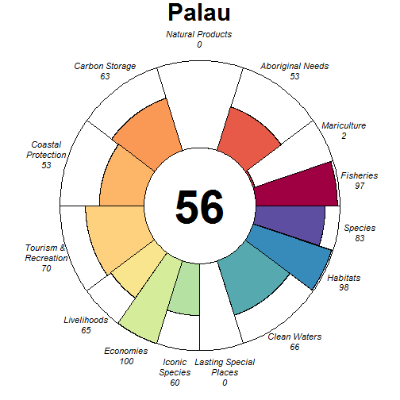

### Scores

|                                |  score| status| future| trend| pressures| resilience|
|:-------------------------------|------:|------:|------:|-----:|---------:|----------:|
|Index                           |  60.34|     NA|  57.23|    NA|        NA|         NA|
|Food Provision                  |  96.55|  93.56|  99.53|  0.03|        NA|         NA|
|. Fisheries                     |  97.00|  94.00| 100.00|  0.03|     28.58|      57.37|
|. Mariculture                   |   2.19|   2.06|   2.32|  0.01|     29.36|      65.62|
|Aboriginal Needs                |  52.62|  50.00|  55.24|  0.00|     26.33|      58.10|
|Natural Products                |   0.00|   0.00|   0.00| -0.56|     33.07|      63.09|
|Carbon Storage                  |  63.27|  86.42|  40.13| -0.87|     37.44|      52.65|
|Coastal Protection              |  53.23|  54.77|  51.68| -0.13|     42.31|      52.65|
|Tourism & Recreation            |  69.67|  69.98|  69.35|  0.01|     67.12|      62.50|
|Coastal Livelihoods & Economies |  82.29|  91.54|  73.03| -0.35|        NA|         NA|
|. Livelihoods                   |  64.58|  83.08|  46.07| -0.70|     27.68|      34.92|
|. Economies                     | 100.00| 100.00| 100.00|  0.00|     27.20|      52.38|
|Sense of Place                  |  29.77|  30.00|  29.54| -0.08|        NA|         NA|
|. Iconic Species                |  59.54|  60.00|  59.08| -0.17|     31.92|      61.09|
|. Lasting Special Places        |   0.00|   0.00|   0.00|  0.00|     40.31|      66.48|
|Clean Waters                    |  65.62|  66.67|  64.57|  0.01|     75.00|      62.50|
|Biodiversity                    |  90.37|  91.49|  89.26| -0.13|        NA|         NA|
|. Habitats                      |  98.19|  96.38| 100.00| -0.01|     30.89|      60.91|
|. Species                       |  82.56|  86.61|  78.51| -0.25|     33.27|      55.90|

## Palmyra Atoll (150)

### Flower

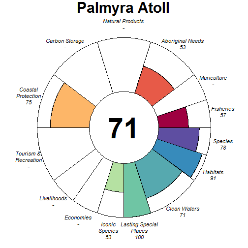

### Scores

|                                |  score| status| future| trend| pressures| resilience|
|:-------------------------------|------:|------:|------:|-----:|---------:|----------:|
|Index                           |  69.63|     NA|  69.85|    NA|        NA|         NA|
|Food Provision                  |  57.24|  53.00|  61.48|  0.06|        NA|         NA|
|. Fisheries                     |  57.24|  53.00|  61.48|  0.06|     25.12|      61.45|
|. Mariculture                   |     NA|     NA|     NA|    NA|     25.61|      30.27|
|Aboriginal Needs                |  53.14|  50.00|  56.27|  0.00|     25.10|      63.11|
|Natural Products                |     NA|     NA|     NA|    NA|        NA|         NA|
|Carbon Storage                  |     NA|     NA|     NA|    NA|        NA|         NA|
|Coastal Protection              |  74.91|  74.30|  75.52|    NA|     40.42|      45.37|
|Tourism & Recreation            |     NA|     NA|     NA|    NA|     44.00|      29.22|
|Coastal Livelihoods & Economies |     NA|     NA|     NA|    NA|        NA|         NA|
|. Livelihoods                   |     NA|     NA|     NA|    NA|        NA|      41.80|
|. Economies                     |     NA|     NA|     NA|    NA|        NA|      50.00|
|Sense of Place                  |  76.52|  80.00|  73.04|  0.25|        NA|         NA|
|. Iconic Species                |  53.04|  60.00|  46.08| -0.50|     29.49|      60.68|
|. Lasting Special Places        | 100.00| 100.00| 100.00|  1.00|     36.26|      30.56|
|Clean Waters                    |  71.36|  74.48|  68.23|  0.00|     54.66|      29.22|
|Biodiversity                    |  84.63|  84.72|  84.54| -0.11|        NA|         NA|
|. Habitats                      |  91.20|  87.15|  95.25|  0.01|     27.87|      54.41|
|. Species                       |  78.05|  82.28|  73.82| -0.23|     30.21|      46.26|

## Panama (129)

### Flower

### Scores

|                                |  score| status| future| trend| pressures| resilience|
|:-------------------------------|------:|------:|------:|-----:|---------:|----------:|
|Index                           |  55.93|     NA|  55.14|    NA|        NA|         NA|
|Food Provision                  |  92.01|  86.14|  97.88|  0.08|        NA|         NA|
|. Fisheries                     |  94.00|  88.00| 100.00|  0.08|     30.58|      64.51|
|. Mariculture                   |   5.65|   5.42|   5.87| -0.02|     29.04|      58.33|
|Aboriginal Needs                |  53.18|  50.00|  56.35|  0.00|     27.67|      66.17|
|Natural Products                |  33.07|  34.76|  31.38| -0.34|     27.34|      67.42|
|Carbon Storage                  |  24.68|  34.32|  15.04| -1.00|     31.14|      63.98|
|Coastal Protection              |  29.74|  33.11|  26.37| -0.45|     34.46|      63.98|
|Tourism & Recreation            |  53.24|  52.76|  53.71|  0.00|     57.01|      62.50|
|Coastal Livelihoods & Economies | 100.00| 100.00| 100.00|  0.51|        NA|         NA|
|. Livelihoods                   | 100.00| 100.00| 100.00|  1.00|     34.69|      52.93|
|. Economies                     | 100.00| 100.00| 100.00|  0.02|     34.27|      54.08|
|Sense of Place                  |  55.61|  55.87|  55.35| -0.14|        NA|         NA|
|. Iconic Species                |  56.05|  58.57|  53.53| -0.28|     35.61|      65.90|
|. Lasting Special Places        |  55.17|  53.16|  57.18|  0.00|     45.88|      68.75|
|Clean Waters                    |  43.15|  43.92|  42.38|  0.01|     75.00|      62.50|
|Biodiversity                    |  74.65|  76.38|  72.92| -0.23|        NA|         NA|
|. Habitats                      |  62.84|  65.53|  60.15| -0.30|     30.39|      65.99|
|. Species                       |  86.46|  87.22|  85.69| -0.16|     36.74|      64.66|

## Papua New Guinea (17)

### Flower

### Scores

|                                |  score| status| future| trend| pressures| resilience|
|:-------------------------------|------:|------:|------:|-----:|---------:|----------:|
|Index                           |  57.03|     NA|  57.34|    NA|        NA|         NA|
|Food Provision                  |  97.99|  95.99|  99.99|  0.22|        NA|         NA|
|. Fisheries                     |  98.00|  96.00| 100.00|  0.22|     30.83|      55.33|
|. Mariculture                   |   0.03|   0.03|   0.03|  0.00|     28.97|      50.00|
|Aboriginal Needs                |  52.23|  50.00|  54.46|  0.00|     28.23|      55.24|
|Natural Products                |  18.61|  19.24|  17.98| -0.25|     29.14|      60.00|
|Carbon Storage                  |  79.38|  71.32|  87.43|  0.29|     34.34|      43.17|
|Coastal Protection              |  52.60|  52.58|  52.63|  0.00|     42.41|      43.17|
|Tourism & Recreation            |   7.91|   8.09|   7.72|  0.00|     64.20|      50.00|
|Coastal Livelihoods & Economies | 100.00| 100.00| 100.00|  0.49|        NA|         NA|
|. Livelihoods                   | 100.00| 100.00| 100.00|  1.00|     33.83|      34.95|
|. Economies                     | 100.00| 100.00| 100.00| -0.03|     32.15|      52.38|
|Sense of Place                  |  34.04|  35.99|  32.08| -0.17|        NA|         NA|
|. Iconic Species                |  55.90|  60.00|  51.81| -0.33|     32.41|      58.72|
|. Lasting Special Places        |  12.17|  11.99|  12.36|  0.00|     40.61|      50.00|
|Clean Waters                    |  43.93|  48.31|  39.55| -0.15|     75.00|      50.00|
|Biodiversity                    |  83.62|  85.66|  81.57| -0.17|        NA|         NA|
|. Habitats                      |  86.89|  84.32|  89.46| -0.04|     30.77|      57.29|
|. Species                       |  80.35|  87.01|  73.69| -0.30|     34.86|      49.29|

## Peru (138)

### Flower

### Scores

|                                |  score| status| future| trend| pressures| resilience|
|:-------------------------------|------:|------:|------:|-----:|---------:|----------:|
|Index                           |  59.72|     NA|  57.83|    NA|        NA|         NA|
|Food Provision                  |  90.83|  82.48|  99.17|  0.14|        NA|         NA|
|. Fisheries                     |  91.40|  83.00|  99.80|  0.14|     29.74|      62.66|
|. Mariculture                   |  27.08|  24.70|  29.46|  0.16|     29.81|      55.73|
|Aboriginal Needs                |  52.98|  50.00|  55.97|  0.00|     28.08|      64.24|
|Natural Products                | 100.00| 100.00| 100.00|  0.01|     27.40|      64.58|
|Carbon Storage                  |  39.04|  54.22|  23.87| -1.00|     28.74|      62.14|
|Coastal Protection              |  39.10|  54.22|  23.98| -1.00|     28.12|      62.14|
|Tourism & Recreation            |  20.11|  20.29|  19.94|  0.00|     55.00|      50.00|
|Coastal Livelihoods & Economies |  62.96|  58.19|  67.72|  0.08|        NA|         NA|
|. Livelihoods                   |  80.83|  61.65| 100.00|  0.80|     29.17|      55.29|
|. Economies                     |  45.09|  54.73|  35.44| -0.63|     31.25|      52.33|
|Sense of Place                  |  66.25|  58.04|  74.45|  0.38|        NA|         NA|
|. Iconic Species                |  60.69|  63.08|  58.30| -0.25|     35.21|      63.03|
|. Lasting Special Places        |  71.81|  53.01|  90.61|  1.00|     43.81|      55.68|
|Clean Waters                    |  54.31|  61.68|  46.94| -0.23|     75.00|      50.00|
|Biodiversity                    |  71.64|  76.99|  66.30| -0.36|        NA|         NA|
|. Habitats                      |  65.81|  73.95|  57.68| -0.49|     28.75|      62.25|
|. Species                       |  77.47|  80.02|  74.93| -0.22|     35.05|      61.07|

## Philippines (15)

### Flower

### Scores

|                                | score| status| future| trend| pressures| resilience|
|:-------------------------------|-----:|------:|------:|-----:|---------:|----------:|
|Index                           | 53.82|     NA|  50.47|    NA|        NA|         NA|
|Food Provision                  | 55.87|  51.89|  59.85|  0.11|        NA|         NA|
|. Fisheries                     | 64.71|  60.00|  69.42|  0.13|     40.29|      61.45|
|. Mariculture                   | 13.31|  12.83|  13.79|  0.00|     31.84|      54.63|
|Aboriginal Needs                | 52.08|  50.00|  54.15|  0.00|     36.51|      61.69|
|Natural Products                | 56.21|  54.31|  58.12| -0.10|     28.89|      70.01|
|Carbon Storage                  | 63.53|  89.66|  37.40| -0.99|     38.16|      62.30|
|Coastal Protection              | 54.64|  56.48|  52.79| -0.18|     44.61|      62.30|
|Tourism & Recreation            | 28.65|  28.16|  29.14|  0.00|     64.01|      75.00|
|Coastal Livelihoods & Economies | 45.36|  50.78|  39.93| -0.38|        NA|         NA|
|. Livelihoods                   | 43.82|  54.62|  33.02| -0.67|     35.04|      52.19|
|. Economies                     | 46.89|  46.94|  46.84| -0.09|     33.74|      51.92|
|Sense of Place                  | 47.06|  47.89|  46.23| -0.15|        NA|         NA|
|. Iconic Species                | 54.03|  57.33|  50.73| -0.30|     38.80|      64.83|
|. Lasting Special Places        | 40.09|  38.45|  41.72|  0.01|     48.74|      72.73|
|Clean Waters                    | 56.58|  56.21|  56.95|  0.02|     75.00|      75.00|
|Biodiversity                    | 78.21|  86.33|  70.10| -0.39|        NA|         NA|
|. Habitats                      | 76.46|  86.30|  66.63| -0.48|     33.90|      62.92|
|. Species                       | 79.96|  86.35|  73.57| -0.29|     45.06|      59.58|

## Phoenix Group (157)

### Flower

### Scores

|                                |  score| status| future| trend| pressures| resilience|
|:-------------------------------|------:|------:|------:|-----:|---------:|----------:|
|Index                           |  75.03|     NA|  74.44|    NA|        NA|         NA|
|Food Provision                  |     NA|     NA|     NA|    NA|        NA|         NA|
|. Fisheries                     |     NA|     NA|     NA|    NA|     25.27|      63.32|
|. Mariculture                   |     NA|     NA|     NA|    NA|     25.79|      47.21|
|Aboriginal Needs                |  53.34|  50.00|  56.68|  0.00|     25.30|      65.79|
|Natural Products                |     NA|     NA|     NA|    NA|        NA|         NA|
|Carbon Storage                  |     NA|     NA|     NA|    NA|        NA|         NA|
|Coastal Protection              | 100.00| 100.00| 100.00|    NA|     41.32|      57.95|
|Tourism & Recreation            |  69.34|  69.98|  68.70|  0.01|     56.84|      49.42|
|Coastal Livelihoods & Economies |  71.28|  76.78|  65.78| -0.30|        NA|         NA|
|. Livelihoods                   |  77.32|  84.02|  70.62| -0.37|     33.96|      60.03|
|. Economies                     |  65.23|  69.53|  60.93| -0.23|     31.21|      40.17|
|Sense of Place                  | 100.00| 100.00| 100.00|  0.00|        NA|         NA|
|. Iconic Species                |     NA|     NA|     NA|    NA|     29.91|      60.91|
|. Lasting Special Places        | 100.00| 100.00| 100.00|  0.00|     36.83|      49.42|
|Clean Waters                    |  43.40|  44.95|  41.84|  0.02|     75.00|      49.42|
|Biodiversity                    |  87.84|  87.61|  88.06| -0.13|        NA|         NA|
|. Habitats                      |  95.96|  91.91| 100.00| -0.01|     27.97|      60.68|
|. Species                       |  79.72|  83.31|  76.13| -0.24|     30.40|      53.25|

## Pitcairn (146)

### Flower

### Scores

|                                |  score| status| future| trend| pressures| resilience|
|:-------------------------------|------:|------:|------:|-----:|---------:|----------:|
|Index                           |  60.67|     NA|  61.99|    NA|        NA|         NA|
|Food Provision                  |  55.04|  52.00|  58.08|  0.01|        NA|         NA|
|. Fisheries                     |  55.04|  52.00|  58.08|  0.01|     25.09|      58.49|
|. Mariculture                   |     NA|     NA|     NA|    NA|     26.01|      62.85|
|Aboriginal Needs                |  52.88|  50.00|  55.76|  0.00|     25.10|      59.98|
|Natural Products                |     NA|     NA|     NA|    NA|        NA|         NA|
|Carbon Storage                  |     NA|     NA|     NA|    NA|        NA|         NA|
|Coastal Protection              | 100.00| 100.00| 100.00|    NA|     42.61|      52.68|
|Tourism & Recreation            |  31.16|  30.97|  31.35|  0.00|     57.68|      61.01|
|Coastal Livelihoods & Economies |  78.91|  72.42|  85.40|  0.33|        NA|         NA|
|. Livelihoods                   |  89.28|  78.56| 100.00|  0.65|     32.43|      35.20|
|. Economies                     |  68.54|  66.28|  70.79|  0.01|     30.72|      50.00|
|Sense of Place                  |  32.84|  32.22|  33.45| -0.05|        NA|         NA|
|. Iconic Species                |  65.67|  64.44|  66.90| -0.10|     29.54|      61.39|
|. Lasting Special Places        |   0.00|   0.00|   0.00|  0.00|     36.14|      66.52|
|Clean Waters                    |  44.84|  45.91|  43.77|  0.00|     75.00|      61.01|
|Biodiversity                    |  89.74|  91.36|  88.11| -0.25|        NA|         NA|
|. Habitats                      | 100.00| 100.00| 100.00|    NA|     39.25|      60.80|
|. Species                       |  79.47|  82.72|  76.22| -0.25|     30.28|      57.81|

## Poland (178)

### Flower

### Scores

|                                |  score| status| future| trend| pressures| resilience|
|:-------------------------------|------:|------:|------:|-----:|---------:|----------:|
|Index                           |  69.44|     NA|  71.11|    NA|        NA|         NA|
|Food Provision                  |  85.00|  78.00|  91.99|  0.09|        NA|         NA|
|. Fisheries                     |  85.00|  78.00|  91.99|  0.09|     32.14|      68.23|
|. Mariculture                   |     NA|     NA|     NA|    NA|     42.71|      60.10|
|Aboriginal Needs                |  53.13|  50.00|  56.27|  0.00|     31.18|      69.17|
|Natural Products                | 100.00| 100.00| 100.00|  0.03|     28.74|      70.86|
|Carbon Storage                  |  67.23|  63.55|  70.91|  0.00|     36.85|      71.97|
|Coastal Protection              |  47.31|  45.48|  49.13|  0.00|     47.69|      71.97|
|Tourism & Recreation            |  21.58|  21.06|  22.11|  0.00|     59.73|      75.00|
|Coastal Livelihoods & Economies |  81.83|  81.50|  82.17|  0.02|        NA|         NA|
|. Livelihoods                   |  63.66|  62.99|  64.33|  0.00|     38.99|      45.43|
|. Economies                     | 100.00| 100.00| 100.00|  0.04|     38.58|      53.83|
|Sense of Place                  | 100.00| 100.00| 100.00|  0.22|        NA|         NA|
|. Iconic Species                |     NA|     NA|     NA|    NA|     40.13|      69.64|
|. Lasting Special Places        | 100.00| 100.00| 100.00|  0.22|     47.12|      70.45|
|Clean Waters                    |  58.42|  60.73|  56.11| -0.11|     75.00|      75.00|
|Biodiversity                    |  79.85|  77.33|  82.37| -0.05|        NA|         NA|
|. Habitats                      |  68.49|  64.79|  72.19|  0.00|     34.32|      68.21|
|. Species                       |  91.21|  89.87|  92.55| -0.10|     37.31|      66.99|

## Portugal (183)

### Flower

### Scores

|                                |  score| status| future| trend| pressures| resilience|
|:-------------------------------|------:|------:|------:|-----:|---------:|----------:|
|Index                           |  67.87|     NA|  70.34|    NA|        NA|         NA|
|Food Provision                  |  54.66|  51.13|  58.19|  0.04|        NA|         NA|
|. Fisheries                     |  57.73|  54.00|  61.46|  0.04|     31.92|      65.65|
|. Mariculture                   |   4.38|   4.18|   4.58|  0.00|     35.87|      64.52|
|Aboriginal Needs                |  52.95|  50.00|  55.90|  0.00|     29.79|      65.56|
|Natural Products                |  27.68|  27.79|  27.57| -0.21|     28.14|      67.70|
|Carbon Storage                  |     NA|     NA|     NA|    NA|        NA|         NA|
|Coastal Protection              |     NA|     NA|     NA|    NA|        NA|         NA|
|Tourism & Recreation            |  87.38|  84.90|  89.85|  0.00|     57.69|      75.00|
|Coastal Livelihoods & Economies |  93.38|  86.76| 100.00|  0.54|        NA|         NA|
|. Livelihoods                   |  86.76|  73.53| 100.00|  1.00|     34.88|      35.64|
|. Economies                     | 100.00| 100.00| 100.00|  0.09|     32.94|      53.33|
|Sense of Place                  |  76.97|  77.86|  76.07| -0.01|        NA|         NA|
|. Iconic Species                |  53.93|  55.71|  52.15| -0.22|     41.41|      67.12|
|. Lasting Special Places        | 100.00| 100.00| 100.00|  0.19|     47.35|      71.59|
|Clean Waters                    |  62.94|  59.78|  66.10|  0.16|     75.00|      75.00|
|Biodiversity                    |  87.00|  84.97|  89.03| -0.08|        NA|         NA|
|. Habitats                      |  94.86|  89.72| 100.00|  0.03|     33.49|      66.66|
|. Species                       |  79.14|  80.22|  78.06| -0.19|     38.44|      68.39|

## Prince Edward Islands (90)

### Flower

### Scores

|                                |  score| status| future| trend| pressures| resilience|
|:-------------------------------|------:|------:|------:|-----:|---------:|----------:|
|Index                           |  87.66|     NA|  89.28|    NA|        NA|         NA|
|Food Provision                  |  96.00|  92.00| 100.00|  0.03|        NA|         NA|
|. Fisheries                     |  96.00|  92.00| 100.00|  0.03|     25.06|      67.07|
|. Mariculture                   |     NA|     NA|     NA|    NA|     29.65|      56.31|
|Aboriginal Needs                |  53.50|  50.00|  57.01|  0.00|     25.33|      67.80|
|Natural Products                |     NA|     NA|     NA|    NA|        NA|         NA|
|Carbon Storage                  |     NA|     NA|     NA|    NA|        NA|         NA|
|Coastal Protection              |     NA|     NA|     NA|    NA|        NA|         NA|
|Tourism & Recreation            |     NA|     NA|     NA|    NA|     30.53|      50.00|
|Coastal Livelihoods & Economies |     NA|     NA|     NA|    NA|        NA|         NA|
|. Livelihoods                   |     NA|     NA|     NA|    NA|     26.08|      51.64|
|. Economies                     |     NA|     NA|     NA|    NA|     26.05|      50.00|
|Sense of Place                  | 100.00| 100.00| 100.00|  0.00|        NA|         NA|
|. Iconic Species                |     NA|     NA|     NA|    NA|     27.01|      65.91|
|. Lasting Special Places        | 100.00| 100.00| 100.00|  0.00|     26.95|      61.36|
|Clean Waters                    |  99.98|  99.96| 100.00|  0.00|     31.73|      50.00|
|Biodiversity                    |  88.84|  88.26|  89.42| -0.10|        NA|         NA|
|. Habitats                      |  98.61|  97.22| 100.00|  0.00|     26.04|      64.68|
|. Species                       |  79.06|  79.29|  78.83| -0.20|     27.32|      65.22|

## Puerto Rico and Virgin Islands of the United States (116)

### Flower

### Scores

|                                |  score| status| future| trend| pressures| resilience|
|:-------------------------------|------:|------:|------:|-----:|---------:|----------:|
|Index                           |  58.66|     NA|  58.75|    NA|        NA|         NA|
|Food Provision                  |  28.53|  27.00|  30.05|  0.03|        NA|         NA|
|. Fisheries                     |  28.53|  27.00|  30.05|  0.03|     27.39|      55.56|
|. Mariculture                   |   0.00|   0.00|   0.00|  0.00|     28.49|      38.13|
|Aboriginal Needs                |  52.34|  50.00|  54.68|  0.00|     26.90|      55.28|
|Natural Products                |     NA|     NA|     NA|    NA|        NA|         NA|
|Carbon Storage                  | 100.00| 100.00| 100.00|  0.72|     36.53|      39.93|
|Coastal Protection              |  36.47|  35.33|  37.60|  0.10|     41.01|      39.93|
|Tourism & Recreation            |  22.88|  23.53|  22.24|  0.00|     57.82|      41.40|
|Coastal Livelihoods & Economies |  71.71|  69.87|  73.55|  0.00|        NA|         NA|
|. Livelihoods                   |  53.17|  52.09|  54.24|  0.03|     31.30|      38.11|
|. Economies                     |  90.25|  87.64|  92.86| -0.03|     31.14|      55.58|
|Sense of Place                  |  60.16|  62.51|  57.80| -0.17|        NA|         NA|
|. Iconic Species                |  55.48|  60.00|  50.96| -0.33|     36.09|      58.11|
|. Lasting Special Places        |  64.83|  65.02|  64.64|  0.00|     42.36|      40.59|
|Clean Waters                    |  67.06|  70.85|  63.28|  0.01|     75.00|      41.40|
|Biodiversity                    |  88.76|  87.98|  89.55|  0.03|        NA|         NA|
|. Habitats                      |  94.74|  89.47| 100.00|  0.23|     31.92|      53.93|
|. Species                       |  82.79|  86.49|  79.09| -0.18|     33.88|      43.55|

## Qatar (190)

### Flower

### Scores

|                                | score| status| future| trend| pressures| resilience|
|:-------------------------------|-----:|------:|------:|-----:|---------:|----------:|
|Index                           | 54.84|     NA|  53.29|    NA|        NA|         NA|
|Food Provision                  | 62.30|  62.00|  62.59| -0.13|        NA|         NA|
|. Fisheries                     | 62.30|  62.00|  62.59| -0.13|     29.94|      59.22|
|. Mariculture                   |  0.00|   0.00|   0.00|  0.00|     32.28|      62.50|
|Aboriginal Needs                | 52.49|  50.00|  54.99|  0.00|     28.41|      58.64|
|Natural Products                |    NA|     NA|     NA|    NA|        NA|         NA|
|Carbon Storage                  | 88.46|  85.58|  91.35|  0.00|     35.68|      56.13|
|Coastal Protection              | 32.93|  32.04|  33.82|  0.00|     39.30|      56.13|
|Tourism & Recreation            | 16.08|  15.63|  16.53|  0.00|     56.55|      75.00|
|Coastal Livelihoods & Economies | 68.41|  83.79|  53.03| -0.68|        NA|         NA|
|. Livelihoods                   | 55.36|  79.12|  31.61| -1.00|     35.99|      57.05|
|. Economies                     | 81.47|  88.47|  74.46| -0.36|     35.99|      61.50|
|Sense of Place                  | 23.63|  26.87|  20.40| -0.25|        NA|         NA|
|. Iconic Species                | 46.84|  53.33|  40.35| -0.50|     35.91|      63.67|
|. Lasting Special Places        |  0.42|   0.40|   0.44|  0.00|     43.68|      71.59|
|Clean Waters                    | 58.59|  58.40|  58.78|  0.01|     75.00|      75.00|
|Biodiversity                    | 90.62|  93.13|  88.12| -0.17|        NA|         NA|
|. Habitats                      | 98.00|  95.99| 100.00|  0.00|     31.60|      62.94|
|. Species                       | 83.25|  90.26|  76.24| -0.34|     36.09|      57.89|

## R_union (32)

### Flower

### Scores

|                                | score| status| future| trend| pressures| resilience|
|:-------------------------------|-----:|------:|------:|-----:|---------:|----------:|
|Index                           | 68.53|     NA|  69.41|    NA|        NA|         NA|
|Food Provision                  | 91.69|  88.37|  95.02|  0.09|        NA|         NA|
|. Fisheries                     | 96.50|  93.00| 100.00|  0.09|     26.80|      60.84|
|. Mariculture                   |  0.22|   0.21|   0.23|  0.00|     28.31|      63.52|
|Aboriginal Needs                | 52.93|  50.00|  55.86|  0.00|     26.44|      61.96|
|Natural Products                |    NA|     NA|     NA|    NA|        NA|         NA|
|Carbon Storage                  |    NA|     NA|     NA|    NA|        NA|         NA|
|Coastal Protection              | 89.58|  85.57|  93.59|  0.09|     51.00|      60.64|
|Tourism & Recreation            |  9.64|   9.52|   9.75|  0.00|     62.89|      70.13|
|Coastal Livelihoods & Economies | 68.90|  81.18|  56.63| -0.49|        NA|         NA|
|. Livelihoods                   | 56.54|  82.31|  30.77| -0.96|     31.38|      35.55|
|. Economies                     | 81.27|  80.04|  82.49| -0.03|     31.59|      47.71|
|Sense of Place                  | 78.14|  68.99|  87.28|  0.27|        NA|         NA|
|. Iconic Species                | 79.87|  65.71|  94.03|  0.50|     34.99|      64.03|
|. Lasting Special Places        | 76.40|  72.28|  80.53|  0.05|     43.53|      68.14|
|Clean Waters                    | 67.64|  68.01|  67.27|  0.01|     75.00|      70.13|
|Biodiversity                    | 89.76|  89.65|  89.87| -0.10|        NA|         NA|
|. Habitats                      | 96.39|  92.79| 100.00|  0.05|     30.12|      62.36|
|. Species                       | 83.13|  86.51|  79.74| -0.24|     33.20|      58.53|

## Republique du Congo (100)

### Flower

### Scores

|                                |  score| status| future| trend| pressures| resilience|
|:-------------------------------|------:|------:|------:|-----:|---------:|----------:|
|Index                           |  50.23|     NA|  47.68|    NA|        NA|         NA|
|Food Provision                  |  79.65|  76.00|  83.30| -0.03|        NA|         NA|
|. Fisheries                     |  79.65|  76.00|  83.30| -0.03|     30.48|      65.67|
|. Mariculture                   |     NA|     NA|     NA|    NA|     27.74|      50.00|
|Aboriginal Needs                |  53.04|  50.00|  56.08|  0.00|     29.02|      65.86|
|Natural Products                |   0.00|   0.00|   0.00| -0.51|     25.84|      65.45|
|Carbon Storage                  |  29.19|  40.00|  18.37| -1.00|     30.15|      69.32|
|Coastal Protection              |     NA|     NA|     NA|    NA|        NA|         NA|
|Tourism & Recreation            |   5.08|   5.15|   5.00|  0.00|     58.78|      50.00|
|Coastal Livelihoods & Economies |  79.83|  94.35|  65.31| -0.52|        NA|         NA|
|. Livelihoods                   |  59.66|  88.70|  30.62| -0.98|     35.19|      36.22|
|. Economies                     | 100.00| 100.00| 100.00| -0.06|     32.25|      47.96|
|Sense of Place                  |  75.39|  75.39|  75.39| -0.12|        NA|         NA|
|. Iconic Species                |  62.82|  65.00|  60.64| -0.25|     35.01|      65.43|
|. Lasting Special Places        |  87.96|  85.79|  90.13|  0.00|     41.47|      56.82|
|Clean Waters                    |  59.96|  59.39|  60.53|  0.15|     75.00|      50.00|
|Biodiversity                    |  69.98|  74.78|  65.17| -0.35|        NA|         NA|
|. Habitats                      |  57.01|  64.79|  49.22| -0.52|     29.19|      62.59|
|. Species                       |  82.95|  84.77|  81.12| -0.18|     35.51|      58.98|

## Romania (72)

### Flower

### Scores

|                                |  score| status| future| trend| pressures| resilience|
|:-------------------------------|------:|------:|------:|-----:|---------:|----------:|
|Index                           |  61.90|     NA|  63.18|    NA|        NA|         NA|
|Food Provision                  |  83.48|  74.00|  92.96|  0.18|        NA|         NA|
|. Fisheries                     |  83.48|  74.00|  92.96|  0.18|     26.18|      67.27|
|. Mariculture                   |     NA|     NA|     NA|    NA|     36.19|      58.33|
|Aboriginal Needs                |  53.47|  50.00|  56.95|  0.00|     26.75|      68.86|
|Natural Products                |  14.74|  20.14|   9.34| -1.00|     28.89|      69.43|
|Carbon Storage                  |     NA|     NA|     NA|    NA|        NA|         NA|
|Coastal Protection              |     NA|     NA|     NA|    NA|        NA|         NA|
|Tourism & Recreation            |  19.89|  19.77|  20.00|  0.00|     58.71|      62.50|
|Coastal Livelihoods & Economies |  89.73|  85.55|  93.92|  0.15|        NA|         NA|
|. Livelihoods                   |  79.47|  71.10|  87.83|  0.27|     36.01|      52.98|
|. Economies                     | 100.00| 100.00| 100.00|  0.03|     32.93|      50.58|
|Sense of Place                  |  76.50|  80.00|  72.99| -0.25|        NA|         NA|
|. Iconic Species                |  52.99|  60.00|  45.99| -0.50|     37.13|      67.87|
|. Lasting Special Places        | 100.00| 100.00| 100.00|  0.00|     45.92|      63.07|
|Clean Waters                    |  64.08|  61.11|  67.04|  0.21|     75.00|      62.50|
|Biodiversity                    |  93.32|  94.39|  92.25| -0.11|        NA|         NA|
|. Habitats                      | 100.00| 100.00| 100.00|  0.00|     29.39|      65.90|
|. Species                       |  86.64|  88.78|  84.50| -0.22|     32.99|      63.21|

## Russia (73)

### Flower

### Scores

|                                |  score| status| future| trend| pressures| resilience|
|:-------------------------------|------:|------:|------:|-----:|---------:|----------:|
|Index                           |  61.99|     NA|  64.31|    NA|        NA|         NA|
|Food Provision                  |  35.35|  32.96|  37.74|  0.04|        NA|         NA|
|. Fisheries                     |  35.39|  33.00|  37.79|  0.04|     28.55|      64.38|
|. Mariculture                   |   2.91|   2.74|   3.07|  0.03|     26.40|      56.98|
|Aboriginal Needs                |  53.16|  50.00|  56.33|  0.00|     27.08|      65.42|
|Natural Products                |   3.06|   2.88|   3.23| -0.02|     26.34|      67.87|
|Carbon Storage                  | 100.00| 100.00| 100.00|    NA|     29.76|      67.32|
|Coastal Protection              |  95.75|  91.51| 100.00|  0.00|     33.71|      67.32|
|Tourism & Recreation            |  13.31|  12.92|  13.70|  0.00|     56.74|      75.00|
|Coastal Livelihoods & Economies |  93.11|  86.23| 100.00|  0.36|        NA|         NA|
|. Livelihoods                   |  86.23|  72.45| 100.00|  0.75|     33.42|      47.86|
|. Economies                     | 100.00| 100.00| 100.00| -0.02|     33.06|      51.67|
|Sense of Place                  |  84.29|  79.59|  89.00|  0.27|        NA|         NA|
|. Iconic Species                |  74.00|  70.00|  77.99|  0.00|     32.06|      66.66|
|. Lasting Special Places        |  94.59|  89.19| 100.00|  0.53|     39.03|      68.18|
|Clean Waters                    |  48.01|  48.37|  47.64| -0.02|     75.00|      75.00|
|Biodiversity                    |  93.90|  92.33|  95.46| -0.02|        NA|         NA|
|. Habitats                      |  99.90|  99.81| 100.00|  0.00|     27.94|      64.30|
|. Species                       |  87.89|  84.86|  90.91| -0.04|     32.82|      62.52|

## Saba (248)

### Flower

### Scores

|                                |  score| status| future| trend| pressures| resilience|
|:-------------------------------|------:|------:|------:|-----:|---------:|----------:|
|Index                           |  74.14|     NA|  72.12|    NA|        NA|         NA|
|Food Provision                  |     NA|     NA|     NA|    NA|        NA|         NA|
|. Fisheries                     |     NA|     NA|     NA|    NA|     26.60|      63.63|
|. Mariculture                   |     NA|     NA|     NA|    NA|     29.39|      63.13|
|Aboriginal Needs                |  53.12|  50.00|  56.25|  0.00|     26.47|      64.32|
|Natural Products                |  16.79|  23.10|  10.48| -1.00|     28.39|      65.85|
|Carbon Storage                  | 100.00| 100.00| 100.00|    NA|     35.79|      61.68|
|Coastal Protection              |  99.60|  99.20| 100.00|  0.03|     42.41|      61.68|
|Tourism & Recreation            | 100.00| 100.00| 100.00|  0.00|     58.08|      66.40|
|Coastal Livelihoods & Economies |  69.96|  84.52|  55.41| -0.50|        NA|         NA|
|. Livelihoods                   |  62.50|  93.79|  31.21| -1.00|     32.14|      32.97|
|. Economies                     |  77.42|  75.24|  79.61|  0.00|     30.97|      49.46|
|Sense of Place                  |  68.82|  68.57|  69.08| -0.14|        NA|         NA|
|. Iconic Species                |  57.36|  60.00|  54.72| -0.29|     34.40|      65.74|
|. Lasting Special Places        |  80.28|  77.13|  83.43|  0.00|     40.83|      65.59|
|Clean Waters                    |  65.40|  65.80|  65.00|  0.02|     75.00|      66.40|
|Biodiversity                    |  93.56|  94.24|  92.88| -0.08|        NA|         NA|
|. Habitats                      | 100.00| 100.00| 100.00|  0.02|     33.13|      64.46|
|. Species                       |  87.12|  88.49|  85.75| -0.18|     33.24|      61.38|

## Saint Helena (86)

### Flower

### Scores

|                                | score| status| future| trend| pressures| resilience|
|:-------------------------------|-----:|------:|------:|-----:|---------:|----------:|
|Index                           | 62.78|     NA|  64.75|    NA|        NA|         NA|
|Food Provision                  | 75.84|  69.00|  82.68|  0.12|        NA|         NA|
|. Fisheries                     | 75.84|  69.00|  82.68|  0.12|     25.49|      61.19|
|. Mariculture                   |    NA|     NA|     NA|    NA|     26.16|      70.34|
|Aboriginal Needs                | 52.86|  50.00|  55.73|  0.00|     25.74|      60.45|
|Natural Products                |    NA|     NA|     NA|    NA|     25.41|      63.76|
|Carbon Storage                  |    NA|     NA|     NA|    NA|        NA|         NA|
|Coastal Protection              |    NA|     NA|     NA|    NA|        NA|         NA|
|Tourism & Recreation            | 44.95|  43.79|  46.10|  0.00|     57.52|      73.53|
|Coastal Livelihoods & Economies | 41.25|  41.81|  40.70| -0.06|        NA|         NA|
|. Livelihoods                   | 58.62|  60.47|  56.76| -0.12|     25.98|      30.85|
|. Economies                     | 23.89|  23.14|  24.64|  0.00|     25.94|      45.62|
|Sense of Place                  | 67.96|  62.83|  73.08|  0.08|        NA|         NA|
|. Iconic Species                | 66.59|  60.00|  73.18|  0.17|     31.70|      64.43|
|. Lasting Special Places        | 69.33|  65.67|  72.99|  0.00|     38.13|      71.92|
|Clean Waters                    | 66.31|  66.34|  66.27|  0.01|     75.00|      73.53|
|Biodiversity                    | 90.28|  91.89|  88.66| -0.13|        NA|         NA|
|. Habitats                      | 99.32|  98.64| 100.00|  0.03|     26.29|      63.65|
|. Species                       | 81.23|  85.15|  77.32| -0.29|     31.04|      61.68|

## Saint Kitts and Nevis (119)

### Flower

### Scores

|                                |  score| status| future| trend| pressures| resilience|
|:-------------------------------|------:|------:|------:|-----:|---------:|----------:|
|Index                           |  53.20|     NA|  52.73|    NA|        NA|         NA|
|Food Provision                  |  13.97|  13.00|  14.95|  0.08|        NA|         NA|
|. Fisheries                     |  13.97|  13.00|  14.95|  0.08|     26.85|      56.03|
|. Mariculture                   |   0.00|   0.00|   0.00|  0.00|     30.17|      50.00|
|Aboriginal Needs                |  52.34|  50.00|  54.69|  0.00|     26.63|      55.03|
|Natural Products                |     NA|     NA|     NA|    NA|        NA|         NA|
|Carbon Storage                  | 100.00| 100.00| 100.00|    NA|     36.79|      41.67|
|Coastal Protection              |  43.71|  43.74|  43.68|    NA|     42.05|      41.67|
|Tourism & Recreation            |  29.66|  30.13|  29.20| -0.01|     58.27|      50.00|
|Coastal Livelihoods & Economies |  57.01|  60.25|  53.78| -0.29|        NA|         NA|
|. Livelihoods                   |  34.14|  40.15|  28.13| -0.48|     32.32|      38.58|
|. Economies                     |  79.88|  80.34|  79.43| -0.10|     32.32|      49.46|
|Sense of Place                  |  27.86|  30.00|  25.71| -0.17|        NA|         NA|
|. Iconic Species                |  55.71|  60.00|  51.43| -0.33|     35.04|      59.42|
|. Lasting Special Places        |   0.00|   0.00|   0.00|  0.00|     41.43|      50.00|
|Clean Waters                    |  63.06|  65.57|  60.56|  0.01|     75.00|      50.00|
|Biodiversity                    |  91.15|  90.33|  91.98| -0.08|        NA|         NA|
|. Habitats                      |  94.83|  90.85|  98.80|  0.00|     31.47|      57.99|
|. Species                       |  87.48|  89.80|  85.15| -0.15|     33.76|      49.29|

## Saint Lucia (122)

### Flower

### Scores

|                                |  score| status| future| trend| pressures| resilience|
|:-------------------------------|------:|------:|------:|-----:|---------:|----------:|
|Index                           |  49.06|     NA|  48.39|    NA|        NA|         NA|
|Food Provision                  |  11.70|  11.00|  12.40|  0.03|        NA|         NA|
|. Fisheries                     |  11.70|  11.00|  12.40|  0.03|     27.34|      59.81|
|. Mariculture                   |     NA|     NA|     NA|    NA|     30.27|      70.83|
|Aboriginal Needs                |  52.66|  50.00|  55.31|  0.00|     27.13|      59.32|
|Natural Products                |   0.00|   0.00|   0.00|  0.00|     28.51|      72.21|
|Carbon Storage                  |  26.25|  25.28|  27.21|    NA|     33.69|      56.90|
|Coastal Protection              |  65.64|  65.00|  66.28| -0.04|     41.96|      56.90|
|Tourism & Recreation            | 100.00| 100.00| 100.00| -0.01|     58.23|      75.00|
|Coastal Livelihoods & Economies |  58.56|  69.79|  47.33| -0.55|        NA|         NA|
|. Livelihoods                   |  46.19|  68.25|  24.12| -1.00|     32.49|      39.42|
|. Economies                     |  70.93|  71.32|  70.54| -0.10|     32.29|      49.46|
|Sense of Place                  |  31.08|  32.67|  29.49| -0.15|        NA|         NA|
|. Iconic Species                |  58.89|  62.22|  55.55| -0.30|     35.55|      63.98|
|. Lasting Special Places        |   3.27|   3.12|   3.43|  0.00|     42.30|      72.73|
|Clean Waters                    |  66.33|  66.15|  66.51|  0.01|     75.00|      75.00|
|Biodiversity                    |  78.41|  77.45|  79.37| -0.09|        NA|         NA|
|. Habitats                      |  68.51|  65.60|  71.42| -0.02|     31.84|      63.20|
|. Species                       |  88.30|  89.29|  87.31| -0.15|     34.26|      58.79|

## Saint Pierre and Miquelon (219)

### Flower

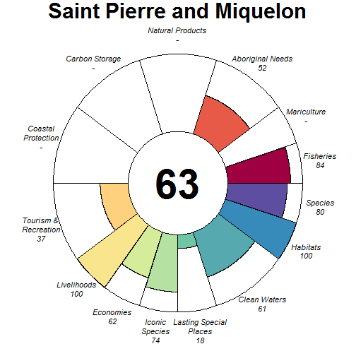

### Scores

|                                |  score| status| future| trend| pressures| resilience|
|:-------------------------------|------:|------:|------:|-----:|---------:|----------:|
|Index                           |  64.47|     NA|  66.66|    NA|        NA|         NA|
|Food Provision                  |  84.06|  75.00|  93.13|  0.23|        NA|         NA|
|. Fisheries                     |  84.06|  75.00|  93.13|  0.23|     30.41|      56.96|
|. Mariculture                   |     NA|     NA|     NA|    NA|     28.89|      62.50|
|Aboriginal Needs                |  52.33|  50.00|  54.66|  0.00|     28.53|      56.75|
|Natural Products                |     NA|     NA|     NA|    NA|        NA|         NA|
|Carbon Storage                  |     NA|     NA|     NA|    NA|        NA|         NA|
|Coastal Protection              |     NA|     NA|     NA|    NA|     40.94|      50.00|
|Tourism & Recreation            |  37.45|  38.05|  36.85|  0.00|     59.20|      50.00|
|Coastal Livelihoods & Economies |  80.91|  79.26|  82.55|  0.00|        NA|         NA|
|. Livelihoods                   |  99.95|  99.90| 100.00|  0.00|     27.94|      40.94|
|. Economies                     |  61.86|  58.62|  65.10|  0.00|     27.94|      61.42|
|Sense of Place                  |  45.90|  40.66|  51.14|  0.17|        NA|         NA|
|. Iconic Species                |  73.89|  64.00|  83.79|  0.33|     33.15|      59.16|
|. Lasting Special Places        |  17.91|  17.32|  18.50|  0.00|     38.48|      59.09|
|Clean Waters                    |  60.85|  63.36|  58.34|  0.00|     75.00|      50.00|
|Biodiversity                    |  89.78|  89.65|  89.92| -0.05|        NA|         NA|
|. Habitats                      | 100.00| 100.00| 100.00|  0.00|     28.11|      60.39|
|. Species                       |  79.57|  79.30|  79.84| -0.11|     34.41|      58.40|

## Saint Vincent and the Grenadines (127)

### Flower

### Scores

|                                | score| status| future| trend| pressures| resilience|
|:-------------------------------|-----:|------:|------:|-----:|---------:|----------:|
|Index                           | 42.97|     NA|  42.17|    NA|        NA|         NA|
|Food Provision                  |  6.40|   6.00|   6.81|  0.04|        NA|         NA|
|. Fisheries                     |  6.40|   6.00|   6.81|  0.04|     26.15|      58.70|
|. Mariculture                   |    NA|     NA|     NA|    NA|     28.75|      57.29|
|Aboriginal Needs                | 52.66|  50.00|  55.31|  0.00|     26.20|      58.41|
|Natural Products                |  0.00|   0.00|   0.00| -0.26|     26.59|      61.92|
|Carbon Storage                  |    NA|     NA|     NA|    NA|        NA|         NA|
|Coastal Protection              | 70.68|  71.52|  69.84| -0.05|     51.04|      53.41|
|Tourism & Recreation            | 44.67|  44.44|  44.89|  0.00|     58.47|      62.50|
|Coastal Livelihoods & Economies | 26.43|  34.19|  18.67| -0.67|        NA|         NA|
|. Livelihoods                   | 31.43|  44.68|  18.18| -0.97|     31.58|      49.31|
|. Economies                     | 21.43|  23.70|  19.16| -0.37|     31.58|      49.46|
|Sense of Place                  | 30.73|  32.50|  28.96| -0.15|        NA|         NA|
|. Iconic Species                | 61.46|  65.00|  57.92| -0.30|     34.26|      62.15|
|. Lasting Special Places        |  0.00|   0.00|   0.00|  0.00|     41.13|      67.61|
|Clean Waters                    | 66.70|  68.01|  65.39|  0.00|     75.00|      62.50|
|Biodiversity                    | 88.43|  87.24|  89.63| -0.09|        NA|         NA|
|. Habitats                      | 89.47|  85.76|  93.17| -0.02|     30.76|      61.71|
|. Species                       | 87.40|  88.72|  86.08| -0.16|     32.89|      56.38|

## Samoa (152)

### Flower

### Scores

|                                |  score| status| future| trend| pressures| resilience|
|:-------------------------------|------:|------:|------:|-----:|---------:|----------:|
|Index                           |  57.40|     NA|  58.22|    NA|        NA|         NA|
|Food Provision                  |  50.48|  44.00|  56.95|  0.28|        NA|         NA|
|. Fisheries                     |  50.48|  44.00|  56.95|  0.28|     27.40|      59.77|
|. Mariculture                   |   0.00|   0.00|   0.00|  0.00|     27.42|      64.58|
|Aboriginal Needs                |  52.79|  50.00|  55.59|  0.00|     26.97|      60.82|
|Natural Products                | 100.00| 100.00| 100.00|  1.00|     25.62|      63.53|
|Carbon Storage                  |  88.15|  85.51|  90.80|    NA|     35.44|      54.17|
|Coastal Protection              |  33.12|  31.57|  34.67|  0.08|     40.60|      54.17|
|Tourism & Recreation            |  31.08|  30.97|  31.19|  0.00|     60.70|      62.50|
|Coastal Livelihoods & Economies |  41.55|  39.88|  43.21|  0.00|        NA|         NA|
|. Livelihoods                   |   3.41|   3.34|   3.47|  0.00|     26.68|      38.20|
|. Economies                     |  79.68|  76.41|  82.95|  0.00|     26.45|      52.38|
|Sense of Place                  |  31.54|  33.20|  29.88| -0.15|        NA|         NA|
|. Iconic Species                |  61.62|  65.00|  58.24| -0.30|     33.14|      62.52|
|. Lasting Special Places        |   1.46|   1.39|   1.52|  0.00|     39.79|      68.75|
|Clean Waters                    |  64.62|  65.95|  63.28|  0.00|     75.00|      62.50|
|Biodiversity                    |  80.65|  88.72|  76.63| -0.10|        NA|         NA|
|. Habitats                      |     NA|  92.76|     NA|  0.08|     33.48|         NA|
|. Species                       |  80.65|  84.68|  76.63| -0.27|     32.75|      59.15|

## Sao Tome and Principe (103)

### Flower

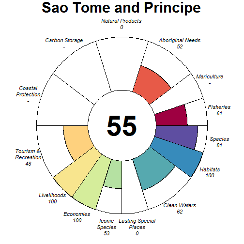

### Scores

|                                |  score| status| future| trend| pressures| resilience|
|:-------------------------------|------:|------:|------:|-----:|---------:|----------:|
|Index                           |  55.03|     NA|  54.89|    NA|        NA|         NA|
|Food Provision                  |  60.99|  59.00|  62.98| -0.03|        NA|         NA|
|. Fisheries                     |  60.99|  59.00|  62.98| -0.03|     26.92|      53.47|
|. Mariculture                   |     NA|     NA|     NA|    NA|     27.07|      50.00|
|Aboriginal Needs                |  52.11|  50.00|  54.21|  0.00|     26.71|      52.23|
|Natural Products                |   0.00|   0.00|   0.00| -1.00|     25.69|      56.28|
|Carbon Storage                  |     NA|     NA|     NA|    NA|        NA|         NA|
|Coastal Protection              |     NA|     NA|     NA|    NA|        NA|         NA|
|Tourism & Recreation            |  48.09|  48.82|  47.37|  0.00|     59.02|      50.00|
|Coastal Livelihoods & Economies | 100.00| 100.00| 100.00|  0.40|        NA|         NA|
|. Livelihoods                   | 100.00| 100.00| 100.00|  0.80|     31.96|      52.34|
|. Economies                     | 100.00| 100.00| 100.00|  0.00|     30.50|      47.96|
|Sense of Place                  |  26.25|  26.67|  25.84| -0.08|        NA|         NA|
|. Iconic Species                |  52.51|  53.33|  51.68| -0.17|     32.87|      57.33|
|. Lasting Special Places        |   0.00|   0.00|   0.00|  0.00|     40.21|      50.00|
|Clean Waters                    |  62.25|  64.65|  59.86|  0.01|     75.00|      50.00|
|Biodiversity                    |  90.54|  92.20|  88.87| -0.11|        NA|         NA|
|. Habitats                      |  99.60|  99.21| 100.00| -0.01|     26.71|      55.95|
|. Species                       |  81.47|  85.19|  77.75| -0.21|     32.39|      48.04|

## Saudi Arabia (50)

### Flower

### Scores

|                                |  score| status| future| trend| pressures| resilience|
|:-------------------------------|------:|------:|------:|-----:|---------:|----------:|
|Index                           |  52.65|     NA|  51.50|    NA|        NA|         NA|
|Food Provision                  |  54.47|  53.54|  55.41| -0.09|        NA|         NA|
|. Fisheries                     |  59.89|  59.00|  60.78| -0.11|     28.17|      59.65|
|. Mariculture                   |  19.56|  18.33|  20.78|  0.07|     29.28|      55.62|
|Aboriginal Needs                |  52.73|  50.00|  55.46|  0.00|     26.76|      59.84|
|Natural Products                |  11.01|  15.10|   6.92| -0.99|     27.30|      64.20|
|Carbon Storage                  |  82.29|  85.55|  79.04| -0.24|     33.90|      59.17|
|Coastal Protection              |  29.12|  30.48|  27.76| -0.24|     37.84|      59.17|
|Tourism & Recreation            |  19.64|  19.08|  20.21|  0.00|     57.19|      75.00|
|Coastal Livelihoods & Economies | 100.00| 100.00| 100.00|  0.53|        NA|         NA|
|. Livelihoods                   | 100.00| 100.00| 100.00|  1.00|     35.54|      66.96|
|. Economies                     | 100.00| 100.00| 100.00|  0.06|     32.76|      59.92|
|Sense of Place                  |  39.07|  41.82|  36.31| -0.25|        NA|         NA|
|. Iconic Species                |  50.69|  57.50|  43.87| -0.50|     34.18|      63.87|
|. Lasting Special Places        |  27.45|  26.14|  28.76|  0.00|     43.53|      73.86|
|Clean Waters                    |  49.49|  50.83|  48.14| -0.08|     75.00|      75.00|
|Biodiversity                    |  88.71|  91.71|  85.71| -0.24|        NA|         NA|
|. Habitats                      |  95.43|  94.18|  96.69| -0.13|     30.16|      63.64|
|. Species                       |  81.99|  89.25|  74.73| -0.36|     34.88|      59.58|

## Senegal (66)

### Flower

### Scores

|                                |  score| status| future| trend| pressures| resilience|
|:-------------------------------|------:|------:|------:|-----:|---------:|----------:|
|Index                           |  52.17|     NA|  51.43|    NA|        NA|         NA|
|Food Provision                  |  78.76|  74.99|  82.53| -0.02|        NA|         NA|
|. Fisheries                     |  78.77|  75.00|  82.55| -0.02|     31.85|      66.41|
|. Mariculture                   |   0.07|   0.07|   0.08|  0.00|     30.25|      56.15|
|Aboriginal Needs                |  53.13|  50.00|  56.26|  0.00|     28.84|      66.79|
|Natural Products                |   4.77|   4.83|   4.71| -0.18|     41.21|      69.21|
|Carbon Storage                  |  33.82|  46.41|  21.22| -1.00|     34.18|      72.73|
|Coastal Protection              |   5.52|   7.68|   3.36| -1.00|     40.20|      72.73|
|Tourism & Recreation            |  20.36|  19.81|  20.91|  0.00|     58.05|      75.00|
|Coastal Livelihoods & Economies | 100.00| 100.00| 100.00|  0.47|        NA|         NA|
|. Livelihoods                   | 100.00| 100.00| 100.00|  1.00|     31.64|      48.54|
|. Economies                     | 100.00| 100.00| 100.00| -0.06|     31.47|      47.17|
|Sense of Place                  |  79.78|  80.66|  78.89| -0.12|        NA|         NA|
|. Iconic Species                |  59.66|  61.54|  57.77| -0.25|     35.67|      67.89|
|. Lasting Special Places        |  99.90|  99.79| 100.00|  0.00|     40.16|      71.59|
|Clean Waters                    |  78.97|  73.76|  84.17|  0.21|     75.00|      75.00|
|Biodiversity                    |  66.61|  70.94|  62.27| -0.36|        NA|         NA|
|. Habitats                      |  52.21|  58.43|  46.00| -0.48|     32.00|      65.94|
|. Species                       |  81.00|  83.45|  78.55| -0.23|     37.07|      65.41|

## Seychelles (31)

### Flower

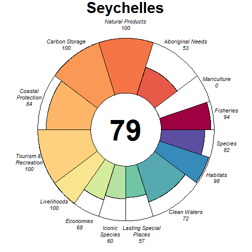

### Scores

|                                |  score| status| future| trend| pressures| resilience|
|:-------------------------------|------:|------:|------:|-----:|---------:|----------:|
|Index                           |  83.60|     NA|  84.50|    NA|        NA|         NA|
|Food Provision                  |  94.00|  88.00| 100.00|  0.07|        NA|         NA|
|. Fisheries                     |  94.00|  88.00| 100.00|  0.07|     25.72|      60.44|
|. Mariculture                   |   0.00|   0.00|   0.00| -0.14|     26.34|      70.83|
|Aboriginal Needs                |  52.94|  50.00|  55.88|  0.00|     25.73|      61.37|
|Natural Products                | 100.00| 100.00| 100.00|  0.07|     25.72|      64.94|
|Carbon Storage                  | 100.00| 100.00| 100.00|  0.00|     27.28|      55.67|
|Coastal Protection              |  84.34|  85.62|  83.06| -0.16|     38.08|      62.12|
|Tourism & Recreation            | 100.00| 100.00| 100.00|  0.00|     58.20|      75.00|
|Coastal Livelihoods & Economies |  84.08|  86.22|  81.93|  0.36|        NA|         NA|
|. Livelihoods                   | 100.00| 100.00| 100.00|  0.99|     30.62|      44.76|
|. Economies                     |  68.15|  72.44|  63.86| -0.28|     30.53|      50.83|
|Sense of Place                  |  58.59|  57.08|  60.10| -0.08|        NA|         NA|
|. Iconic Species                |  59.92|  60.00|  59.84| -0.17|     31.08|      64.13|
|. Lasting Special Places        |  57.26|  54.15|  60.36|  0.00|     39.11|      73.86|
|Clean Waters                    |  72.02|  69.42|  74.61|  0.11|     75.00|      75.00|
|Biodiversity                    |  90.02|  90.64|  89.39| -0.17|        NA|         NA|
|. Habitats                      |  97.60|  95.19| 100.00| -0.05|     27.65|      64.63|
|. Species                       |  82.43|  86.09|  78.78| -0.28|     31.33|      62.75|

## Sierra Leone (96)

### Flower

### Scores

|                                |  score| status| future| trend| pressures| resilience|
|:-------------------------------|------:|------:|------:|-----:|---------:|----------:|
|Index                           |  45.96|     NA|  42.37|    NA|        NA|         NA|
|Food Provision                  |  80.87|  78.00|  83.75| -0.03|        NA|         NA|
|. Fisheries                     |  80.87|  78.00|  83.75| -0.03|     29.55|      57.97|
|. Mariculture                   |     NA|     NA|     NA|    NA|     31.06|      57.29|
|Aboriginal Needs                |  52.32|  50.00|  54.63|  0.00|     28.75|      56.83|
|Natural Products                |     NA|     NA|     NA|    NA|     26.33|      60.09|
|Carbon Storage                  |  24.08|  34.81|  13.35| -1.00|     35.90|      52.15|
|Coastal Protection              |   6.27|   9.15|   3.39| -1.00|     39.86|      52.15|
|Tourism & Recreation            |   8.40|   8.36|   8.44|  0.00|     59.23|      62.50|
|Coastal Livelihoods & Economies |  78.01|  92.94|  63.07| -0.50|        NA|         NA|
|. Livelihoods                   |  56.01|  85.88|  26.14| -1.00|     34.53|      26.78|
|. Economies                     | 100.00| 100.00| 100.00|  0.00|     34.53|      40.17|
|Sense of Place                  |  32.86|  35.45|  30.28|  0.18|        NA|         NA|
|. Iconic Species                |  55.05|  62.86|  47.24| -0.50|     35.05|      61.30|
|. Lasting Special Places        |  10.67|   8.04|  13.31|  0.85|     39.80|      65.34|
|Clean Waters                    |  64.46|  65.32|  63.59|  0.02|     75.00|      62.50|
|Biodiversity                    |  66.39|  71.99|  60.79| -0.37|        NA|         NA|
|. Habitats                      |  51.90|  59.63|  44.18| -0.53|     31.36|      59.61|
|. Species                       |  80.88|  84.35|  77.40| -0.22|     34.53|      54.77|

## Singapore (208)

### Flower

### Scores

|                                |  score| status| future| trend| pressures| resilience|
|:-------------------------------|------:|------:|------:|-----:|---------:|----------:|
|Index                           |  58.03|     NA|  57.75|    NA|        NA|         NA|
|Food Provision                  |  48.99|  47.37|  50.60|  0.10|        NA|         NA|
|. Fisheries                     |  53.77|  52.00|  55.55|  0.11|     57.14|      55.47|
|. Mariculture                   |   2.12|   2.09|   2.15| -0.04|     52.65|      68.75|
|Aboriginal Needs                |  50.69|  50.00|  51.37|  0.00|     46.83|      55.14|
|Natural Products                |  45.63|  44.66|  46.59| -0.03|     42.17|      61.68|
|Carbon Storage                  |  86.56|  85.51|  87.62|    NA|     45.81|      53.27|
|Coastal Protection              |  26.16|  26.00|  26.32|  0.00|     49.22|      53.27|
|Tourism & Recreation            |  61.69|  60.30|  63.09|  0.00|     61.25|      75.00|
|Coastal Livelihoods & Economies |  96.36|  92.71| 100.00|  0.25|        NA|         NA|
|. Livelihoods                   |  92.71|  85.42| 100.00|  0.50|     43.74|      43.46|
|. Economies                     | 100.00| 100.00| 100.00|  0.01|     42.42|      63.92|
|Sense of Place                  |  27.02|  31.39|  22.65| -0.25|        NA|         NA|
|. Iconic Species                |  51.18|  60.00|  42.37| -0.50|     48.25|      60.71|
|. Lasting Special Places        |   2.85|   2.78|   2.93|  0.00|     50.56|      67.05|
|Clean Waters                    |  59.03|  61.91|  56.14| -0.14|     75.00|      75.00|
|Biodiversity                    |  78.19|  83.25|  73.14| -0.20|        NA|         NA|
|. Habitats                      |  83.75|  81.79|  85.70| -0.01|     42.58|      60.11|
|. Species                       |  72.64|  84.71|  60.57| -0.39|     62.83|      55.33|

## Sint Eustatius (249)

### Flower

### Scores

|                                |  score| status| future| trend| pressures| resilience|
|:-------------------------------|------:|------:|------:|-----:|---------:|----------:|
|Index                           |  68.59|     NA|  66.48|    NA|        NA|         NA|
|Food Provision                  |     NA|     NA|     NA|    NA|        NA|         NA|
|. Fisheries                     |     NA|     NA|     NA|    NA|     26.78|      58.31|
|. Mariculture                   |     NA|     NA|     NA|    NA|     30.96|      63.13|
|Aboriginal Needs                |  52.61|  50.00|  55.22|  0.00|     26.67|      58.28|
|Natural Products                |  16.61|  23.09|  10.13| -1.00|     28.93|      61.84|
|Carbon Storage                  | 100.00| 100.00| 100.00|    NA|     36.67|      52.06|
|Coastal Protection              |  91.66|  89.29|  94.03|  0.03|     42.61|      52.06|
|Tourism & Recreation            | 100.00| 100.00| 100.00|  0.00|     58.28|      66.40|
|Coastal Livelihoods & Economies |  69.90|  84.52|  55.29| -0.50|        NA|         NA|
|. Livelihoods                   |  62.44|  93.79|  31.09| -1.00|     32.54|      32.97|
|. Economies                     |  77.37|  75.24|  79.50|  0.00|     31.41|      49.46|
|Sense of Place                  |  28.46|  30.00|  26.92| -0.14|        NA|         NA|
|. Iconic Species                |  56.92|  60.00|  53.85| -0.29|     35.29|      62.22|
|. Lasting Special Places        |   0.00|   0.00|   0.00|  0.00|     41.78|      65.59|
|Clean Waters                    |  64.60|  64.98|  64.23|  0.03|     75.00|      66.40|
|Biodiversity                    |  93.47|  94.42|  92.52| -0.08|        NA|         NA|
|. Habitats                      | 100.00| 100.00| 100.00|  0.02|     33.54|      61.85|
|. Species                       |  86.95|  88.85|  85.05| -0.18|     33.90|      56.57|

## Sint Maarten (220)

### Flower

### Scores

|                                |  score| status| future| trend| pressures| resilience|
|:-------------------------------|------:|------:|------:|-----:|---------:|----------:|
|Index                           |  58.65|     NA|  58.29|    NA|        NA|         NA|
|Food Provision                  |   8.50|   8.00|   8.99|  0.05|        NA|         NA|
|. Fisheries                     |   8.50|   8.00|   8.99|  0.05|     30.84|      58.32|
|. Mariculture                   |     NA|     NA|     NA|    NA|     32.35|      63.13|
|Aboriginal Needs                |  52.46|  50.00|  54.92|  0.00|     28.51|      58.30|
|Natural Products                |  16.54|  23.10|   9.99| -1.00|     30.84|      61.86|
|Carbon Storage                  | 100.00| 100.00| 100.00|    NA|     38.38|      52.06|
|Coastal Protection              |  30.82|  30.00|  31.64|  0.03|     42.20|      52.06|
|Tourism & Recreation            | 100.00| 100.00| 100.00|  0.00|     58.48|      66.40|
|Coastal Livelihoods & Economies |  89.32|  86.54|  92.11|  0.10|        NA|         NA|
|. Livelihoods                   |  96.37|  92.73| 100.00|  0.21|     32.94|      32.97|
|. Economies                     |  82.28|  80.34|  84.22| -0.01|     32.04|      49.46|
|Sense of Place                  |  29.00|  30.63|  27.38| -0.14|        NA|         NA|
|. Iconic Species                |  56.70|  60.00|  53.40| -0.29|     37.55|      62.24|
|. Lasting Special Places        |   1.31|   1.26|   1.35|  0.00|     44.01|      65.59|
|Clean Waters                    |  66.78|  67.48|  66.09|  0.01|     75.00|      66.40|
|Biodiversity                    |  93.10|  94.45|  91.76| -0.08|        NA|         NA|
|. Habitats                      | 100.00| 100.00| 100.00|  0.02|     34.97|      61.86|
|. Species                       |  86.21|  88.90|  83.52| -0.18|     38.14|      56.57|

## Slovenia (188)

### Flower

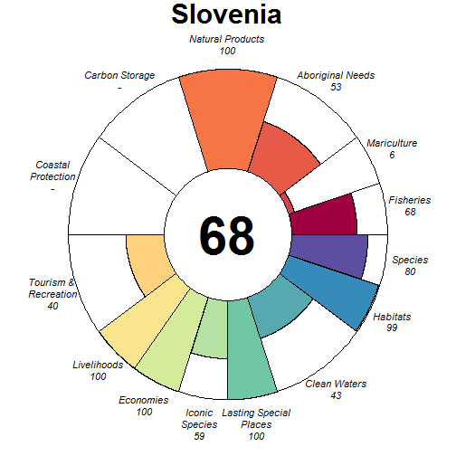

### Scores

|                                |  score| status| future| trend| pressures| resilience|
|:-------------------------------|------:|------:|------:|-----:|---------:|----------:|
|Index                           |  70.04|     NA|  69.94|    NA|        NA|         NA|
|Food Provision                  |  55.23|  50.88|  59.58|  0.09|        NA|         NA|
|. Fisheries                     |  68.44|  63.00|  73.89|  0.11|     36.92|      66.95|
|. Mariculture                   |   6.32|   6.02|   6.62|  0.02|     43.78|      69.79|
|Aboriginal Needs                |  53.13|  50.00|  56.27|  0.00|     29.77|      67.77|
|Natural Products                | 100.00| 100.00| 100.00|  0.79|     31.85|      69.12|
|Carbon Storage                  |     NA|     NA|     NA|    NA|        NA|         NA|
|Coastal Protection              |     NA|     NA|     NA|    NA|        NA|         NA|
|Tourism & Recreation            |  40.12|  39.10|  41.15|  0.00|     59.30|      75.00|
|Coastal Livelihoods & Economies | 100.00| 100.00| 100.00|  0.55|        NA|         NA|
|. Livelihoods                   | 100.00| 100.00| 100.00|  0.99|     39.46|      37.08|
|. Economies                     | 100.00| 100.00| 100.00|  0.10|     38.93|      52.83|
|Sense of Place                  |  79.29|  83.33|  75.24| -0.25|        NA|         NA|
|. Iconic Species                |  58.57|  66.67|  50.48| -0.50|     40.27|      68.20|
|. Lasting Special Places        | 100.00| 100.00| 100.00|  0.00|     48.74|      72.73|
|Clean Waters                    |  43.32|  47.61|  39.03| -0.27|     75.00|      75.00|
|Biodiversity                    |  89.20|  90.12|  88.28| -0.10|        NA|         NA|
|. Habitats                      |  98.74|  97.49| 100.00|  0.01|     34.66|      65.79|
|. Species                       |  79.65|  82.75|  76.55| -0.21|     45.97|      65.58|

## Solomon Islands (7)

### Flower

### Scores

|                                |  score| status| future| trend| pressures| resilience|
|:-------------------------------|------:|------:|------:|-----:|---------:|----------:|
|Index                           |  62.19|     NA|  60.67|    NA|        NA|         NA|
|Food Provision                  |  99.00|  98.00| 100.00|  0.29|        NA|         NA|
|. Fisheries                     |  99.00|  98.00| 100.00|  0.29|     26.62|      58.98|
|. Mariculture                   |   0.00|   0.00|   0.00|  0.00|     28.94|      75.00|
|Aboriginal Needs                |  52.74|  50.00|  55.48|  0.00|     26.60|      59.80|
|Natural Products                |  62.60|  59.50|  65.69| -0.01|     35.03|      67.84|
|Carbon Storage                  |  50.18|  71.18|  29.19| -1.00|     35.54|      59.80|
|Coastal Protection              |  58.34|  55.04|  61.64|  0.09|     42.13|      59.80|
|Tourism & Recreation            |  28.47|  28.04|  28.91|  0.00|     66.02|      75.00|
|Coastal Livelihoods & Economies | 100.00| 100.00| 100.00|  0.52|        NA|         NA|
|. Livelihoods                   | 100.00| 100.00| 100.00|  1.00|     32.87|      26.87|
|. Economies                     | 100.00| 100.00| 100.00|  0.03|     31.40|      40.17|
|Sense of Place                  |  36.54|  38.45|  34.63| -0.19|        NA|         NA|
|. Iconic Species                |  55.26|  60.00|  50.51| -0.39|     32.10|      63.15|
|. Lasting Special Places        |  17.82|  16.89|  18.75|  0.00|     40.49|      73.86|
|Clean Waters                    |  55.04|  54.61|  55.47|  0.02|     75.00|      75.00|
|Biodiversity                    |  78.96|  82.21|  75.70| -0.27|        NA|         NA|
|. Habitats                      |  75.91|  78.50|  73.32| -0.26|     30.76|      64.36|
|. Species                       |  82.00|  85.93|  78.08| -0.29|     32.04|      62.34|

## Somalia (44)

### Flower

### Scores

|                                |  score| status| future| trend| pressures| resilience|
|:-------------------------------|------:|------:|------:|-----:|---------:|----------:|
|Index                           |  50.38|     NA|  45.03|    NA|        NA|         NA|
|Food Provision                  |  61.51|  62.00|  61.03| -0.16|        NA|         NA|
|. Fisheries                     |  61.51|  62.00|  61.03| -0.16|     26.07|      53.80|
|. Mariculture                   |     NA|     NA|     NA|    NA|     27.32|      50.00|
|Aboriginal Needs                |  52.29|  50.00|  54.58|  0.00|     26.05|      53.80|
|Natural Products                |  38.77|  42.56|  34.98| -0.39|     35.04|      59.63|
|Carbon Storage                  |  52.21|  76.84|  27.58| -1.00|     28.73|      37.50|
|Coastal Protection              |  39.14|  58.49|  19.79| -1.00|     39.12|      41.67|
|Tourism & Recreation            |   5.04|   5.11|   4.97|  0.00|     58.32|      50.00|
|Coastal Livelihoods & Economies |  96.70|  93.40| 100.00|  0.29|        NA|         NA|
|. Livelihoods                   |  93.40|  86.79| 100.00|  0.57|     32.71|      43.76|
|. Economies                     | 100.00| 100.00| 100.00|  0.00|     31.06|      47.71|
|Sense of Place                  |  28.98|  30.80|  27.17| -0.15|        NA|         NA|
|. Iconic Species                |  57.90|  61.54|  54.27| -0.30|     32.57|      57.69|
|. Lasting Special Places        |   0.06|   0.06|   0.06|  0.00|     40.63|      50.00|
|Clean Waters                    |  54.03|  55.61|  52.45|  0.04|     75.00|      50.00|
|Biodiversity                    |  75.17|  82.61|  67.73| -0.38|        NA|         NA|
|. Habitats                      |  68.82|  78.30|  59.34| -0.50|     28.39|      56.51|
|. Species                       |  81.51|  86.92|  76.11| -0.26|     32.03|      47.95|

## South Africa (102)

### Flower

### Scores

|                                |  score| status| future| trend| pressures| resilience|
|:-------------------------------|------:|------:|------:|-----:|---------:|----------:|
|Index                           |  62.51|     NA|  61.24|    NA|        NA|         NA|
|Food Provision                  |  53.43|  49.81|  57.05|  0.03|        NA|         NA|
|. Fisheries                     |  53.63|  50.00|  57.26|  0.03|     28.38|      66.30|
|. Mariculture                   |   0.88|   0.85|   0.92|  0.00|     31.90|      56.31|
|Aboriginal Needs                |  53.26|  50.00|  56.53|  0.00|     27.34|      66.91|
|Natural Products                |  48.33|  43.67|  52.99|  0.13|     26.90|      65.59|
|Carbon Storage                  |  80.04|  99.46|  60.62| -0.71|     37.12|      63.80|
|Coastal Protection              |  22.40|  25.51|  19.29| -0.48|     40.11|      63.80|
|Tourism & Recreation            |  42.17|  42.79|  41.56|  0.00|     58.73|      50.00|
|Coastal Livelihoods & Economies | 100.00| 100.00| 100.00|  0.52|        NA|         NA|
|. Livelihoods                   | 100.00| 100.00| 100.00|  1.00|     32.98|      53.15|
|. Economies                     | 100.00| 100.00| 100.00|  0.04|     31.37|      53.08|
|Sense of Place                  |  76.85|  76.82|  76.89| -0.14|        NA|         NA|
|. Iconic Species                |  59.63|  62.22|  57.04| -0.27|     35.39|      65.53|
|. Lasting Special Places        |  94.08|  91.42|  96.74|  0.00|     43.72|      61.36|
|Clean Waters                    |  64.48|  64.59|  64.38|  0.12|     75.00|      50.00|
|Biodiversity                    |  84.18|  85.29|  83.07| -0.19|        NA|         NA|
|. Habitats                      |  89.41|  89.62|  89.20| -0.16|     32.20|      64.15|
|. Species                       |  78.95|  80.96|  76.94| -0.22|     34.02|      64.17|

## South Georgia and the South Sandwich Islands (89)

### Flower

### Scores

|                                |  score| status| future| trend| pressures| resilience|
|:-------------------------------|------:|------:|------:|-----:|---------:|----------:|
|Index                           |  75.65|     NA|  79.19|    NA|        NA|         NA|
|Food Provision                  |  47.88|  45.00|  50.76| -0.02|        NA|         NA|
|. Fisheries                     |  47.88|  45.00|  50.76| -0.02|     25.08|      67.90|
|. Mariculture                   |     NA|     NA|     NA|    NA|     26.23|      70.34|
|Aboriginal Needs                |  53.56|  50.00|  57.12|  0.00|     25.13|      68.28|
|Natural Products                |     NA|     NA|     NA|    NA|        NA|         NA|
|Carbon Storage                  |     NA|     NA|     NA|    NA|        NA|         NA|
|Coastal Protection              |     NA|     NA|     NA|    NA|        NA|         NA|
|Tourism & Recreation            |     NA|     NA|     NA|    NA|     29.78|      73.53|
|Coastal Livelihoods & Economies |     NA|     NA|     NA|    NA|        NA|         NA|
|. Livelihoods                   |     NA|     NA|     NA|    NA|     25.04|      25.65|
|. Economies                     |     NA|     NA|     NA|    NA|     25.19|      50.00|
|Sense of Place                  |  87.11|  80.00|  94.21|  0.75|        NA|         NA|
|. Iconic Species                |  74.21|  60.00|  88.42|  0.50|     26.64|      68.67|
|. Lasting Special Places        | 100.00| 100.00| 100.00|  1.00|     26.04|      71.92|
|Clean Waters                    |  99.95|  99.90| 100.00|  0.00|     26.80|      73.53|
|Biodiversity                    |  89.78|  85.70|  93.87| -0.06|        NA|         NA|
|. Habitats                      |  94.53|  89.06| 100.00| -0.01|     26.14|      67.07|
|. Species                       |  85.04|  82.34|  87.73| -0.10|     27.37|      68.27|

## South Korea (20)

### Flower

### Scores

|                                |  score| status| future| trend| pressures| resilience|
|:-------------------------------|------:|------:|------:|-----:|---------:|----------:|
|Index                           |  62.34|     NA|  64.17|    NA|        NA|         NA|
|Food Provision                  |  35.51|  34.59|  36.43| -0.03|        NA|         NA|
|. Fisheries                     |   2.08|   2.00|   2.17|  0.01|     38.59|      62.19|
|. Mariculture                   |  55.56|  54.13|  56.98| -0.06|     33.38|      61.52|
|Aboriginal Needs                |  52.33|  50.00|  54.66|  0.00|     33.82|      62.08|
|Natural Products                |  79.23|  78.11|  80.34| -0.11|     27.66|      57.73|
|Carbon Storage                  |     NA|     NA|     NA|    NA|        NA|         NA|
|Coastal Protection              |     NA|     NA|     NA|    NA|        NA|         NA|
|Tourism & Recreation            |  30.53|  29.71|  31.35|  0.00|     58.49|      75.00|
|Coastal Livelihoods & Economies |  94.78|  89.56| 100.00|  0.48|        NA|         NA|
|. Livelihoods                   |  89.56|  79.12| 100.00|  0.94|     30.56|      53.62|
|. Economies                     | 100.00| 100.00| 100.00|  0.01|     33.41|      59.33|
|Sense of Place                  |  62.38|  59.33|  65.43|  0.09|        NA|         NA|
|. Iconic Species                |  71.36|  71.43|  71.29| -0.10|     40.97|      60.69|
|. Lasting Special Places        |  53.39|  47.23|  59.56|  0.28|     47.53|      70.45|
|Clean Waters                    |  57.81|  56.35|  59.26|  0.08|     75.00|      75.00|
|Biodiversity                    |  86.17|  86.45|  85.89| -0.11|        NA|         NA|
|. Habitats                      |  96.07|  92.14| 100.00|  0.02|     36.86|      63.62|
|. Species                       |  76.28|  80.77|  71.79| -0.24|     42.01|      57.86|

## Spain (182)

### Flower

### Scores

|                                |  score| status| future| trend| pressures| resilience|
|:-------------------------------|------:|------:|------:|-----:|---------:|----------:|
|Index                           |  63.90|     NA|  64.20|    NA|        NA|         NA|
|Food Provision                  |  59.59|  56.12|  63.06|  0.03|        NA|         NA|
|. Fisheries                     |  56.78|  53.00|  60.57|  0.05|     31.54|      64.67|
|. Mariculture                   |  64.26|  61.31|  67.21|  0.01|     35.47|      62.59|
|Aboriginal Needs                |  52.92|  50.00|  55.84|  0.00|     29.60|      65.00|
|Natural Products                |  56.84|  54.14|  59.53| -0.04|     28.41|      67.67|
|Carbon Storage                  |  52.52|  50.00|  55.05|    NA|     39.85|      70.45|
|Coastal Protection              |  52.38|  50.00|  54.76|    NA|     41.63|      70.45|
|Tourism & Recreation            |  69.84|  67.89|  71.78|  0.00|     57.15|      75.00|
|Coastal Livelihoods & Economies |  77.59|  89.71|  65.47| -0.42|        NA|         NA|
|. Livelihoods                   |  55.19|  79.43|  30.95| -0.94|     34.35|      40.82|
|. Economies                     | 100.00| 100.00| 100.00|  0.11|     33.96|      55.00|
|Sense of Place                  |  78.08|  78.57|  77.59| -0.08|        NA|         NA|
|. Iconic Species                |  56.16|  57.14|  55.19| -0.19|     38.83|      66.52|
|. Lasting Special Places        | 100.00| 100.00| 100.00|  0.03|     47.14|      68.18|
|Clean Waters                    |  62.80|  64.45|  61.15| -0.08|     75.00|      75.00|
|Biodiversity                    |  76.42|  75.10|  77.75| -0.09|        NA|         NA|
|. Habitats                      |  73.15|  69.38|  76.93|  0.01|     34.86|      65.81|
|. Species                       |  79.69|  80.82|  78.57| -0.18|     37.91|      66.69|

## Sri Lanka (40)

### Flower

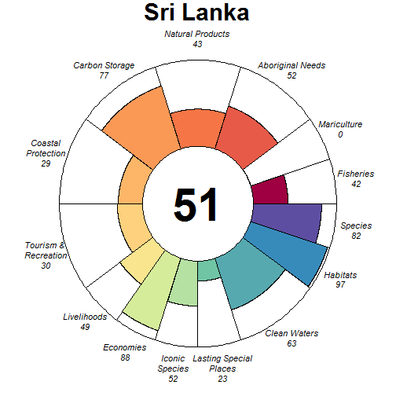

### Scores

|                                | score| status| future| trend| pressures| resilience|
|:-------------------------------|-----:|------:|------:|-----:|---------:|----------:|
|Index                           | 52.91|     NA|  52.40|    NA|        NA|         NA|
|Food Provision                  | 38.03|  36.47|  39.60|  0.02|        NA|         NA|
|. Fisheries                     | 41.71|  40.00|  43.43|  0.02|     37.56|      59.47|
|. Mariculture                   |  0.20|   0.19|   0.21|  0.00|     35.38|      61.25|
|Aboriginal Needs                | 52.28|  50.00|  54.56|  0.00|     32.60|      60.21|
|Natural Products                | 43.04|  41.30|  44.79| -0.06|     27.53|      64.48|
|Carbon Storage                  | 76.85|  85.92|  67.78| -0.42|     39.26|      59.86|
|Coastal Protection              | 29.24|  25.14|  33.33|  0.40|     41.83|      59.86|
|Tourism & Recreation            | 30.40|  29.61|  31.20|  0.00|     58.62|      75.00|
|Coastal Livelihoods & Economies | 68.86|  73.26|  64.47| -0.32|        NA|         NA|
|. Livelihoods                   | 49.32|  60.00|  38.64| -0.61|     35.18|      51.97|
|. Economies                     | 88.40|  86.52|  90.29| -0.03|     33.00|      51.58|
|Sense of Place                  | 37.74|  38.94|  36.53| -0.15|        NA|         NA|
|. Iconic Species                | 52.30|  55.71|  48.88| -0.30|     39.80|      63.52|
|. Lasting Special Places        | 23.18|  22.17|  24.18|  0.00|     47.47|      75.00|
|Clean Waters                    | 63.08|  63.17|  62.99|  0.00|     75.00|      75.00|
|Biodiversity                    | 89.61|  90.41|  88.81| -0.05|        NA|         NA|
|. Habitats                      | 97.15|  94.29| 100.00|  0.14|     33.92|      63.03|
|. Species                       | 82.08|  86.53|  77.62| -0.25|     40.47|      59.71|

## Sudan (49)

### Flower

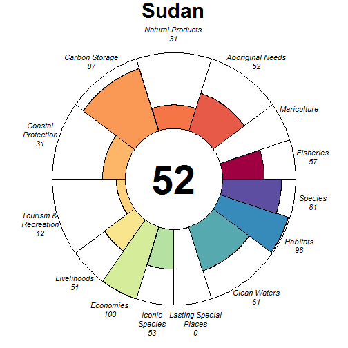

### Scores

|                                |  score| status| future| trend| pressures| resilience|
|:-------------------------------|------:|------:|------:|-----:|---------:|----------:|
|Index                           |  52.25|     NA|  51.14|    NA|        NA|         NA|
|Food Provision                  |  56.95|  57.00|  56.90| -0.14|        NA|         NA|
|. Fisheries                     |  56.95|  57.00|  56.90| -0.14|     27.00|      54.89|
|. Mariculture                   |     NA|     NA|     NA|    NA|     27.85|      50.00|
|Aboriginal Needs                |  52.32|  50.00|  54.63|  0.00|     26.32|      54.40|
|Natural Products                |  31.16|  31.78|  30.53| -0.14|     43.89|      59.68|
|Carbon Storage                  |  86.69|  85.52|  87.85|  0.00|     33.41|      41.68|
|Coastal Protection              |  31.15|  30.90|  31.39|  0.00|     36.86|      41.68|
|Tourism & Recreation            |  12.26|  12.40|  12.12|  0.00|     56.68|      50.00|
|Coastal Livelihoods & Economies |  75.45|  81.88|  69.02| -0.31|        NA|         NA|
|. Livelihoods                   |  50.90|  63.76|  38.04| -0.65|     32.95|      42.14|
|. Economies                     | 100.00| 100.00| 100.00|  0.02|     30.98|      48.50|
|Sense of Place                  |  26.45|  30.14|  22.76| -0.25|        NA|         NA|
|. Iconic Species                |  52.62|  60.00|  45.24| -0.50|     31.60|      58.57|
|. Lasting Special Places        |   0.28|   0.27|   0.28|  0.00|     34.31|      50.00|
|Clean Waters                    |  60.79|  61.73|  59.85|  0.08|     75.00|      50.00|
|Biodiversity                    |  89.31|  92.34|  86.28| -0.18|        NA|         NA|
|. Habitats                      |  97.97|  95.94| 100.00|  0.00|     29.58|      57.29|
|. Species                       |  80.65|  88.73|  72.56| -0.36|     31.62|      48.52|

## Suriname (168)

### Flower

### Scores

|                                |  score| status| future| trend| pressures| resilience|
|:-------------------------------|------:|------:|------:|-----:|---------:|----------:|
|Index                           |  67.63|     NA|  67.73|    NA|        NA|         NA|
|Food Provision                  |   8.47|   7.98|   8.96|  0.01|        NA|         NA|
|. Fisheries                     |   8.49|   8.00|   8.99|  0.01|     27.63|      62.93|
|. Mariculture                   |   0.48|   0.47|   0.50|  0.00|     31.04|      50.00|
|Aboriginal Needs                |  53.03|  50.00|  56.06|  0.00|     26.41|      63.16|
|Natural Products                | 100.00| 100.00| 100.00|  0.38|     26.28|      63.71|
|Carbon Storage                  |  99.74|  99.48| 100.00| -0.03|     28.92|      62.50|
|Coastal Protection              |  99.74|  99.48| 100.00| -0.03|     31.30|      62.50|
|Tourism & Recreation            |   8.57|   8.72|   8.42|  0.00|     59.84|      50.00|
|Coastal Livelihoods & Economies |  85.26|  83.82|  86.70|  0.22|        NA|         NA|
|. Livelihoods                   |  96.20|  92.40| 100.00|  0.54|     33.90|      44.02|
|. Economies                     |  74.32|  75.25|  73.40| -0.10|     33.74|      47.33|
|Sense of Place                  |  76.39|  80.00|  72.77| -0.25|        NA|         NA|
|. Iconic Species                |  52.77|  60.00|  45.55| -0.50|     34.87|      63.40|
|. Lasting Special Places        | 100.00| 100.00| 100.00|  0.00|     43.82|      50.00|
|Clean Waters                    |  56.32|  55.11|  57.53|  0.19|     75.00|      50.00|
|Biodiversity                    |  88.81|  90.80|  86.82| -0.14|        NA|         NA|
|. Habitats                      |  99.62|  99.24| 100.00| -0.01|     27.78|      60.67|
|. Species                       |  78.00|  82.36|  73.64| -0.27|     33.81|      57.08|

## Sweden (222)

### Flower

### Scores

|                                |  score| status| future| trend| pressures| resilience|
|:-------------------------------|------:|------:|------:|-----:|---------:|----------:|
|Index                           |  73.40|     NA|  75.18|    NA|        NA|         NA|
|Food Provision                  |  75.08|  69.84|  80.32|  0.05|        NA|         NA|
|. Fisheries                     |  76.33|  71.00|  81.66|  0.05|     32.73|      68.07|
|. Mariculture                   |   3.07|   2.90|   3.23|  0.01|     33.61|      66.35|
|Aboriginal Needs                |  53.31|  50.00|  56.62|  0.00|     29.05|      69.15|
|Natural Products                |  40.76|  38.09|  43.43|  0.01|     29.31|      70.49|
|Carbon Storage                  |  65.59|  61.48|  69.70|  0.00|     32.97|      73.48|
|Coastal Protection              |  99.79|  99.57| 100.00|  0.12|     48.40|      73.48|
|Tourism & Recreation            |  52.80|  51.49|  54.11|  0.00|     60.14|      75.00|
|Coastal Livelihoods & Economies | 100.00| 100.00| 100.00|  0.51|        NA|         NA|
|. Livelihoods                   | 100.00| 100.00| 100.00|  0.94|     34.30|      47.38|
|. Economies                     | 100.00| 100.00| 100.00|  0.08|     34.22|      62.75|
|Sense of Place                  |  84.18|  85.00|  83.37|  0.38|        NA|         NA|
|. Iconic Species                |  68.37|  70.00|  66.74| -0.25|     32.94|      69.57|
|. Lasting Special Places        | 100.00| 100.00| 100.00|  1.00|     37.15|      72.73|
|Clean Waters                    |  68.64|  71.87|  65.42| -0.13|     75.00|      75.00|
|Biodiversity                    |  93.84|  88.88|  98.79|  0.01|        NA|         NA|
|. Habitats                      |  93.75|  87.50| 100.00|  0.05|     30.90|      68.35|
|. Species                       |  93.92|  90.26|  97.58| -0.03|     35.25|      66.76|

## Syria (77)

### Flower

### Scores

|                                |  score| status| future| trend| pressures| resilience|
|:-------------------------------|------:|------:|------:|-----:|---------:|----------:|
|Index                           |  68.35|     NA|  70.01|    NA|        NA|         NA|
|Food Provision                  |  57.83|  55.00|  60.65|  0.01|        NA|         NA|
|. Fisheries                     |  57.83|  55.00|  60.65|  0.01|     30.59|      59.70|
|. Mariculture                   |     NA|     NA|     NA|    NA|     41.29|      58.33|
|Aboriginal Needs                |  52.43|  50.00|  54.87|  0.00|     29.79|      59.29|
|Natural Products                |  84.41|  75.39|  93.43|  0.21|     32.66|      63.13|
|Carbon Storage                  |     NA|     NA|     NA|    NA|        NA|         NA|
|Coastal Protection              |     NA|     NA|     NA|    NA|        NA|         NA|
|Tourism & Recreation            |  70.59|  70.11|  71.06|  0.01|     59.63|      62.50|
|Coastal Livelihoods & Economies | 100.00| 100.00| 100.00|  0.26|        NA|         NA|
|. Livelihoods                   | 100.00| 100.00| 100.00|  0.38|     37.65|      52.69|
|. Economies                     | 100.00| 100.00| 100.00|  0.15|     34.50|      54.12|
|Sense of Place                  |  23.93|  27.50|  20.36| -0.25|        NA|         NA|
|. Iconic Species                |  47.86|  55.00|  40.72| -0.50|     40.17|      62.99|
|. Lasting Special Places        |   0.00|   0.00|   0.00|  0.00|     47.84|      65.34|
|Clean Waters                    |  63.95|  62.62|  65.29|  0.13|     75.00|      62.50|
|Biodiversity                    |  93.68|  92.93|  94.44| -0.05|        NA|         NA|
|. Habitats                      |  97.51|  95.02| 100.00|  0.02|     33.24|      61.04|
|. Species                       |  89.86|  90.84|  88.88| -0.11|     38.29|      54.64|

## Taiwan (14)

### Flower

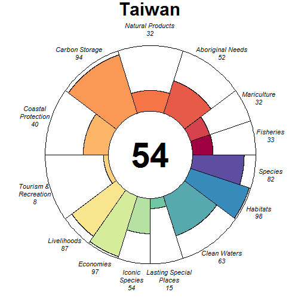

### Scores

|                                | score| status| future| trend| pressures| resilience|
|:-------------------------------|-----:|------:|------:|-----:|---------:|----------:|
|Index                           | 53.73|     NA|  55.09|    NA|        NA|         NA|
|Food Provision                  | 32.28|  30.69|  33.86|  0.04|        NA|         NA|
|. Fisheries                     | 32.56|  31.00|  34.11|  0.04|     37.20|      59.50|
|. Mariculture                   | 31.82|  30.19|  33.45|  0.04|     35.54|      60.19|
|Aboriginal Needs                | 52.03|  50.00|  54.05|  0.00|     35.29|      59.85|
|Natural Products                | 31.66|  30.70|  32.62| -0.08|     33.59|      68.57|
|Carbon Storage                  | 93.99|  91.28|  96.70|    NA|     40.23|      58.19|
|Coastal Protection              | 39.74|  39.09|  40.40| -0.01|     45.21|      58.19|
|Tourism & Recreation            |  7.80|   7.63|   7.97|  0.00|     60.33|      73.92|
|Coastal Livelihoods & Economies | 92.06|  84.12| 100.00|  0.44|        NA|         NA|
|. Livelihoods                   | 87.27|  74.53| 100.00|  0.89|     34.97|      62.94|
|. Economies                     | 96.85|  93.70| 100.00|  0.00|     33.46|      60.67|
|Sense of Place                  | 34.67|  35.90|  33.44| -0.14|        NA|         NA|
|. Iconic Species                | 53.86|  56.92|  50.80| -0.27|     40.71|      63.46|
|. Lasting Special Places        | 15.49|  14.88|  16.09|  0.00|     48.51|      73.07|
|Clean Waters                    | 63.38|  63.39|  63.36|  0.00|     75.00|      73.92|
|Biodiversity                    | 89.71|  90.96|  88.46| -0.14|        NA|         NA|
|. Habitats                      | 97.65|  95.30| 100.00| -0.01|     36.61|      63.58|
|. Species                       | 81.78|  86.62|  76.93| -0.26|     41.27|      60.64|

## Tanzania (202)

### Flower

### Scores

|                                |  score| status| future| trend| pressures| resilience|
|:-------------------------------|------:|------:|------:|-----:|---------:|----------:|
|Index                           |  64.33|     NA|  63.35|    NA|        NA|         NA|
|Food Provision                  |  53.14|  52.18|  54.10| -0.12|        NA|         NA|
|. Fisheries                     |  53.97|  53.00|  54.95| -0.12|     32.09|      67.59|
|. Mariculture                   |   0.14|   0.13|   0.14|  0.00|     28.60|      62.50|
|Aboriginal Needs                |  53.10|  50.00|  56.20|  0.00|     30.97|      68.54|
|Natural Products                |  73.39|  69.01|  77.76| -0.03|     26.76|      71.74|
|Carbon Storage                  |  63.35|  82.37|  44.32| -0.89|     30.70|      71.97|
|Coastal Protection              |  64.97|  60.32|  69.62|  0.07|     39.39|      71.97|
|Tourism & Recreation            |  14.79|  14.41|  15.18|  0.00|     58.49|      75.00|
|Coastal Livelihoods & Economies | 100.00| 100.00| 100.00|  0.57|        NA|         NA|
|. Livelihoods                   | 100.00| 100.00| 100.00|  1.00|     33.13|      44.05|
|. Economies                     | 100.00| 100.00| 100.00|  0.14|     31.89|      46.67|
|Sense of Place                  |  79.29|  80.71|  77.87| -0.15|        NA|         NA|
|. Iconic Species                |  58.58|  61.43|  55.74| -0.30|     36.09|      68.94|
|. Lasting Special Places        | 100.00| 100.00| 100.00|  0.00|     43.13|      70.45|
|Clean Waters                    |  62.76|  60.01|  65.51|  0.14|     75.00|      75.00|
|Biodiversity                    |  78.51|  84.03|  72.99| -0.35|        NA|         NA|
|. Habitats                      |  74.75|  81.45|  68.04| -0.42|     31.09|      65.80|
|. Species                       |  82.27|  86.61|  77.93| -0.29|     36.24|      64.60|

## Thailand (25)

### Flower

### Scores

|                                |  score| status| future| trend| pressures| resilience|
|:-------------------------------|------:|------:|------:|-----:|---------:|----------:|
|Index                           |  68.16|     NA|  68.64|    NA|        NA|         NA|
|Food Provision                  |  80.68|  76.30|  85.06|  0.06|        NA|         NA|
|. Fisheries                     |  56.10|  50.00|  62.20|  0.21|     33.77|      65.09|
|. Mariculture                   |  92.42|  88.86|  95.97| -0.01|     32.77|      59.05|
|Aboriginal Needs                |  52.84|  50.00|  55.68|  0.00|     31.18|      65.60|
|Natural Products                |  82.14|  75.27|  89.00|  0.07|     27.66|      68.76|
|Carbon Storage                  |  66.80|  85.64|  47.96| -0.82|     33.22|      67.37|
|Coastal Protection              |  38.33|  40.89|  35.77| -0.33|     37.74|      67.37|
|Tourism & Recreation            |  54.10|  52.83|  55.37|  0.00|     60.11|      75.00|
|Coastal Livelihoods & Economies |  85.96|  76.64|  95.28|  0.49|        NA|         NA|
|. Livelihoods                   |  71.92|  53.28|  90.56|  0.94|     33.32|      54.33|
|. Economies                     | 100.00| 100.00| 100.00|  0.04|     33.21|      54.33|
|Sense of Place                  |  67.02|  60.47|  73.58|  0.32|        NA|         NA|
|. Iconic Species                |  51.08|  55.00|  47.16| -0.36|     36.65|      67.31|
|. Lasting Special Places        |  82.97|  65.93| 100.00|  1.00|     43.08|      70.45|
|Clean Waters                    |  71.07|  69.53|  72.61|  0.07|     75.00|      75.00|
|Biodiversity                    |  82.65|  89.26|  76.04| -0.37|        NA|         NA|
|. Habitats                      |  83.70|  91.60|  75.80| -0.42|     32.75|      66.24|
|. Species                       |  81.61|  86.93|  76.28| -0.32|     37.79|      65.24|

## Togo (98)

### Flower

### Scores

|                                |  score| status| future| trend| pressures| resilience|
|:-------------------------------|------:|------:|------:|-----:|---------:|----------:|
|Index                           |  70.24|     NA|  70.02|    NA|        NA|         NA|
|Food Provision                  |  89.10|  86.00|  92.20|  0.00|        NA|         NA|
|. Fisheries                     |  89.10|  86.00|  92.20|  0.00|     32.52|      54.36|
|. Mariculture                   |     NA|     NA|     NA|    NA|     29.57|      62.50|
|Aboriginal Needs                |  51.79|  50.00|  53.58|  0.00|     31.03|      52.72|
|Natural Products                |     NA|     NA|     NA|    NA|        NA|         NA|
|Carbon Storage                  | 100.00| 100.00| 100.00|    NA|     38.43|      52.27|
|Coastal Protection              | 100.00| 100.00| 100.00|    NA|     41.81|      52.27|
|Tourism & Recreation            |   6.05|   5.90|   6.21|  0.00|     59.19|      75.00|
|Coastal Livelihoods & Economies | 100.00| 100.00| 100.00|  0.51|        NA|         NA|
|. Livelihoods                   | 100.00| 100.00| 100.00|  1.00|     33.16|      39.58|
|. Economies                     | 100.00| 100.00| 100.00|  0.03|     33.06|      45.62|
|Sense of Place                  |  30.15|  30.00|  30.29| -0.05|        NA|         NA|
|. Iconic Species                |  60.29|  60.00|  60.58| -0.10|     36.64|      59.88|
|. Lasting Special Places        |   0.00|   0.00|   0.00|  0.00|     40.63|      65.91|
|Clean Waters                    |  65.72|  70.92|  60.52| -0.22|     75.00|      75.00|
|Biodiversity                    |  89.38|  91.33|  87.42| -0.09|        NA|         NA|
|. Habitats                      |  99.50|  98.99| 100.00|  0.05|     32.65|      57.84|
|. Species                       |  79.26|  83.68|  74.84| -0.24|     36.21|      51.95|

## Tokelau (156)

### Flower

### Scores

|                                | score| status| future| trend| pressures| resilience|
|:-------------------------------|-----:|------:|------:|-----:|---------:|----------:|
|Index                           | 60.73|     NA|  60.71|    NA|        NA|         NA|
|Food Provision                  | 68.86|  64.00|  73.72|  0.06|        NA|         NA|
|. Fisheries                     | 68.86|  64.00|  73.72|  0.06|     25.45|      59.27|
|. Mariculture                   |    NA|     NA|     NA|    NA|     26.38|      59.89|
|Aboriginal Needs                | 52.91|  50.00|  55.82|  0.00|     25.49|      60.77|
|Natural Products                |    NA|     NA|     NA|    NA|        NA|         NA|
|Carbon Storage                  | 52.47|  50.00|  54.95|  0.00|     28.34|      58.33|
|Coastal Protection              | 88.02|  98.38|  77.66| -0.42|     37.76|      58.33|
|Tourism & Recreation            | 31.82|  30.97|  32.68|  0.00|     58.63|      74.99|
|Coastal Livelihoods & Economies | 78.43|  72.42|  84.44|  0.33|        NA|         NA|
|. Livelihoods                   | 89.28|  78.56| 100.00|  0.65|     30.85|      37.17|
|. Economies                     | 67.58|  66.28|  68.87|  0.01|     29.67|      40.17|
|Sense of Place                  | 26.49|  30.00|  22.99| -0.25|        NA|         NA|
|. Iconic Species                | 52.99|  60.00|  45.97| -0.50|     30.32|      61.00|
|. Lasting Special Places        |  0.00|   0.00|   0.00|  0.00|     37.13|      74.99|
|Clean Waters                    | 67.99|  68.10|  67.89|  0.00|     75.00|      74.99|
|Biodiversity                    | 79.57|  78.95|  76.25| -0.23|        NA|         NA|
|. Habitats                      |    NA|  75.00|     NA| -0.21|     30.26|         NA|
|. Species                       | 79.57|  82.89|  76.25| -0.25|     30.69|      57.10|

## Tonga (155)

### Flower

### Scores

|                                |  score| status| future| trend| pressures| resilience|
|:-------------------------------|------:|------:|------:|-----:|---------:|----------:|
|Index                           |  55.11|     NA|  52.06|    NA|        NA|         NA|
|Food Provision                  |  71.85|  65.00|  78.69|  0.17|        NA|         NA|
|. Fisheries                     |  71.85|  65.00|  78.69|  0.17|     25.62|      54.94|
|. Mariculture                   |   0.00|   0.00|   0.00|  0.00|     28.18|      47.50|
|Aboriginal Needs                |  52.48|  50.00|  54.97|  0.00|     25.74|      55.85|
|Natural Products                |  15.34|  17.71|  12.97| -0.53|     26.68|      53.66|
|Carbon Storage                  |  67.28|  85.51|  49.04| -0.67|     35.96|      42.07|
|Coastal Protection              |  28.86|  37.21|  20.52| -0.67|     42.65|      42.07|
|Tourism & Recreation            |  30.35|  30.97|  29.73|  0.00|     62.52|      50.00|
|Coastal Livelihoods & Economies |  99.81|  99.62| 100.00|  0.49|        NA|         NA|
|. Livelihoods                   | 100.00| 100.00| 100.00|  0.97|     31.03|      51.54|
|. Economies                     |  99.62|  99.25| 100.00|  0.01|     31.23|      52.38|
|Sense of Place                  |  35.06|  37.14|  32.98| -0.15|        NA|         NA|
|. Iconic Species                |  63.21|  67.50|  58.92| -0.30|     31.69|      54.07|
|. Lasting Special Places        |   6.91|   6.78|   7.03|  0.00|     38.91|      50.00|
|Clean Waters                    |  67.29|  69.90|  64.68|  0.01|     75.00|      50.00|
|Biodiversity                    |  82.82|  88.66|  76.99| -0.29|        NA|         NA|
|. Habitats                      |  86.71|  93.04|  80.37| -0.33|     30.35|      56.76|
|. Species                       |  78.93|  84.27|  73.60| -0.25|     31.40|      44.00|

## Trinidad and Tobago (126)

### Flower

### Scores

|                                | score| status| future| trend| pressures| resilience|
|:-------------------------------|-----:|------:|------:|-----:|---------:|----------:|
|Index                           | 72.91|     NA|  73.43|    NA|        NA|         NA|
|Food Provision                  | 32.07|  29.00|  35.14|  0.16|        NA|         NA|
|. Fisheries                     | 32.07|  29.00|  35.14|  0.16|     26.53|      58.24|
|. Mariculture                   |    NA|     NA|     NA|    NA|     31.63|      50.00|
|Aboriginal Needs                | 52.60|  50.00|  55.20|  0.00|     26.69|      58.23|
|Natural Products                | 94.74|  91.14|  98.33| -0.05|     26.92|      61.11|
|Carbon Storage                  | 85.41|  93.33|  77.48| -0.33|     30.72|      46.93|
|Coastal Protection              | 79.95|  81.65|  78.25| -0.10|     39.51|      47.95|
|Tourism & Recreation            | 98.41| 100.00|  96.83|  0.00|     59.26|      50.00|
|Coastal Livelihoods & Economies | 84.52|  77.84|  91.21|  0.27|        NA|         NA|
|. Livelihoods                   | 88.16|  76.33| 100.00|  0.60|     25.95|      33.39|
|. Economies                     | 80.89|  79.35|  82.42| -0.06|     26.29|      50.08|
|Sense of Place                  | 46.96|  48.59|  45.33| -0.17|        NA|         NA|
|. Iconic Species                | 53.43|  57.50|  49.37| -0.33|     35.85|      60.67|
|. Lasting Special Places        | 40.49|  39.69|  41.30|  0.00|     44.49|      56.82|
|Clean Waters                    | 67.38|  64.67|  70.10|  0.25|     75.00|      50.00|
|Biodiversity                    | 87.05|  87.68|  86.42| -0.14|        NA|         NA|
|. Habitats                      | 90.02|  88.28|  91.75| -0.08|     30.75|      58.76|
|. Species                       | 84.09|  87.08|  81.09| -0.19|     33.67|      51.86|

## Tristan da Cunha (88)

### Flower

### Scores

|                                | score| status| future| trend| pressures| resilience|
|:-------------------------------|-----:|------:|------:|-----:|---------:|----------:|
|Index                           | 50.89|     NA|  52.94|    NA|        NA|         NA|
|Food Provision                  | 37.06|  34.00|  40.12|  0.11|        NA|         NA|
|. Fisheries                     | 37.06|  34.00|  40.12|  0.11|     25.11|      57.35|
|. Mariculture                   |    NA|     NA|     NA|    NA|     26.65|      70.34|
|Aboriginal Needs                | 52.64|  50.00|  55.29|  0.00|     25.27|      57.31|
|Natural Products                |    NA|     NA|     NA|    NA|        NA|         NA|
|Carbon Storage                  |    NA|     NA|     NA|    NA|        NA|         NA|
|Coastal Protection              |    NA|     NA|     NA|    NA|        NA|         NA|
|Tourism & Recreation            | 44.79|  43.79|  45.79|  0.00|     59.67|      73.53|
|Coastal Livelihoods & Economies | 84.97|  76.39|  93.55|  0.34|        NA|         NA|
|. Livelihoods                   | 85.75|  71.50| 100.00|  0.68|     25.88|      30.85|
|. Economies                     | 84.19|  81.28|  87.09|  0.01|     25.85|      45.62|
|Sense of Place                  |  0.00|   0.00|   0.00|  0.00|        NA|         NA|
|. Iconic Species                |    NA|     NA|     NA|    NA|     30.60|      61.25|
|. Lasting Special Places        |  0.00|   0.00|   0.00|  0.00|     37.11|      71.92|
|Clean Waters                    | 49.55|  49.58|  49.52|  0.01|     75.00|      73.53|
|Biodiversity                    | 87.24|  88.14|  86.34| -0.11|        NA|         NA|
|. Habitats                      | 99.32|  98.64| 100.00|  0.03|     26.96|      60.68|
|. Species                       | 75.16|  77.64|  72.68| -0.24|     30.32|      59.94|

## Tunisia (61)

### Flower

### Scores

|                                |  score| status| future| trend| pressures| resilience|
|:-------------------------------|------:|------:|------:|-----:|---------:|----------:|
|Index                           |  63.57|     NA|  62.02|    NA|        NA|         NA|
|Food Provision                  |  66.63|  63.69|  69.57|  0.02|        NA|         NA|
|. Fisheries                     |  71.14|  68.00|  74.27|  0.02|     32.40|      56.30|
|. Mariculture                   |   2.28|   2.17|   2.40|  0.01|     32.90|      62.50|
|Aboriginal Needs                |  52.21|  50.00|  54.41|  0.00|     28.88|      55.63|
|Natural Products                |  55.97|  57.93|  54.01| -0.24|     32.31|      60.66|
|Carbon Storage                  |     NA|     NA|     NA|    NA|        NA|         NA|
|Coastal Protection              |     NA|     NA|     NA|    NA|        NA|         NA|
|Tourism & Recreation            |  54.44|  54.07|  54.81|  0.00|     57.59|      62.50|
|Coastal Livelihoods & Economies |  83.93|  98.55|  69.32| -0.47|        NA|         NA|
|. Livelihoods                   |  67.87|  97.09|  38.64| -1.00|     33.56|      53.24|
|. Economies                     | 100.00| 100.00| 100.00|  0.06|     33.28|      48.50|
|Sense of Place                  |  32.82|  33.68|  31.96| -0.10|        NA|         NA|
|. Iconic Species                |  64.92|  66.67|  63.17| -0.20|     35.18|      59.90|
|. Lasting Special Places        |   0.73|   0.70|   0.76|  0.00|     38.09|      63.07|
|Clean Waters                    |  74.87|  75.37|  74.37|  0.04|     75.00|      62.50|
|Biodiversity                    |  87.68|  87.62|  87.74| -0.08|        NA|         NA|
|. Habitats                      |  97.19|  94.39| 100.00|  0.05|     31.17|      59.90|
|. Species                       |  78.17|  80.86|  75.47| -0.20|     36.64|      57.15|

## Turkey (76)

### Flower

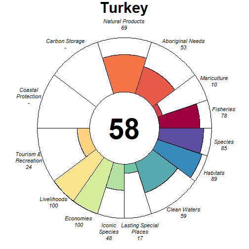

### Scores

|                                |  score| status| future| trend| pressures| resilience|
|:-------------------------------|------:|------:|------:|-----:|---------:|----------:|
|Index                           |  61.41|     NA|  62.82|    NA|        NA|         NA|
|Food Provision                  |  67.32|  63.06|  71.57|  0.06|        NA|         NA|
|. Fisheries                     |  77.98|  73.00|  82.95|  0.07|     33.51|      60.61|
|. Mariculture                   |   9.72|   9.37|  10.07|  0.00|     35.48|      58.14|
|Aboriginal Needs                |  52.52|  50.00|  55.03|  0.00|     30.08|      60.59|
|Natural Products                |  68.96|  60.64|  77.27|  0.26|     33.43|      64.75|
|Carbon Storage                  |     NA|     NA|     NA|    NA|        NA|         NA|
|Coastal Protection              |     NA|     NA|     NA|    NA|        NA|         NA|
|Tourism & Recreation            |  23.75|  23.12|  24.37|  0.00|     58.35|      75.00|
|Coastal Livelihoods & Economies | 100.00| 100.00| 100.00|  0.54|        NA|         NA|
|. Livelihoods                   | 100.00| 100.00| 100.00|  1.00|     34.69|      35.83|
|. Economies                     | 100.00| 100.00| 100.00|  0.08|     32.93|      53.75|
|Sense of Place                  |  32.54|  33.62|  31.46|  0.25|        NA|         NA|
|. Iconic Species                |  48.19|  55.00|  41.38| -0.50|     37.93|      64.38|
|. Lasting Special Places        |  16.89|  12.24|  21.54|  1.00|     46.97|      73.86|
|Clean Waters                    |  59.07|  62.55|  55.59| -0.17|     75.00|      75.00|
|Biodiversity                    |  87.10|  86.90|  87.29| -0.11|        NA|         NA|
|. Habitats                      |  89.33|  86.11|  92.54| -0.03|     33.61|      63.13|
|. Species                       |  84.87|  87.69|  82.04| -0.19|     39.76|      59.62|

## Turks and Caicos Islands (111)

### Flower

### Scores

|                                |  score| status| future| trend| pressures| resilience|
|:-------------------------------|------:|------:|------:|-----:|---------:|----------:|
|Index                           |  63.30|     NA|  61.34|    NA|        NA|         NA|
|Food Provision                  |  57.15|  53.00|  61.30|  0.07|        NA|         NA|
|. Fisheries                     |  57.15|  53.00|  61.30|  0.07|     27.99|      61.25|
|. Mariculture                   |   0.02|   0.02|   0.02|  0.00|     27.31|      63.13|
|Aboriginal Needs                |  52.99|  50.00|  55.97|  0.00|     26.06|      62.25|
|Natural Products                |  11.18|  10.52|  11.85|  0.01|     29.23|      65.73|
|Carbon Storage                  |  75.28|  99.50|  51.05| -0.86|     31.68|      58.87|
|Coastal Protection              |  33.58|  34.65|  32.52| -0.21|     34.65|      58.87|
|Tourism & Recreation            | 100.00| 100.00| 100.00|  0.00|     56.14|      66.40|
|Coastal Livelihoods & Economies |  92.08|  91.73|  92.43| -0.04|        NA|         NA|
|. Livelihoods                   |  90.61|  92.53|  88.69| -0.08|     32.30|      35.94|
|. Economies                     |  93.55|  90.93|  96.17|  0.00|     31.95|      49.46|
|Sense of Place                  |  65.64|  65.07|  66.20| -0.12|        NA|         NA|
|. Iconic Species                |  58.08|  60.00|  56.16| -0.25|     32.54|      63.90|
|. Lasting Special Places        |  73.19|  70.14|  76.25|  0.00|     39.20|      65.59|
|Clean Waters                    |  61.50|  61.89|  61.11|  0.02|     75.00|      66.40|
|Biodiversity                    |  83.61|  86.28|  80.94| -0.24|        NA|         NA|
|. Habitats                      |  83.37|  87.18|  79.57| -0.30|     29.32|      62.89|
|. Species                       |  83.85|  85.39|  82.30| -0.18|     33.51|      59.96|

## Tuvalu (19)

### Flower

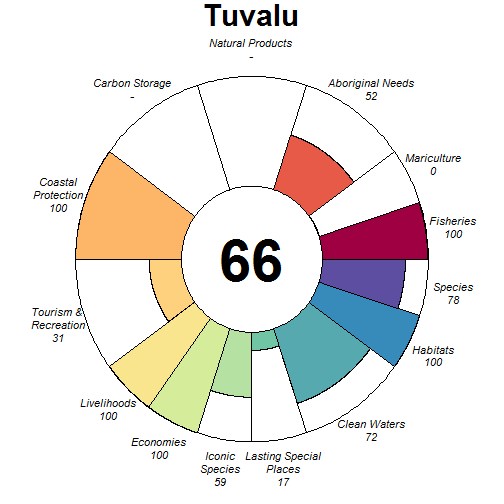

### Scores

|                                |  score| status| future| trend| pressures| resilience|
|:-------------------------------|------:|------:|------:|-----:|---------:|----------:|
|Index                           |  72.65|     NA|  72.09|    NA|        NA|         NA|
|Food Provision                  |  99.38|  98.88|  99.88|  0.08|        NA|         NA|
|. Fisheries                     |  99.50|  99.00| 100.00|  0.08|     27.97|      54.26|
|. Mariculture                   |   0.34|   0.33|   0.36|  0.00|     27.03|      50.00|
|Aboriginal Needs                |  52.44|  50.00|  54.89|  0.00|     25.66|      55.29|
|Natural Products                |     NA|     NA|     NA|    NA|        NA|         NA|
|Carbon Storage                  |     NA|     NA|     NA|    NA|        NA|         NA|
|Coastal Protection              | 100.00| 100.00| 100.00|  0.06|     47.30|      44.60|
|Tourism & Recreation            |  30.57|  30.97|  30.18|  0.00|     58.12|      50.00|
|Coastal Livelihoods & Economies | 100.00| 100.00| 100.00|  0.51|        NA|         NA|
|. Livelihoods                   | 100.00| 100.00| 100.00|  1.00|     30.37|      41.72|
|. Economies                     | 100.00| 100.00| 100.00|  0.02|     29.46|      52.38|
|Sense of Place                  |  37.90|  40.11|  35.70| -0.17|        NA|         NA|
|. Iconic Species                |  59.27|  64.00|  54.55| -0.33|     30.64|      53.55|
|. Lasting Special Places        |  16.54|  16.21|  16.86|  0.00|     37.77|      50.00|
|Clean Waters                    |  71.71|  73.92|  69.49|  0.01|     70.56|      50.00|
|Biodiversity                    |  89.20|  91.79|  86.61| -0.11|        NA|         NA|
|. Habitats                      | 100.00| 100.00| 100.00|  0.03|     28.28|      56.32|
|. Species                       |  78.40|  83.57|  73.22| -0.24|     32.31|      43.55|

## Ukraine (75)

### Flower

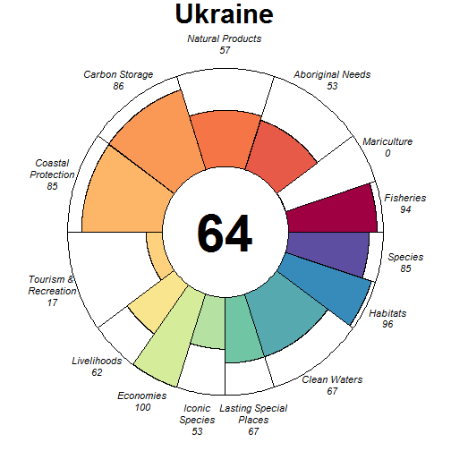

### Scores

|                                |  score| status| future| trend| pressures| resilience|
|:-------------------------------|------:|------:|------:|-----:|---------:|----------:|
|Index                           |  68.93|     NA|  68.97|    NA|        NA|         NA|
|Food Provision                  |  92.17|  85.76|  98.57|  0.17|        NA|         NA|
|. Fisheries                     |  93.50|  87.00| 100.00|  0.17|     27.93|      63.49|
|. Mariculture                   |   0.28|   0.27|   0.29|  0.00|     35.42|      57.71|
|Aboriginal Needs                |  53.10|  50.00|  56.20|  0.00|     27.08|      64.66|
|Natural Products                |  57.27|  61.54|  53.00| -0.42|     28.49|      71.41|
|Carbon Storage                  |  85.76|  82.45|  89.07|    NA|     40.04|      64.37|
|Coastal Protection              |  85.40|  82.45|  88.35|    NA|     42.69|      64.37|
|Tourism & Recreation            |  17.21|  16.74|  17.67|  0.00|     58.10|      75.00|
|Coastal Livelihoods & Economies |  80.84|  96.40|  65.28| -0.48|        NA|         NA|
|. Livelihoods                   |  61.67|  92.79|  30.55| -1.00|     34.35|      34.12|
|. Economies                     | 100.00| 100.00| 100.00|  0.05|     34.03|      51.17|
|Sense of Place                  |  59.98|  62.36|  57.60| -0.25|        NA|         NA|
|. Iconic Species                |  52.78|  60.00|  45.57| -0.50|     37.75|      66.38|
|. Lasting Special Places        |  67.17|  64.71|  69.64|  0.00|     46.26|      69.32|
|Clean Waters                    |  67.10|  61.16|  73.05|  0.29|     75.00|      75.00|
|Biodiversity                    |  90.45|  89.95|  90.94| -0.12|        NA|         NA|
|. Habitats                      |  95.61|  91.23| 100.00|  0.00|     34.03|      64.10|
|. Species                       |  85.28|  88.67|  81.89| -0.24|     34.85|      60.42|

## United Arab Emirates (54)

### Flower

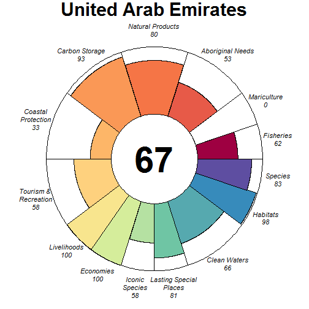

### Scores

|                                |  score| status| future| trend| pressures| resilience|
|:-------------------------------|------:|------:|------:|-----:|---------:|----------:|
|Index                           |  70.41|     NA|  73.36|    NA|        NA|         NA|
|Food Provision                  |  61.97|  60.93|  63.01| -0.11|        NA|         NA|
|. Fisheries                     |  62.04|  61.00|  63.07| -0.11|     34.06|      66.69|
|. Mariculture                   |   0.10|   0.10|   0.11| -0.01|     31.77|      62.50|
|Aboriginal Needs                |  53.14|  50.00|  56.28|  0.00|     29.45|      67.52|
|Natural Products                |  79.86|  68.39|  91.32|  0.29|     28.29|      70.44|
|Carbon Storage                  |  92.98|  85.95| 100.00|  0.86|     35.22|      70.45|
|Coastal Protection              |  32.58|  24.31|  40.86|  0.86|     38.18|      70.45|
|Tourism & Recreation            |  57.52|  55.95|  59.08|  0.00|     57.44|      75.00|
|Coastal Livelihoods & Economies | 100.00| 100.00| 100.00|  0.49|        NA|         NA|
|. Livelihoods                   | 100.00| 100.00| 100.00|  1.00|     34.82|      56.10|
|. Economies                     | 100.00| 100.00| 100.00| -0.03|     32.63|      58.92|
|Sense of Place                  |  69.54|  68.50|  70.59| -0.12|        NA|         NA|
|. Iconic Species                |  58.32|  60.00|  56.63| -0.25|     34.84|      68.60|
|. Lasting Special Places        |  80.77|  77.00|  84.54|  0.00|     38.51|      68.18|
|Clean Waters                    |  65.81|  67.60|  64.02| -0.08|     75.00|      75.00|
|Biodiversity                    |  90.66|  92.83|  88.48|  0.05|        NA|         NA|
|. Habitats                      |  98.00|  95.99| 100.00|  0.43|     31.47|      65.30|
|. Species                       |  83.32|  89.68|  76.95| -0.33|     37.67|      62.35|

## United Kingdom (180)

### Flower

### Scores

|                                |  score| status| future| trend| pressures| resilience|
|:-------------------------------|------:|------:|------:|-----:|---------:|----------:|
|Index                           |  70.58|     NA|  73.99|    NA|        NA|         NA|
|Food Provision                  |  66.25|  61.85|  70.65|  0.05|        NA|         NA|
|. Fisheries                     |  72.87|  68.00|  77.75|  0.06|     36.32|      67.57|
|. Mariculture                   |  15.39|  14.61|  16.16|  0.01|     33.34|      63.47|
|Aboriginal Needs                |  52.99|  50.00|  55.97|  0.00|     32.24|      68.45|
|Natural Products                |  93.38|  86.75| 100.00|  0.29|     29.63|      69.56|
|Carbon Storage                  |  53.57|  50.00|  57.14|  0.00|     31.72|      75.00|
|Coastal Protection              |  42.12|  39.50|  44.73|  0.02|     39.45|      75.00|
|Tourism & Recreation            |  80.70|  78.47|  82.93|  0.00|     57.75|      75.00|
|Coastal Livelihoods & Economies |  90.21|  80.43| 100.00|  0.50|        NA|         NA|
|. Livelihoods                   |  84.00|  68.00| 100.00|  0.99|     30.76|      43.32|
|. Economies                     |  96.43|  92.86| 100.00|  0.01|     32.36|      62.08|
|Sense of Place                  |  80.07|  80.00|  80.14|  0.43|        NA|         NA|
|. Iconic Species                |  60.14|  60.00|  60.27| -0.14|     38.01|      68.39|
|. Lasting Special Places        | 100.00| 100.00| 100.00|  1.00|     44.14|      75.00|
|Clean Waters                    |  67.33|  67.89|  66.78| -0.02|     75.00|      75.00|
|Biodiversity                    |  79.15|  76.75|  81.56| -0.06|        NA|         NA|
|. Habitats                      |  78.54|  73.31|  83.77|  0.03|     30.46|      66.64|
|. Species                       |  79.76|  80.19|  79.34| -0.15|     40.13|      68.32|

## United States (163)

### Flower

### Scores

|                                |  score| status| future| trend| pressures| resilience|
|:-------------------------------|------:|------:|------:|-----:|---------:|----------:|
|Index                           |  65.84|     NA|  63.55|    NA|        NA|         NA|
|Food Provision                  |  56.78|  54.16|  59.40| -0.01|        NA|         NA|
|. Fisheries                     |  58.72|  56.00|  61.44| -0.01|     30.94|      62.40|
|. Mariculture                   |  10.11|   9.82|  10.39|  0.00|     29.21|      46.94|
|Aboriginal Needs                |  52.83|  50.00|  55.66|  0.00|     28.94|      63.26|
|Natural Products                |  62.89|  59.56|  66.22|  0.04|     32.84|      59.53|
|Carbon Storage                  |  63.82|  76.22|  51.42| -0.56|     31.97|      47.73|
|Coastal Protection              |  76.90|  76.01|  77.80| -0.05|     30.45|      47.73|
|Tourism & Recreation            |  49.47|  52.17|  46.78|  0.00|     56.02|      25.00|
|Coastal Livelihoods & Economies |  76.23|  84.29|  68.17| -0.34|        NA|         NA|
|. Livelihoods                   |  52.55|  68.77|  36.33| -0.75|     32.15|      41.50|
|. Economies                     |  99.91|  99.82| 100.00|  0.07|     30.96|      62.25|
|Sense of Place                  |  80.00|  81.15|  78.84| -0.09|        NA|         NA|
|. Iconic Species                |  59.99|  62.31|  57.68| -0.23|     34.77|      59.62|
|. Lasting Special Places        | 100.00| 100.00| 100.00|  0.05|     41.44|      34.09|
|Clean Waters                    |  63.19|  68.39|  57.99|  0.02|     75.00|      25.00|
|Biodiversity                    |  76.28|  79.37|  73.19| -0.22|        NA|         NA|
|. Habitats                      |  70.57|  75.84|  65.29| -0.34|     30.44|      57.40|
|. Species                       |  81.99|  82.89|  81.08| -0.10|     34.89|      49.47|

## Uruguay (173)

### Flower

### Scores

|                                |  score| status| future| trend| pressures| resilience|
|:-------------------------------|------:|------:|------:|-----:|---------:|----------:|
|Index                           |  60.28|     NA|  62.18|    NA|        NA|         NA|
|Food Provision                  |  88.89|  83.00|  94.77|  0.07|        NA|         NA|
|. Fisheries                     |  88.89|  83.00|  94.77|  0.07|     29.24|      58.01|
|. Mariculture                   |   0.00|   0.00|   0.00|  0.00|     37.34|      51.04|
|Aboriginal Needs                |  52.38|  50.00|  54.75|  0.00|     29.22|      58.03|
|Natural Products                |   1.13|   1.19|   1.07| -0.31|     26.49|      59.54|
|Carbon Storage                  |     NA|     NA|     NA|    NA|        NA|         NA|
|Coastal Protection              |     NA|     NA|     NA|    NA|        NA|         NA|
|Tourism & Recreation            |  34.92|  35.50|  34.34|  0.00|     60.07|      50.00|
|Coastal Livelihoods & Economies | 100.00| 100.00| 100.00|  0.53|        NA|         NA|
|. Livelihoods                   | 100.00| 100.00| 100.00|  1.00|     34.55|      45.90|
|. Economies                     | 100.00| 100.00| 100.00|  0.05|     34.36|      51.08|
|Sense of Place                  |  55.47|  50.20|  60.75|  0.39|        NA|         NA|
|. Iconic Species                |  60.20|  62.86|  57.54| -0.22|     39.95|      59.45|
|. Lasting Special Places        |  50.75|  37.53|  63.96|  1.00|     46.49|      56.82|
|Clean Waters                    |  65.79|  63.88|  67.71|  0.21|     75.00|      50.00|
|Biodiversity                    |  83.69|  83.33|  84.04| -0.12|        NA|         NA|
|. Habitats                      |  95.87|  92.34|  99.39| -0.01|     33.69|      58.51|
|. Species                       |  71.51|  74.33|  68.69| -0.22|     34.81|      57.27|

## Vanuatu (6)

### Flower

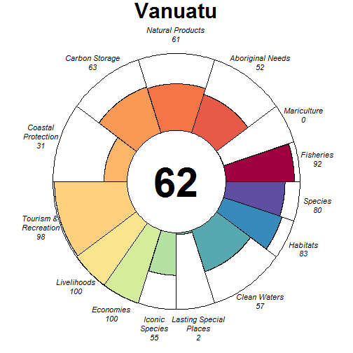

### Scores

|                                |  score| status| future| trend| pressures| resilience|
|:-------------------------------|------:|------:|------:|-----:|---------:|----------:|
|Index                           |  66.46|     NA|  63.24|    NA|        NA|         NA|
|Food Provision                  |  92.35|  84.86|  99.84|  0.15|        NA|         NA|
|. Fisheries                     |  92.50|  85.00| 100.00|  0.15|     27.30|      55.25|
|. Mariculture                   |   0.20|   0.19|   0.21|  0.00|     28.07|      59.38|
|Aboriginal Needs                |  52.49|  50.00|  54.97|  0.00|     25.95|      56.08|
|Natural Products                |  60.58|  55.06|  66.09|  0.18|     37.43|      61.26|
|Carbon Storage                  |  62.85|  85.50|  40.21| -0.83|     36.12|      44.81|
|Coastal Protection              |  31.16|  43.01|  19.32| -0.83|     42.49|      44.81|
|Tourism & Recreation            |  98.05| 100.00|  96.10|  0.01|     62.93|      50.00|
|Coastal Livelihoods & Economies | 100.00| 100.00| 100.00|  0.70|        NA|         NA|
|. Livelihoods                   | 100.00| 100.00| 100.00|  0.97|     34.91|      38.28|
|. Economies                     | 100.00| 100.00| 100.00|  0.42|     31.87|      52.38|
|Sense of Place                  |  28.95|  31.20|  26.71| -0.18|        NA|         NA|
|. Iconic Species                |  55.45|  60.00|  50.91| -0.36|     31.96|      58.54|
|. Lasting Special Places        |   2.45|   2.39|   2.51|  0.00|     39.72|      54.55|
|Clean Waters                    |  56.79|  58.84|  54.73|  0.02|     75.00|      50.00|
|Biodiversity                    |  81.43|  88.38|  74.47| -0.36|        NA|         NA|
|. Habitats                      |  82.94|  91.31|  74.56| -0.42|     30.28|      59.27|
|. Species                       |  79.92|  85.45|  74.38| -0.30|     32.62|      53.51|

## Venezuela (139)

### Flower

### Scores

|                                |  score| status| future| trend| pressures| resilience|
|:-------------------------------|------:|------:|------:|-----:|---------:|----------:|
|Index                           |  53.17|     NA|  52.05|    NA|        NA|         NA|
|Food Provision                  |  51.67|  47.13|  56.21|  0.11|        NA|         NA|
|. Fisheries                     |  57.03|  52.00|  62.07|  0.12|     27.87|      62.17|
|. Mariculture                   |   3.12|   3.04|   3.21| -0.02|     31.91|      52.50|
|Aboriginal Needs                |  52.87|  50.00|  55.75|  0.00|     27.39|      62.23|
|Natural Products                |   0.00|   0.00|   0.00| -0.08|     35.10|      64.19|
|Carbon Storage                  |  72.13|  89.67|  54.59| -0.70|     31.82|      55.78|
|Coastal Protection              |  41.16|  47.39|  34.94| -0.48|     37.07|      55.78|
|Tourism & Recreation            |  21.42|  21.74|  21.10|  0.00|     58.63|      50.00|
|Coastal Livelihoods & Economies |  86.24|  77.83|  94.66|  0.40|        NA|         NA|
|. Livelihoods                   |  72.49|  55.66|  89.31|  0.85|     34.18|      44.52|
|. Economies                     | 100.00| 100.00| 100.00| -0.06|     32.38|      45.50|
|Sense of Place                  |  70.18|  72.29|  68.06| -0.19|        NA|         NA|
|. Iconic Species                |  53.56|  58.33|  48.80| -0.38|     36.58|      63.17|
|. Lasting Special Places        |  86.79|  86.25|  87.32|  0.00|     46.25|      50.00|
|Clean Waters                    |  54.10|  52.11|  56.09|  0.24|     75.00|      50.00|
|Biodiversity                    |  81.93|  84.75|  79.11| -0.22|        NA|         NA|
|. Habitats                      |  80.69|  83.80|  77.58| -0.25|     32.71|      60.55|
|. Species                       |  83.17|  85.69|  80.64| -0.19|     35.45|      55.67|

## Vietnam (207)

### Flower

### Scores

|                                |  score| status| future| trend| pressures| resilience|
|:-------------------------------|------:|------:|------:|-----:|---------:|----------:|
|Index                           |  58.99|     NA|  55.68|    NA|        NA|         NA|
|Food Provision                  |  16.76|  15.91|  17.61|  0.03|        NA|         NA|
|. Fisheries                     |   2.10|   2.00|   2.19|  0.01|     39.94|      67.28|
|. Mariculture                   |  34.02|  32.29|  35.76|  0.05|     35.62|      58.02|
|Aboriginal Needs                |  52.62|  50.00|  55.25|  0.00|     36.58|      68.37|
|Natural Products                |  75.47|  65.06|  85.89|  0.28|     29.61|      69.62|
|Carbon Storage                  |  42.82|  58.51|  27.14| -1.00|     32.17|      72.73|
|Coastal Protection              |  67.61|  77.14|  58.08| -0.53|     39.37|      72.73|
|Tourism & Recreation            |  33.90|  33.13|  34.67|  0.00|     60.29|      75.00|
|Coastal Livelihoods & Economies |  75.43|  91.67|  59.18| -0.54|        NA|         NA|
|. Livelihoods                   |  63.08|  95.47|  30.69| -1.00|     36.53|      33.94|
|. Economies                     |  87.78|  87.88|  87.67| -0.09|     34.15|      50.92|
|Sense of Place                  |  77.61|  80.00|  75.22| -0.19|        NA|         NA|
|. Iconic Species                |  55.22|  60.00|  50.45| -0.38|     40.84|      68.72|
|. Lasting Special Places        | 100.00| 100.00| 100.00|  0.00|     47.97|      71.59|
|Clean Waters                    |  66.95|  65.48|  68.42|  0.07|     75.00|      75.00|
|Biodiversity                    |  80.76|  86.19|  75.33| -0.32|        NA|         NA|
|. Habitats                      |  80.68|  85.97|  75.40| -0.34|     34.55|      66.10|
|. Species                       |  80.84|  86.41|  75.27| -0.30|     42.39|      65.21|

## Wake Island (12)

### Flower

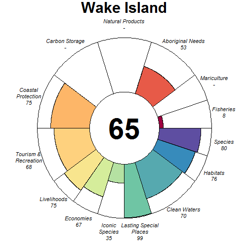

### Scores

|                                | score| status| future| trend| pressures| resilience|
|:-------------------------------|-----:|------:|------:|-----:|---------:|----------:|
|Index                           | 61.22|     NA|  59.70|    NA|        NA|         NA|
|Food Provision                  |  7.59|   9.00|   6.19| -0.64|        NA|         NA|
|. Fisheries                     |  7.59|   9.00|   6.19| -0.64|     26.01|      61.26|
|. Mariculture                   |    NA|     NA|     NA|    NA|     26.20|      30.27|
|Aboriginal Needs                | 53.08|  50.00|  56.16|  0.00|     25.92|      63.24|
|Natural Products                |    NA|     NA|     NA|    NA|        NA|         NA|
|Carbon Storage                  |    NA|     NA|     NA|    NA|        NA|         NA|
|Coastal Protection              | 74.51|  74.30|  74.71|    NA|     43.70|      45.37|
|Tourism & Recreation            | 68.22|  69.98|  66.46|  0.01|     46.37|      29.22|
|Coastal Livelihoods & Economies | 71.10|  76.78|  65.42| -0.30|        NA|         NA|
|. Livelihoods                   | 75.49|  84.02|  66.97| -0.37|     28.91|      41.80|
|. Economies                     | 66.70|  69.53|  63.86| -0.23|     28.25|      50.00|
|Sense of Place                  | 67.08|  70.00|  64.16| -0.25|        NA|         NA|
|. Iconic Species                | 35.25|  40.00|  30.51| -0.50|     30.88|      60.49|
|. Lasting Special Places        | 98.91| 100.00|  97.81|  0.00|     37.19|      30.56|
|Clean Waters                    | 70.42|  73.96|  66.88|  0.00|     58.22|      29.22|
|Biodiversity                    | 77.75|  77.91|  77.59| -0.14|        NA|         NA|
|. Habitats                      | 75.78|  74.30|  77.26|    NA|     41.90|      53.98|
|. Species                       | 79.72|  81.51|  77.92| -0.14|     31.19|      46.26|

## Wallis and Futuna (161)

### Flower

### Scores

|                                |  score| status| future| trend| pressures| resilience|
|:-------------------------------|------:|------:|------:|-----:|---------:|----------:|
|Index                           |  69.14|     NA|  70.29|    NA|        NA|         NA|
|Food Provision                  |  97.00|  94.00| 100.00|  0.59|        NA|         NA|
|. Fisheries                     |  97.00|  94.00| 100.00|  0.59|     25.63|      58.34|
|. Mariculture                   |     NA|     NA|     NA|    NA|     27.74|      62.85|
|Aboriginal Needs                |  52.79|  50.00|  55.58|  0.00|     26.08|      59.87|
|Natural Products                |     NA|     NA|     NA|    NA|        NA|         NA|
|Carbon Storage                  |     NA|     NA|     NA|    NA|        NA|         NA|
|Coastal Protection              | 100.00| 100.00| 100.00|  0.01|     42.22|      52.68|
|Tourism & Recreation            |  30.94|  30.97|  30.91|  0.00|     61.91|      61.01|
|Coastal Livelihoods & Economies |  79.29|  72.42|  86.16|  0.33|        NA|         NA|
|. Livelihoods                   |  89.28|  78.56| 100.00|  0.65|     26.08|      35.42|
|. Economies                     |  69.30|  66.28|  72.32|  0.01|     26.11|      52.38|
|Sense of Place                  |  36.29|  36.67|  35.92| -0.08|        NA|         NA|
|. Iconic Species                |  72.59|  73.33|  71.84| -0.17|     33.70|      61.38|
|. Lasting Special Places        |   0.00|   0.00|   0.00|  0.00|     40.77|      66.52|
|Clean Waters                    |  66.49|  67.97|  65.00|  0.00|     75.00|      61.01|
|Biodiversity                    |  90.36|  91.95|  88.77| -0.12|        NA|         NA|
|. Habitats                      | 100.00| 100.00| 100.00|  0.00|     29.37|      61.08|
|. Species                       |  80.72|  83.90|  77.53| -0.24|     31.42|      57.41|

## Western Sahara (63)

### Flower

### Scores

|                                |  score| status| future| trend| pressures| resilience|
|:-------------------------------|------:|------:|------:|-----:|---------:|----------:|
|Index                           |  65.70|     NA|  65.60|    NA|        NA|         NA|
|Food Provision                  |  78.47|  76.00|  80.94| -0.03|        NA|         NA|
|. Fisheries                     |  78.47|  76.00|  80.94| -0.03|     29.14|      54.94|
|. Mariculture                   |     NA|     NA|     NA|    NA|     28.01|      30.49|
|Aboriginal Needs                |  52.14|  50.00|  54.27|  0.00|     27.94|      53.84|
|Natural Products                |     NA|     NA|     NA|    NA|        NA|         NA|
|Carbon Storage                  |     NA|     NA|     NA|    NA|        NA|         NA|
|Coastal Protection              |     NA|     NA|     NA|    NA|        NA|         NA|
|Tourism & Recreation            |  36.41|  38.02|  34.81|  0.00|     58.48|      33.26|
|Coastal Livelihoods & Economies |  97.21|  94.42| 100.00|  0.16|        NA|         NA|
|. Livelihoods                   |  94.42|  88.83| 100.00|  0.29|     32.19|      44.28|
|. Economies                     | 100.00| 100.00| 100.00|  0.03|     30.81|      48.50|
|Sense of Place                  |  56.47|  57.30|  55.65| -0.09|        NA|         NA|
|. Iconic Species                |  58.37|  60.00|  56.75| -0.19|     30.80|      52.45|
|. Lasting Special Places        |  54.58|  54.59|  54.56|  0.00|     33.33|      33.11|
|Clean Waters                    |  51.45|  54.65|  48.25|  0.03|     75.00|      33.26|
|Biodiversity                    |  87.72|  90.18|  85.26| -0.09|        NA|         NA|
|. Habitats                      |  99.36|  98.73| 100.00|  0.05|     28.45|      51.50|
|. Species                       |  76.08|  81.64|  70.51| -0.22|     32.84|      35.91|

## Yemen (47)

### Flower

### Scores

|                                |  score| status| future| trend| pressures| resilience|
|:-------------------------------|------:|------:|------:|-----:|---------:|----------:|
|Index                           |  59.54|     NA|  59.15|    NA|        NA|         NA|
|Food Provision                  |  64.86|  64.00|  65.71| -0.09|        NA|         NA|
|. Fisheries                     |  64.86|  64.00|  65.71| -0.09|     28.31|      54.69|
|. Mariculture                   |     NA|     NA|     NA|    NA|     28.94|      50.00|
|Aboriginal Needs                |  52.19|  50.00|  54.38|  0.00|     27.66|      54.21|
|Natural Products                |  89.25|  78.51| 100.00|  0.56|     27.09|      58.25|
|Carbon Storage                  |  72.21|  85.52|  58.90| -0.50|     34.48|      41.67|
|Coastal Protection              |  32.12|  28.83|  35.40|  0.32|     37.70|      41.67|
|Tourism & Recreation            |  14.98|  15.17|  14.79|  0.00|     57.52|      50.00|
|Coastal Livelihoods & Economies | 100.00| 100.00| 100.00|  0.49|        NA|         NA|
|. Livelihoods                   | 100.00| 100.00| 100.00|  1.00|     35.23|      57.98|
|. Economies                     | 100.00| 100.00| 100.00| -0.02|     32.38|      41.42|
|Sense of Place                  |  28.37|  30.00|  26.74| -0.14|        NA|         NA|
|. Iconic Species                |  56.74|  60.00|  53.48| -0.28|     34.81|      58.30|
|. Lasting Special Places        |   0.00|   0.00|   0.00|  0.00|     43.07|      50.00|
|Clean Waters                    |  53.88|  57.73|  50.02| -0.08|     75.00|      50.00|
|Biodiversity                    |  87.57|  89.60|  85.55| -0.17|        NA|         NA|
|. Habitats                      |  94.02|  92.07|  95.98| -0.07|     30.60|      56.98|
|. Species                       |  81.13|  87.13|  75.12| -0.28|     34.48|      48.69|
